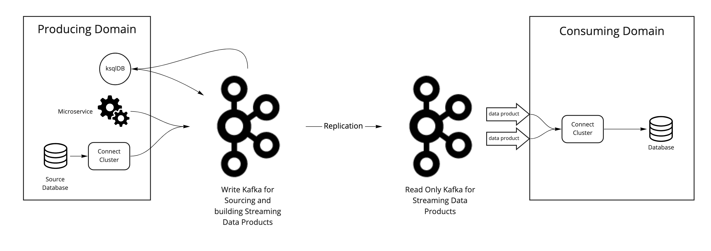
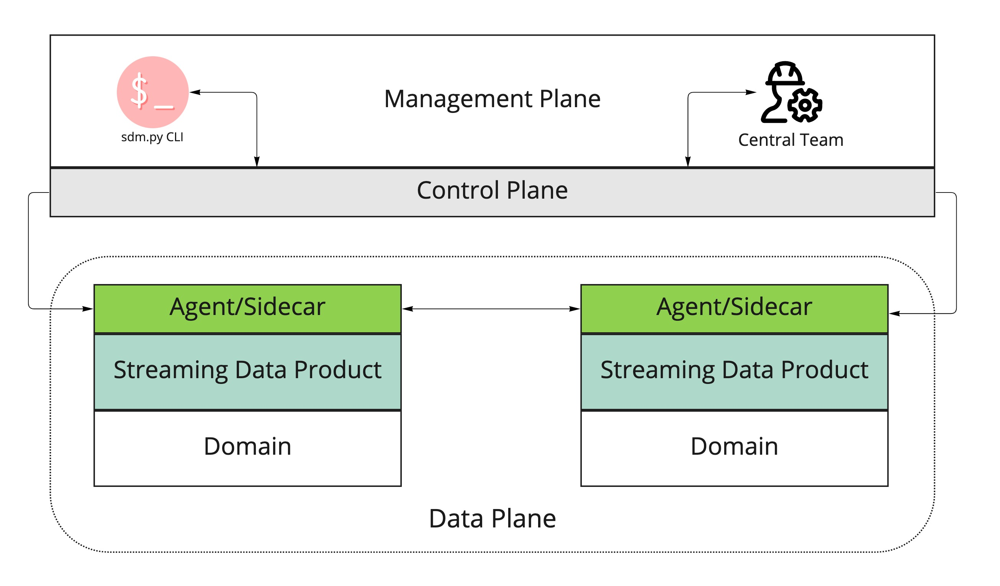
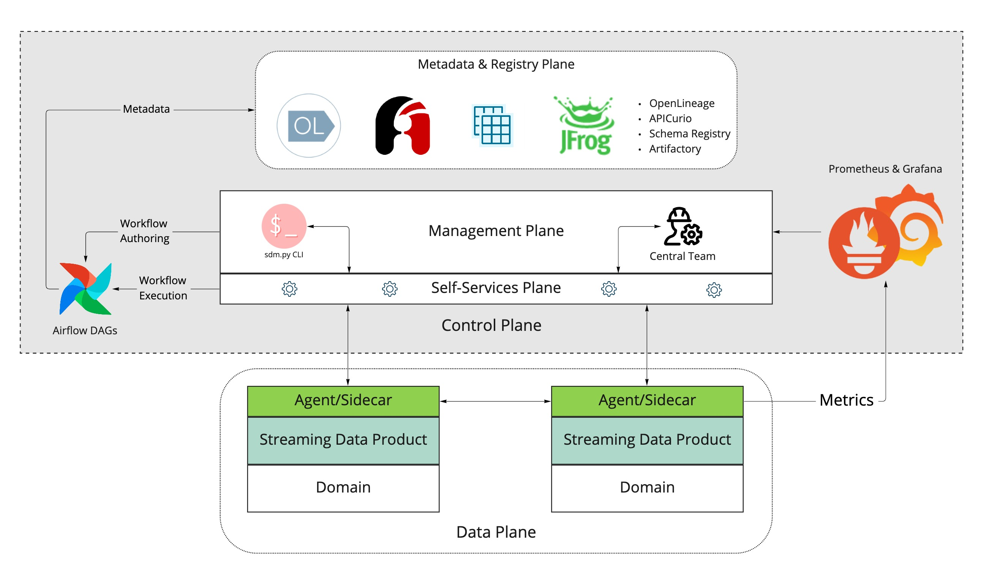

# Data Mesh Reference Implementation with standalone example use cases

**Examples use cases (not exhaustive)**
- Retool + GraphQL 
- GraphQL multiple DB
- GraphQL subscription + Grafana live monitoring
- GraphQL Auth0
- Debezium CDC
- MirrorMaker: bidirectional (PT -> Fed -> PT), disaster recovery, high-availabilty, new infrastructure, muli-cloud
- SpoolDir Schema
- Kafka without Confluent
- Spark build in Docker
- Kafka -> Spark -> Kafka
- NeoDash view-only
- Kafka monitoring
- Apicurio schema registry
- Apache Atlas or Admunsen for Data Management
- Cloudera (Apache) Envelope, Sparknado
- Splunk Search Language (SPL) for security?
- Neo4j Sink tasks.max & parallel processing
- HIPAA/GDPR tokenization, encryption, filtering
- UUID for entity
- Apache Fink (vs Apache Spark) for ML
- ksqlDB UDF
- AsyncAPI combined with 
- OpenLineage to track data at every domain, every stage
- Apache Airflow with DAG for high-level workflows
- Redpanda
- Apache Pulsar
- RTOLAP accommondation Rockset, Apache Pinot, Apache Druid, Materialized, Tiny Bird, or Clickhouse.
- Metrics via Datadog, AppDynamics, or Prometheus & Grafana

[Streaming Data Mesh by Hubert Dulay, Stephen Mooney](https://www.oreilly.com/library/view/streaming-data-mesh/9781098130718/)

**7 requirements for data-as-a-product**
- Sigh quality: Transforms data to the standards defined by all of the domains in the data mesh; filtering out bad records if required.
- Secure and Trustworthy: All personal identifiable information (PII) or personal health information (PHI) are obfuscated by either tokenization or encryption.Authorization and authentication is defined as access control levels (ACLs) or role based access controls (RBACs) rules.
- Interoperable: Data products should provide schemas that represent the final data product. Schemas serves as a contract between the producing domain and the consuming domain. Data products should be in a format that supports consumers written in multiple programming languages (polyglot). Some examples are: JSON, Avro or Protobuf.
- Easily consumable: The data product must be quickly and easily accessible through simple technical means. The data product must optimized for reading and serving. Some ways to optimize data are: partitioning, indexing, bucketing or compaction.
- Preserve lineage: The data lineage can be derived from the metadata recursively through the other domains. For example if the data product uses another domain’s data product the lineage from the derivative data product is preserved and can be parsed.
- Easily searchable and Self-describing: The data product should be discoverable using a search engine and is descriptive enough for consumers to have trust in it.
- Provide historical data: The data product supports serving a historical data not just latest changes.

**Requirements for data governance in a streaming data mesh:**
- When data is in motion, domains need to be extra careful that protected data isn’t breaking any regulations that may cost them a lot in fines and customer trust. Domains need to identify the regulations that affect the streaming data products and provide domain tools that will make it easy to safeguard protected data.
- Since domains will be sharing data between themselves, there needs to be a set of standards that promote interoperability. To do this, there will need to be a way to define data models using schemas so that domains can easily define and consume these standards programmatically.
- Defining roles or groups of users in a streaming data mesh is critical to helping safeguard protected data. For example a whole domain could fall into a single group name. This will make it easier for streaming data product owners to grant or drop access to their domain data.
- Domain engineers that build streaming data products need simple ways to obfuscate protected data. For example they will need simple tools that will allow them to encrypt data before it leaves their domain. Conversely consuming domains need a way to decrypt that same data. Similarly domain engineers need an ability to tokenize / detokenize data.
- Domain engineers will need a way to easily build data lineage that spans multiple domains. They will need to preserve detailed source information and transformations related to standardizations and security.

**Three components for a streaming data mesh:**
- Agents deployed within the domains that communicate with the control plane.
- The replication of data between domains is the data plane.
- The central streaming data mesh is the control plane (everything except the domains).

**Control planes:**
- Metadata & registry plane: The metadata & registry plane holds many of the open source tools the control needs to use. They include OpenLineage, APICurio, Schema Registry, and jFrog (an artifact repository). These tools hold much of the metadata consumers need to trust the streaming data products published in the streaming data mesh.
- Management plane: The management plane provides access for users to monitor the streaming data mesh as well as initiate commands.
- Self-services plane: The self-services plane are the domain facing services.

