[Back](../README.md)

## Healthcare Analytics Sandbox: Load and Analyze FDA Adverse Event Reporting System Data With Neo4j

**Credit: The original case was described in a [Medium article](https://medium.com/neo4j/healthcare-analytics-sandbox-load-and-analyze-fda-adverse-event-reporting-system-data-with-neo4j-29b7b71a6ef4). Here you can find its [Neo4j blog](https://neo4j.com/developer-blog/healthcare-analytics-sandbox-load-and-analyze-fda-adverse-event-reporting-system-data-with-neo4j/), [GitHub repo](https://github.com/neo4j-graph-examples/healthcare-analytics), and [YouTube video](https://youtu.be/5DZfOLspVDM).**

If you know what is [Neo4j Browser Guide](https://neo4j.com/developer/neo4j-browser/) and how to use it here are the recommended steps:
- Read the article (and the blog if needed);
- Watch the video;
- Then click on this link to create a [Neo4j Sandbox](https://sandbox.neo4j.com/?usecase=healthcare-analytics) in a very short amount of time and go though the guide, as shown below.
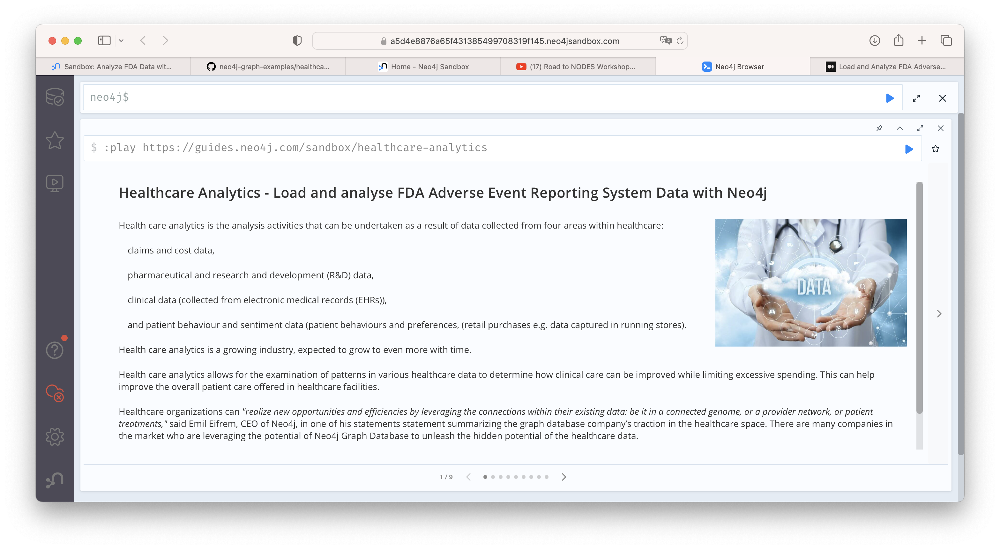

---
In below, we provide a bit different approach to discuss the case so it is (a bit more difficult comparing to a sandbox) repeatable, easier to follow, some more steps are shown, some hidden features revealed, and more explanations added. Most of the text written here are from the original article.

## A. Health care analytics

Health care analytics is the analysis activities that can be undertaken as a result of data collected from four areas within healthcare:

* claims and cost data, 
* pharmaceutical and research and development (R&D) data, 
* clinical data (collected from electronic medical records (EHRs)),
* and patient behavior and sentiment data (patient behaviors and preferences, (retail purchases e.g. data captured in running stores). 

Health care analytics is a growing industry, expected to grow to even more with time.

Health care analytics allows for the examination of patterns in various healthcare data to determine how clinical care can be improved while limiting excessive spending. 
This can help improve the overall patient care offered in healthcare facilities.

Healthcare organizations can _"realize new opportunities and efficiencies by leveraging the connections within their existing data: be it in a connected genome, or a provider network, or patient treatments,"_ said Emil Eifrem, CEO of Neo4j, in one of his statements statement summarizing the graph database company's traction in the healthcare space. 
There are many companies in the market who are leveraging the potential of Neo4j Graph Database to unleash the hidden potential of the healthcare data. 

The connected data capabilities of a graph database can help us achieve what is either impossible or complicated with the traditional relational databases, other NoSQL databases or even big data solutions like Pig and Hive.

&nbsp;

## B. The Example

This demonstration guide covers a similar case of healthcare data analysis with Neo4j. 

We are performing data ingestion and analytics of the FDA Adverse Event Reporting System Data. 
The FDA Adverse Event Reporting System (FAERS or AERS) is a computerized information database designed to support the U.S. Food and Drug Administration's (FDA) post marketing safety surveillance program for all approved drug and therapeutic biologic products. 

The FDA uses FAERS to monitor for new adverse events and medication errors that might occur with these products. 
It is a system that measures occasional harms from medications to ascertain whether the risk–benefit ratio is high enough to justify continued use of any drug and to identify correctable and preventable problems in health care delivery (such as need for retraining to prevent prescribing errors).

Reporting of adverse events from the point of care is voluntary in the United States. 
The FDA receives some adverse event and medication error reports directly from health care professionals (such as physicians, pharmacists, nurses, and others) and consumers (such as patients, family members, lawyers, and others). 
Health professionals and consumers may also report these events to the products’ manufacturers.
If a manufacturer receives an adverse event report, they are required to send the report to the FDA as specified by regulations. 

We downloaded one of the [FDA FAERS datasets](https://www.fda.gov/drugs/questions-and-answers-fdas-adverse-event-reporting-system-faers/fda-adverse-event-reporting-system-faers-public-dashboard), massaged and articulated the demographics for United States. 
We performed data ingestion to prepare the FAERS graph and run a few example analytics queries to see interesting output.

&nbsp;

## C. Getting Neo4j up and running

We are going to use containerized images to provide a consistent executable environment. Please follow the instructions in [Install Docker Engine and Docker Compose](./docker.md) to get your Docker ready. Then pull and create a set of Neo4j Docker-images as follow:

<details>
<summary>1. Setup Neo4j</summary>
<p>

```bash
./scripts/neo4j/start_first_time.sh
```

```bash
Start all services ...
[+] Running 2/2
 ⠿ Network backend  Created                                                             0.0s
 ⠿ Container neo4j  Started                                                             0.3s
Wait for container 'neo4j' to be healthy for max 30 seconds...
Container is healthy after 23 seconds ✅
All services are started ✅
```

Note that we have to wait until `neo4j` is ready. There are several ways to do so, the easier, although not the best for automation, is to scan the log if `Neo4j` is `Started`

```bash
docker compose docker-compose-neo4j.yml logs neo4j -f
```

```bash
neo4j  | Installing Plugin 'apoc' from /var/lib/neo4j/labs/apoc-*-core.jar to /var/lib/neo4j/plugins/apoc.jar
neo4j  | Applying default values for plugin apoc to neo4j.conf
neo4j  | Fetching versions.json for Plugin 'graph-data-science' from https://graphdatascience.ninja/versions.json
neo4j  | Installing Plugin 'graph-data-science' from https://graphdatascience.ninja/neo4j-graph-data-science-2.3.0.jar to /var/lib/neo4j/plugins/graph-data-science.jar 
neo4j  | Applying default values for plugin graph-data-science to neo4j.conf
neo4j  | Changed password for user 'neo4j'. IMPORTANT: this change will only take effect if performed before the database is started for the first time.
neo4j  | 2023-01-31 03:21:28.188+0000 WARN  Use of deprecated setting 'dbms.connector.bolt.advertised_address'. It is replaced by 'server.bolt.advertised_address'.
neo4j  | 2023-01-31 03:21:28.194+0000 INFO  Starting...
neo4j  | 2023-01-31 03:21:28.519+0000 INFO  This instance is ServerId{55581446} (55581446-3cac-44fe-a44c-e9ff5d5a2457)
neo4j  | SLF4J: Failed to load class "org.slf4j.impl.StaticLoggerBinder".
neo4j  | SLF4J: Defaulting to no-operation (NOP) logger implementation
neo4j  | SLF4J: See http://www.slf4j.org/codes.html#StaticLoggerBinder for further details.
neo4j  | 2023-01-31 03:21:28.922+0000 INFO  ======== Neo4j 5.3.0 ========
neo4j  | 2023-01-31 03:21:29.046+0000 INFO  GDS compatibility: for Neo4j Settings 4.4 -- not available, for Neo4j Settings 5.1 -- not available, for Neo4j Settings 5.2.0 -- not available, for Neo4j Settings 5.3 -- available, for Neo4j Settings 5.4 -- not available, selected: Neo4j Settings 5.3
neo4j  | 2023-01-31 03:21:29.046+0000 INFO  GDS compatibility: for Neo4j 4.4 -- not available, for Neo4j 5.1 -- not available, for Neo4j 5.2.0 -- not available, for Neo4j 5.3 -- available, for Neo4j 5.4 -- not available, selected: Neo4j 5.3
neo4j  | 2023-01-31 03:21:45.851+0000 INFO  Bolt enabled on 0.0.0.0:7687.
neo4j  | 2023-01-31 03:21:46.329+0000 INFO  Remote interface available at http://localhost:7474/
neo4j  | 2023-01-31 03:21:46.331+0000 INFO  id: 5E5083CF800D4EEC517C9FFB3D7B45C8250561509A2799DD6958C048E1468363
neo4j  | 2023-01-31 03:21:46.332+0000 INFO  name: system
neo4j  | 2023-01-31 03:21:46.332+0000 INFO  creationDate: 2023-01-31T03:21:29.335Z
neo4j  | 2023-01-31 03:21:46.332+0000 INFO  Started.
```
</p>
</details>

<details>
<summary>2. Create constraints and indexes for faster data search (run only once)</summary>
<p>

First, we define some [constraints](https://neo4j.com/docs/cypher-manual/current/constraints/) and [indexes](https://neo4j.com/docs/cypher-manual/current/indexes-for-search-performance/) for the entities - to enforce uniqueness and higher search performance. The following constraints and indexes are specified in [health_analytics_neo4j_constraints.cql](../conf/health_analytics_neo4j_constraints.cql).

*Constraints:*
```Cypher
CREATE CONSTRAINT constraint_drug_name IF NOT EXISTS FOR (n: `Drug`) REQUIRE n.`name` IS UNIQUE;
CREATE CONSTRAINT constraint_case_primaryid IF NOT EXISTS FOR (n: `Case`) REQUIRE n.`primaryid` IS UNIQUE;
CREATE CONSTRAINT constraint_reaction_description IF NOT EXISTS FOR (n: `Reaction`) REQUIRE n.`description` IS UNIQUE;
CREATE CONSTRAINT constraint_reportsource_code IF NOT EXISTS FOR (n: `ReportSource`) REQUIRE n.`code` IS UNIQUE;
CREATE CONSTRAINT constraint_outcome_code IF NOT EXISTS FOR (n: `Outcome`) REQUIRE n.`code` IS UNIQUE;
CREATE CONSTRAINT constraint_therapy_primaryid IF NOT EXISTS FOR (n: `Therapy`) REQUIRE n.`primaryid` IS UNIQUE;
CREATE CONSTRAINT constraint_manufacturer_name IF NOT EXISTS FOR (n: `Manufacturer`) REQUIRE n.`manufacturerName` IS UNIQUE;
```

*Indexes:*
```Cypher
CREATE INDEX index_case_age IF NOT EXISTS FOR (n: `Case`) ON (n.`age`);
CREATE INDEX index_case_ageUnit IF NOT EXISTS FOR (n: `Case`) ON (n.`ageUnit`);
CREATE INDEX index_case_gender IF NOT EXISTS FOR (n: `Case`) ON (n.`gender`);
CREATE INDEX index_case_eventdate IF NOT EXISTS FOR (n: `Case`) ON (n.`eventDate`);
CREATE INDEX index_case_reportdate IF NOT EXISTS FOR (n: `Case`) ON (n.`reportDate`);
```

Then executing the query (only once) to set them up:
```bash
./scripts/neo4j/setup_database.sh
```

```bash
Creating constraints and indexes ...
0 rows
ready to start consuming query after 205 ms, results consumed after another 0 ms
Added 1 constraints
0 rows
ready to start consuming query after 12 ms, results consumed after another 0 ms
Added 1 constraints
0 rows
ready to start consuming query after 10 ms, results consumed after another 0 ms
Added 1 constraints
0 rows
ready to start consuming query after 11 ms, results consumed after another 0 ms
Added 1 constraints
0 rows
ready to start consuming query after 10 ms, results consumed after another 0 ms
Added 1 constraints
0 rows
ready to start consuming query after 10 ms, results consumed after another 0 ms
Added 1 constraints
0 rows
ready to start consuming query after 9 ms, results consumed after another 0 ms
Added 1 constraints
0 rows
ready to start consuming query after 10 ms, results consumed after another 0 ms
Added 1 indexes
0 rows
ready to start consuming query after 4 ms, results consumed after another 0 ms
Added 1 indexes
0 rows
ready to start consuming query after 3 ms, results consumed after another 0 ms
Added 1 indexes
0 rows
ready to start consuming query after 3 ms, results consumed after another 0 ms
Added 1 indexes
0 rows
ready to start consuming query after 4 ms, results consumed after another 0 ms
Added 1 indexes
Constraints and indexes are created ✅
```
</p>
</details>

<details>
<summary>3. Optional commands</summary>
<p>

Stop Neo4j
```bash
./scripts/neo4j/stop.sh
```

Restart Neo4j
```bash
./scripts/neo4j/start_again.sh
```

Remove Neo4j
```bash
./scripts/neo4j/cleanup.sh
```
</p>
</details>

&nbsp;

## D. Data Model

&nbsp;

### D.1. FAERS Entities (as Neo4j Nodes)

| Entity        | Label        | Description                                                                                                                                                                                                                                    |
|---------------|--------------|------------------------------------------------------------------------------------------------------------------------------------------------------------------------------------------------------------------------------------------------|
| Demographic   | Case         | This is the demographic information of a person involved in the adverse event report.                                                                                                                                                          |
| Drug          | Drug         | Drug involved in the adverse event. A drug can be a primary suspect, secondary suspect, concomitant or interacting drug responsible for the adverse effect. This suspect type is identified by the relationship between Case and Drug Nodes.   |
| Reaction      | Reaction     | This is the reaction that the person (Case) developed after consumption of the respective drug, like 'Pain', 'Body temperature increased' or 'Insomnia' or 'Memory Loss' etc.                                                                  |
| Outcome       | Outcome      | This is the long term outcome of the case after the adverse event, for example 'Hospitalization: Initial or Prolonged', 'Disability' or 'Death'                                                                                                |
| Report_Source | ReportSource | This is the reported of the adverse event, for example 'Health Professional', 'Consumer', 'User Health Facility' etc who has reported the event to FDA system.                                                                                 |
| Therapy       | Therapy      | For some cases, they receive drug as a part of a therapy. This is the therapy details for the case.                                                                                                                                            |
| Indication    | -            | This is the medical term for drug indication that has the details like drug sequence, indication point. We have not used a separate Node label for this, instead we have covered required details as `Case` to `Drug` relationship properties. |
| Demographics  | AgeGroup     | Demographics table in the FEARS data has age information that we turned into a separate node for Age Group reporting.                                                                                                                          |

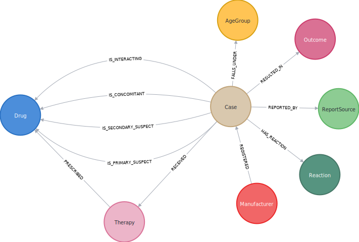
&nbsp;

### D.2. Import data into Neo4j

We import three sets of data by running 
```bash
./scripts/neo4j/import_data.sh
```

This execute the Cyper queries included in [health_analytics_neo4j_import.cql](../conf/health_analytics_neo4j_import.cql), whose content is shown and explained as below.

<details>
<summary>1. Load cases, manufacturers and relate them</summary>
<p>

```Cypher
LOAD CSV WITH HEADERS FROM "https://raw.githubusercontent.com/neo4j-graph-examples/healthcare-analytics/main/data/csv/demographics.csv" AS row

//Conditionally create Case nodes, set properties on first create
MERGE (c:Case { primaryid: toInteger(row.primaryid) })
    ON CREATE SET
        c.eventDate= date(row.eventDate),
        c.reportDate= date(row.reportDate),
        c.age = toFloat(row.age),
        c.ageUnit = row.ageUnit,
        c.gender = row.sex,
        c.reporterOccupation = row.reporterOccupation

    //Conditionally create Manufacturer
    MERGE (m:Manufacturer { manufacturerName: row.manufacturerName } )

    //Relate case and manufacturer
    MERGE (m)-[:REGISTERED]->(c)

    //Conditionally create age group node and relate with case
    MERGE (a:AgeGroup { ageGroup: row.ageGroup })

    //Relate case with age group
    MERGE (c)-[:FALLS_UNDER]->(a)

    RETURN count (c);
```
</p>
</details>

<details>
<summary>2. Load other information related to the events </summary>
<p>

- Load outcomes and link them with cases 

```Cypher
LOAD CSV WITH HEADERS FROM "https://raw.githubusercontent.com/neo4j-graph-examples/healthcare-analytics/main/data/csv/outcome.csv" AS row

// Conditionally create outcome node
MERGE (o:Outcome { code: row.code })
    ON CREATE SET
        o.outcome = row.outcome

WITH o, row
    
    // Find the case to relate this outcome to
    MATCH (c:Case {primaryid: toInteger(row.primaryid)})

    // Relate
    MERGE (c)-[:RESULTED_IN]->(o)

    RETURN count(o);
```

- Load reactions and link them with cases 

```Cypher
LOAD CSV WITH HEADERS FROM "https://raw.githubusercontent.com/neo4j-graph-examples/healthcare-analytics/main/data/csv/reaction.csv" AS row

//Conditionally create reaction node
MERGE (r:Reaction { description: row.description })

WITH r, row

    //Find the case to relate this reaction to
    MATCH (c:Case {primaryid: toInteger(row.primaryid)})

    //Relate
    MERGE (c)-[:HAS_REACTION]->(r)

    RETURN count(r);
```

- Load report sources and link them with cases 

```Cypher
LOAD CSV WITH HEADERS FROM "https://raw.githubusercontent.com/neo4j-graph-examples/healthcare-analytics/main/data/csv/reportSources.csv" AS row

// Conditionally create reportSource node
MERGE (r:ReportSource { code: row.code })
    ON CREATE SET
        r.name = row.name

WITH r, row

    // Find the case to relate this report source to
    MATCH (c:Case {primaryid: toInteger(row.primaryid) })

WITH c, r

    // Relate
    MERGE (c)-[:REPORTED_BY]->(r)

    RETURN count(r);
```
</p>
</details>

<details>
<summary>3. Load drugs and therapies</summary>
<p>

- Load drugs with indications and link them with cases using relationships based on their roles for the cases

```Cypher
LOAD CSV WITH HEADERS FROM "https://raw.githubusercontent.com/neo4j-graph-examples/healthcare-analytics/main/data/csv/drugs-indication.csv" AS row

CALL { WITH row

    //Conditionally create Drug node
    MERGE (d:Drug { name: row.name })
        ON CREATE SET
            d.primarySubstabce = row.primarySubstabce

    WITH d, row

        //Find the case to relate this drug based on the suspect type
        MATCH (c:Case {primaryid: toInteger(row.primaryid)})

        FOREACH (_ IN CASE WHEN row.role = "Primary Suspect" THEN [1] ELSE [] END |
            //Relate
            MERGE (c)-[relate:IS_PRIMARY_SUSPECT { drugSequence: row.drugSequence, route: row.route, doseAmount: row.doseAmount, doseUnit: row.doseUnit, indication: row.indication  }]->(d)
        )

        FOREACH (_ IN CASE WHEN row.role = "Secondary Suspect" THEN [1] ELSE [] END |
            //Relate
            MERGE (c)-[relate:IS_SECONDARY_SUSPECT { drugSequence: row.drugSequence, route: row.route, doseAmount: row.doseAmount, doseUnit: row.doseUnit, indication: row.indication  }]->(d)
        )

        FOREACH (_ IN CASE WHEN row.role = "Concomitant" THEN [1] ELSE [] END |
            //Relate
            MERGE (c)-[relate:IS_CONCOMITANT { drugSequence: row.drugSequence, route: row.route, doseAmount: row.doseAmount, doseUnit: row.doseUnit, indication: row.indication  }]->(d)
        )

        FOREACH (_ IN CASE WHEN row.role = "Interacting" THEN [1] ELSE [] END |
            //Relate
            MERGE (c)-[relate:IS_INTERACTING { drugSequence: row.drugSequence, route: row.route, doseAmount: row.doseAmount, doseUnit: row.doseUnit, indication: row.indication  }]->(d)
        )

} IN TRANSACTIONS OF 5000 ROWS;
```

- Load therapies and link them with cases and drugs 

```Cypher
LOAD CSV WITH HEADERS FROM "https://raw.githubusercontent.com/neo4j-graph-examples/healthcare-analytics/main/data/csv/therapy.csv" AS row

//Conditionally create therapy node
MERGE (t:Therapy { primaryid: toInteger(row.primaryid) })

WITH t, row
    
    //Find the case to relate this therapy to
    MATCH (c:Case {primaryid: toInteger(row.primaryid)})

    //Relate case with therapy
    MERGE (c)-[:RECEIVED]->(t)

WITH c, t, row

    //Find drugs prescribed in the therapy
    MATCH (d:Drug { name: row.drugName })

    //Relate therapy and drugs
    MERGE (t)-[:PRESCRIBED { drugSequence: row.drugSequence, startYear: coalesce(row.startYear, 1900), endYear: coalesce(row.endYear, 2021) } ]->(d);
```
</p>
</details>

<details>
<summary>Import results</summary>
<p>

```bash
Importing data ...
+-----------+
| count (c) |
+-----------+
| 4307      |
+-----------+

1 row
ready to start consuming query after 387 ms, results consumed after another 1009 ms
Added 4448 nodes, Created 8614 relationships, Set 30290 properties, Added 4448 labels
+----------+
| count(o) |
+----------+
| 4461     |
+----------+

1 row
ready to start consuming query after 80 ms, results consumed after another 240 ms
Added 6 nodes, Created 4461 relationships, Set 12 properties, Added 6 labels
+----------+
| count(r) |
+----------+
| 21069    |
+----------+

1 row
ready to start consuming query after 44 ms, results consumed after another 486 ms
Added 2701 nodes, Created 21069 relationships, Set 2701 properties, Added 2701 labels
+----------+
| count(r) |
+----------+
| 4307     |
+----------+

1 row
ready to start consuming query after 45 ms, results consumed after another 122 ms
Added 5 nodes, Created 4307 relationships, Set 10 properties, Added 5 labels
0 rows
ready to start consuming query after 1405 ms, results consumed after another 0 ms
Added 2500 nodes, Created 15840 relationships, Set 84028 properties, Added 2500 labels
0 rows
ready to start consuming query after 408 ms, results consumed after another 0 ms
Added 1721 nodes, Created 7162 relationships, Set 18044 properties, Added 1721 labels
Data is imported ✅
```
</p>
</details>

We can take a look at a case view as a graph of connected entities:

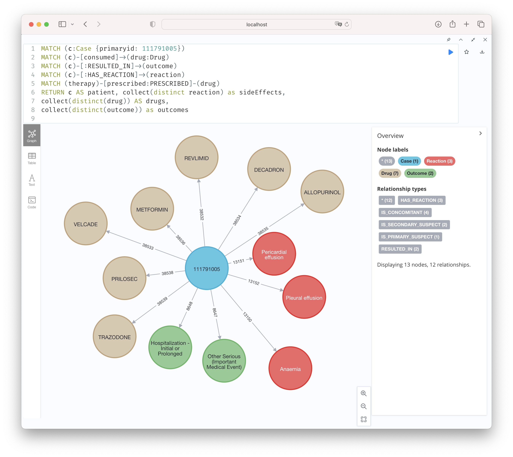

```Cypher
MATCH (c:Case {primaryid: 111791005})
MATCH (c)-[consumed]->(drug:Drug)
MATCH (c)-[:RESULTED_IN]->(outcome)
MATCH (c)-[:HAS_REACTION]->(reaction)
MATCH (therapy)-[prescribed:PRESCRIBED]-(drug)
RETURN c AS patient, collect(distinct reaction) as sideEffects,
collect(distinct(drug)) AS drugs,
collect(distinct(outcome)) as outcomes
```

## E. Performing Data Analytics

Navigate your browser to `http://localhost:5005`, your instance of [Neodash](https://neo4j.com/labs/neodash/) should already be running there.

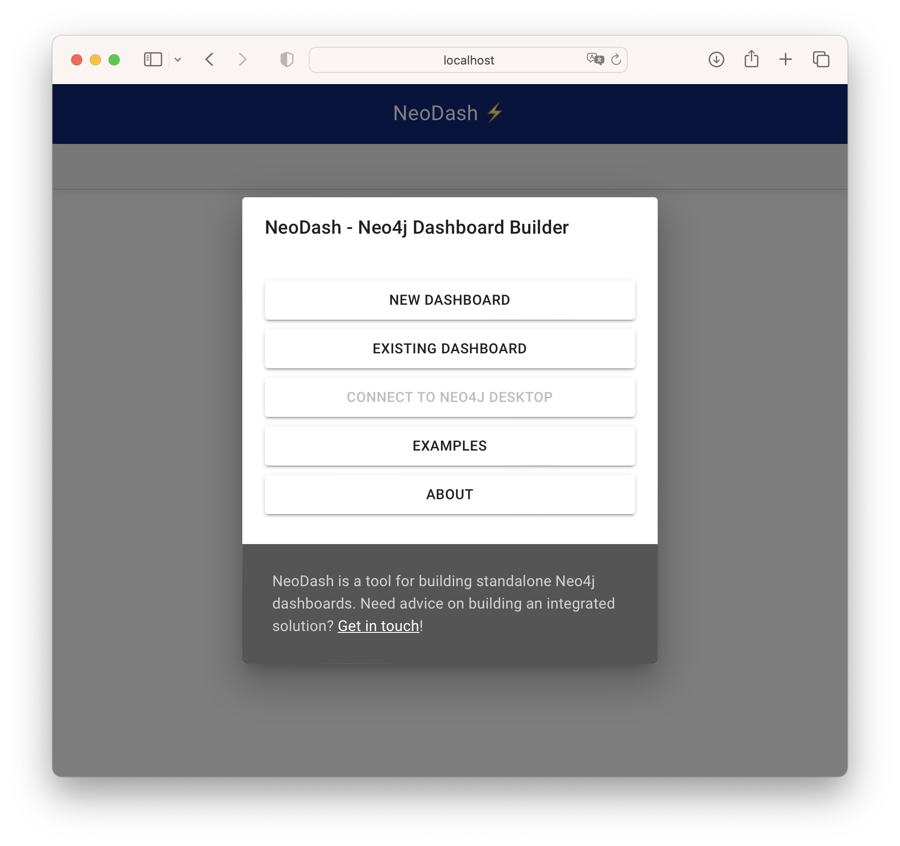

Choose to create a new dashboard, then login with `neo4j` and `phac2022` credential.

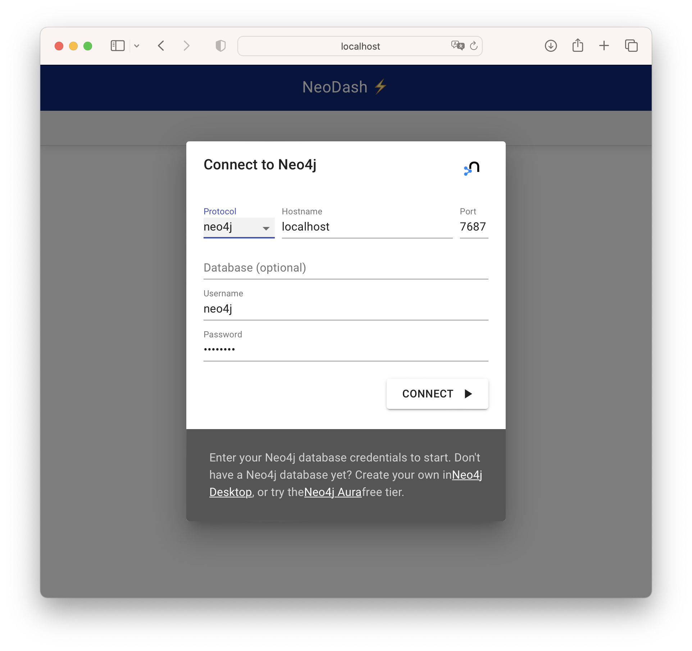

And finally click the `Load Dashboard` button on the left menu panel, then paste in the content of [neodash_dashboard.json](../conf/neodash_dashboard.json), which was created by the `Cypher` queries below.

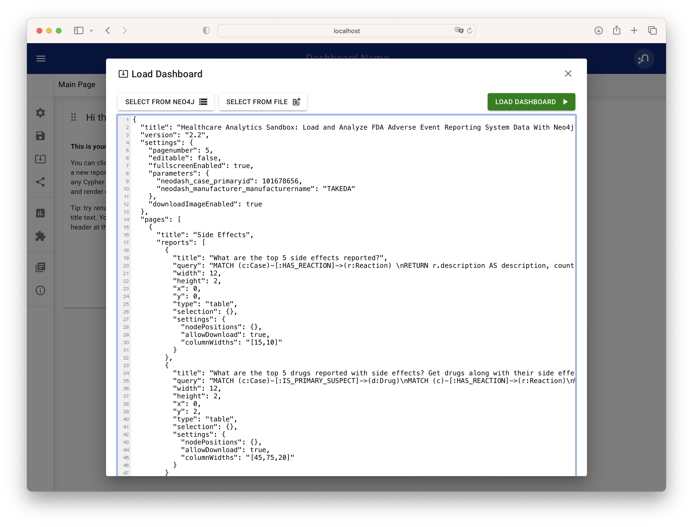

### E.1. Side Effects

1. What are the top 5 side effects reported?

```Cypher
MATCH (c:Case)-[:HAS_REACTION]->(r:Reaction) 
RETURN r.description AS description, count(c) As count
ORDER BY count(c) DESC 
LIMIT 5;
```

2. What are the top 5 drugs reported with side effects? Get drugs along with their side effects.

```Cypher
MATCH (c:Case)-[:IS_PRIMARY_SUSPECT]->(d:Drug)
MATCH (c)-[:HAS_REACTION]->(r:Reaction)
WITH d.name as drugName, collect(r.description) as sideEffects, count(r.description) as totalSideEffects
RETURN drugName, sideEffects[0..5] as sideEffects, totalSideEffects 
ORDER BY totalSideEffects DESC LIMIT 5;
```

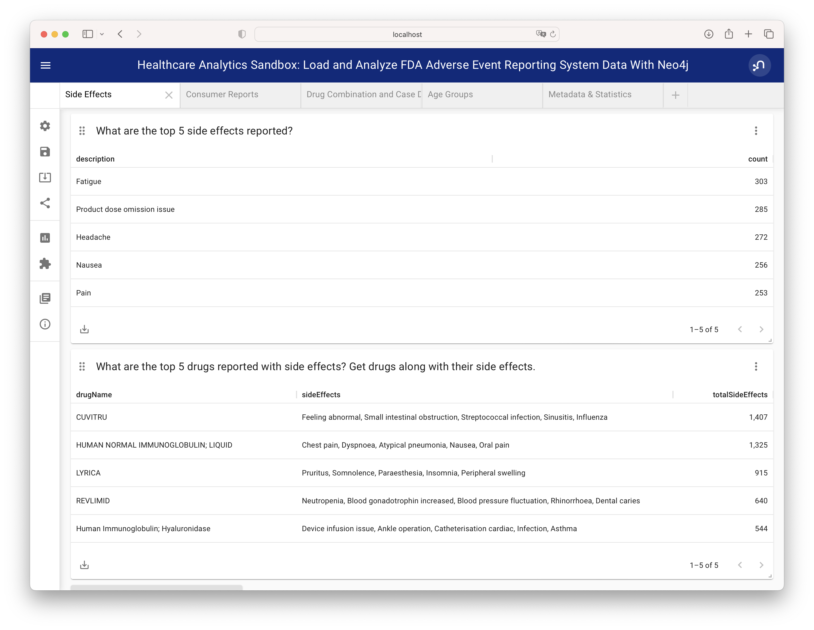

### E.2. Companies

1. What are the manufacturing companies which have most drugs which reported side effects?

```Cypher
MATCH (m:Manufacturer)-[:REGISTERED]->(c)-[:HAS_REACTION]->(r)
RETURN m.manufacturerName as company, count(distinct r) as numberOfSideEffects
ORDER BY numberOfSideEffects DESC LIMIT 5;
```

2. Top 5 registered Drugs and their Side Effects
* What are the top 5 drugs from a particular company with side effects? 
* What are the side effects from those drugs?

```Cypher
MATCH (m:Manufacturer {manufacturerName: 'NOVARTIS'})-[:REGISTERED]->(c)
MATCH (r:Reaction)<--(c)-[:IS_PRIMARY_SUSPECT]->(d)
WITH d.name as drug,collect(distinct r.description) AS reactions, count(distinct r) as totalReactions
RETURN drug, reactions[0..5] as sideEffects, totalReactions 
ORDER BY totalReactions DESC
LIMIT 5;
```

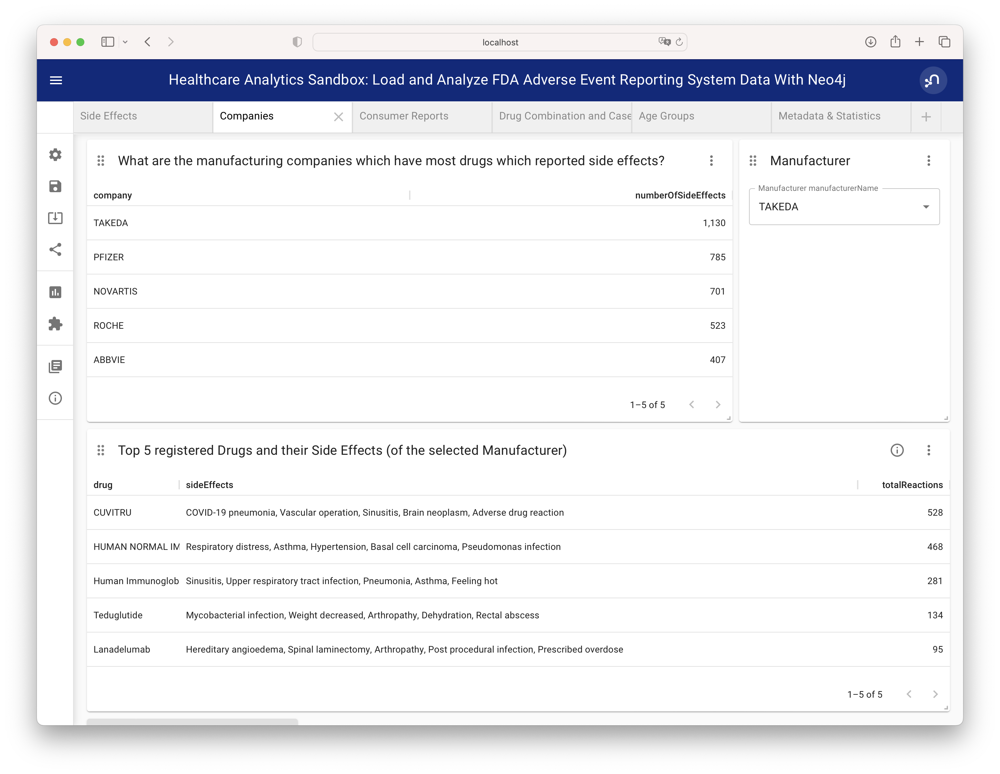

### E.3. Consumer Reports

1. What are the top 5 drugs which are reported directly by consumers for the side effects?

```Cypher
MATCH (c:Case)-[:REPORTED_BY]->(rpsr:ReportSource {name: "Consumer"})
MATCH (c)-[:IS_PRIMARY_SUSPECT]->(d)
MATCH (c)-[:HAS_REACTION]->(r)
WITH rpsr.name as reporter, d.name as drug, collect(distinct r.description) as sideEffects, count(distinct r) as total
RETURN drug, reporter, sideEffects[0..5] as sideEffects 
ORDER BY total desc LIMIT 5;
```

2. What are the top 5 drugs whose side effects resulted in Death of patients as an outcome?

```Cypher
MATCH (c:Case)-[:RESULTED_IN]->(o:Outcome {outcome:"Death"})
MATCH (c)-[:IS_PRIMARY_SUSPECT]->(d)
MATCH (c)-[:HAS_REACTION]->(r)
WITH d.name as drug, collect(distinct r.description) as sideEffects, o.outcome as outcome, count(distinct c) as cases
RETURN drug, sideEffects[0..5] as sideEffects, outcome, cases
ORDER BY cases DESC
LIMIT 5;
```

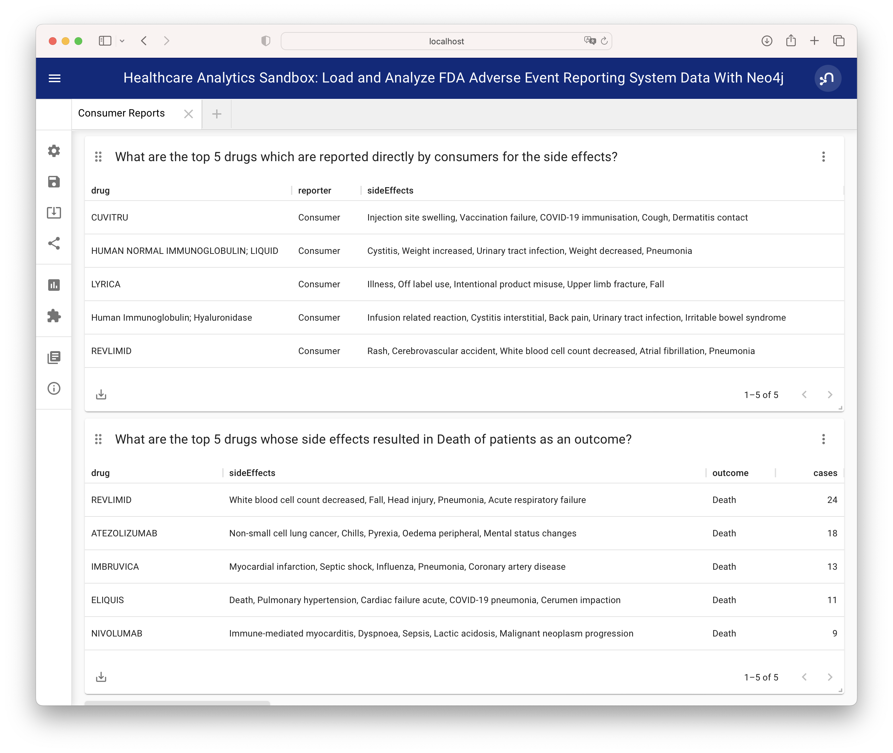

### E.4. Drug Combination and Case Details

1. Show top 10 drug combinations which have most side effects when consumed together

```Cypher
MATCH (c:Case)-[:IS_PRIMARY_SUSPECT]->(d1)
MATCH (c:Case)-[:IS_SECONDARY_SUSPECT]->(d2)
MATCH (c)-[:HAS_REACTION]->(r)
MATCH (c)-[:RESULTED_IN]->(o)
WHERE d1<>d2
WITH d1.name as primaryDrug, d2.name as secondaryDrug,
collect(r.description) as sideEffects, count(r.description) as totalSideEffects, collect(o.outcome) as outcomes
RETURN primaryDrug, secondaryDrug, sideEffects[0..3] as sideEffects, totalSideEffects, outcomes[0] ORDER BY totalSideEffects desc
LIMIT 10;
```

2. Take one of the case, and list demographics, all the drugs given, side effects and outcome for the patient.
This actually is split into three panels.

```Cypher
MATCH (c:Case {primaryid: 111791005})
MATCH (c)-[consumed]->(drug:Drug)
MATCH (c)-[:RESULTED_IN]->(outcome)
MATCH (c)-[:HAS_REACTION]->(reaction)
MATCH (therapy)-[prescribed:PRESCRIBED]-(drug)
WITH distinct c.age + ' ' + c.ageUnit as age, c.gender as gender,
collect(distinct reaction.description) as sideEffects,
collect(
    distinct {   drug: drug.name,
        dose: consumed.doseAmount + ' '  + consumed.doseUnit,
        indication: consumed.indication,
        route: consumed.route
    }) as treatment,
collect(distinct outcome.outcome) as outcomes
RETURN age, gender, treatment, sideEffects, outcomes ;
```
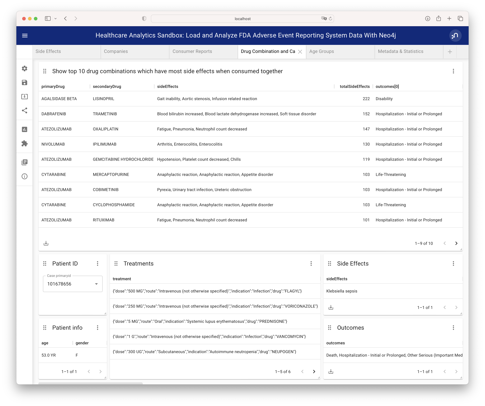

### E.5. Age Groups

1. What is the age group which reported highest side effects, and what are those side effects?

```Cypher
MATCH (a:AgeGroup)<-[:FALLS_UNDER]-(c:Case)
MATCH (c)-[:HAS_REACTION]->(r)
WITH a, collect(r.description) as sideEffects, count(r) as total
RETURN a.ageGroup as ageGroupName, sideEffects[0..6] as sideEffects 
ORDER BY total DESC
LIMIT 1;
```

2. What are the highest side effects reported in Children and what are the drugs those caused these side effects?

```Cypher
MATCH (a:AgeGroup {ageGroup:"Child"})<-[:FALLS_UNDER]-(c)
MATCH (c)-[:HAS_REACTION]->(r)
MATCH (c)-[:IS_PRIMARY_SUSPECT]->(d)
WITH distinct r.description as sideEffect, collect(distinct d.name) as drugs, count(r) as sideEffectCount
RETURN sideEffect, drugs 
ORDER BY sideEffectCount desc LIMIT 5;
```

3. What is the percentage wise allocation of side effects for each age group?

```Cypher
MATCH (c:Case)-[:HAS_REACTION]->(r)
WITH count(r) as totalReactions
MATCH (a:AgeGroup)<-[:FALLS_UNDER]-(c)-[:HAS_REACTION]->(r)
WITH a, count(r) as ageGroupWiseReactions, totalReactions
RETURN a.ageGroup as ageGroupName, (ageGroupWiseReactions*100.00)/totalReactions as perc
ORDER BY perc DESC
```

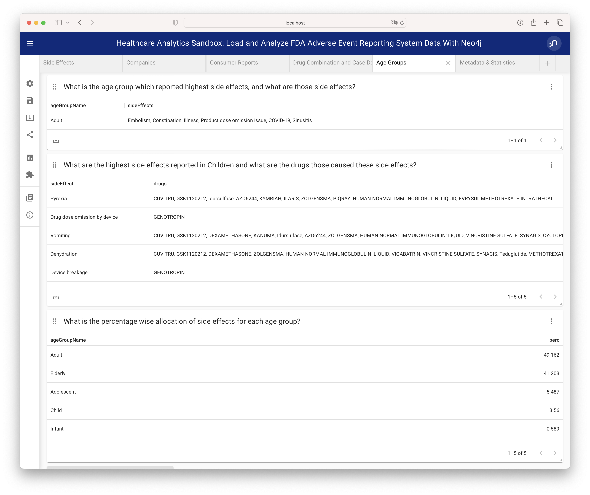

[Back](../README.md)