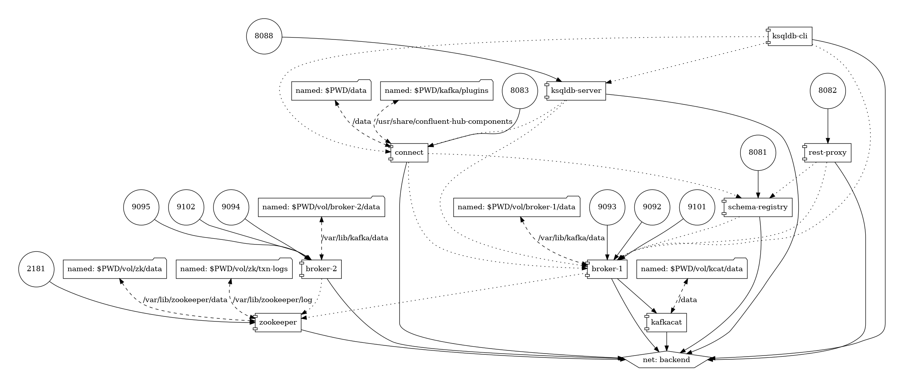
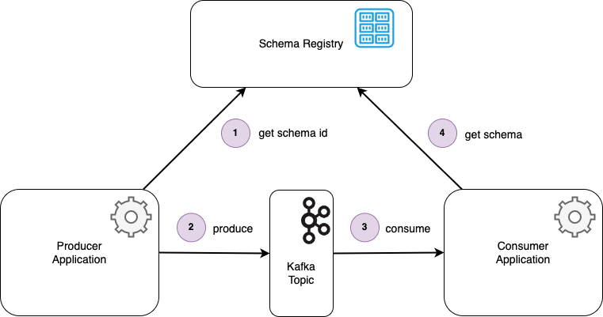
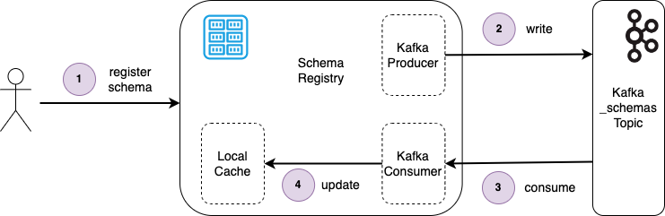
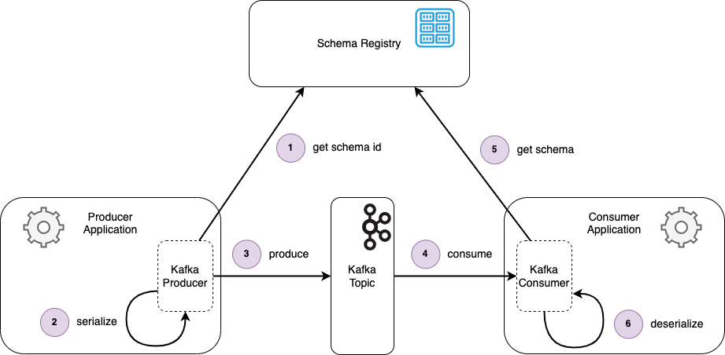
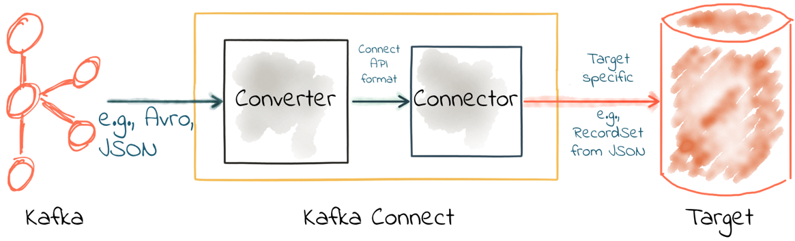

## Kafka Cluster Community Edition (CE)

The `Kafka` Cluster Community Edition is setup in [`docker-compose-kafka-ce.yml`](../docker-compose-kafka-ce.yml), which consists of services based on `Docker` images
- `zookeper` ([`Apache Zookeeper`](https://zookeeper.apache.org))
- `broker-1` and `broker-2` ([`Apache Kafka`](https://kafka.apache.org/documentation.html))
- `schema-registry` ([`Confluent Schema Registry`](https://github.com/confluentinc/schema-registry))
- `connect` ([`Apache Kafka Connect`](https://kafka.apache.org/documentation.html#connect))
- `ksqldb-server` ([`Confluent ksqlDB`](https://ksqldb.io/))
- `ksqldb-cli` ([`Confluent ksqlDB CLI`](https://docs.ksqldb.io/en/latest/operate-and-deploy/installation/cli-config/))
- `rest-proxy` ([`Confluent Rest Proxy`](https://github.com/confluentinc/kafka-rest))
- `kafkacat` ([`Kafkacat CLI`](https://docs.confluent.io/platform/current/app-development/kafkacat-usage.html))



&nbsp;

### A. Common tasks

<details>
<summary>Click here for technical details.</summary>
<p>

1. Prepare folders for data, logs, and test files

```bash
./scripts/kafka/setup.sh
```

2. Start the cluster

```bash
./scripts/kafka/start_after_setup.sh
```

### IV.3.b (Optional) Other utilities

1. Stop the cluster

```bash
./scripts/kafka/stop.sh
```

2. Restart the cluster (once it has already been set up)

```bash
./scripts/kafka/start_again.sh
```

3. Remove the cluster

```bash
./scripts/kafka/cleanup.sh
```

</p>
</details>

&nbsp;

### B. Zookeeper and Brokers

<details>
<summary>Click here for technical details.</summary>
<p>

First, we comment all other services in the `services` section of the  [`docker-compose-kafka-ce.yml`](../docker-compose-kafka-ce.yml), leaving only `zookeper`, `broker-1`, and `broker-2`.

1. Prepare folders for data, logs, and test files

```bash
./scripts/kafka/setup.sh
```
```bash
Creating volumes for zookeeper and broker(s) ...
vol/zk/data volume is created.
vol/zk/txn-logs volume is created.
vol/broker-1/data volume is created.
vol/broker-2/data volume is created.
Volumes for zookeeper and broker(s) created ✅
```

2. Start the cluster

```bash
./scripts/kafka/start_after_setup.sh
```
```bash
Start all services ...
[+] Running 16/16
 ⠿ broker-1 Pulled                                                                                                                               21.5s
 ⠿ broker-2 Pulled                                                                                                                               21.5s
   ⠿ a598ce84e35d Pull complete                                                                                                                   2.0s
   ⠿ 13e38800e73e Pull complete                                                                                                                   9.6s
   ⠿ 9fdfac543434 Pull complete                                                                                                                   9.7s
   ⠿ 4559e9cecfbd Pull complete                                                                                                                   9.7s
   ⠿ f661e8453626 Pull complete                                                                                                                   9.9s
   ⠿ 177bd8be5779 Pull complete                                                                                                                  10.0s
   ⠿ 269c80094f00 Pull complete                                                                                                                  10.0s
   ⠿ 20c185f8d754 Pull complete                                                                                                                  10.1s
   ⠿ 4d4a269d9970 Pull complete                                                                                                                  10.1s
   ⠿ f2d1d31b9ef4 Pull complete                                                                                                                  10.7s
   ⠿ 5f4966e8af23 Pull complete                                                                                                                  10.7s
 ⠿ zookeeper Pulled                                                                                                                              21.5s
   ⠿ 3158a4d155a6 Pull complete                                                                                                                  10.4s
   ⠿ 77350cadb764 Pull complete                                                                                                                  10.5s
[+] Running 4/4
 ⠿ Network backend      Created                                                                                                                   0.0s
 ⠿ Container zookeeper  Started                                                                                                                   0.7s
 ⠿ Container broker-2   Started                                                                                                                   0.6s
 ⠿ Container broker-1   Started                                                                                                                   0.6s
All services are started ✅

Wait for zookeeper:2181 ...
zookeeper:2181 is ready ✅

Wait for broker-1:29092 ...
broker-1:29092 is ready ✅
Wait for broker-2:29094 ...
broker-2:29094 is ready ✅

Kafka cluster is ready ✅
```

3. Run basic test (can be repeated multiple times):

```
./scripts/kafka/tests/test_brokers.sh
```
```bash
Create topic-console-test from inside broker-1 to broker-1:29092 ...
Created topic topic-console-test.
topic-console-test created ✅

Sending 3 messages into topic-console-test from broker-1 to broker-1:29092 ...
3 messages sent ✅

Receiving 3 messages from topic-console-test ...
3 messages received ✅
Test sending/receiving messages completed ✅

Resetting consumer offsets from topic-console-test ...

GROUP                          TOPIC                          PARTITION  NEW-OFFSET     
test-consumer                  topic-console-test             0          0              
Consumer offsets reset ✅

Receiving 3 messages from topic-console-test ...
3 messages received ✅
Test sending/receiving messages completed ✅

Deleting topic-console-test ...
topic-console-test deleted ✅
```

4. Remove the cluster

```bash
./scripts/kafka/cleanup.sh
```

```bash
Stopping all services ...
[+] Running 3/3
 ⠿ Container broker-1   Stopped                                                                                                                   0.9s
 ⠿ Container broker-2   Stopped                                                                                                                   0.9s
 ⠿ Container zookeeper  Stopped                                                                                                                   0.5s
All services are stopped ✅

Shutting down containers...
[+] Running 4/0
 ⠿ Container broker-2   Removed                                                                                                                   0.0s
 ⠿ Container broker-1   Removed                                                                                                                   0.0s
 ⠿ Container zookeeper  Removed                                                                                                                   0.0s
 ⠿ Network backend      Removed                                                                                                                   0.1s
Containers shutdown ✅

Removing instance files ...
Instance files removed ✅
```

</p>
</details>

&nbsp;

### C. Adding Schema Registry

<details>
<summary>Click here for technical details.</summary>
<p>

**Credit** [Kafka Schema Registry & Avro: Introduction by Rob Golder](https://www.lydtechconsulting.com/blog-kafka-schema-registry-intro.html)

The schema registry is an independent component that microservices talk to in order to retrieve and apply the required schemas. The most popular schema registry used for Kafka applications is Confluent’s Schema Registry. This can be run as a standalone service or hosted by Confluent in the cloud. It provides a REST API for administering and retrieving the schemas. New schemas are registered with the Schema Registry, which can happen automatically as part of the serialization flow, via a REST client, or if configured as part of the CI/CD pipeline. The upshot of using the schema registry as a common repository for the schema is that the microservices that use it remain fully decoupled. The applications are able to evolve independently, with well-defined versioned schemas ensuring the evolving messages can still be understood.



Confluent’s Schema Registry uses Kafka itself as its storage backend. The Schema Registry writes the schemas that are being registered to a dedicated, compacted, topic. By default this is called *_schemas*, although can be configured using the kafkastore.topic Schema Registry parameter. A new schema or version of an existing schema is registered using the Schema Registry REST API. The REST API can be called manually, or by using the Schema Registry client abstraction provided by Confluent, or triggered via the Confluent Schema Registry maven plugin. Alternatively Confluent’s Kafka Avro serializer can be configured to register the new schema if it does not yet exist. The Schema Registry then consumes the schemas from the *_schemas* topic, building a copy in a local cache.



- Step 1 - An Avro schema is registered with the Schema Registry via a REST POST request.
- Step 2 - The Schema Registry writes the new schema to the _schemas Kafka topic.
- Step 3 - The Schema Registry consumes the new schema from the _schemas topic.
- Step 4 - The local cache is updated with the new schema.

When the schema or schema Id is requested from the Schema Registry as happens during the serialization and deserialization flows, the results can be served from the local cache. By utilizing Kafka as the backend storage for schemas, the Schema Registry therefore gets all the benefits that Kafka provides, such as resiliency and redundancy. For example, if a broker node hosting a *_schemas* topic partition fails, a replica partition will have a copy of the data. If the Schema Registry fails and is restarted, or a new instance of the Schema Registry is started, it begins by consuming the schemas available from the compacted *_schemas* topic to (re)build its local cache.

Confluent’s Kafka avro serializer library provides the KafkaAvroSerializer and KafkaAvroDeserializer classes that are responsible for performing the serialization and deserialization of message keys and values. These are registered with the consumer and producer respectively. As part of their de/serialization processing they interact with the Schema Registry as necessary, such that the developer does not need to be concerned with this complexity.



- Step 1 - A message is being produced. The Kafka Avro Serializer in the producer gets the schema id associated with the schema of the message (which is obtained by reflection).
- Step 2 - The message is serialized in the Avro format, verified using the retrieved schema.
- Step 3 - The message is written to the Kafka topic.
- Step 4 - The message is consumed from the topic by the Kafka consumer.
- Step 5 - The Kafka Avro Deserializer in the consumer gets the schema Id from the message and uses this to look up the schema from the Schema Registry.
- Step 6 - The message is deserialized, verified using the retrieved schema.

&nbsp;

Now, we comment out `schema-registry` service in the `services` section of the [`docker-compose-kafka-ce.yml`](../docker-compose-kafka-ce.yml).

1. Prepare folders for data, logs, and test files

```bash
./scripts/kafka/setup.sh
```

2. Start the cluster

```bash
./scripts/kafka/start_after_setup.sh
```
```bash
Start all services ...
[+] Running 12/12
 ⠿ schema-registry Pulled                                                                                                                        47.1s
   ⠿ a598ce84e35d Already exists                                                                                                                  0.0s
   ⠿ 13e38800e73e Already exists                                                                                                                  0.0s
   ⠿ 9fdfac543434 Already exists                                                                                                                  0.0s
   ⠿ 4559e9cecfbd Already exists                                                                                                                  0.0s
   ⠿ f661e8453626 Already exists                                                                                                                  0.0s
   ⠿ 177bd8be5779 Already exists                                                                                                                  0.0s
   ⠿ 269c80094f00 Already exists                                                                                                                  0.0s
   ⠿ 20c185f8d754 Already exists                                                                                                                  0.0s
   ⠿ 4d4a269d9970 Already exists                                                                                                                  0.0s
   ⠿ aa10c34d88c7 Pull complete                                                                                                                  45.7s
   ⠿ ea4531615707 Pull complete                                                                                                                  45.8s
[+] Running 5/5
 ⠿ Network backend            Created                                                                                                             0.0s
 ⠿ Container zookeeper        Started                                                                                                             0.7s
 ⠿ Container broker-1         Started                                                                                                             0.7s
 ⠿ Container broker-2         Started                                                                                                             0.6s
 ⠿ Container schema-registry  Started                                                                                                             0.9s
All services are started ✅

Wait for zookeeper:2181 ...
zookeeper:2181 is ready ✅

Wait for broker-1:29092 ...
broker-1:29092 is ready ✅
Wait for broker-2:29094 ...
broker-2:29094 is ready ✅

Wait for schema-registry:8081 ...
schema-registry:8081 is ready ✅

Kafka cluster is ready ✅
```

3. Run basic test (can be repeated multiple times):

```
./scripts/kafka/tests/test_schema_registry.sh
```
```bash
Create daily-report from inside broker to broker:29092 ...
Created topic daily-report.
daily-report created ✅

Check schema types are supported by http://localhost:8081 ...
["JSON","PROTOBUF","AVRO"] are supported ✅
AVRO is supported ✅

Get top level schema compatibility configuration ...
"BACKWARD"

List all current subjects ...

Add key schema for daily reports ...
1

List all current subjects ...
"daily-report-key"

Add value schema for daily reports ...
3

List all current subjects ...
"daily-report-key"
"daily-report-value"

List all versions of daily-report-key...
{
  "subject": "daily-report-key",
  "version": 3,
  "id": 1,
  "schema": "{\"type\":\"record\",\"name\":\"daily_report_key\",\"namespace\":\"ca.gov.phac.cdsb.dmia.oan.dmri\",\"fields\":[{\"name\":\"date\",\"type\":\"string\"},{\"name\":\"fips\",\"type\":\"string\"}]}"
}

List all versions of daily-report-value...
{
  "subject": "daily-report-value",
  "version": 3,
  "id": 3,
  "schema": "{\"type\":\"record\",\"name\":\"daily_report_value\",\"namespace\":\"ca.gov.phac.cdsb.dmia.oan.dmri\",\"doc\":\"Value record, of a daily report, containing four fields: name of the county, name of the state, number of cases, and number of deaths on the date of reporting.\",\"fields\":[{\"name\":\"county\",\"type\":\"string\"},{\"name\":\"state\",\"type\":\"string\"},{\"name\":\"cases\",\"type\":\"int\"},{\"name\":\"deaths\",\"type\":\"int\"}]}"
}

Produce messages ...

Consume messages ...
{"county":"Bristol","state":"Rhode Island","cases":1369,"deaths":44}
{"county":"Aiken","state":"South Carolina","cases":6791,"deaths":101}
{"county":"Jones","state":"South Dakota","cases":63,"deaths":0}
{"county":"Lawrence","state":"Tennessee","cases":2987,"deaths":38}
{"county":"Tyler","state":"Texas","cases":325,"deaths":5}
{"county":"Morgan","state":"Utah","cases":566,"deaths":3}
{"county":"Essex","state":"Vermont","cases":62,"deaths":0}
{"county":"St. Thomas","state":"Virgin Islands","cases":898,"deaths":15}
{"county":"Pulaski","state":"Virginia","cases":794,"deaths":16}
{"county":"Columbia","state":"Washington","cases":48,"deaths":3}
{"county":"Wyoming","state":"West Virginia","cases":840,"deaths":11}
{"county":"Weston","state":"Wyoming","cases":419,"deaths":2}
Processed a total of 12 messages

Delete daily-report-key subject ...
3

Delete daily-report-value subject ...
3

List all current subjects ...

Deleting daily-report ...
daily-report deleted ✅
```

4. Remove the cluster

```bash
./scripts/kafka/cleanup.sh
```

</p>
</details>

&nbsp;

### D. Adding Connect and SpoolDir Source Connector

<details>
<summary>Click here for technical details.</summary>
<p>

**Credit [Kafka Connect Deep Dive – Converters and Serialization Explained](https://www.confluent.io/blog/kafka-connect-deep-dive-converters-serialization-explained/)**

Kafka Connect is part of Apache Kafka®, providing streaming integration between data stores (e.g. including databases) and Kafka. Kafka Connect is modular in nature, providing a very powerful way of handling integration requirements. Some key components include:
- Connectors – the JAR files that define how to integrate with the data store itself
- Converters – handling serialization and deserialization of data
- Transforms – optional in-flight manipulation of messages

This section demonstrates a test with the [SpoolDir Source Connector](https://github.com/jcustenborder/kafka-connect-spooldir) which is capable of digesting [`csv`-format files](../data/kafka-ce/counties.csv).



The test to run (can be repeated multiple times):
```
./scripts/kafka/tests/test_connect.sh
```
```bash
Listing all available plugins ...
"io.confluent.connect.jdbc.JdbcSinkConnector"
"streams.kafka.connect.sink.Neo4jSinkConnector"
"com.github.jcustenborder.kafka.connect.spooldir.SpoolDirAvroSourceConnector"
"com.github.jcustenborder.kafka.connect.spooldir.SpoolDirBinaryFileSourceConnector"
"com.github.jcustenborder.kafka.connect.spooldir.SpoolDirCsvSourceConnector"
"com.github.jcustenborder.kafka.connect.spooldir.SpoolDirJsonSourceConnector"
"com.github.jcustenborder.kafka.connect.spooldir.SpoolDirLineDelimitedSourceConnector"
"com.github.jcustenborder.kafka.connect.spooldir.SpoolDirSchemaLessJsonSourceConnector"
"com.github.jcustenborder.kafka.connect.spooldir.elf.SpoolDirELFSourceConnector"
"io.confluent.connect.jdbc.JdbcSourceConnector"
"org.apache.kafka.connect.mirror.MirrorCheckpointConnector"
"org.apache.kafka.connect.mirror.MirrorHeartbeatConnector"
"org.apache.kafka.connect.mirror.MirrorSourceConnector"
"streams.kafka.connect.source.Neo4jSourceConnector"

Listing all connectors ...

Copying data into for spooldir ...
data/kafka-ce/counties.csv is copied.
Folders for spooldir data created ✅

counties county_fips population:int32,lat:float32,lng:float32
HTTP/1.1 201 Created
Date: Wed, 08 Feb 2023 04:38:01 GMT
Location: http://localhost:8083/connectors/spooldir_counties
Content-Type: application/json
Content-Length: 639
Server: Jetty(9.4.48.v20220622)

{"name":"spooldir_counties","config":{"connector.class":"com.github.jcustenborder.kafka.connect.spooldir.SpoolDirCsvSourceConnector","topic":"topic-counties","input.path":"/data/unprocessed","finished.path":"/data/processed","error.path":"/data/error","input.file.pattern":"^counties-[0-9]+\\.csv","schema.generation.enabled":"true","schema.generation.key.fields":"county_fips","csv.first.row.as.header":"true","transforms":"castTypes","transforms.castTypes.type":"org.apache.kafka.connect.transforms.Cast$Value","transforms.castTypes.spec":"population:int32,lat:float32,lng:float32","name":"spooldir_counties"},"tasks":[],"type":"source"}
Wait for delivery ...

Listing all connectors ...
"spooldir_counties"

List all topics ...
__consumer_offsets
_confluent-monitoring
_schemas
docker-connect-configs
docker-connect-offsets
docker-connect-status
topic-counties

List all current subjects ...
"topic-counties-key"
"topic-counties-value"

List all versions of topic-counties-key...
{
  "subject": "topic-counties-key",
  "version": 3,
  "id": 3,
  "schema": "{\"type\":\"record\",\"name\":\"Key\",\"namespace\":\"com.github.jcustenborder.kafka.connect.model\",\"fields\":[{\"name\":\"county_fips\",\"type\":[\"null\",\"string\"],\"default\":null}],\"connect.name\":\"com.github.jcustenborder.kafka.connect.model.Key\"}"
}

List all versions of topic-counties-value...
{
  "subject": "topic-counties-value",
  "version": 3,
  "id": 4,
  "schema": "{\"type\":\"record\",\"name\":\"Value\",\"namespace\":\"com.github.jcustenborder.kafka.connect.model\",\"fields\":[{\"name\":\"county\",\"type\":[\"null\",\"string\"],\"default\":null},{\"name\":\"county_ascii\",\"type\":[\"null\",\"string\"],\"default\":null},{\"name\":\"county_full\",\"type\":[\"null\",\"string\"],\"default\":null},{\"name\":\"county_fips\",\"type\":[\"null\",\"string\"],\"default\":null},{\"name\":\"state_id\",\"type\":[\"null\",\"string\"],\"default\":null},{\"name\":\"state_name\",\"type\":[\"null\",\"string\"],\"default\":null},{\"name\":\"lat\",\"type\":[\"null\",\"float\"],\"default\":null},{\"name\":\"lng\",\"type\":[\"null\",\"float\"],\"default\":null},{\"name\":\"population\",\"type\":[\"null\",\"int\"],\"default\":null}],\"connect.name\":\"com.github.jcustenborder.kafka.connect.model.Value\"}"
}

Consume messages ...
{"county":{"string":"Los Angeles"},"county_ascii":{"string":"Los Angeles"},"county_full":{"string":"Los Angeles County"},"county_fips":{"string":"06037"},"state_id":{"string":"CA"},"state_name":{"string":"California"},"lat":{"float":34.3209},"lng":{"float":-118.2247},"population":{"int":10040682}}
{"county":{"string":"Cook"},"county_ascii":{"string":"Cook"},"county_full":{"string":"Cook County"},"county_fips":{"string":"17031"},"state_id":{"string":"IL"},"state_name":{"string":"Illinois"},"lat":{"float":41.8401},"lng":{"float":-87.8168},"population":{"int":5169517}}
{"county":{"string":"Harris"},"county_ascii":{"string":"Harris"},"county_full":{"string":"Harris County"},"county_fips":{"string":"48201"},"state_id":{"string":"TX"},"state_name":{"string":"Texas"},"lat":{"float":29.8578},"lng":{"float":-95.3936},"population":{"int":4680609}}
{"county":{"string":"Maricopa"},"county_ascii":{"string":"Maricopa"},"county_full":{"string":"Maricopa County"},"county_fips":{"string":"04013"},"state_id":{"string":"AZ"},"state_name":{"string":"Arizona"},"lat":{"float":33.349},"lng":{"float":-112.4915},"population":{"int":4412779}}
{"county":{"string":"San Diego"},"county_ascii":{"string":"San Diego"},"county_full":{"string":"San Diego County"},"county_fips":{"string":"06073"},"state_id":{"string":"CA"},"state_name":{"string":"California"},"lat":{"float":33.0343},"lng":{"float":-116.735},"population":{"int":3323970}}
{"county":{"string":"Orange"},"county_ascii":{"string":"Orange"},"county_full":{"string":"Orange County"},"county_fips":{"string":"06059"},"state_id":{"string":"CA"},"state_name":{"string":"California"},"lat":{"float":33.7031},"lng":{"float":-117.7609},"population":{"int":3170345}}
{"county":{"string":"Miami-Dade"},"county_ascii":{"string":"Miami-Dade"},"county_full":{"string":"Miami-Dade County"},"county_fips":{"string":"12086"},"state_id":{"string":"FL"},"state_name":{"string":"Florida"},"lat":{"float":25.6149},"lng":{"float":-80.5623},"population":{"int":2705528}}
{"county":{"string":"Dallas"},"county_ascii":{"string":"Dallas"},"county_full":{"string":"Dallas County"},"county_fips":{"string":"48113"},"state_id":{"string":"TX"},"state_name":{"string":"Texas"},"lat":{"float":32.7666},"lng":{"float":-96.7778},"population":{"int":2622634}}
{"county":{"string":"Kings"},"county_ascii":{"string":"Kings"},"county_full":{"string":"Kings County"},"county_fips":{"string":"36047"},"state_id":{"string":"NY"},"state_name":{"string":"New York"},"lat":{"float":40.6395},"lng":{"float":-73.9385},"population":{"int":2576771}}
{"county":{"string":"Riverside"},"county_ascii":{"string":"Riverside"},"county_full":{"string":"Riverside County"},"county_fips":{"string":"06065"},"state_id":{"string":"CA"},"state_name":{"string":"California"},"lat":{"float":33.7437},"lng":{"float":-115.9938},"population":{"int":2437864}}
Processed a total of 10 messages

Delete topic-counties-key subject ...
3

Delete topic-counties-value subject ...
3

List all current subjects ...

Deleting topic-counties ...
topic-counties deleted ✅

Delete connector ...
spooldir_counties connector deleted ✅
```

</p>
</details>

### E. Adding Debezium CDC Connector for MySQL

To perform Change Data Capture, i.e. capturing changes occured by creation, modification, or deletion of data in a data store. This section demonstrates use of [Debezium](https://debezium.io) which is capable of capturing any changes occured in a [MySQL Database](https://debezium.io/documentation/reference/stable/connectors/mysql).

<details>
<summary>Click here for technical details.</summary>
<p>

</p>
</details>


