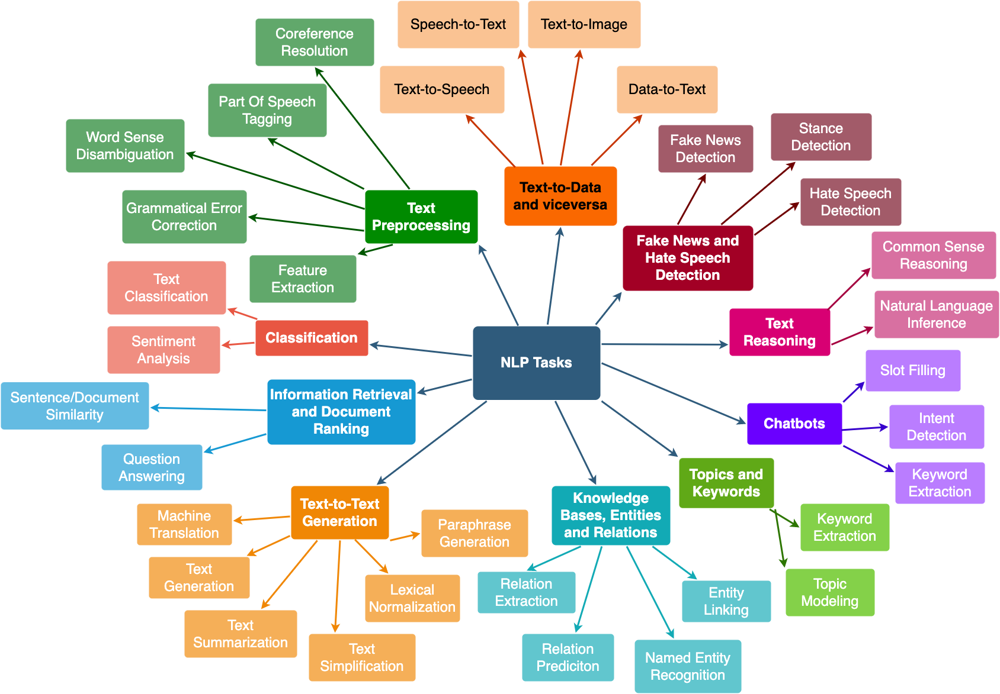
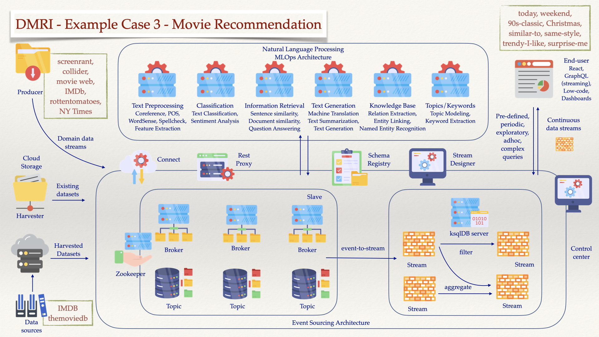
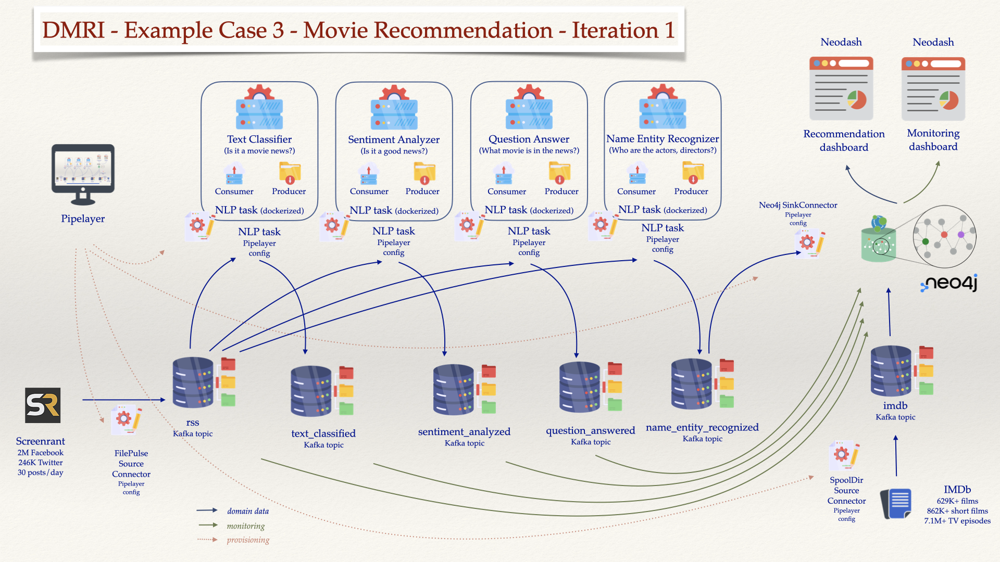

## Movie Recommendation

Brief Description:
- the integration of NLP containers (per task as shown), with pre-trained datasets, and datasets for fine-tuning,
- some sort of descriptive configuration (in Confluent Cloud there is a Stream Designer, which is very convenient for orchestrating the workflow pipeline mesh),
- some additional movie info databases (from sources highlighted in the diagram), perhaps some cloud storage for large binary data (to avoid long download time, shorten setup time)
- some harvesters to collect movie news (from sources highlighted in the diagram)
- the one that will probably takes large portion of time is to construct a UI which capable to issue formal and “natural language” queries, based on React, communicating via GraphQL, and capable of doing some good visualizations.

**The example**

Excerpt from this news [First 'Joker: Folie à Deux' Image of Lady Gaga's Harley Quinn](https://collider.com/joker-2-image-lady-gaga-joaquin-phoenix/):
```
Who says Valentine's Day can't have some jokes?
Director Todd Phillips took to Instagram to unveil the first look at Lady Gaga in the sequel Joker: Folie à Deux.
While her role is currently under wraps, all signs appear to point to the multi-hyphenate portraying iconic DC character Harley Quinn.
The Joker sequel is set to release on October 4, 2024.
Gaga isn't alone in the image, which sees the return of Joaquin Phoenix's Arthur Fleck/Joker.
He's complete in marred clown makeup and clearly happy to be in the embrace of her character.
Plot details are not known at the moment.
However, this image appears to correlate with Harley Quinn's origin as Joker's psychiatrist in Arkham Asylum, the presumed location for the sequel.
The ending of Joker found Arthur having his way in the famed Gotham facility.
```

Below a few so-called `Natural Language Processing Tasks` (in short `NLP tasks`) are shown.

*Task 1 - Summarize the news in a few sentences*

```bash
Todd Phillips took to Instagram to unveil the first look at Lady Gaga in the sequel Joker: Folie à Deux. All signs appear to point to the multi-hyphenate portraying iconic DC character Harley Quinn. The Joker sequel is set to release on October 4, 2024.
```

*Task 2 - What is the news about: education, politics, business, health, sport, or movie?*

```bash
                                            sequence     labels    scores
0  Who says Valentine's Day can't have some jokes...      movie  0.551902
1  Who says Valentine's Day can't have some jokes...      sport  0.205439
2  Who says Valentine's Day can't have some jokes...   business  0.103893
3  Who says Valentine's Day can't have some jokes...     health  0.084764
4  Who says Valentine's Day can't have some jokes...  education  0.027428
5  Who says Valentine's Day can't have some jokes...   politics  0.026575
```

*Task 3 - What named entities (people, date, organization, location, etc) mentioned in the news?*

```bash
   entity_group     score                  word  start  end
0          MISC  0.996852     Valentine ' s Day      9   24
1           PER  0.999712         Todd Phillips     57   70
2          MISC  0.594972                 Insta     79   84
3           PER  0.998348             Lady Gaga    117  126
4          MISC  0.986863  Joker : Folie à Deux    141  160
5           ORG  0.971730                    DC    270  272
6           PER  0.995922          Harley Quinn    283  295
7          MISC  0.983769                 Joker    301  306
8           PER  0.999261                  Gaga    352  356
9           PER  0.999269       Joaquin Phoenix    408  423
10          PER  0.970964          Arthur Fleck    426  438
11          PER  0.996184                 Joker    439  444
12          PER  0.998973          Harley Quinn    628  640
13          PER  0.991769                 Joker    653  658
14          LOC  0.992751         Arkham Asylum    677  690
15         MISC  0.767194                 Joker    744  749
16          PER  0.999083                Arthur    756  762
17          LOC  0.997191                Gotham    791  797
```

*Task 4 - Answering the question "What movie is in the news?"*

```bash
score  start  end               answer
0  0.938275    141  160  Joker: Folie à Deux
```

*Task 5 - Answering the question "Who is the director of the movie?"*
```bash
      score  start  end         answer
0  0.984972     57   70  Todd Phillips
```

*Task 6 - Answering the question "Who plays the main villain of the movie?"*

```bash
      score  start  end        answer
0  0.334782    283  295  Harley Quinn
```

The beauty of it is that *all these tasks are plug-and-play* and *they can scale very well* because there is no limitation on the number of instances on the cloud. Obviously a good knowledge base needs to be built for movie, actor, etc but those are available at IMDb, etc. 

`Kafka Cluster` will be used as *the underlaying streaming architecture* to exchange messages between these tasks. So each of the `NLP tasks` can work independently, producing/consuming messages into/out-of Kafka topics.

&nbsp;

### A. Natural Language Processing Tasks

**Credit [NLP PLanet](https://www.nlplanet.org)**

<details>
<summary>Click here for more details.</summary>
<p>

1. Text Preprocessing
  + Coreference Resolution: clustering mentions in text that refer to the same underlying real-world entities.
  + Part Of Speech (POS) tagging: tagging a word in a text with its part of speech. A part of speech is a category of words with similar grammatical properties, such as noun, verb, adjective, adverb, pronoun, preposition, conjunction, etc.
  + Word Sense Disambiguation: associating words in context with their most suitable entry in a pre-defined sense inventory (typically WordNet).
  + Grammatical Error Correction: correcting different kinds of errors in text such as spelling, punctuation, grammatical, and word choice errors.
  + Feature Extraction: extraction of generic numerical features from text, usually embeddings.
2. Classification
  + Text Classification: assigning a category to a sentence or document (e.g. spam filtering).
  + Sentiment Analysis: identifying the polarity of a piece of text.
3. Information Retrieval and Document Ranking
  + Sentence/document similarity: determining how similar two texts are.
  + Question Answering: the task of answering a question in natural language.
4. Text-to-Text Generation
  + Machine Translation: translating from one language to another.
  + Text Generation: creating text that appears indistinguishable from human-written text.
  + Text Summarization: creating a shortened version of several documents that preserves most of their meaning.
  + Text Simplification: making a text easier to read and understand, while preserving its main ideas and approximate meaning.
  + Lexical Normalization: translating/transforming a non-standard text to a standard register.
  + Paraphrase Generation: creating an output sentence that preserves the meaning of input but includes variations in word choice and grammar.
5. Knowledge bases, entities and relations
  + Relation extraction: extracting semantic relationships from a text. Extracted relationships usually occur between two or more entities and fall into specific semantic categories (e.g. lives in, sister of, etc).
  + Relation prediction: identifying a named relation between two named semantic entities.
  + Named Entity Recognition: tagging entities in text with their corresponding type, typically in BIO notation.
  + Entity Linking: recognizing and disambiguating named entities to a knowledge base (typically Wikidata).
6. Topics and Keywords
  + Topic Modeling: identifying abstract “topics” underlying a collection of documents.
  + Keyword Extraction: identifying the most relevant terms to describe the subject of a document
7. Chatbots
  + Intent Detection: capturing the semantics behind messages from users and assigning them to the correct label.
  + Slot Filling: aims to extract the values of certain types of attributes (or slots, such as cities or dates) for a given entity from texts.
  + Dialog Management: managing of state and flow of conversations.
8. Text Reasoning
  + Common Sense Reasoning: use of “common sense” or world knowledge to make inferences.
  + Natural Language Inference: determining whether a “hypothesis” is true (entailment), false (contradiction), or undetermined (neutral) given a “premise”.
9. Fake News and Hate Speech Detection
  + Fake News Detection: detecting and filtering out texts containing false and misleading information.
  + Stance Detection: determining an individual’s reaction to a primary actor’s claim. It is a core part of a set of approaches to fake news assessment.
  + Hate Speech Detection: detecting if a piece of text contains hate speech.
10. Text-to-Data and viceversa
  + Text-to-Speech: technology that reads digital text aloud.
  + Speech-to-Text: transcribing speech to text.
  + Text-to-Image: generating photo-realistic images which are semantically consistent with the text descriptions.
  + Data-to-Text: producing text from non-linguistic input, such as databases of records, spreadsheets, and expert system knowledge bases.



</p>
</details>

### B. Architecture Overview



### C. Iterations

#### [C.1. Iteration 1](#c1-iteration-1)

In this iteration, we aim to accomplish the following:
1. **Task 1** - Creation of a `Pipelayer` [ReactFlow](https://reactflow.dev)-based tool that allow
  + visual design of the data streams between the components of the `Kafka Cluster` and the `NLP Cluster`.
  + providing configuration files for the components in order to connect to `Kafka` data streaming infrastructure as well as to customize the generic `NLP task`.
  + keep the whole visual design and its configuration parameters in a `json` file for later purposes such as easy reloading, management, and monitoring.
2. **Task 2** -  Creation of multiple generic `NLP tasks`, packaged as `Docker` images, equipped with `Python`-based `Kafka` consumers and providers, and easy to be customized by configuration provided by the `Pipelayer`.
3. **Task 3** - Data integration 
  + Integration of an instance of `FilePulse Source Connector` for `XML files` that enables capture of daily news from  [`ScreenRant`](https://screenrant.com)
  + Integration of another instance of `FilePulse Source Connector` for `TSV files` that enables to import the [`IMDb dataset`](https://www.imdb.com/interfaces/).
4. **Task 4**: Graph database for movie data, tracking lineage, and data visualization
  - Setup a `Neo4j` instance to accepts movie news processing status and information.
  - Setup a `Neodash` instance to display `top recent movie recommendation` and `movie data lineage` (processing result throughout our data streams)
5. **Task 5**: Showcasing
  - Allow access to `Neodash` dashboards for all users
  - Allow access to `Pipelayer`, `Neo4j` only at local machine.



What will not be included in this iteration:
- Personalization, the site will be public for all user and no personalized feature.
- No scaling for multiple `Kafka brokers` or `NLP tasks`.
- No customization for `NLP pipelines` or `Recommendation dashboard`.

&nbsp;

---

**Task 2** `NLP` task as `Docker` image

*Task 2: Part 1:* Installing `NVIDIA driver`, `NVIDIA Container Toolkit`, and `Pytorch` docker.

**Credit** [Develop like a Pro with NVIDIA + Docker + VS Code + PyTorch](https://blog.roboflow.com/nvidia-docker-vscode-pytorch/)

The `NVIDIA Container Toolkit` allows users to build and run GPU accelerated containers. The toolkit includes a container runtime library and utilities to automatically configure containers to leverage `NVIDIA` GPUs.


We need to install:
- the proper `NVIDIA Driver` for the GPUs coming with the virtual machine (unless they are provided by a serverless enviroment)
- `Nvidia Docker` for GPU-Accelerated Containers
- `PyTorch Docker` supported by the `NVIDIA Container Toolkit` and then test the docker by running `MNIST algorithm`


<details>
<summary>Click here for more details.</summary>
<p>

1. A virtual machine is created in the `Google Cloud Platform`:

- `n1-standard-8`, 8 vCPU, 30GB RAM, `threads-per-core=2`, `visible-core-count=4`
- `NVIDIA T4`
- `ubuntu-2204-jammy-v20230114`
- 100 GB persistent disk
- access via SSH (keys)
- allow HTTP/HTTPS (with provisioned static internal/external IPs)

2. Install Docker and test the installation:

```bash
./scripts/docker/install.sh
./scripts/docker/test.sh
```

3. Install `gcc`, `make`

```bash
sudo apt install gcc make
```

4. Download driver for `NVIDIA Tesla T4` supporting `CUDA 11.7`

```bash
wget "https://us.download.nvidia.com/tesla/515.86.01/NVIDIA-Linux-x86_64-515.86.01.run"
chmod +x NVIDIA-Linux-x86_64-515.86.01.run
sudo ./NVIDIA-Linux-x86_64-515.86.01.run
```

5. Run `nvidia-smi` to verify installation
```bash
nvidia-smi
```
```bash
Fri Feb 17 20:21:13 2023       
+-----------------------------------------------------------------------------+
| NVIDIA-SMI 515.86.01    Driver Version: 515.86.01    CUDA Version: 11.7     |
|-------------------------------+----------------------+----------------------+
| GPU  Name        Persistence-M| Bus-Id        Disp.A | Volatile Uncorr. ECC |
| Fan  Temp  Perf  Pwr:Usage/Cap|         Memory-Usage | GPU-Util  Compute M. |
|                               |                      |               MIG M. |
|===============================+======================+======================|
|   0  Tesla T4            Off  | 00000000:00:04.0 Off |                    0 |
| N/A   38C    P0    28W /  70W |      2MiB / 15360MiB |      4%      Default |
|                               |                      |                  N/A |
+-------------------------------+----------------------+----------------------+
                                                                               
+-----------------------------------------------------------------------------+
| Processes:                                                                  |
|  GPU   GI   CI        PID   Type   Process name                  GPU Memory |
|        ID   ID                                                   Usage      |
|=============================================================================|
|  No running processes found                                                 |
+-----------------------------------------------------------------------------+
```

6. Install Nvidia Docker for GPU-Accelerated Containers

```bash
distribution=$(. /etc/os-release;echo $ID$VERSION_ID) \
  && curl -fsSL https://nvidia.github.io/libnvidia-container/gpgkey | sudo gpg --dearmor -o /usr/share/keyrings/nvidia-container-toolkit-keyring.gpg \
  && curl -s -L https://nvidia.github.io/libnvidia-container/$distribution/libnvidia-container.list | \
  sed 's#deb https://#deb [signed-by=/usr/share/keyrings/nvidia-container-toolkit-keyring.gpg] https://#g' | \
  sudo tee /etc/apt/sources.list.d/nvidia-container-toolkit.list
sudo apt-get update
sudo apt-get install -y nvidia-docker2
sudo systemctl restart docker
```

7. Test the installation. You should see the correct output *from* `nvidia-smi` *inside the container*. 

```bash
docker run --rm --gpus all nvidia/cuda:11.7.1-base-ubuntu22.04 nvidia-smi
```
```bash
Fri Feb 17 20:23:57 2023       
+-----------------------------------------------------------------------------+
| NVIDIA-SMI 515.86.01    Driver Version: 515.86.01    CUDA Version: 11.7     |
|-------------------------------+----------------------+----------------------+
| GPU  Name        Persistence-M| Bus-Id        Disp.A | Volatile Uncorr. ECC |
| Fan  Temp  Perf  Pwr:Usage/Cap|         Memory-Usage | GPU-Util  Compute M. |
|                               |                      |               MIG M. |
|===============================+======================+======================|
|   0  Tesla T4            Off  | 00000000:00:04.0 Off |                    0 |
| N/A   40C    P0    28W /  70W |      2MiB / 15360MiB |      5%      Default |
|                               |                      |                  N/A |
+-------------------------------+----------------------+----------------------+
                                                                               
+-----------------------------------------------------------------------------+
| Processes:                                                                  |
|  GPU   GI   CI        PID   Type   Process name                  GPU Memory |
|        ID   ID                                                   Usage      |
|=============================================================================|
|  No running processes found                                                 |
+-----------------------------------------------------------------------------+
```

`--gpus` is used to specify which GPU the container should see, all means "all of them". If you want to expose only one you can pass its id `--gpus 1`. You can also specify a list of GPUs to use, `--gpus "device=1,2"`

8. Run GPU Accelerated Containers with PyTorch

```bash
docker run --gpus all -it --rm nvcr.io/nvidia/pytorch:23.01-py3
```

9. Changing to higher performance command line options

```bash
docker run --gpus all --ipc=host --ulimit memlock=-1 --ulimit stack=67108864 -it --rm nvcr.io/nvidia/pytorch:23.01-py3
```

```bash
=============
== PyTorch ==
=============

NVIDIA Release 23.01 (build 52269074)
PyTorch Version 1.14.0a0+44dac51

Container image Copyright (c) 2023, NVIDIA CORPORATION & AFFILIATES. All rights reserved.

Copyright (c) 2014-2023 Facebook Inc.
Copyright (c) 2011-2014 Idiap Research Institute (Ronan Collobert)
Copyright (c) 2012-2014 Deepmind Technologies    (Koray Kavukcuoglu)
Copyright (c) 2011-2012 NEC Laboratories America (Koray Kavukcuoglu)
Copyright (c) 2011-2013 NYU                      (Clement Farabet)
Copyright (c) 2006-2010 NEC Laboratories America (Ronan Collobert, Leon Bottou, Iain Melvin, Jason Weston)
Copyright (c) 2006      Idiap Research Institute (Samy Bengio)
Copyright (c) 2001-2004 Idiap Research Institute (Ronan Collobert, Samy Bengio, Johnny Mariethoz)
Copyright (c) 2015      Google Inc.
Copyright (c) 2015      Yangqing Jia
Copyright (c) 2013-2016 The Caffe contributors
All rights reserved.

Various files include modifications (c) NVIDIA CORPORATION & AFFILIATES.  All rights reserved.

This container image and its contents are governed by the NVIDIA Deep Learning Container License.
By pulling and using the container, you accept the terms and conditions of this license:
https://developer.nvidia.com/ngc/nvidia-deep-learning-container-license

NOTE: CUDA Forward Compatibility mode ENABLED.
  Using CUDA 12.0 driver version 525.85.11 with kernel driver version 515.86.01.
  See https://docs.nvidia.com/deploy/cuda-compatibility/ for details.

root@6e7bbf2efd04:/workspace# python
Python 3.8.10 (default, Nov 14 2022, 12:59:47) 
[GCC 9.4.0] on linux
Type "help", "copyright", "credits" or "license" for more information.
>>> import torch
>>> torch.cuda.is_available()
True
>>> torch.backends.cudnn.version()
8700
>>> 
```

10. Now we can proceed to test [`MNIST Handwritten Digit Recognition in PyTorch`](../src/movie-rec/train.py)

```bash
./scripts/nlp/test.sh
```

```bash
Downloading http://yann.lecun.com/exdb/mnist/train-images-idx3-ubyte.gz
Downloading http://yann.lecun.com/exdb/mnist/train-images-idx3-ubyte.gz to ../data/MNIST/raw/train-images-idx3-ubyte.gz
100%|██████████████████████████████████████████████████████████████████████████████████████████████████████████████████████████████████████████████████| 9912422/9912422 [00:00<00:00, 42952511.03it/s]
Extracting ../data/MNIST/raw/train-images-idx3-ubyte.gz to ../data/MNIST/raw

Downloading http://yann.lecun.com/exdb/mnist/train-labels-idx1-ubyte.gz
Downloading http://yann.lecun.com/exdb/mnist/train-labels-idx1-ubyte.gz to ../data/MNIST/raw/train-labels-idx1-ubyte.gz
100%|██████████████████████████████████████████████████████████████████████████████████████████████████████████████████████████████████████████████████████| 28881/28881 [00:00<00:00, 15283332.55it/s]
Extracting ../data/MNIST/raw/train-labels-idx1-ubyte.gz to ../data/MNIST/raw

Downloading http://yann.lecun.com/exdb/mnist/t10k-images-idx3-ubyte.gz
Downloading http://yann.lecun.com/exdb/mnist/t10k-images-idx3-ubyte.gz to ../data/MNIST/raw/t10k-images-idx3-ubyte.gz
100%|██████████████████████████████████████████████████████████████████████████████████████████████████████████████████████████████████████████████████| 1648877/1648877 [00:00<00:00, 10997068.46it/s]
Extracting ../data/MNIST/raw/t10k-images-idx3-ubyte.gz to ../data/MNIST/raw

Downloading http://yann.lecun.com/exdb/mnist/t10k-labels-idx1-ubyte.gz
Downloading http://yann.lecun.com/exdb/mnist/t10k-labels-idx1-ubyte.gz to ../data/MNIST/raw/t10k-labels-idx1-ubyte.gz
100%|████████████████████████████████████████████████████████████████████████████████████████████████████████████████████████████████████████████████████████| 4542/4542 [00:00<00:00, 20528587.03it/s]
Extracting ../data/MNIST/raw/t10k-labels-idx1-ubyte.gz to ../data/MNIST/raw

Train Epoch: 1 [0/60000 (0%)]	Loss: 2.282550
Train Epoch: 1 [640/60000 (1%)]	Loss: 1.385302
Train Epoch: 1 [1280/60000 (2%)]	Loss: 0.936717
...
Train Epoch: 14 [58880/60000 (98%)]	Loss: 0.003294
Train Epoch: 14 [59520/60000 (99%)]	Loss: 0.004645

Test set: Average loss: 0.0263, Accuracy: 9919/10000 (99%)
```

---

*Task 2: Part 2:* Creating our `NLP tasks` 

We create our `NLP tasks` as following:
- Extend the `Pytorch` docker, 
- Adding `HuggingFace` `pipelines`, make its `transformers` and `datasets` easily *cached*,
- Make these dockers *easily configurable* per each of the `NLP Tasks`: `text classification`, `question-answering`, and `text summarization` (and many more)
- Add a `Kafka consumer` and a `Kafka producer` to consume incoming messages and produce outgoing messages to `Kafka topics`.
- Allow `content-based routing` for the outgoing messages depending on the processing result of the imcoming messages.

1. Test `Docker` images for our `NLP Tasks`

```bash
docker compose -f docker-compose-nlp.yml up
```
```bash
question-answer  |       score  start  end               answer
question-answer  | 0  0.938275    141  160  Joker: Folie à Deux
question-answer  | 
summerizer       |  Todd Phillips took to Instagram to unveil the first look at Lady Gaga in the sequel Joker: Folie à Deux. All signs appear to point to the multi-hyphenate portraying iconic DC character Harley Quinn. The Joker sequel is set to release on October 4, 2024. 
summerizer       | 
text-classifier  |                                             sequence     labels    scores
text-classifier  | 0  Who says Valentine's Day can't have some jokes...      movie  0.551902
text-classifier  | 1  Who says Valentine's Day can't have some jokes...      sport  0.205438
text-classifier  | 2  Who says Valentine's Day can't have some jokes...   business  0.103893
text-classifier  | 3  Who says Valentine's Day can't have some jokes...     health  0.084764
text-classifier  | 4  Who says Valentine's Day can't have some jokes...  education  0.027428
text-classifier  | 5  Who says Valentine's Day can't have some jokes...   politics  0.026575
```

(**TBC**)

</p>
</details>

---

&nbsp;

**Task 3** - Data integration 

**Task 3 - Part 1: Integration of an `RSS Kafka Connect Source Connector` that enables capture of daily news from  [`ScreenRant`](https://screenrant.com)**

[`Screenrant`](https://screenrant.com) Screen Rant - headquartered in  Ogden, Utah, US - is arguably the most visited, non-corporate-owned movie and TV news site online. We cover the hot topics that movie and TV fans are looking for. Our readers are influencers in the movie and TV category: people others come to for recommendations on what to watch on TV and go see at the movies.  

Its (bi-)hourly feed [Screen Rant RSS Feed](https://screenrant.com/feed/) followed by 2M+ `Facebookers`, 246K+ `Twitters`. The feed contains approx. 100 latest news called `item` in `XML format`, with an example as below:
```xml
<item>
  <title>
    <![CDATA[
      Every Family Member Of Discovery’s Michael Burnham In Star Trek
    ]]>
  </title>
  <link>
    https://screenrant.com/star-trek-discovery-michael-burnham-family-members/
  </link>
  <dc:creator>
    <![CDATA[ John Orquiola ]]>
  </dc:creator>
  <enclosure url="https://static1.srcdn.com/wordpress/wp-content/uploads/2023/02/every-family-member-of-discovery-s-michael-burnham-in-star-trek.jpg" length="656" type="image/jpeg"/>
  <category>
    <![CDATA[ TV ]]>
  </category>
  <category>
    <![CDATA[ star trek discovery ]]>
  </category>
  <category>
    <![CDATA[ Star Trek ]]>
  </category>
  <description>
    <![CDATA[
    Star Trek: Discovery's Captain Michael Burnham is a member of two families and she has relatives in two different eras of Star Trek.
    ]]>
  </description>
  <content:encoded>
    <![CDATA[
      <p>Captain Michael Burnham (Sonequa Martin-Green) in <a href="https://screenrant.com/tag/star-trek-discovery/"><em><strong>Star Trek: Discovery</strong></em></a> is fortunate to be part of two families in two different eras. Burnham is <em>Discovery</em>&#39;s central character, and the focus on Michael as the primary lead distinguishes <em>Discovery </em>from other Star Trek series. In turn, Michael&#39;s rich backstory is supported by multiple parental figures, siblings, and a couple of notable love affairs with Lt. Ash Tyler (Shazad Latif) and Cleveland Booker (David Ajala).</p>
    ]]>
  </content:encoded>
  <pubDate>Mon, 20 Feb 2023 18:40:14 GMT</pubDate>
  <guid isPermaLink="true">
    https://screenrant.com/star-trek-discovery-michael-burnham-family-members/
  </guid>
</item>
```

Our purpose is to capture, extract, and transform it into the format show below,
```json
{
  "title":"Every Family Member Of Discovery’s Michael Burnham In Star Trek",
  "link":"https://screenrant.com/star-trek-discovery-michael-burnham-family-members/",
  "creator":"John Orquiola",
  "enclosure_url":"https://static1.srcdn.com/wordpress/wp-content/uploads/2023/02/every-family-member-of-discovery-s-michael-burnham-in-star-trek.jpg",
  "category":{"array":["TV","star trek discovery","Star Trek"]},
  "description":"Star Trek: Discovery's Captain Michael Burnham is a member of two families and she has relatives in two different eras of Star Trek.",
  "content":"<p>Captain Michael Burnham (Sonequa Martin-Green) in <a href=\"https://screenrant.com/tag/star-trek-discovery/\"><em><strong>Star Trek: Discovery</strong></em></a> is fortunate to be part of two families in two different eras. Burnham is <em>Discovery</em>&#39;s central character, and the focus on Michael as the primary lead distinguishes <em>Discovery </em>from other Star Trek series. In turn, Michael&#39;s rich backstory is supported by multiple parental figures, siblings, and a couple of notable love affairs with Lt. Ash Tyler (Shazad Latif) and Cleveland Booker (David Ajala).</p>",
  "pub_date":"Mon, 20 Feb 2023 18:40:14 GMT"
}
```

and later post-process all properties to gain `named entities`, clustering based on `categories`, and many other.
In addition `description`, `content` can be used to extract:
- URL links to `tags` on [`Screenrant`](https://screenrant.com), which is a nice way to resolve `tags` to this `movie news`.
- Emphasis by HTML `<em>` tags to elevate content to higer relevancy.

<details>
<summary>Click here for more details.</summary>
<p>

We use the []`FilePulse Source Connector`](https://streamthoughts.github.io/kafka-connect-file-pulse/)

1. First, we define a [`value schema`](../conf/movie-rec/screenrant-value.avsc) for the news `item` based on [this](https://streamthoughts.github.io/kafka-connect-file-pulse/docs/developer-guide/configuration/#defining-connect-record-schema):

```json
{
	"name": "screentrant_value",
	"type":"STRUCT",
	"fieldSchemas": {
		"link":{"type":"STRING", "isOptional":false},
		"pub_date":{"type":"STRING", "isOptional":false},
		"category": {"type":"ARRAY", "isOptional":true, "valueSchema": {"type": "STRING"}},
		"content":{"type":"STRING", "isOptional":false},
		"creator":{"type":"STRING", "isOptional":false},
		"description":{"type":"STRING", "isOptional":false},
		"enclosure_url":{"type":"STRING", "isOptional":false},
		"title":{"type":"STRING", "isOptional":false}
	}
}
```

2. The `Source Connector` is [defined in-line](../scripts/movie-rec/create_filepulse_connector.sh) as follow

```bash
curl -i -X PUT -H "Accept:application/json" -H  "Content-Type:application/json" \
  http://${connect_local_host}:${connect_port}/connectors/${connector}/config \
  -d '{
    "connector.class":"io.streamthoughts.kafka.connect.filepulse.source.FilePulseSourceConnector",
    "fs.listing.class":"io.streamthoughts.kafka.connect.filepulse.fs.LocalFSDirectoryListing",
    "fs.listing.directory.path":"/data/filepulse/xml",
    "fs.listing.filters":"io.streamthoughts.kafka.connect.filepulse.fs.filter.RegexFileListFilter",
    "fs.listing.interval.ms":10000,
    "fs.cleanup.policy.class": "io.streamthoughts.kafka.connect.filepulse.fs.clean.LogCleanupPolicy ",
    "file.filter.regex.pattern":".*\\.xml$",
    "offset.strategy":"name",
    "reader.xpath.expression":"/rss/channel/item",
    "reader.xpath.result.type":"NODESET",
    "reader.xml.force.array.on.fields":"category",
    "reader.xml.parser.validating.enabled":true,
    "reader.xml.parser.namespace.aware.enabled":true,
    "filters":"enclosure,content,pubDate,Exclude",
    "filters.enclosure.type":"io.streamthoughts.kafka.connect.filepulse.filter.MoveFilter",
    "filters.enclosure.source":"enclosure.url",
    "filters.enclosure.target":"enclosure_url",
    "filters.content.type":"io.streamthoughts.kafka.connect.filepulse.filter.RenameFilter",
    "filters.content.field":"encoded",
    "filters.content.target":"content",
    "filters.pubDate.type":"io.streamthoughts.kafka.connect.filepulse.filter.RenameFilter",
    "filters.pubDate.field":"pubDate",
    "filters.pubDate.target":"pub_date",
    "filters.Exclude.type":"io.streamthoughts.kafka.connect.filepulse.filter.ExcludeFilter",
    "filters.Exclude.fields":"enclosure,guid",
    "topic":"'${topic}'",
    "tasks.file.status.storage.bootstrap.servers":"'${broker_internal_host}':'${broker_internal_port}'",
    "tasks.file.status.storage.topic":"connect-file-pulse-status",
    "tasks.reader.class":"io.streamthoughts.kafka.connect.filepulse.fs.reader.LocalXMLFileInputReader",
    "tasks.max": 1,
    "value.connect.schema":"{ \"name\": \"screentrant_value\", \"type\":\"STRUCT\", \"fieldSchemas\": { \"link\":{\"type\":\"STRING\", \"isOptional\":false}, \"pub_date\":{\"type\":\"STRING\", \"isOptional\":false}, \"category\": {\"type\":\"ARRAY\", \"isOptional\":true, \"valueSchema\": {\"type\": \"STRING\"}}, \"content\":{\"type\":\"STRING\", \"isOptional\":false}, \"creator\":{\"type\":\"STRING\", \"isOptional\":false}, \"description\":{\"type\":\"STRING\", \"isOptional\":false}, \"enclosure_url\":{\"type\":\"STRING\", \"isOptional\":false}, \"title\":{\"type\":\"STRING\", \"isOptional\":false} } }"
  }'
```

The filter `filters.enclosure` uses a `MoveFilter` to move the `url` inside the tag `<enclosure>` into the (converted) `json` field `enclosure_url`, there is no need for `XML` attribute `size` `type` (although we might need if we want to propulate a website with those images, abeit the dimensions can be detected as well (?)).

It is worth to mention that to extract a single `RSS` feed containing `100` `items` of movie news into 100 `Kafka` messages, an `XPath` to identify the items need to be defined in the configuration
```json
"reader.xpath.expression":"/rss/channel/item",
```

It is decided to obtains the results as `NODESET`, since each of the properties of an `item` can have attribute that is valueable, such as `url` for the `enclosure` `XML` tag, so the configuration has to be done accordingly:
```json
"reader.xpath.result.type":"NODESET",
```

Note that the `FilePulse` library convert `XML` tags with names in form `<part1>:<part2>` into `<part2>`, for example `dc:creator` and `content:encoded` are converted into `creator` and `encoded`. Thus, the filter `filters.content` is used to rename the `encloded` into `content`. Filter `filters.pubDate` is to convert `pubDate` into `pub_date` for the sake of consistency. Last, filter `filters.Exclude` is used to drop the (extracted) `enclosure` and `guid` (since both `link` and `guid` have the same content and it makes more sense to refer back to the news using the `link` rather then `guid`, which is unfortunately not within our namespace).


And finally, the created `value.connect.schema`, which is to be sent to `Kafka Connect`, defined in just above, is `double-quote escaped`, `tabs removed`, and `linefeeds removed`, in order to convert into a `escaped` string that can be used in the configuration:
```json
"value.connect.schema":"{ \"name\": \"screentrant_value\", \"type\":\"STRUCT\", \"fieldSchemas\": { \"link\":{\"type\":\"STRING\", \"isOptional\":false}, \"pub_date\":{\"type\":\"STRING\", \"isOptional\":false}, \"category\": {\"type\":\"ARRAY\", \"isOptional\":true, \"valueSchema\": {\"type\": \"STRING\"}}, \"content\":{\"type\":\"STRING\", \"isOptional\":false}, \"creator\":{\"type\":\"STRING\", \"isOptional\":false}, \"description\":{\"type\":\"STRING\", \"isOptional\":false}, \"enclosure_url\":{\"type\":\"STRING\", \"isOptional\":false}, \"title\":{\"type\":\"STRING\", \"isOptional\":false} } }"
```

The [Developer Guide](https://streamthoughts.github.io/kafka-connect-file-pulse/docs/developer-guide/) is amazingly details, although it is not written for beginners. It is worth to study the connector by the following articles (for file-based (or anything that can be turned into a file) `XML`)
- [Kafka Connect FilePulse - One Connector to Ingest them All!](https://medium.com/streamthoughts/kafka-connect-filepulse-one-connector-to-ingest-them-all-faed018a725c)
- [Streaming data into Kafka S01/E02 - Loading XML file](https://dev.to/fhussonnois/streaming-data-into-kafka-s01-e02-loading-xml-file-529i)
- [Ingesting XML data into Kafka - Option 3: Kafka Connect FilePulse connector](https://rmoff.net/2020/10/01/ingesting-xml-data-into-kafka-option-3-kafka-connect-filepulse-connector/)

Note that it is important the the `XML` files (feeds) location is configured as 
```json
"fs.listing.directory.path":"/data/filepulse/xml",
```

thus, they have to be downloaded and placed into `$PWD/kafka-ce/connect/data`, which is mapped to the local volume by [docker-compose-kafka-ce.yml](../docker-compose-kafka-ce.yml)

```yaml
  ####################
  # connect
  ####################
  connect:
    image: confluentinc/cp-kafka-connect:7.3.1
    hostname: connect
    container_name: connect
    ...
    volumes:
      - $PWD/kafka-ce/connect/data:/data
      - $PWD/kafka-ce/plugins:/usr/share/confluent-hub-components
    restart: always
```

3. Run the test

First, (setup Docker, test the setup, and then) start Kafka
```bash
./scripts/kafka/setup.sh
./scripts/kafka/start_after_setup.sh
```

Then run the test
```bash
./scripts/movie-rec/test_filepulse_screenrant.sh
```

What does it do? Lets take a look at its content:
```bash
# Download the current RSS feed from https://screenrant.com/feed/
# In production it is recommended to run a cronjob, note that the feed is updated frequently
# We don't worry about duplication, since the messages are fed into Kafka and it will eliminate duplicates - depending on our choice for unique constraints
./scripts/movie-rec/download_current_rss.sh

# List the current Connect plugins
# What we need is the "io.streamthoughts.kafka.connect.filepulse.source.FilePulseSourceConnector"
./scripts/movie-rec/list_connect_plugins.sh

# List the current connector instances
# It could show an earlier version of the "filepulse-screenrant" connector, but don't worry, it will be updated
./scripts/movie-rec/list_connectors.sh

# List the current topics
# It could show that the topic "topic-screenrant" exists, but that will have no effect
./scripts/movie-rec/list_topics.sh

# List the current subject in the "schema registry" of the Kafka cluster
# It could show that the subject "topic-screenrant-value" exists, this script will update it with a new version
./scripts/movie-rec/list_subjects.sh

# Create the FilePulse connector with the configuration shown above to read XML messages
./scripts/movie-rec/create_filepulse_connector.sh ${topic} ${connector} ${test_internal_ms_setup}

# Wait until the connector instance becomes available
./scripts/movie-rec/wait_for_connector.sh ${connector}

# Wait until the schema registry subject becomes available
./scripts/movie-rec/wait_for_subject.sh ${subject}

# Wait until the topic becomes available
./scripts/movie-rec/wait_for_topic.sh ${topic}

# The FilePulse source connector instance will 
# - automatically kick-in, 
# - reading messages, 
# - process them according to the "filters" instructions
# - convert them from XML into AVRO messages according to the schema (now) stored in the schema registry
# - produce these messages into the topic

# Test consuming messages with in a number of seconds
# The consumer_group variable is used to define a consumer group,
# that will be used to reset the consumer offsets if messages need to be reread
./scripts/movie-rec/consume_messages.sh ${topic} ${timeout_ms} ${consumer_group}
echo ''

# Here messages are reread and reprocessed
echo Reset consumer offset and consume again ✅
./scripts/movie-rec/consume_messages.sh ${topic} ${timeout_ms} ${consumer_group}

# Subject, topic, and connector instance are deleted to cleanup the cluster
./scripts/movie-rec/delete_subject.sh ${subject}
./scripts/movie-rec/delete_topic.sh ${topic}
./scripts/movie-rec/delete_connector.sh ${connector}

# Downloaded RSS files are removed
./scripts/movie-rec/remove_all_downloaded_rss.sh
```

Console output listed below, some truncated for ease to read,
```bash
Downloading data into for filepulse folder ...
kafka-ce/connect/data/filepulse/xmlscreenrant-rss-1676937347476.xml is downloaded. ✅

Listing all available plugins ...
curl -s -XGET http://localhost:8083/connector-plugins | jq '.[].class'
"io.confluent.connect.jdbc.JdbcSinkConnector"
"streams.kafka.connect.sink.Neo4jSinkConnector"
"com.github.jcustenborder.kafka.connect.spooldir.SpoolDirAvroSourceConnector"
"com.github.jcustenborder.kafka.connect.spooldir.SpoolDirBinaryFileSourceConnector"
"com.github.jcustenborder.kafka.connect.spooldir.SpoolDirCsvSourceConnector"
"com.github.jcustenborder.kafka.connect.spooldir.SpoolDirJsonSourceConnector"
"com.github.jcustenborder.kafka.connect.spooldir.SpoolDirLineDelimitedSourceConnector"
"com.github.jcustenborder.kafka.connect.spooldir.SpoolDirSchemaLessJsonSourceConnector"
"com.github.jcustenborder.kafka.connect.spooldir.elf.SpoolDirELFSourceConnector"
"io.confluent.connect.jdbc.JdbcSourceConnector"
"io.debezium.connector.mysql.MySqlConnector"
"io.streamthoughts.kafka.connect.filepulse.source.FilePulseSourceConnector"
"org.apache.kafka.connect.mirror.MirrorCheckpointConnector"
"org.apache.kafka.connect.mirror.MirrorHeartbeatConnector"
"org.apache.kafka.connect.mirror.MirrorSourceConnector"
"streams.kafka.connect.source.Neo4jSourceConnector"

Listing all connectors ...
curl -s -XGET http://localhost:8083/connectors | jq '.[]'

List all topics ...
docker exec -it broker /bin/kafka-topics --bootstrap-server broker:29092 --list
__consumer_offsets
__transaction_state
_confluent-ksql-default__command_topic
_confluent-monitoring
_schemas
connect-file-pulse-status
default_ksql_processing_log
docker-connect-configs
docker-connect-offsets
docker-connect-status

List all current subjects ...
curl --silent -X GET http://localhost:8081/subjects | jq .[]

Creating filepulse connector ...
curl -i -X PUT -H Accept:application/json -H  Content-Type:application/json     http://localhost:8083/connectors/filepulse-screenrant/config     -d '{
        connector.class:io.streamthoughts.kafka.connect.filepulse.source.FilePulseSourceConnector,
        fs.listing.class:io.streamthoughts.kafka.connect.filepulse.fs.LocalFSDirectoryListing,
        fs.listing.directory.path:/data/filepulse/xml,
        fs.listing.filters:io.streamthoughts.kafka.connect.filepulse.fs.filter.RegexFileListFilter,
        fs.listing.interval.ms:${internal_ms_setup},
        fs.cleanup.policy.class: io.streamthoughts.kafka.connect.filepulse.fs.clean.LogCleanupPolicy ,
        file.filter.regex.pattern:.*\.xml,
        offset.strategy:name,
        reader.xpath.expression:/rss/channel/item,
        reader.xpath.result.type:NODESET,
        reader.xml.force.array.on.fields:category,
        reader.xml.parser.validating.enabled:true,
        reader.xml.parser.namespace.aware.enabled:true,
        filters:enclosure,content,pubDate,Exclude,
        filters.enclosure.type:io.streamthoughts.kafka.connect.filepulse.filter.MoveFilter,
        filters.enclosure.source:enclosure.url,
        filters.enclosure.target:enclosure_url,
        filters.content.type:io.streamthoughts.kafka.connect.filepulse.filter.RenameFilter,
        filters.content.field:encoded,
        filters.content.target:content,
        filters.pubDate.type:io.streamthoughts.kafka.connect.filepulse.filter.RenameFilter,
        filters.pubDate.field:pubDate,
        filters.pubDate.target:pub_date,
        filters.Exclude.type:io.streamthoughts.kafka.connect.filepulse.filter.ExcludeFilter,
        filters.Exclude.fields:enclosure,guid,
        topic:${topic},
        tasks.file.status.storage.bootstrap.servers:${broker_internal_host}:${broker_internal_port},
        tasks.file.status.storage.topic:connect-file-pulse-status,
        tasks.reader.class:io.streamthoughts.kafka.connect.filepulse.fs.reader.LocalXMLFileInputReader,
        tasks.max: 1,
        value.connect.schema:{ "name": "screentrant_value", "type":"STRUCT", "fieldSchemas": { "link":{"type":"STRING", "isOptional":false}, "pub_date":{"type":"STRING", "isOptional":false}, "category": {"type":"ARRAY", "isOptional":true, "valueSchema": {"type": "STRING"}}, "content":{"type":"STRING", "isOptional":false}, "creator":{"type":"STRING", "isOptional":false}, "description":{"type":"STRING", "isOptional":false}, "enclosure_url":{"type":"STRING", "isOptional":false}, "title":{"type":"STRING", "isOptional":false} } }
    }'

HTTP/1.1 201 Created
Date: Mon, 20 Feb 2023 23:55:49 GMT
Location: http://localhost:8083/connectors/filepulse-screenrant
Content-Type: application/json
Content-Length: 2383
Server: Jetty(9.4.48.v20220622)

{"name":"filepulse-screenrant","config":{"connector.class":"io.streamthoughts.kafka.connect.filepulse.source.FilePulseSourceConnector","fs.listing.class":"io.streamthoughts.kafka.connect.filepulse.fs.LocalFSDirectoryListing","fs.listing.directory.path":"/data/filepulse/xml","fs.listing.filters":"io.streamthoughts.kafka.connect.filepulse.fs.filter.RegexFileListFilter","fs.listing.interval.ms":"10000","fs.cleanup.policy.class":"io.streamthoughts.kafka.connect.filepulse.fs.clean.LogCleanupPolicy ","file.filter.regex.pattern":".*\\.xml$","offset.strategy":"name","reader.xpath.expression":"/rss/channel/item","reader.xpath.result.type":"NODESET","reader.xml.force.array.on.fields":"category","reader.xml.parser.validating.enabled":"true","reader.xml.parser.namespace.aware.enabled":"true","filters":"enclosure,content,pubDate,Exclude","filters.enclosure.type":"io.streamthoughts.kafka.connect.filepulse.filter.MoveFilter","filters.enclosure.source":"enclosure.url","filters.enclosure.target":"enclosure_url","filters.content.type":"io.streamthoughts.kafka.connect.filepulse.filter.RenameFilter","filters.content.field":"encoded","filters.content.target":"content","filters.pubDate.type":"io.streamthoughts.kafka.connect.filepulse.filter.RenameFilter","filters.pubDate.field":"pubDate","filters.pubDate.target":"pub_date","filters.Exclude.type":"io.streamthoughts.kafka.connect.filepulse.filter.ExcludeFilter","filters.Exclude.fields":"enclosure,guid","topic":"topic-screenrant","tasks.file.status.storage.bootstrap.servers":"broker:29092","tasks.file.status.storage.topic":"connect-file-pulse-status","tasks.reader.class":"io.streamthoughts.kafka.connect.filepulse.fs.reader.LocalXMLFileInputReader","tasks.max":"1","value.connect.schema":"{ \"name\": \"screentrant_value\", \"type\":\"STRUCT\", \"fieldSchemas\": { \"link\":{\"type\":\"STRING\", \"isOptional\":false}, \"pub_date\":{\"type\":\"STRING\", \"isOptional\":false}, \"category\": {\"type\":\"ARRAY\", \"isOptional\":true, \"valueSchema\": {\"type\": \"STRING\"}}, \"content\":{\"type\":\"STRING\", \"isOptional\":false}, \"creator\":{\"type\":\"STRING\", \"isOptional\":false}, \"description\":{\"type\":\"STRING\", \"isOptional\":false}, \"enclosure_url\":{\"type\":\"STRING\", \"isOptional\":false}, \"title\":{\"type\":\"STRING\", \"isOptional\":false} } }","name":"filepulse-screenrant"},"tasks":[],"type":"source"}
Filepulse connector created ✅

Wait for connector filepulse-screenrant ...
filepulse-screenrant connector ready ✅
Wait for the subject topic-screenrant-value be ready ...

List all versions of topic-screenrant-value...
curl --silent -X GET http://localhost:8081/subjects/topic-screenrant-value/versions | jq
[
  5
]

Wait for topic topic-screenrant to be ready...
Topic topic-screenrant with replications ready ✅
Reset all consumer offsets of filepulse-consumer group ...
docker exec -it broker /bin/kafka-consumer-groups     --bootstrap-server broker:29092     --group screenrant-consumer --reset-offsets --to-earliest --all-topics --execute;


GROUP                          TOPIC                          PARTITION  NEW-OFFSET     
Consumer offsets reset ✅

Consume messages ...
docker exec -it schema-registry kafka-avro-console-consumer      --bootstrap-server broker:29092     --topic topic-screenrant --group screenrant-consumer --from-beginning --timeout-ms 5000     --property schema.registry.url=http://schema-registry:8081

{"pub_date":"Mon, 20 Feb 2023 23:51:14 GMT","creator":"Corey Larson","enclosure_url":"https://static1.srcdn.com/wordpress/wp-content/uploads/2023/02/star-wars-needs-mandalorian-movie-jon-favreau-wrong.jpg","link":"https://screenrant.com/star-wars-needs-mandalorian-movie-jon-favreau-wrong/","description":"\n                                            Jon Favreau thinks that The Mandalorian works great as a Disney+ tv series. But it could be so much more if made into a blockbuster movie. \n                                        ","category":{"array":["Movies","The Mandalorian","Star Wars (Franchise)"]},"title":"Jon Favreau's Wrong, Star Wars Needs A Mandalorian Movie","content":"\n                                                                                                                    <p><a href=\"https://screenrant.com/tag/the-mandalorian/\"><strong><em>The Mandalorian</em></strong></a> season 3 is headed to Disney+ on March 1st, but some fans wonder why it continues to be relegated to a Disney+ TV show when it could be so much more. <em>Star Wars</em> may have taken a gap from the big screen, but the last few years have seen Lucasfilm transform it into a success transmedia franchise. <em>The Mandalorian</em> is essentially Disney+&#39;s flagship TV show, with the first episode releasing on the day Disney launched the streaming service.</p>\n    \n                                                                                            "}
{"pub_date":"Mon, 20 Feb 2023 23:30:48 GMT","creator":"Amy DeVore","enclosure_url":"https://static1.srcdn.com/wordpress/wp-content/uploads/2021/04/BELOW-DECK-SAILING-YACHT-GLEN.jpg","link":"https://screenrant.com/below-deck-captain-glenn-leadership-style-fan-reactions/","description":"\n                                            In a franchise that is often riddled with questionable leadership, Below Deck Sailing Yacht Captain Glenn is quickly becoming a fan-favorite.\n                                        ","category":{"array":["Reality TV","Below Deck Sailing Yacht","below deck"]},"title":"Below Deck Fans Praise Captain Glenn’s Leadership Style","content":"\n                                                                                                                    <p>After seasons of division over differing captain leadership styles, fans weighed in with an agreed-upon perspective: Captain Glenn Shephard from <a href=\"https://screenrant.com/tag/below-deck-sailing-yacht/\"><em><strong>Below Deck Sailing Yacht</strong></em></a> is leading the way with his top tier management style. <em>Sailing Yacht</em> is the third in a series of spin-offs, succeeded by the original<em> </em><a href=\"https://screenrant.com/tag/below-deck/\"><em>Below Deck</em></a>, coming alongside <a href=\"https://screenrant.com/tag/below-deck-mediterranean/\"><em>Below Deck Mediterranean</em></a><em>, </em><a href=\"https://screenrant.com/tag/below-deck-adventure/\"><em>Below Deck Adventure</em></a><em>, </em>and <a href=\"https://screenrant.com/tag/below-deck-down-under/\"><em>Below Deck Down Under</em></a><em>. </em>Each of these series has its own captain, yacht, and crew. Captain Glenn has been at the helm of <em>Sailing Yacht</em> since the series premiered<em> </em>in<em> </em>2020, a position he still maintains.</p>\n    \n                                                                                            "}
{"pub_date":"Mon, 20 Feb 2023 23:30:14 GMT","creator":"Dashiel Reaves","enclosure_url":"https://static1.srcdn.com/wordpress/wp-content/uploads/2022/11/lobo-james-gunn-tease.jpg","link":"https://screenrant.com/dceased-lobo-anti-life-zombie-immunity-save-universe/","description":"\n                                            Lobo is one of the most ridiculous characters in the entire DC Comics Universe and it seems that now he's also their best hope for survival.\n                                        ","category":{"array":["Comics","DC Comics","lobo","Dceased"]},"title":"DC's Lobo Just Became the Universe's Most Important Hero","content":"\n                                                                                                                    <p><span class=\"article-alert\">Warning! Contains a preview for DCeased: War of the Undead Gods #6.</span><a href=\"https://screenrant.com/tag/lobo/\"><strong>Lobo</strong></a> is one of the most absurd and dangerous anti-heroes in all of <a href=\"https://screenrant.com/tag/dc-comics/\"><strong>DC Comics</strong></a>, having clashed time and time again with characters such as Superman, but in the world of <a href=\"https://screenrant.com/tag/dceased/\"><strong><em>DCeased</em></strong></a> it seems the main man is finally getting his chance to prove he could save the universe if he wants too.</p>\n    \n                                                                                            "}
...
{"pub_date":"Mon, 20 Feb 2023 18:37:59 GMT","creator":"Sarah Beth Waldrop","enclosure_url":"https://static1.srcdn.com/wordpress/wp-content/uploads/2023/02/tori-and-devin-1.jpg","link":"https://screenrant.com/the-challenge-fans-thrilled-about-devin-tori-win/","description":"\n                                            Fans are rejoicing after Tori and Devin's win on The Challenge: Ride or Dies. Find out why audiences are applauding the duo following the final.\n                                        ","category":{"array":["Reality TV","The Challenge","Are You the One?"]},"title":"Why The Challenge Fans Are Thrilled About Devin & Tori’s Win","content":"\n                                                                                                                    <p>Fans are overjoyed after Tori Deal and Devin Walker took home the ultimate prize on <em><strong><a href=\"https://screenrant.com/tag/the-challenge/\">The Challenge: Ride or Dies</a></strong></em>.<em><strong> </strong></em>Tori and Devin&#39;s relationship over the years has grown immensely since their first meeting on <em><a href=\"https://screenrant.com/tag/are-you-the-one/\">Are You The One: Second Chances</a> </em>back in 2017. On the show, they formed a rivalry that carried over into <em>The Challenge, </em>affecting them when they were forced to be partners on <em>The Challenge: Double Agents. </em>Despite their distaste for each other at the time, Tori and Devin both admitted that they worked extremely well together, which seemed to foreshadow what was to come.</p>\n    \n                                                                                            "}
{"pub_date":"Mon, 20 Feb 2023 18:34:13 GMT","creator":"Gianna Nocera","enclosure_url":"https://static1.srcdn.com/wordpress/wp-content/uploads/2021/08/Jersey-Shore-Family-Vacation-Nikki-Hall.jpg","link":"https://screenrant.com/jersey-shore-family-vacation-nikki-hall-update/","description":"\n                                            Although she has not been in any recent episode of Jersey Shore: Family Vacation, Pauly D's girlfriend, Nikki Hall, has been keeping quite busy.\n                                        ","category":{"array":["Reality TV","Jersey Shore: Family Vacation","Jersey Shore","Double Shot At Love"]},"title":"Jersey Shore: What Nikki Hall Has Been Up To","content":"\n                                                                                                                    <p>With the new season of <a href=\"https://screenrant.com/tag/jersey-shore-family-vacation/\"><strong><em>Jersey Shore: Family Vacation</em></strong></a> underway, viewers have noticed that Pauly D&#39;s girlfriend, Nikki Hall, has been missing from recent episodes. Amid her absence, it has been vague as to what the <a href=\"https://screenrant.com/tag/jersey-shore/\"><em>Jersey Shore</em></a> girlfriend has been up to if she has not been filming for the hit spinoff series. Nikki first joined the cast in 2020 after she and Pauly got back together.</p>\n    \n                                                                                            "}
{"pub_date":"Mon, 20 Feb 2023 18:31:16 GMT","creator":"Bruno Yonezawa","enclosure_url":"https://static1.srcdn.com/wordpress/wp-content/uploads/2023/02/diablo-4-open-beta-dates-lilith-key-art.jpg","link":"https://screenrant.com/diablo-4-open-beta-sign-up-dates-platforms/","description":"\n                                            Diablo 4 will have two open beta sessions before its release in June, and one of them will be made available for everyone. Here’s how to play.\n                                        ","category":{"array":["Gaming","Diablo 4","PC"]},"title":"Diablo 4 Open Beta Dates: How & Where To Sign Up","content":"\n                                                                                                                    <p><a href=\"https://screenrant.com/tag/diablo-4/\"><strong><em>Diablo 4</em></strong></a>&rsquo;s open beta dates have been revealed, allowing interested players to prepare themselves to test the highly awaited action RPG ahead of its release. Developer Blizzard&rsquo;s title was originally announced at BlizzCon 2019 and has since been in development leading up to this year&rsquo;s scheduled launch. The game will have two distinct testing periods, one of which is limited to a smaller group of players, and the other one is available for everyone.</p>\n    \n                                                                                            "}
[2023-02-20 23:56:19,692] ERROR Error processing message, terminating consumer process:  (kafka.tools.ConsoleConsumer$)
org.apache.kafka.common.errors.TimeoutException
Processed a total of 100 messages


Reset consumer offset and consume again ✅
Reset all consumer offsets of filepulse-consumer group ...
docker exec -it broker /bin/kafka-consumer-groups     --bootstrap-server broker:29092     --group screenrant-consumer --reset-offsets --to-earliest --all-topics --execute;


GROUP                          TOPIC                          PARTITION  NEW-OFFSET     
screenrant-consumer            topic-screenrant               0          0              
Consumer offsets reset ✅

Consume messages ...
docker exec -it schema-registry kafka-avro-console-consumer      --bootstrap-server broker:29092     --topic topic-screenrant --group screenrant-consumer --from-beginning --timeout-ms 5000     --property schema.registry.url=http://schema-registry:8081

{"pub_date":"Mon, 20 Feb 2023 23:51:14 GMT","creator":"Corey Larson","enclosure_url":"https://static1.srcdn.com/wordpress/wp-content/uploads/2023/02/star-wars-needs-mandalorian-movie-jon-favreau-wrong.jpg","link":"https://screenrant.com/star-wars-needs-mandalorian-movie-jon-favreau-wrong/","description":"\n                                            Jon Favreau thinks that The Mandalorian works great as a Disney+ tv series. But it could be so much more if made into a blockbuster movie. \n                                        ","category":{"array":["Movies","The Mandalorian","Star Wars (Franchise)"]},"title":"Jon Favreau's Wrong, Star Wars Needs A Mandalorian Movie","content":"\n                                                                                                                    <p><a href=\"https://screenrant.com/tag/the-mandalorian/\"><strong><em>The Mandalorian</em></strong></a> season 3 is headed to Disney+ on March 1st, but some fans wonder why it continues to be relegated to a Disney+ TV show when it could be so much more. <em>Star Wars</em> may have taken a gap from the big screen, but the last few years have seen Lucasfilm transform it into a success transmedia franchise. <em>The Mandalorian</em> is essentially Disney+&#39;s flagship TV show, with the first episode releasing on the day Disney launched the streaming service.</p>\n    \n                                                                                            "}
{"pub_date":"Mon, 20 Feb 2023 23:30:48 GMT","creator":"Amy DeVore","enclosure_url":"https://static1.srcdn.com/wordpress/wp-content/uploads/2021/04/BELOW-DECK-SAILING-YACHT-GLEN.jpg","link":"https://screenrant.com/below-deck-captain-glenn-leadership-style-fan-reactions/","description":"\n                                            In a franchise that is often riddled with questionable leadership, Below Deck Sailing Yacht Captain Glenn is quickly becoming a fan-favorite.\n                                        ","category":{"array":["Reality TV","Below Deck Sailing Yacht","below deck"]},"title":"Below Deck Fans Praise Captain Glenn’s Leadership Style","content":"\n                                                                                                                    <p>After seasons of division over differing captain leadership styles, fans weighed in with an agreed-upon perspective: Captain Glenn Shephard from <a href=\"https://screenrant.com/tag/below-deck-sailing-yacht/\"><em><strong>Below Deck Sailing Yacht</strong></em></a> is leading the way with his top tier management style. <em>Sailing Yacht</em> is the third in a series of spin-offs, succeeded by the original<em> </em><a href=\"https://screenrant.com/tag/below-deck/\"><em>Below Deck</em></a>, coming alongside <a href=\"https://screenrant.com/tag/below-deck-mediterranean/\"><em>Below Deck Mediterranean</em></a><em>, </em><a href=\"https://screenrant.com/tag/below-deck-adventure/\"><em>Below Deck Adventure</em></a><em>, </em>and <a href=\"https://screenrant.com/tag/below-deck-down-under/\"><em>Below Deck Down Under</em></a><em>. </em>Each of these series has its own captain, yacht, and crew. Captain Glenn has been at the helm of <em>Sailing Yacht</em> since the series premiered<em> </em>in<em> </em>2020, a position he still maintains.</p>\n    \n                                                                                            "}
{"pub_date":"Mon, 20 Feb 2023 23:30:14 GMT","creator":"Dashiel Reaves","enclosure_url":"https://static1.srcdn.com/wordpress/wp-content/uploads/2022/11/lobo-james-gunn-tease.jpg","link":"https://screenrant.com/dceased-lobo-anti-life-zombie-immunity-save-universe/","description":"\n                                            Lobo is one of the most ridiculous characters in the entire DC Comics Universe and it seems that now he's also their best hope for survival.\n                                        ","category":{"array":["Comics","DC Comics","lobo","Dceased"]},"title":"DC's Lobo Just Became the Universe's Most Important Hero","content":"\n                                                                                                                    <p><span class=\"article-alert\">Warning! Contains a preview for DCeased: War of the Undead Gods #6.</span><a href=\"https://screenrant.com/tag/lobo/\"><strong>Lobo</strong></a> is one of the most absurd and dangerous anti-heroes in all of <a href=\"https://screenrant.com/tag/dc-comics/\"><strong>DC Comics</strong></a>, having clashed time and time again with characters such as Superman, but in the world of <a href=\"https://screenrant.com/tag/dceased/\"><strong><em>DCeased</em></strong></a> it seems the main man is finally getting his chance to prove he could save the universe if he wants too.</p>\n    \n                                                                                            "}
...
{"pub_date":"Mon, 20 Feb 2023 18:37:59 GMT","creator":"Sarah Beth Waldrop","enclosure_url":"https://static1.srcdn.com/wordpress/wp-content/uploads/2023/02/tori-and-devin-1.jpg","link":"https://screenrant.com/the-challenge-fans-thrilled-about-devin-tori-win/","description":"\n                                            Fans are rejoicing after Tori and Devin's win on The Challenge: Ride or Dies. Find out why audiences are applauding the duo following the final.\n                                        ","category":{"array":["Reality TV","The Challenge","Are You the One?"]},"title":"Why The Challenge Fans Are Thrilled About Devin & Tori’s Win","content":"\n                                                                                                                    <p>Fans are overjoyed after Tori Deal and Devin Walker took home the ultimate prize on <em><strong><a href=\"https://screenrant.com/tag/the-challenge/\">The Challenge: Ride or Dies</a></strong></em>.<em><strong> </strong></em>Tori and Devin&#39;s relationship over the years has grown immensely since their first meeting on <em><a href=\"https://screenrant.com/tag/are-you-the-one/\">Are You The One: Second Chances</a> </em>back in 2017. On the show, they formed a rivalry that carried over into <em>The Challenge, </em>affecting them when they were forced to be partners on <em>The Challenge: Double Agents. </em>Despite their distaste for each other at the time, Tori and Devin both admitted that they worked extremely well together, which seemed to foreshadow what was to come.</p>\n    \n                                                                                            "}
{"pub_date":"Mon, 20 Feb 2023 18:34:13 GMT","creator":"Gianna Nocera","enclosure_url":"https://static1.srcdn.com/wordpress/wp-content/uploads/2021/08/Jersey-Shore-Family-Vacation-Nikki-Hall.jpg","link":"https://screenrant.com/jersey-shore-family-vacation-nikki-hall-update/","description":"\n                                            Although she has not been in any recent episode of Jersey Shore: Family Vacation, Pauly D's girlfriend, Nikki Hall, has been keeping quite busy.\n                                        ","category":{"array":["Reality TV","Jersey Shore: Family Vacation","Jersey Shore","Double Shot At Love"]},"title":"Jersey Shore: What Nikki Hall Has Been Up To","content":"\n                                                                                                                    <p>With the new season of <a href=\"https://screenrant.com/tag/jersey-shore-family-vacation/\"><strong><em>Jersey Shore: Family Vacation</em></strong></a> underway, viewers have noticed that Pauly D&#39;s girlfriend, Nikki Hall, has been missing from recent episodes. Amid her absence, it has been vague as to what the <a href=\"https://screenrant.com/tag/jersey-shore/\"><em>Jersey Shore</em></a> girlfriend has been up to if she has not been filming for the hit spinoff series. Nikki first joined the cast in 2020 after she and Pauly got back together.</p>\n    \n                                                                                            "}
{"pub_date":"Mon, 20 Feb 2023 18:31:16 GMT","creator":"Bruno Yonezawa","enclosure_url":"https://static1.srcdn.com/wordpress/wp-content/uploads/2023/02/diablo-4-open-beta-dates-lilith-key-art.jpg","link":"https://screenrant.com/diablo-4-open-beta-sign-up-dates-platforms/","description":"\n                                            Diablo 4 will have two open beta sessions before its release in June, and one of them will be made available for everyone. Here’s how to play.\n                                        ","category":{"array":["Gaming","Diablo 4","PC"]},"title":"Diablo 4 Open Beta Dates: How & Where To Sign Up","content":"\n                                                                                                                    <p><a href=\"https://screenrant.com/tag/diablo-4/\"><strong><em>Diablo 4</em></strong></a>&rsquo;s open beta dates have been revealed, allowing interested players to prepare themselves to test the highly awaited action RPG ahead of its release. Developer Blizzard&rsquo;s title was originally announced at BlizzCon 2019 and has since been in development leading up to this year&rsquo;s scheduled launch. The game will have two distinct testing periods, one of which is limited to a smaller group of players, and the other one is available for everyone.</p>\n    \n                                                                                            "}
[2023-02-20 23:56:34,455] ERROR Error processing message, terminating consumer process:  (kafka.tools.ConsoleConsumer$)
org.apache.kafka.common.errors.TimeoutException
Processed a total of 100 messages

Delete topic-screenrant-value subject ...
curl --silent -X DELETE http://localhost:8081/subjects/topic-screenrant-value | jq .[]
5

List all current subjects ...
curl --silent -X GET http://localhost:8081/subjects | jq .[]

Delete topic topic-screenrant ...
docker exec -it broker /bin/kafka-topics     --delete --topic      --bootstrap-server broker:29092
topic-screenrant deleted ✅

Delete connector ...
curl --silent -X DELETE http://localhost:8083/connectors/filepulse-screenrant | jq .[]
filepulse-screenrant connector deleted ✅
Removing processed data from filepulse ...
Processed data in filepulse deleted ✅
```
</p>
</details>

*Task 3 - Part 2:* Integration of a `SpoolDir TSV Source Connector` that enables to import the `IMDb dataset`.

(**TBC**)