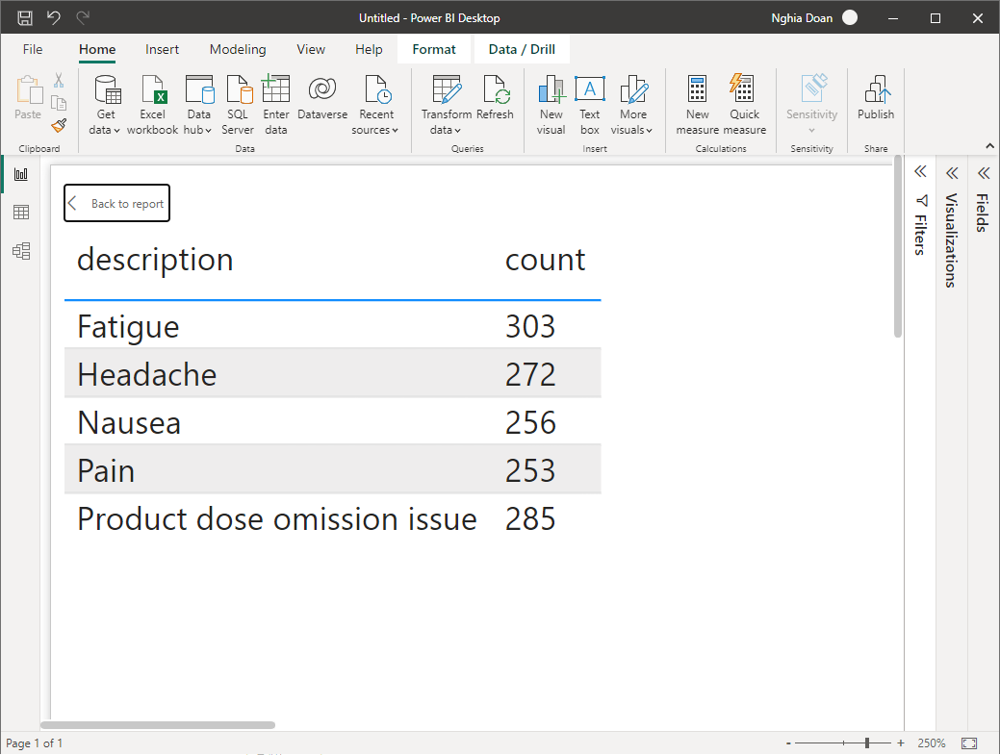

[Back](../README.md)

## Healthcare Analytics Sandbox: Load and Analyze FDA Adverse Event Reporting System Data With Neo4j

**Credit: The original case was described in a [Medium article](https://medium.com/neo4j/healthcare-analytics-sandbox-load-and-analyze-fda-adverse-event-reporting-system-data-with-neo4j-29b7b71a6ef4). Here you can find its [Neo4j blog](https://neo4j.com/developer-blog/healthcare-analytics-sandbox-load-and-analyze-fda-adverse-event-reporting-system-data-with-neo4j/), [GitHub repo](https://github.com/neo4j-graph-examples/healthcare-analytics), and [YouTube video](https://youtu.be/5DZfOLspVDM).**

If you know what is [Neo4j Browser Guide](https://neo4j.com/developer/neo4j-browser/) and how to use it here are the recommended steps:
- Read the article (and the blog if needed);
- Watch the video;
- Then click on this link to create a [Neo4j Sandbox](https://sandbox.neo4j.com/?usecase=healthcare-analytics) in a very short amount of time and go though the guide, as shown below.


---
In below, we provide a bit different approach to discuss the case so it is (a bit more difficult comparing to a sandbox) repeatable, easier to follow, some more steps are shown, some hidden features revealed, and more explanations added. Most of the text written here are from the original article.

## A. Health care analytics

Health care analytics is the analysis activities that can be undertaken as a result of data collected from four areas within healthcare:

* claims and cost data, 
* pharmaceutical and research and development (R&D) data, 
* clinical data (collected from electronic medical records (EHRs)),
* and patient behavior and sentiment data (patient behaviors and preferences, (retail purchases e.g. data captured in running stores). 

Health care analytics is a growing industry, expected to grow to even more with time.

Health care analytics allows for the examination of patterns in various healthcare data to determine how clinical care can be improved while limiting excessive spending. 
This can help improve the overall patient care offered in healthcare facilities.

Healthcare organizations can _"realize new opportunities and efficiencies by leveraging the connections within their existing data: be it in a connected genome, or a provider network, or patient treatments,"_ said Emil Eifrem, CEO of Neo4j, in one of his statements statement summarizing the graph database company's traction in the healthcare space. 
There are many companies in the market who are leveraging the potential of Neo4j Graph Database to unleash the hidden potential of the healthcare data. 

The connected data capabilities of a graph database can help us achieve what is either impossible or complicated with the traditional relational databases, other NoSQL databases or even big data solutions like Pig and Hive.

&nbsp;

## B. The Example

This demonstration guide covers a similar case of healthcare data analysis with Neo4j. 

We are performing data ingestion and analytics of the FDA Adverse Event Reporting System Data. 
The FDA Adverse Event Reporting System (FAERS or AERS) is a computerized information database designed to support the U.S. Food and Drug Administration's (FDA) post marketing safety surveillance program for all approved drug and therapeutic biologic products. 

The FDA uses FAERS to monitor for new adverse events and medication errors that might occur with these products. 
It is a system that measures occasional harms from medications to ascertain whether the risk–benefit ratio is high enough to justify continued use of any drug and to identify correctable and preventable problems in health care delivery (such as need for retraining to prevent prescribing errors).

Reporting of adverse events from the point of care is voluntary in the United States. 
The FDA receives some adverse event and medication error reports directly from health care professionals (such as physicians, pharmacists, nurses, and others) and consumers (such as patients, family members, lawyers, and others). 
Health professionals and consumers may also report these events to the products’ manufacturers.
If a manufacturer receives an adverse event report, they are required to send the report to the FDA as specified by regulations. 

We downloaded the `2022 Q4` dataset from the [FDA FAERS](https://www.fda.gov/drugs/questions-and-answers-fdas-adverse-event-reporting-system-faers/fda-adverse-event-reporting-system-faers-public-dashboard). We performed data ingestion to prepare the FAERS graph and run a few example analytics queries to see interesting output.

&nbsp;

## Prepare Kafka + Neo4j Cluster

The cluster consists of:
+ an instance of `Kafka` community edition [`docker-compose.yml`](../docker-compose-kafka-ce.yml), which includes (`Docker` image) services as below:
    - `zookeper` ([`Apache Zookeeper`](https://zookeeper.apache.org))
    - `broker`, `broker2`, and `broker3` ([`Apache Kafka`](https://kafka.apache.org/documentation.html))
    - `schema-registry` ([`Confluent Schema Registry`](https://github.com/confluentinc/schema-registry))
    - `connect`, `connect2`, and `connect3` ([`Apache Kafka Connect`](https://kafka.apache.org/documentation.html#connect))
    - `ksqldb-server` ([`Confluent ksqlDB`](https://ksqldb.io/))
    - `ksqldb-cli` ([`Confluent ksqlDB CLI`](https://docs.ksqldb.io/en/latest/operate-and-deploy/installation/cli-config/))
    - `rest-proxy` ([`Confluent Rest Proxy`](https://github.com/confluentinc/kafka-rest))
    - `kafkacat` ([`Kafkacat CLI`](https://docs.confluent.io/platform/current/app-development/kafkacat-usage.html))
    - `kafka-ui` ([`Kafka UI`](https://github.com/provectus/kafka-ui))
+ an instance of `neo4j` ([`Neo4j Graph Database`](https://neo4j.com/product/neo4j-graph-database/)), which is a graph database management system developed by Neo4j, Inc. Described by its developers as an ACID-compliant transactional database with native graph storage and processing.
+ an instance of `neodash` ([`Dashboard Builder for Neo4j`](https://neo4j.com/labs/neodash/)), which supports presenting your data as tables, graphs, bar charts, line charts, maps and more. It contains a Cypher editor to directly write the Cypher queries that populate the reports. You can save dashboards to your database, and share them with others.

### A. Prepare the cluster

<details>
<summary>Setup and start the cluster ...</summary>
<p>

1. Clone the GitHub repository
```bash
git clone https://github.com/PHACDataHub/data-mesh-ref-impl.git
```

2. Prepare folders for data, logs, and data files

```bash
./scripts/setup.sh
```

Note that the setup script downloads the datasets reside at [`FDA Adverse Event Reporting System (FAERS) Quarterly Data Extract Files`](https://fis.fda.gov/extensions/FPD-QDE-FAERS/FPD-QDE-FAERS.html).

To download a specific quarterly dataset, use

```bash
./scripts/download_faers_qdef.sh 2022 Q4
```

The setup script also downloads the [`Geopolitical Entities, Names, and Codes (GENC)`](https://www.fda.gov/industry/structured-product-labeling-resources/geopolitical-entities-names-and-codes-genc).

To run it separately, use

```bash
./scripts/download_genc_terms.sh
```


2. Start the cluster

```bash
./scripts/start_first_time.sh
```

</p>
</details>


### B. (Optional) Other utilities

<details>
<summary>For more details ...</summary>
<p>

1. Stop the cluster

```bash
./scripts/stop.sh
```

2. Restart the cluster (once it has already been set up)

```bash
./scripts/start_again.sh
```

3. Remove the cluster

```bash
./scripts/cleanup.sh
```

</p>
</details>

&nbsp;

## C. Data Model

&nbsp;

### C.1. FAERS Entities (as Neo4j Nodes)

| Entity        | Label        | Description                                                                                                                                                                                                                                    |
|---------------|--------------|------------------------------------------------------------------------------------------------------------------------------------------------------------------------------------------------------------------------------------------------|
| Demographic   | Case         | This is the demographic information of a person involved in the adverse event report.                                                                                                                                                          |
| Drug          | Drug         | Drug involved in the adverse event. A drug can be a primary suspect, secondary suspect, concomitant or interacting drug responsible for the adverse effect. This suspect type is identified by the relationship between Case and Drug Nodes.   |
| Reaction      | Reaction     | This is the reaction that the person (Case) developed after consumption of the respective drug, like 'Pain', 'Body temperature increased' or 'Insomnia' or 'Memory Loss' etc.                                                                  |
| Outcome       | Outcome      | This is the long term outcome of the case after the adverse event, for example 'Hospitalization: Initial or Prolonged', 'Disability' or 'Death'                                                                                                |
| Report_Source | ReportSource | This is the reported of the adverse event, for example 'Health Professional', 'Consumer', 'User Health Facility' etc who has reported the event to FDA system.                                                                                 |
| Therapy       | Therapy      | For some cases, they receive drug as a part of a therapy. This is the therapy details for the case.                                                                                                                                            |
| Indication    | -            | This is the medical term for drug indication that has the details like drug sequence, indication point. We have not used a separate Node label for this, instead we have covered required details as `Case` to `Drug` relationship properties. |
| Demographics  | AgeGroup     | Demographics table in the FEARS data has age information that we turned into a separate node for Age Group reporting.                                                                                                                          |


&nbsp;

We can take a look at a case view as a graph of connected entities:


```Cypher
MATCH (c:Case {primaryid: 58965853})
MATCH (c)-[consumed]->(drug:Drug)
MATCH (c)-[:RESULTED_IN]->(outcome)
MATCH (c)-[:HAS_REACTION]->(reaction)
MATCH (therapy)-[prescribed:PRESCRIBED]-(drug)
RETURN c AS patient, collect(distinct reaction) as sideEffects,
collect(distinct(drug)) AS drugs,
collect(distinct(outcome)) as outcomes
```

## E. Performing Data Analytics

<a id="neodash">Setup a Neodash dashboard:</a> Navigate your browser to `http://localhost:5005`. 

<details>
<summary>Your instance of [Neodash](https://neo4j.com/labs/neodash/) should already be running there.</summary>
<p>


Choose to create a new dashboard, then use with `neo4j` and `phac2022` as credential.


And finally click the `Load Dashboard` button on the left menu panel, then paste in the content of [neodash_dashboard.json](../conf/neo4j/dashboard.json), which was created by the `Cypher` queries below.


</p>
</details>

### E.1. Side Effects

1. What are the top 5 side effects reported?

```Cypher
MATCH (c:Case)-[:HAS_REACTION]->(r:Reaction) 
RETURN r.description AS description, count(c) As count
ORDER BY count(c) DESC 
LIMIT 5;
```

2. What are the top 5 drugs reported with side effects? Get drugs along with their side effects.

```Cypher
MATCH (c:Case)-[:IS_PRIMARY_SUSPECT]->(d:Drug)
MATCH (c)-[:HAS_REACTION]->(r:Reaction)
WITH d.name as drugName, collect(r.description) as sideEffects, count(r.description) as totalSideEffects
RETURN drugName, sideEffects[0..5] as sideEffects, totalSideEffects 
ORDER BY totalSideEffects DESC LIMIT 5;
```


### E.2. Companies

1. What are the manufacturing companies which have most drugs which reported side effects?

```Cypher
MATCH (m:Manufacturer)-[:REGISTERED]->(c)-[:HAS_REACTION]->(r)
RETURN m.manufacturerName as company, count(distinct r) as numberOfSideEffects
ORDER BY numberOfSideEffects DESC LIMIT 5;
```

2. Top 5 registered Drugs and their Side Effects
* What are the top 5 drugs from a particular company with side effects? 
* What are the side effects from those drugs?

```Cypher
MATCH (m:Manufacturer {manufacturerName: 'NOVARTIS'})-[:REGISTERED]->(c)
MATCH (r:Reaction)<--(c)-[:IS_PRIMARY_SUSPECT]->(d)
WITH d.name as drug,collect(distinct r.description) AS reactions, count(distinct r) as totalReactions
RETURN drug, reactions[0..5] as sideEffects, totalReactions 
ORDER BY totalReactions DESC
LIMIT 5;
```
*It is important to note that in the `Parameter Select` box of the `Manufacturer` you can chose the company by typing part of its name, for example `TAK` for `TAKEDA`.*


### E.3. Consumer Reports

1. What are the top 5 drugs which are reported directly by consumers for the side effects?

```Cypher
MATCH (c:Case)-[:REPORTED_BY]->(rpsr:ReportSource {name: "Consumer"})
MATCH (c)-[:IS_PRIMARY_SUSPECT]->(d)
MATCH (c)-[:HAS_REACTION]->(r)
WITH rpsr.name as reporter, d.name as drug, collect(distinct r.description) as sideEffects, count(distinct r) as total
RETURN drug, reporter, sideEffects[0..5] as sideEffects 
ORDER BY total desc LIMIT 5;
```

2. What are the top 5 drugs whose side effects resulted in Death of patients as an outcome?

```Cypher
MATCH (c:Case)-[:RESULTED_IN]->(o:Outcome {outcome:"Death"})
MATCH (c)-[:IS_PRIMARY_SUSPECT]->(d)
MATCH (c)-[:HAS_REACTION]->(r)
WITH d.name as drug, collect(distinct r.description) as sideEffects, o.outcome as outcome, count(distinct c) as cases
RETURN drug, sideEffects[0..5] as sideEffects, outcome, cases
ORDER BY cases DESC
LIMIT 5;
```


### E.4. Drug Combination and Case Details

1. Show top 10 drug combinations which have most side effects when consumed together

```Cypher
MATCH (c:Case)-[:IS_PRIMARY_SUSPECT]->(d1)
MATCH (c:Case)-[:IS_SECONDARY_SUSPECT]->(d2)
MATCH (c)-[:HAS_REACTION]->(r)
MATCH (c)-[:RESULTED_IN]->(o)
WHERE d1<>d2
WITH d1.name as primaryDrug, d2.name as secondaryDrug,
collect(r.description) as sideEffects, count(r.description) as totalSideEffects, collect(o.outcome) as outcomes
RETURN primaryDrug, secondaryDrug, sideEffects[0..3] as sideEffects, totalSideEffects, outcomes[0] ORDER BY totalSideEffects desc
LIMIT 10;
```

2. Take one of the case, and list demographics, all the drugs given, side effects and outcome for the patient.
This actually is split into three panels.

```Cypher
MATCH (c:Case {primaryid: 111791005})
MATCH (c)-[consumed]->(drug:Drug)
MATCH (c)-[:RESULTED_IN]->(outcome)
MATCH (c)-[:HAS_REACTION]->(reaction)
MATCH (therapy)-[prescribed:PRESCRIBED]-(drug)
WITH distinct c.age + ' ' + c.ageUnit as age, c.gender as gender,
collect(distinct reaction.description) as sideEffects,
collect(
    distinct {   drug: drug.name,
        dose: consumed.doseAmount + ' '  + consumed.doseUnit,
        indication: consumed.indication,
        route: consumed.route
    }) as treatment,
collect(distinct outcome.outcome) as outcomes
RETURN age, gender, treatment, sideEffects, outcomes ;
```

*It is important to note that in the `Parameter Select` box of the `Manufacturer` you can chose the case by typing part of its identification, for example `111` for `111791005`.*


### E.5. Age Groups

1. What is the age group which reported highest side effects, and what are those side effects?

```Cypher
MATCH (a:AgeGroup)<-[:FALLS_UNDER]-(c:Case)
MATCH (c)-[:HAS_REACTION]->(r)
WITH a, collect(r.description) AS sideEffects, count(r) AS total
RETURN a.ageGroup AS ageGroupName, sideEffects[0..6] AS sideEffects 
ORDER BY total DESC
LIMIT 1;
```

2. What are the highest side effects reported in Children and what are the drugs those caused these side effects?

```Cypher
MATCH (a:AgeGroup {ageGroup:"C"})<-[:FALLS_UNDER]-(c)
MATCH (c)-[:HAS_REACTION]->(r)
MATCH (c)-[:IS_PRIMARY_SUSPECT]->(d)
WITH distinct r.description as sideEffect, collect(distinct d.name) as drugs, count(r) as sideEffectCount
RETURN sideEffect, drugs 
ORDER BY sideEffectCount desc LIMIT 5;
```

3. What is the percentage wise allocation of side effects for each age group?

```Cypher
MATCH (c:Case)-[:HAS_REACTION]->(r)
WITH count(r) as totalReactions
MATCH (a:AgeGroup)<-[:FALLS_UNDER]-(c)-[:HAS_REACTION]->(r)
WITH a, count(r) as ageGroupWiseReactions, totalReactions
RETURN a.ageGroup as ageGroupName, (ageGroupWiseReactions*100.00)/totalReactions as perc
ORDER BY perc DESC
```


To save the dashboard for later use, select the `Save` button on the left menu and then save it into `Neo4j` instance (the dashboard now is a part of the `Neo4j` database.)

## F. [Alternative Visualization with Power BI](#power-bi-viz)

If you have a licensed version of [Power BI Desktop](https://powerbi.microsoft.com/en-us/desktop/) installed on your machine, you can access and visualize `Cypher` queries directly from `Power BI`.

First, install the [Neo4j DataConnector For Power BI](https://github.com/cskardon/Neo4jDataConnectorForPowerBi), just follow the instructions below:
- Copy the driver to your `<user>/Documents/Power BI Desktop/Custom Connectors` folder (if you don't have that folder - create it!)
- Allow `Power BI` to see the connector: Open `Power BI`, Go to `File -> Options and Settings -> Options`, Select `Security` from the left hand side bar, in the `Data Extensions` section, select: `(Not Recommended) Allow any extension to load without validation or warning`, say `OK`. Close and restart `Power BI`.
- Click on `Get Data` and choose `Neo4j 2.0 (Beta)`.

Let choose the `Cypher` associated to `What are the top 5 side effects reported?`:

```Cypher
MATCH (c:Case)-[:HAS_REACTION]->(r:Reaction) 
RETURN r.description AS description, count(c) As count
ORDER BY count(c) DESC 
LIMIT 5;
```

put it into the `Cypher` text box of the `Execute Cypher Output`, let `http` be the `Scheme`, `localhost` as `Address`, `7474` for `port`, `4.3` as `Neo4j Version` (although we have a higher one, which is backward-compatible), `neo4j` as `Database Name`, and `30` seconds for timeout.


Then by executing and configuring the dashboard. Happy viz!




[Back](../../README.md)