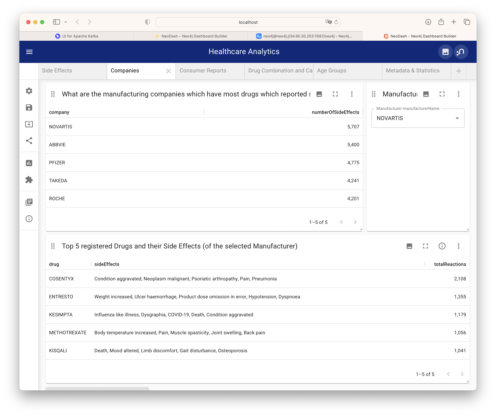
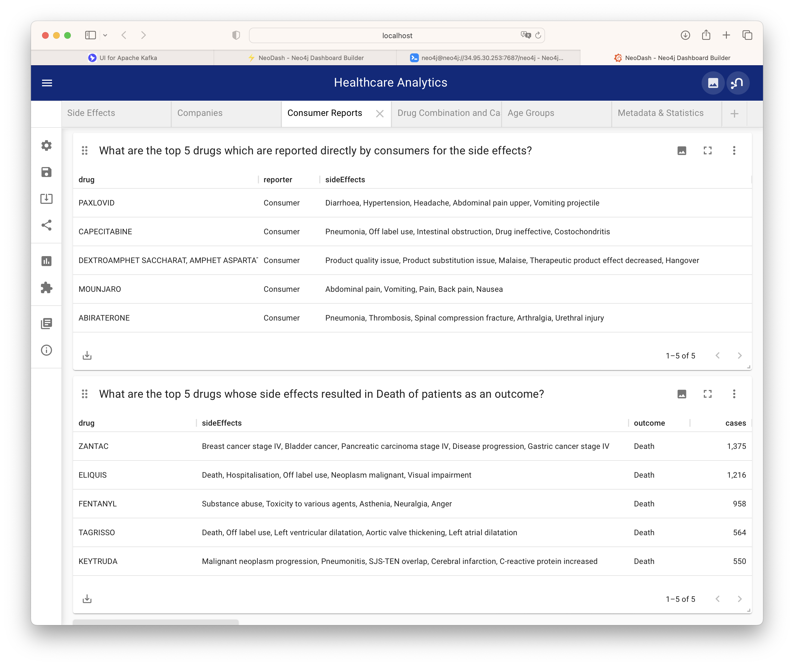

[Back](../README.md)

# Load, analyze, and make FDA Adverse Event Reporting System Data accessible

## A. Purposes
As an example case of the Data Mesh Reference Implementation, it is to show:
1. Demonstrate a setup of a `Kafka Even Sourcing Architecture` as *scalable cluster using only open source components*. The cluster is integrated with `Neo4j` graph database and `NeoDash` for dashboards.
2. Demonstrate ingestion of data in `csv` file format, transformation into *streams of ordered events*, and then seemlesly consumted by `Neo4j`.
3. Demonstrate how datapoints are handled automatically everywhere throughout the process based on *metadata at source*.
4. Demonstrate how *different systems* - such as `Neo4j` or `PowerBI` - *connecting to the streaming infrastructure* in order to consume streams of events, analyze them, and present outcomes in dashboards of choice.
5. Demonstrate how a complex setup of the whole cluster can be *containerized* supporting *setup-on-demand, scale-on-demand, and real-time monitoring*.

## B. Objectives
As an exercise on the `Healthcare` domain, the example case is to show how to:
1. Perform data ingestion a quarterly dataset from the `FDA Adverse Event Reporting System Data` into a `Kafka - Neo4j cluster` and make them available on `Google Cloud Platform`.
2. Connect `Neo4j` graph database to the cluster, consume data, perform analysis on the dataset. The outcomes then are presented in `NeoDash` cloud dashboards, which are accessible from anywhere.
3. Connect a desktop-based instance of `PowerBI` to the cluster, consume data, perform analysis on the dataset, and then show the outcomes on local dashboards.

<details>
<summary>Credit: The original case</summary>
<p>

**Credit: The original case was described in a [Medium article](https://medium.com/neo4j/healthcare-analytics-sandbox-load-and-analyze-fda-adverse-event-reporting-system-data-with-neo4j-29b7b71a6ef4). Here you can find its [Neo4j blog](https://neo4j.com/developer-blog/healthcare-analytics-sandbox-load-and-analyze-fda-adverse-event-reporting-system-data-with-neo4j/), [GitHub repo](https://github.com/neo4j-graph-examples/healthcare-analytics), and [YouTube video](https://youtu.be/5DZfOLspVDM).**

If you know what is [Neo4j Browser Guide](https://neo4j.com/developer/neo4j-browser/) and how to use it here are the recommended steps:
- Read the article (and the blog if needed);
- Watch the video;
- Then click on this link to create a [Neo4j Sandbox](https://sandbox.neo4j.com/?usecase=healthcare-analytics) in a very short amount of time and go though the guide, as shown below.


[Neo4j Life Sciences and Healthcare Network](https://neo4j.com/developer/life-sciences-and-healthcare/) describes use cases in Life Sciences and Healthcare. If you work in biology, biochemistry, pharmaceuticals, healthcare and other life sciences, you know that you work with highly-connected information. Unfortunately, many scientists still use relational databases and spreadsheets as their daily tools.
Here we want to present you with an alternative. Managing, storing and querying connected information is natural to a graph database like `Neo4j`. Learn how your research and practitioner colleagues utilized `Neo4j` to draw new insights or just be more efficient in their daily work.

</p>
</details>

## C. Health care analytics, FDA FAERS, and the quarterly dataset

### C.1. Health care analytics

Health care analytics is the analysis activities that can be undertaken as a result of data collected from four areas within healthcare: claims and cost data, pharmaceutical and research and development (R&D) data, clinical data (collected from electronic medical records (EHRs)), and patient behavior and sentiment data (patient behaviors and preferences, (retail purchases e.g. data captured in running stores). Health care analytics is a growing industry, expected to grow to even more with time. Health care analytics allows for the examination of patterns in various healthcare data to determine how clinical care can be improved while limiting excessive spending. This can help improve the overall patient care offered in healthcare facilities. -- [Wikipedia](https://en.wikipedia.org/wiki/Health_care_analytics).

Healthcare organizations can *"realize new opportunities and efficiencies by leveraging the connections within their existing data: be it in a connected genome, or a provider network, or patient treatments,"* -- Emil Eifrem, CEO of `Neo4j`.

### C.2 FDA Adverse Event Reporting System (FAERS or AERS)

The FDA Adverse Event Reporting System (FAERS) is a database that contains adverse event reports, medication error reports and product quality complaints resulting in adverse events that were submitted to FDA. The database is designed to support the FDA's post-marketing safety surveillance program for drug and therapeutic biologic products. The informatic structure of the FAERS database adheres to the international safety reporting guidance issued by the International Conference on Harmonisation ([ICH E2B](https://www.fda.gov/drugs/guidances-drugs/international-council-harmonisation-efficacy)). Adverse events and medication errors are coded using terms in the Medical Dictionary for Regulatory Activities ([MedDRA](https://www.meddra.org)) -- [FDA FAERS](https://www.fda.gov/drugs/surveillance/questions-and-answers-fdas-adverse-event-reporting-system-faers).


<details>
<summary>For more details ...</summary>
<p>

FAERS is a useful tool for FDA for activities such as looking for new safety concerns that might be related to a marketed product, evaluating a manufacturer's compliance to reporting regulations and responding to outside requests for information. The reports in FAERS are evaluated by clinical reviewers, in the Center for Drug Evaluation and Research (CDER) and the Center for Biologics Evaluation and Research (CBER), to monitor the safety of products after they are approved by FDA.

If a potential safety concern is identified in FAERS, further evaluation is performed. Further evaluation might include conducting studies using other large databases, such as those available in the [Sentinel System](https://www.fda.gov/sentinel-initiative-transforming-how-we-monitor-product-safety). Based on an evaluation of the potential safety concern, FDA may take regulatory action(s) to improve product safety and protect the public health, such as updating a product’s labeling information, restricting the use of the drug, communicating new safety information to the public, or, in rare cases, removing a product from the market.   

Healthcare professionals, consumers, and manufacturers submit reports to FAERS. FDA receives voluntary reports directly from healthcare professionals (such as physicians, pharmacists, nurses and others) and consumers (such as patients, family members, lawyers and others). Healthcare professionals and consumers may also report to the products’ manufacturers. If a manufacturer receives a report from a healthcare professional or consumer, it is required to send the report to FDA as specified by regulations.

</p>
</details>

### C.3. The quarterly dataset


The `2022 Q4` dataset from the [FDA FAERS Latest Quarterly Data Files](https://www.fda.gov/drugs/questions-and-answers-fdas-adverse-event-reporting-system-faers/fda-adverse-event-reporting-system-faers-latest-quarterly-data-files) is downloaded. Data ingestion is then performed to prepare the FAERS graph and run a few example analytics queries to see interesting output.

## D. The Kafka + Neo4j Cluster

The cluster consists of:
+ an instance of `Kafka` community edition [`docker-compose.yml`](../docker-compose-kafka-ce.yml), which includes (`Docker` image) services as below:
    - `zookeper` ([`Apache Zookeeper`](https://zookeeper.apache.org))
    - `broker`, `broker2`, and `broker3` ([`Apache Kafka`](https://kafka.apache.org/documentation.html))
    - `schema-registry` ([`Confluent Schema Registry`](https://github.com/confluentinc/schema-registry))
    - `connect`, `connect2`, and `connect3` ([`Apache Kafka Connect`](https://kafka.apache.org/documentation.html#connect))
    - `ksqldb-server` ([`Confluent ksqlDB`](https://ksqldb.io/))
    - `ksqldb-cli` ([`Confluent ksqlDB CLI`](https://docs.ksqldb.io/en/latest/operate-and-deploy/installation/cli-config/))
    - `rest-proxy` ([`Confluent Rest Proxy`](https://github.com/confluentinc/kafka-rest))
    - `kafkacat` ([`Kafkacat CLI`](https://docs.confluent.io/platform/current/app-development/kafkacat-usage.html))
    - `kafka-ui` ([`Kafka UI`](https://github.com/provectus/kafka-ui))
+ an instance of `neo4j` ([`Neo4j Graph Database`](https://neo4j.com/product/neo4j-graph-database/)), which is a graph database management system developed by Neo4j, Inc. Described by its developers as an ACID-compliant transactional database with native graph storage and processing.
+ an instance of `neodash` ([`Dashboard Builder for Neo4j`](https://neo4j.com/labs/neodash/)), which supports presenting your data as tables, graphs, bar charts, line charts, maps and more. It contains a Cypher editor to directly write the Cypher queries that populate the reports. You can save dashboards to your database, and share them with others.

### A. Prepare the cluster

<details>
<summary>Setup and start the cluster ...</summary>
<p>

1. Clone the GitHub repository
```bash
git clone https://github.com/PHACDataHub/data-mesh-ref-impl.git
```

2. Prepare folders for data, logs, and data files

```bash
./scripts/setup.sh
```

Note that the setup script downloads the datasets reside at [`FDA Adverse Event Reporting System (FAERS) Quarterly Data Extract Files`](https://fis.fda.gov/extensions/FPD-QDE-FAERS/FPD-QDE-FAERS.html).

To download a specific quarterly dataset, use

```bash
./scripts/download_faers_qdef.sh 2022 Q4
```

The setup script also downloads the [`Geopolitical Entities, Names, and Codes (GENC)`](https://www.fda.gov/industry/structured-product-labeling-resources/geopolitical-entities-names-and-codes-genc).

To run it separately, use

```bash
./scripts/download_genc_terms.sh
```


2. Start the cluster

```bash
./scripts/start_first_time.sh
```

</p>
</details>


### B. (Optional) Other utilities

<details>
<summary>For more details ...</summary>
<p>

1. Stop the cluster

```bash
./scripts/stop.sh
```

2. Restart the cluster (once it has already been set up)

```bash
./scripts/start_again.sh
```

3. Remove the cluster

```bash
./scripts/cleanup.sh
```

</p>
</details>

&nbsp;

## C. Data Model

&nbsp;

### C.1. FAERS Entities (as Neo4j Nodes)

| Entity        | Label        | Description                                                                                                                                                                                                                                    |
|---------------|--------------|------------------------------------------------------------------------------------------------------------------------------------------------------------------------------------------------------------------------------------------------|
| Demographic   | Case         | This is the demographic information of a person involved in the adverse event report.                                                                                                                                                          |
| Drug          | Drug         | Drug involved in the adverse event. A drug can be a primary suspect, secondary suspect, concomitant or interacting drug responsible for the adverse effect. This suspect type is identified by the relationship between Case and Drug Nodes.   |
| Reaction      | Reaction     | This is the reaction that the person (Case) developed after consumption of the respective drug, like 'Pain', 'Body temperature increased' or 'Insomnia' or 'Memory Loss' etc.                                                                  |
| Outcome       | Outcome      | This is the long term outcome of the case after the adverse event, for example 'Hospitalization: Initial or Prolonged', 'Disability' or 'Death'                                                                                                |
| Report_Source | ReportSource | This is the reported of the adverse event, for example 'Health Professional', 'Consumer', 'User Health Facility' etc who has reported the event to FDA system.                                                                                 |
| Therapy       | Therapy      | For some cases, they receive drug as a part of a therapy. This is the therapy details for the case.                                                                                                                                            |
| Indication    | -            | This is the medical term for drug indication that has the details like drug sequence, indication point. We have not used a separate Node label for this, instead we have covered required details as `Case` to `Drug` relationship properties. |
| Demographics  | AgeGroup     | Demographics table in the FEARS data has age information that we turned into a separate node for Age Group reporting.                                                                                                                          |


&nbsp;

We can take a look at a case (`primaryid` `58965853`) as a graph of connected entities:


```Cypher
MATCH (c:Case {primaryid: 58965853})
MATCH (c)-[consumed]->(drug:Drug)
MATCH (c)-[:RESULTED_IN]->(outcome)
MATCH (c)-[:HAS_REACTION]->(reaction)
MATCH (therapy)-[prescribed:PRESCRIBED]-(drug)
RETURN c AS patient, collect(distinct reaction) as sideEffects,
collect(distinct(drug)) AS drugs,
collect(distinct(outcome)) as outcomes
```

## E. Performing Data Analytics

<a id="neodash">Setup a Neodash dashboard:</a> Navigate your browser to `http://localhost:5005`. 

<details>
<summary>Your instance of [Neodash](https://neo4j.com/labs/neodash/) should already be running there.</summary>
<p>


Choose to create a new dashboard, then use with `neo4j` and `phac2022` as credential.


And finally click the `Load Dashboard` button on the left menu panel, then paste in the content of [neodash_dashboard.json](../conf/neo4j/dashboard.json), which was created by the `Cypher` queries below.


</p>
</details>

### E.1. Side Effects

1. What are the top 5 side effects reported?

```Cypher
MATCH (c:Case)-[:HAS_REACTION]->(r:Reaction) 
RETURN r.description AS description, count(c) As count
ORDER BY count(c) DESC 
LIMIT 5;
```

2. What are the top 5 drugs reported with side effects? Get drugs along with their side effects.

```Cypher
MATCH (c:Case)-[:IS_PRIMARY_SUSPECT]->(d:Drug)
MATCH (c)-[:HAS_REACTION]->(r:Reaction)
WITH d.name as drugName, collect(r.description) as sideEffects, count(r.description) as totalSideEffects
RETURN drugName, sideEffects[0..5] as sideEffects, totalSideEffects 
ORDER BY totalSideEffects DESC LIMIT 5;
```


### E.2. Companies

1. What are the manufacturing companies which have most drugs which reported side effects?

```Cypher
MATCH (m:Manufacturer)-[:REGISTERED]->(c)-[:HAS_REACTION]->(r)
RETURN m.manufacturerName as company, count(distinct r) as numberOfSideEffects
ORDER BY numberOfSideEffects DESC LIMIT 5;
```

2. Top 5 registered Drugs and their Side Effects
* What are the top 5 drugs from a particular company with side effects? 
* What are the side effects from those drugs?

```Cypher
MATCH (m:Manufacturer {manufacturerName: 'NOVARTIS'})-[:REGISTERED]->(c)
MATCH (r:Reaction)<--(c)-[:IS_PRIMARY_SUSPECT]->(d)
WITH d.name as drug,collect(distinct r.description) AS reactions, count(distinct r) as totalReactions
RETURN drug, reactions[0..5] as sideEffects, totalReactions 
ORDER BY totalReactions DESC
LIMIT 5;
```
*It is important to note that in the `Parameter Select` box of the `Manufacturer` you can chose the company by typing part of its name, for example `TAK` for `TAKEDA`.*



### E.3. Consumer Reports

1. What are the top 5 drugs which are reported directly by consumers for the side effects?

```Cypher
MATCH (c:Case)-[:REPORTED_BY]->(rpsr:ReportSource {name: "Consumer"})
MATCH (c)-[:IS_PRIMARY_SUSPECT]->(d)
MATCH (c)-[:HAS_REACTION]->(r)
WITH rpsr.name as reporter, d.name as drug, collect(distinct r.description) as sideEffects, count(distinct r) as total
RETURN drug, reporter, sideEffects[0..5] as sideEffects 
ORDER BY total desc LIMIT 5;
```

2. What are the top 5 drugs whose side effects resulted in Death of patients as an outcome?

```Cypher
MATCH (c:Case)-[:RESULTED_IN]->(o:Outcome {outcome:"Death"})
MATCH (c)-[:IS_PRIMARY_SUSPECT]->(d)
MATCH (c)-[:HAS_REACTION]->(r)
WITH d.name as drug, collect(distinct r.description) as sideEffects, o.outcome as outcome, count(distinct c) as cases
RETURN drug, sideEffects[0..5] as sideEffects, outcome, cases
ORDER BY cases DESC
LIMIT 5;
```



### E.4. Drug Combination and Case Details

1. Show top 10 drug combinations which have most side effects when consumed together

```Cypher
MATCH (c:Case)-[:IS_PRIMARY_SUSPECT]->(d1)
MATCH (c:Case)-[:IS_SECONDARY_SUSPECT]->(d2)
MATCH (c)-[:HAS_REACTION]->(r)
MATCH (c)-[:RESULTED_IN]->(o)
WHERE d1<>d2
WITH d1.name as primaryDrug, d2.name as secondaryDrug,
collect(r.description) as sideEffects, count(r.description) as totalSideEffects, collect(o.outcome) as outcomes
RETURN primaryDrug, secondaryDrug, sideEffects[0..3] as sideEffects, totalSideEffects, outcomes[0] ORDER BY totalSideEffects desc
LIMIT 10;
```

2. Take one of the case, and list demographics, all the drugs given, side effects and outcome for the patient.
This actually is split into three panels.

```Cypher
MATCH (c:Case {primaryid: 111791005})
MATCH (c)-[consumed]->(drug:Drug)
MATCH (c)-[:RESULTED_IN]->(outcome)
MATCH (c)-[:HAS_REACTION]->(reaction)
MATCH (therapy)-[prescribed:PRESCRIBED]-(drug)
WITH distinct c.age + ' ' + c.ageUnit as age, c.gender as gender,
collect(distinct reaction.description) as sideEffects,
collect(
    distinct {   drug: drug.name,
        dose: consumed.doseAmount + ' '  + consumed.doseUnit,
        indication: consumed.indication,
        route: consumed.route
    }) as treatment,
collect(distinct outcome.outcome) as outcomes
RETURN age, gender, treatment, sideEffects, outcomes ;
```

*It is important to note that in the `Parameter Select` box of the `Manufacturer` you can chose the case by typing part of its identification, for example `111` for `111791005`.*


### E.5. Age Groups

1. What is the age group which reported highest side effects, and what are those side effects?

```Cypher
MATCH (a:AgeGroup)<-[:FALLS_UNDER]-(c:Case)
MATCH (c)-[:HAS_REACTION]->(r)
WITH a, collect(r.description) AS sideEffects, count(r) AS total
RETURN a.ageGroup AS ageGroupName, sideEffects[0..6] AS sideEffects 
ORDER BY total DESC
LIMIT 1;
```

2. What are the highest side effects reported in Children and what are the drugs those caused these side effects?

```Cypher
MATCH (a:AgeGroup {ageGroup:"C"})<-[:FALLS_UNDER]-(c)
MATCH (c)-[:HAS_REACTION]->(r)
MATCH (c)-[:IS_PRIMARY_SUSPECT]->(d)
WITH distinct r.description as sideEffect, collect(distinct d.name) as drugs, count(r) as sideEffectCount
RETURN sideEffect, drugs 
ORDER BY sideEffectCount desc LIMIT 5;
```

3. What is the percentage wise allocation of side effects for each age group?

```Cypher
MATCH (c:Case)-[:HAS_REACTION]->(r)
WITH count(r) as totalReactions
MATCH (a:AgeGroup)<-[:FALLS_UNDER]-(c)-[:HAS_REACTION]->(r)
WITH a, count(r) as ageGroupWiseReactions, totalReactions
RETURN a.ageGroup as ageGroupName, (ageGroupWiseReactions*100.00)/totalReactions as perc
ORDER BY perc DESC
```


To save the dashboard for later use, select the `Save` button on the left menu and then save it into `Neo4j` instance (the dashboard now is a part of the `Neo4j` database.)

## F. [Alternative Visualization with Power BI](#power-bi-viz)

If you have a licensed version of [Power BI Desktop](https://powerbi.microsoft.com/en-us/desktop/) installed on your machine, you can access and visualize `Cypher` queries directly from `Power BI`.

First, install the [Neo4j DataConnector For Power BI](https://github.com/cskardon/Neo4jDataConnectorForPowerBi), just follow the instructions below:
- Copy the driver to your `<user>/Documents/Power BI Desktop/Custom Connectors` folder (if you don't have that folder - create it!)
- Allow `Power BI` to see the connector: Open `Power BI`, Go to `File -> Options and Settings -> Options`, Select `Security` from the left hand side bar, in the `Data Extensions` section, select: `(Not Recommended) Allow any extension to load without validation or warning`, say `OK`. Close and restart `Power BI`.
- Click on `Get Data` and choose `Neo4j 2.0 (Beta)`.

Let choose the `Cypher` associated to `What are the top 5 side effects reported?`:

```Cypher
MATCH (c:Case)-[:HAS_REACTION]->(r:Reaction) 
RETURN r.description AS description, count(c) As count
ORDER BY count(c) DESC 
LIMIT 5;
```

put it into the `Cypher` text box of the `Execute Cypher Output`, let `http` be the `Scheme`, `localhost` as `Address`, `7474` for `port`, `4.3` as `Neo4j Version` (although we have a higher one, which is backward-compatible), `neo4j` as `Database Name`, and `30` seconds for timeout.


Then by executing and configuring the dashboard. Happy viz!


[Back](../../README.md)