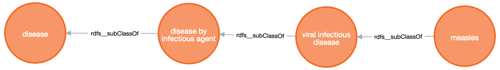
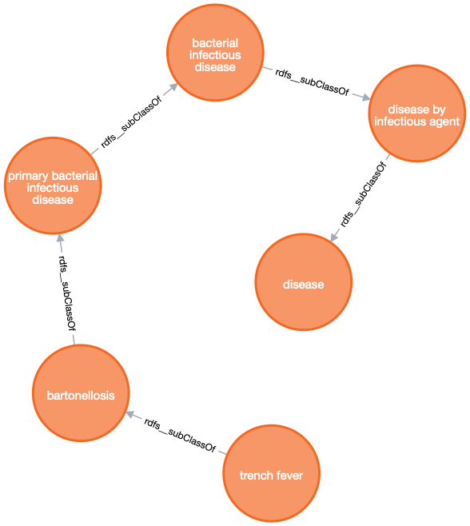
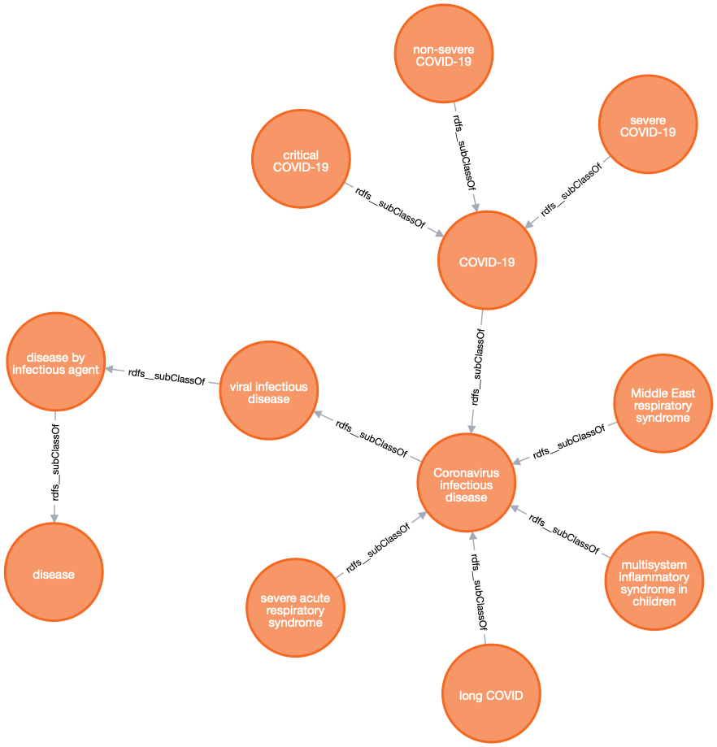
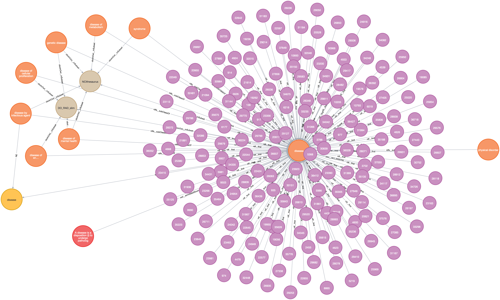
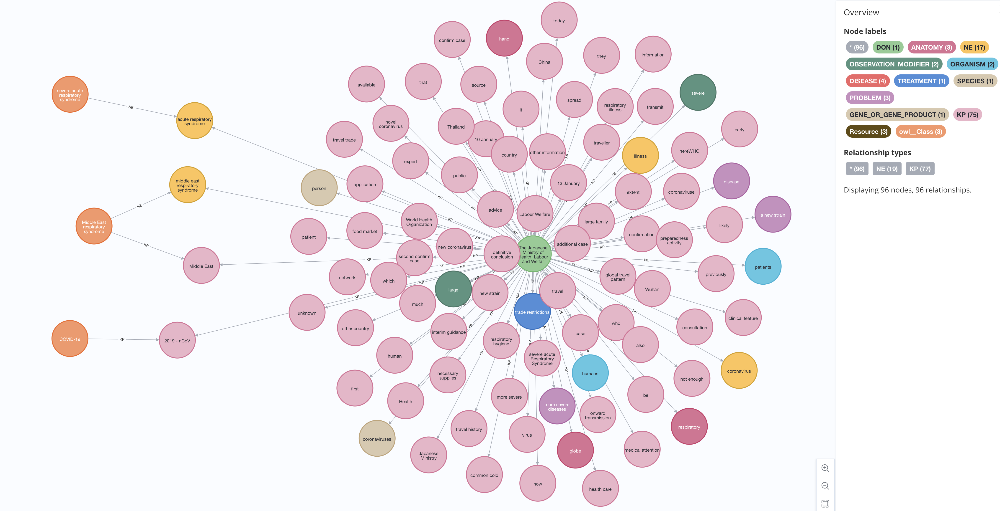
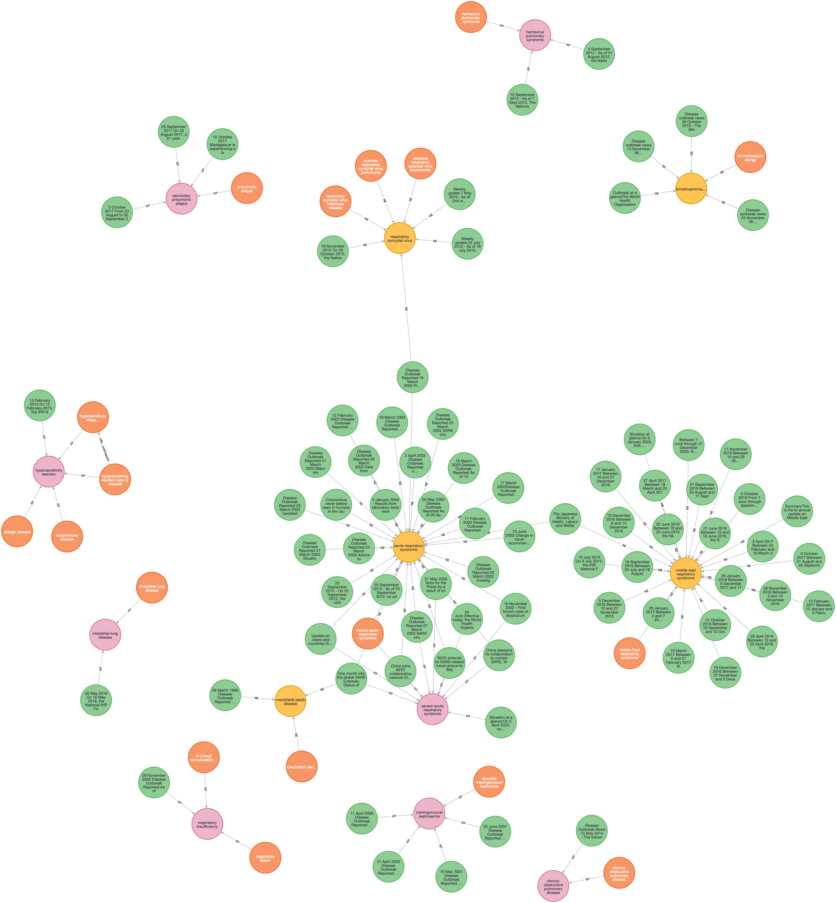

# Knowledge Graph from Disease Ontology

## 1. Setup

Note that: you need to setup a VM in the cloud with at least a Nvidia T4 GPU.

1. Clone the GitHub repository:
```bash
git clone https://github.com/PHACDataHub/data-mesh-ref-impl.git
```

2. Install `Docker` and `Docker Compose`:

```bash
./docker/install.sh
logout
```

Relogin then

```bash
./scripts/install_gcp_gpu_support.sh
./scripts/install_packages.sh
```

3. Setup

```bash
./setup.sh
./start.sh
./run.sh
```

## 2. Queries

### 2.1 Diseases

```json
[
  {
    "n": {
      "identity": 33789,
      "labels": [
        "Resource",
        "owl__Class"
      ],
      "properties": {
        "oboInOwl__id": [
          "DOID:8622"
        ],
        "oboInOwl__hasExactSynonym": [
          "morbilli"
        ],
        "oboInOwl__hasOBONamespace": [
          "disease_ontology"
        ],
        "rdfs__label": [
          "measles"
        ],
        "obo__IAO_0000115": [
          "A viral infectious disease that results_in infection located_in skin, has_material_basis_in Measles virus, which is transmitted_by contact with oronasal secretions, or semen of an infected person. The infection has_symptom fever, has_symptom cough, has_symptom coryza, has_symptom conjunctivitis, and has_symptom maculopapular, erythematous rash."
        ],
        "uri": "http://purl.obolibrary.org/obo/DOID_8622",
        "oboInOwl__hasAlternativeId": [
          "DOID:8963",
          "DOID:8621",
          "DOID:9112"
        ],
        "oboInOwl__hasDbXref": [
          "MESH:D008457",
          "ICD9CM:055",
          "GARD:3434",
          "NCI:C96406",
          "UMLS_CUI:C0025007",
          "ICD10CM:B05",
          "SNOMEDCT_US_2022_09_01:154338006"
        ]
      },
      "elementId": "33789"
    }
  }
]
```



```json
[
  {
    "n": {
      "identity": 19024,
      "labels": [
        "Resource",
        "owl__Class"
      ],
      "properties": {
        "skos__exactMatch": [
          "MESH:D014205"
        ],
        "oboInOwl__id": [
          "DOID:11101"
        ],
        "oboInOwl__hasExactSynonym": [
          "shin bone fever",
          "Quintan fever",
          "His-Werner disease",
          "Wolhynian fever",
          "tibialgic fever"
        ],
        "oboInOwl__hasOBONamespace": [
          "disease_ontology"
        ],
        "rdfs__label": [
          "trench fever"
        ],
        "obo__IAO_0000115": [
          "A primary bacterial infectious disease that results in systemic infection, has_material_basis_in Bartonella quintana, which is transmitted by body lice (Pediculus humanus corporis). The infection has symptom relapsing fever, has symptom headache, has symptom shin pain, and has symptom soreness of the muscles of the legs and back."
        ],
        "uri": "http://purl.obolibrary.org/obo/DOID_11101",
        "oboInOwl__hasDbXref": [
          "ICD9CM:083.1",
          "MESH:D014205",
          "SNOMEDCT_US_2022_09_01:82214002",
          "ICD10CM:A79.0",
          "UMLS_CUI:C0040830"
        ]
      },
      "elementId": "19024"
    }
  }
]
```





### 2.2 Details

A class of Disease Ontology



A news article of WHO Disease Outbreak News



### 2.3 Matches



