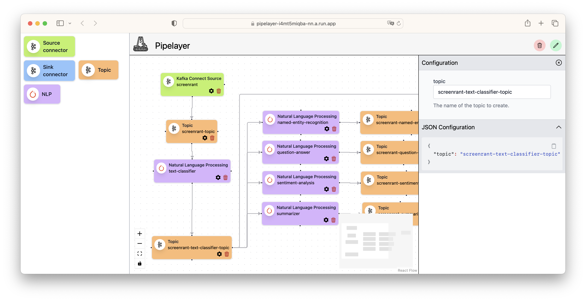
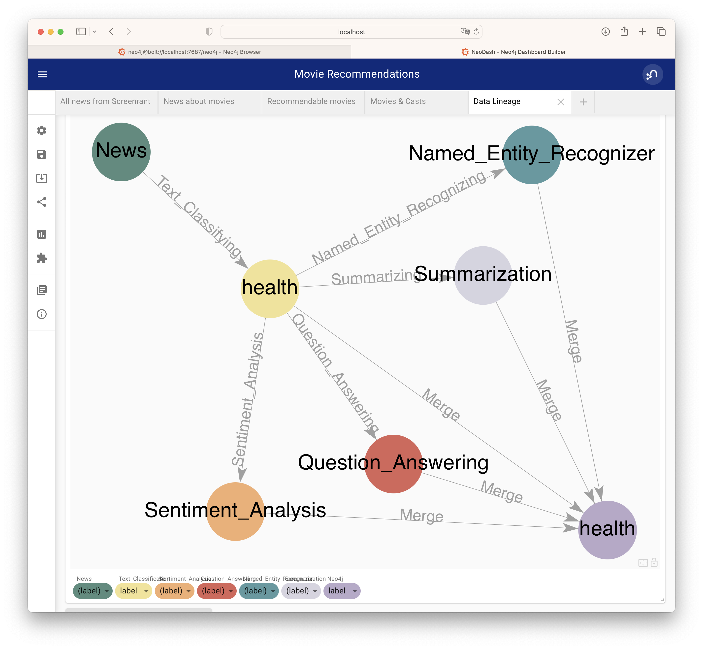

[Back](../README.md)

# Movie Recommendation

## A. Purposes

As an example case of the Data Mesh Reference Implementation, it is to show:
1. Demonstrate an initial implementation of `Pipelayer` flow designer, which helps in high-level design of workflow by assisting in defining and configuring containerized services, event topics, and their relations in a `directed acyclic graph`.
2. Demonstrate real-time data acquistion from `RSS` source into `Kafka` event streams with little effort of configuration. Datapoints then are handled automatically everywhere throughout the process based on *metadata at source*.
3. Demonstrate large data import in relatively short amount of time directly into `Neo4j` graph database. 
4. Demonstrate a setup of a `Kafka Even Sourcing Architecture` as *scalable cluster using only open source components*. The cluster is integrated with `Neo4j` graph database and `NeoDash` for dashboards.
5. Demonstrate generic construction of `Natural Language Processing` tasks with `consumer-process-produce` containerized service based on `huggingface.co` `Transformers`, generic `Kafka` consumer/producer with pre-trained, fine-tuned  models.
6. Demonstrate how `Neo4j` or similar data storage system can be *connected to the streaming infrastructure* in order to consume streams of events, analyze them, and present outcomes in dashboards of choice.
7. Demonstrate how low-code tool such as `Retool.com` can be used in order to quickly create cloud-based serverless `end-user UI` to accomondate the need of integrating human-interaction to `supervise machine-learning process`.
8. Demonstrate how a complex setup of the whole cluster can be *containerized* supporting *setup-on-demand, scale-on-demand, and real-time monitoring*.

&nbsp;

## B. Objectives

As an exercise on the machine-learning domain, the example case is to show how to:
1. Continuously ingest `RSS feeds` from `12` web sources, such as [RSS feed](https://screenrant.com/feed/) of [`Screen Rant`](https://screenrant.com). Extract news items from the feed, transform, and produce them as events in `Kafka`.
2. Import the large dataset from [`IMDb`](https://www.imdb.com).
3. Execute a number of `Natural Language Processing` (NLP) tasks on the messages (see the example below).
4. Perform `unsupervised` recommendation by matching outcomes of NLP tasks to `IMDb` movies, select from those a number of top-rated movies for recommendation.
5. Perform `supervised` recommendation by providing outcomes of NLP tasks to `human desicion` via an `end-user UI` constructed by `Retool`, and then select from those a number of top-rated movies for recommendation.


**An example in details**

Excerpt from this news [First 'Joker: Folie à Deux' Image of Lady Gaga's Harley Quinn](https://collider.com/joker-2-image-lady-gaga-joaquin-phoenix/):
```
Who says Valentine's Day can't have some jokes?
Director Todd Phillips took to Instagram to unveil the first look at Lady Gaga in the sequel Joker: Folie à Deux.
While her role is currently under wraps, all signs appear to point to the multi-hyphenate portraying iconic DC character Harley Quinn.
The Joker sequel is set to release on October 4, 2024.
Gaga isn't alone in the image, which sees the return of Joaquin Phoenix's Arthur Fleck/Joker.
He's complete in marred clown makeup and clearly happy to be in the embrace of her character.
Plot details are not known at the moment.
However, this image appears to correlate with Harley Quinn's origin as Joker's psychiatrist in Arkham Asylum, the presumed location for the sequel.
The ending of Joker found Arthur having his way in the famed Gotham facility.
```

Outcomes of a number of different `NLP` tasks, produced by [`huggingface`](https://huggingface.co) `pipelines`.

*Task 1 - Summarize the news in a few sentences*

```bash
Todd Phillips took to Instagram to unveil the first look at Lady Gaga in the sequel Joker: Folie à Deux. All signs appear to point to the multi-hyphenate portraying iconic DC character Harley Quinn. The Joker sequel is set to release on October 4, 2024.
```

*Task 2 - What is the news about: education, politics, business, health, sport, or movie?*

```bash
                                            sequence     labels    scores
0  Who says Valentine's Day can't have some jokes...      movie  0.551902
1  Who says Valentine's Day can't have some jokes...      sport  0.205439
2  Who says Valentine's Day can't have some jokes...   business  0.103893
3  Who says Valentine's Day can't have some jokes...     health  0.084764
4  Who says Valentine's Day can't have some jokes...  education  0.027428
5  Who says Valentine's Day can't have some jokes...   politics  0.026575
```

*Task 3 - What named entities (people, date, organization, location, etc) mentioned in the news?*

```bash
   entity_group     score                  word  start  end
0          MISC  0.996852     Valentine ' s Day      9   24
1           PER  0.999712         Todd Phillips     57   70
2          MISC  0.594972                 Insta     79   84
3           PER  0.998348             Lady Gaga    117  126
4          MISC  0.986863  Joker : Folie à Deux    141  160
5           ORG  0.971730                    DC    270  272
6           PER  0.995922          Harley Quinn    283  295
7          MISC  0.983769                 Joker    301  306
8           PER  0.999261                  Gaga    352  356
9           PER  0.999269       Joaquin Phoenix    408  423
10          PER  0.970964          Arthur Fleck    426  438
11          PER  0.996184                 Joker    439  444
12          PER  0.998973          Harley Quinn    628  640
13          PER  0.991769                 Joker    653  658
14          LOC  0.992751         Arkham Asylum    677  690
15         MISC  0.767194                 Joker    744  749
16          PER  0.999083                Arthur    756  762
17          LOC  0.997191                Gotham    791  797
```

*Task 4 - Answering the question "What movie is in the news?"*

```bash
score  start  end               answer
0  0.938275    141  160  Joker: Folie à Deux
```

*Task 5 - Answering the question "Who is the director of the movie?"*
```bash
      score  start  end         answer
0  0.984972     57   70  Todd Phillips
```

*Task 6 - Answering the question "Who plays the main villain of the movie?"*

```bash
      score  start  end        answer
0  0.334782    283  295  Harley Quinn
```

&nbsp;

## C. Architecture Overview


&nbsp;

## D. Pipelayer flow designer

A `Pipelayer` is designed with [ReactFlow](https://reactflow.dev), which is tool that allows:
+ visual design of the data streams between the components of the `Kafka Cluster` and the `NLP Cluster`.
+ providing configuration files for the components in order to connect to `Kafka` data streaming infrastructure as well as to customize the generic `NLP task`.
+ keep the whole visual design and its configuration parameters in a `json` file for later purposes such as easy reloading, management, and monitoring.

The graphical layout of the dataflows of this example case (without the supervise learning subgraph)


<details>
<summary>For more details ...</summary>
<p>

`Pipelayer` follows the ideas of [Confluent Stream Designer](https://docs.confluent.io/cloud/current/stream-designer/index.html), but provide more extensive capabilities to design, manage, and monitor the data streams.

How to configure a `Kafka` topic:


How to configure a `NLP task`:


Exported configuration as `json`:


</p>
</details>

&nbsp;

## E. Real-time Screen Rant RSS feed

Integration of an instance of `FilePulse Source Connector` for `XML files` that enables capture of daily news from `12` web sources, selected from [Top 100 Movie RSS Feeds](https://blog.feedspot.com/movie_rss_feeds/):

1. [Little White Lies](https://lwlies.com)
2. [Screen Rant](https://screenrant.com)
3. [CommingSoon.net](https://www.comingsoon.net)
4. [Collider](https://collider.com)
5. [ScreenCrush](https://screencrush.com)
6. [JoBlo.com](https://www.joblo.com)
7. [Box Office Worldwide](https://boxofficeworldwide.com)
8. [The Hollywood Reporter](https://www.hollywoodreporter.com)
9. [/Film](https://feeds.feedburner.com)
10. [Film Daily](https://filmdaily.co)
11. [Dark Horizons](https://www.darkhorizons.com)
12. [FirstShowing.net](https://www.firstshowing.net)

One of these, [`Screenrant`](https://screenrant.com) Screen Rant - headquartered in Ogden, Utah, US - is arguably one of the most visited, non-corporate-owned movie and TV news sites online. We cover the hot topics that movie and TV fans are looking for. Our readers are influencers in the movie and TV category: people others come to for recommendations on what to watch on TV and go see at the movies.  

Its (bi-)hourly feed [Screen Rant RSS Feed](https://screenrant.com/feed/) followed by 2M+ `Facebookers`, 246K+ `Twitters`. The feed contains approx. 100 latest news called `item` in `XML format`, with an example as below:
```xml
<item>
  <title>
    <![CDATA[
      Every Family Member Of Discovery’s Michael Burnham In Star Trek
    ]]>
  </title>
  <link>
    https://screenrant.com/star-trek-discovery-michael-burnham-family-members/
  </link>
  <dc:creator>
    <![CDATA[ John Orquiola ]]>
  </dc:creator>
  <enclosure url="https://static1.srcdn.com/wordpress/wp-content/uploads/2023/02/every-family-member-of-discovery-s-michael-burnham-in-star-trek.jpg" length="656" type="image/jpeg"/>
  <category>
    <![CDATA[ TV ]]>
  </category>
  <category>
    <![CDATA[ star trek discovery ]]>
  </category>
  <category>
    <![CDATA[ Star Trek ]]>
  </category>
  <description>
    <![CDATA[
    Star Trek: Discovery's Captain Michael Burnham is a member of two families and she has relatives in two different eras of Star Trek.
    ]]>
  </description>
  <content:encoded>
    <![CDATA[
      <p>Captain Michael Burnham (Sonequa Martin-Green) in <a href="https://screenrant.com/tag/star-trek-discovery/"><em><strong>Star Trek: Discovery</strong></em></a> is fortunate to be part of two families in two different eras. Burnham is <em>Discovery</em>&#39;s central character, and the focus on Michael as the primary lead distinguishes <em>Discovery </em>from other Star Trek series. In turn, Michael&#39;s rich backstory is supported by multiple parental figures, siblings, and a couple of notable love affairs with Lt. Ash Tyler (Shazad Latif) and Cleveland Booker (David Ajala).</p>
    ]]>
  </content:encoded>
  <pubDate>Mon, 20 Feb 2023 18:40:14 GMT</pubDate>
  <guid isPermaLink="true">
    https://screenrant.com/star-trek-discovery-michael-burnham-family-members/
  </guid>
</item>
```

Our purpose is to capture, extract, and transform it into the format show below,
```json
{
  "title":"Every Family Member Of Discovery’s Michael Burnham In Star Trek",
  "link":"https://screenrant.com/star-trek-discovery-michael-burnham-family-members/",
  "creator":"John Orquiola",
  "enclosure_url":"https://static1.srcdn.com/wordpress/wp-content/uploads/2023/02/every-family-member-of-discovery-s-michael-burnham-in-star-trek.jpg",
  "category":{"array":["TV","star trek discovery","Star Trek"]},
  "description":"Star Trek: Discovery's Captain Michael Burnham is a member of two families and she has relatives in two different eras of Star Trek.",
  "content":"<p>Captain Michael Burnham (Sonequa Martin-Green) in <a href=\"https://screenrant.com/tag/star-trek-discovery/\"><em><strong>Star Trek: Discovery</strong></em></a> is fortunate to be part of two families in two different eras. Burnham is <em>Discovery</em>&#39;s central character, and the focus on Michael as the primary lead distinguishes <em>Discovery </em>from other Star Trek series. In turn, Michael&#39;s rich backstory is supported by multiple parental figures, siblings, and a couple of notable love affairs with Lt. Ash Tyler (Shazad Latif) and Cleveland Booker (David Ajala).</p>",
  "pub_date":"Mon, 20 Feb 2023 18:40:14 GMT"
}
```

and later post-process all properties to gain `named entities`, clustering based on `categories`, and many other.
In addition `description` and `content` tags can be used to extract:
- URL links to `tags` on [`Screenrant`](https://screenrant.com), which is a nice way to resolve `tags` to this `movie news`.
- Emphasis by HTML `<em>` tags to elevate content to higher relevancy.


<details>
<summary>Click here for more details.</summary>
<p>

1. A containerized `crontab` is created to run the [`download_current_rss.sh`](../scripts/utils/download/download_current_rss.sh):

```bash
*/30 * * * * /download_current_rss.sh boxofficeworldwide https://boxofficeworldwide.com/feed/
*/30 * * * * /download_current_rss.sh collider https://collider.com/feed/
*/30 * * * * /download_current_rss.sh comingsoon https://www.comingsoon.net/feed
*/30 * * * * /download_current_rss.sh darkhorizons https://www.darkhorizons.com/feed/
*/30 * * * * /download_current_rss.sh feedburner https://feeds.feedburner.com/slashfilm
*/30 * * * * /download_current_rss.sh filmdaily https://filmdaily.co/feed/
*/30 * * * * /download_current_rss.sh firstshowing https://www.firstshowing.net/feed/
*/30 * * * * /download_current_rss.sh hollywoodreporter https://www.hollywoodreporter.com/topic/movies/feed/
*/30 * * * * /download_current_rss.sh joblo https://www.joblo.com/feed/
*/30 * * * * /download_current_rss.sh lwlies https://lwlies.com/feed/
*/30 * * * * /download_current_rss.sh screenrush https://screencrush.com/feed/
*/5 * * * * /download_current_rss.sh screenrant https://screenrant.com/feed/
```
Note that except `Screen Rant`, every other feed is captured every `30` minutes.

All  feeds are downloaded into a mounted volume of the `cronjob` (Docker) service

```docker
  ####################
  # cronjob
  ####################
  cronjob: 
    ...
    volumes:
      - $PWD/kafka-ce/connect/data/filepulse/xml:/data
    ...
```

Note that all file names are formatted as `<entity>-rss-<timestamp>.xml`, here an example listing:

```bash
total 5680
drwxr-xrwx@ 32 nghia  staff    1024 12 Apr 18:00 .
drwxr-xrwx@  3 nghia  staff      96 12 Apr 13:52 ..
-rw-r--r--@  1 nghia  staff   30053 12 Apr 17:02 boxofficeworldwide-rss-1681333338.xml
-rw-r--r--@  1 nghia  staff   30053 12 Apr 18:00 boxofficeworldwide-rss-1681336800.xml
-rw-r--r--@  1 nghia  staff  269751 12 Apr 17:05 collider-rss-1681333501.xml
-rw-r--r--@  1 nghia  staff  268747 12 Apr 18:00 collider-rss-1681336800.xml
-rw-r--r--@  1 nghia  staff  102603 12 Apr 17:10 comingsoon-rss-1681333800.xml
-rw-r--r--@  1 nghia  staff  101457 12 Apr 18:00 comingsoon-rss-1681336800.xml
-rw-r--r--@  1 nghia  staff  121827 12 Apr 17:27 darkhorizons-rss-1681334819.xml
-rw-r--r--@  1 nghia  staff  121096 12 Apr 18:00 darkhorizons-rss-1681336800.xml
-rw-r--r--@  1 nghia  staff   66248 12 Apr 17:27 feedburner-rss-1681334819.xml
-rw-r--r--@  1 nghia  staff   72638 12 Apr 18:00 feedburner-rss-1681336800.xml
-rw-r--r--@  1 nghia  staff   49696 12 Apr 17:27 filmdaily-rss-1681334819.xml
-rw-r--r--@  1 nghia  staff   50066 12 Apr 18:00 filmdaily-rss-1681336800.xml
-rw-r--r--@  1 nghia  staff   79085 12 Apr 16:30 firstshowing-rss-1681331400.xml
-rw-r--r--@  1 nghia  staff   79071 12 Apr 17:36 firstshowing-rss-1681335413.xml
-rw-r--r--@  1 nghia  staff   79071 12 Apr 18:00 firstshowing-rss-1681336800.xml
-rw-r--r--@  1 nghia  staff   11446 12 Apr 16:35 hollywoodreporter-rss-1681331700.xml
-rw-r--r--@  1 nghia  staff   11446 12 Apr 17:36 hollywoodreporter-rss-1681335413.xml
-rw-r--r--@  1 nghia  staff   11446 12 Apr 18:00 hollywoodreporter-rss-1681336800.xml
-rw-r--r--@  1 nghia  staff   60122 12 Apr 16:40 joblo-rss-1681332000.xml
-rw-r--r--@  1 nghia  staff   58813 12 Apr 17:40 joblo-rss-1681335600.xml
-rw-r--r--@  1 nghia  staff   58813 12 Apr 18:00 joblo-rss-1681336800.xml
-rw-r--r--@  1 nghia  staff   74705 12 Apr 17:02 lwlies-rss-1681333338.xml
-rw-r--r--@  1 nghia  staff   74705 12 Apr 17:45 lwlies-rss-1681335900.xml
-rw-r--r--@  1 nghia  staff   74705 12 Apr 18:00 lwlies-rss-1681336800.xml
-rw-r--r--@  1 nghia  staff  248496 12 Apr 17:02 screenrant-rss-1681333338.xml
-rw-r--r--@  1 nghia  staff  249174 12 Apr 17:55 screenrant-rss-1681336500.xml
-rw-r--r--@  1 nghia  staff  249369 12 Apr 18:00 screenrant-rss-1681336800.xml
-rw-r--r--@  1 nghia  staff   45642 12 Apr 17:02 screenrush-rss-1681333338.xml
-rw-r--r--@  1 nghia  staff   45642 12 Apr 17:50 screenrush-rss-1681336200.xml
-rw-r--r--@  1 nghia  staff   45642 12 Apr 18:00 screenrush-rss-1681336800.xml
```

2. We use the [`FilePulse Source Connector`](https://streamthoughts.github.io/kafka-connect-file-pulse/) to read the `XML files` and ingest them into `Kafka` as follow.

First, we define an `in-line` generic `value schema` for all `XML <item>` tags in the feeds based on [this specification](https://streamthoughts.github.io/kafka-connect-file-pulse/docs/developer-guide/configuration/#defining-connect-record-schema):

```json
{
	"name": "screentrant_value",
	"type":"STRUCT",
	"fieldSchemas": {
		"link":{"type":"STRING", "isOptional":false},
		"pub_date":{"type":"STRING", "isOptional":false},
		"category":{"type":"ARRAY", "isOptional":true, "valueSchema": {"type": "STRING"}},
		"content":{"type":"STRING", "isOptional":false},
		"creator":{"type":"ARRAY", "isOptional":true, "valueSchema": {"type": "STRING"}},
		"description":{"type":"STRING", "isOptional":false},
		"title":{"type":"STRING", "isOptional":false}
	}
}
```

3. Then, the `Source Connector` is [defined in-line](../scripts/movie-rec/create_filepulse_connector.sh) as follow

```bash
curl -i -X PUT -H "Accept:application/json" -H  "Content-Type:application/json" \
  http://${connect_local_host}:${connect_port}/connectors/${connector}/config \
  -d '{
    "connector.class":"io.streamthoughts.kafka.connect.filepulse.source.FilePulseSourceConnector",
    "fs.listing.class":"io.streamthoughts.kafka.connect.filepulse.fs.LocalFSDirectoryListing",
    "fs.listing.directory.path":"/data/filepulse/xml",
    "fs.listing.filters":"io.streamthoughts.kafka.connect.filepulse.fs.filter.RegexFileListFilter",
    "fs.listing.interval.ms":10000,
    "fs.cleanup.policy.class": "io.streamthoughts.kafka.connect.filepulse.fs.clean.LogCleanupPolicy ",
    "file.filter.regex.pattern":".*\\.xml$",
    "offset.strategy":"name",
    "reader.xpath.expression":"/rss/channel/item",
    "reader.xpath.result.type":"NODESET",
    "reader.xml.force.array.on.fields":"category,creator",
    "reader.xml.parser.validating.enabled":true,
    "reader.xml.parser.namespace.aware.enabled":true,
    "filters":"content,pubDate,Exclude",
    "filters.content.type":"io.streamthoughts.kafka.connect.filepulse.filter.RenameFilter",
    "filters.content.field":"encoded",
    "filters.content.target":"content",
    "filters.pubDate.type":"io.streamthoughts.kafka.connect.filepulse.filter.RenameFilter",
    "filters.pubDate.field":"pubDate",
    "filters.pubDate.target":"pub_date",
    "filters.Exclude.type":"io.streamthoughts.kafka.connect.filepulse.filter.ExcludeFilter",
    "filters.Exclude.fields":"comments,commentRss,enclosure,guid,post-id,thumbnail",
    "topic":"'${topic}'",
    "tasks.file.status.storage.bootstrap.servers":"'${broker_internal_host}':'${broker_internal_port}'",
    "tasks.file.status.storage.topic":"connect-file-pulse-status",
    "tasks.reader.class":"io.streamthoughts.kafka.connect.filepulse.fs.reader.LocalXMLFileInputReader",
    "tasks.max": 1,
    "value.connect.schema":"{ \"name\": \"rss_value\", \"type\":\"STRUCT\", \"fieldSchemas\": { \"link\":{\"type\":\"STRING\", \"isOptional\":false}, \"pub_date\":{\"type\":\"STRING\", \"isOptional\":false}, \"category\": {\"type\":\"ARRAY\", \"isOptional\":true, \"valueSchema\": {\"type\": \"STRING\"}}, \"content\":{\"type\":\"STRING\", \"isOptional\":true}, \"creator\": {\"type\":\"ARRAY\", \"isOptional\":true, \"valueSchema\": {\"type\": \"STRING\"}}, \"description\":{\"type\":\"ARRAY\", \"isOptional\":true, \"valueSchema\": {\"type\": \"STRING\"}}, \"enclosure_url\":{\"type\":\"STRING\", \"isOptional\":true}, \"title\":{\"type\":\"STRING\", \"isOptional\":true} } }"
  }'
```

It is worth to mention that to extract a single `RSS` feed containing `100` `items` of movie news into 100 `Kafka` messages, an `XPath` to identify the items need to be defined in the configuration
```json
"reader.xpath.expression":"/rss/channel/item",
```

It is decided to obtains the results as `NODESET`, since each of the properties of an `item` can have attribute that is valueable, such as `url` for the `enclosure` `XML` tag, so the configuration has to be done accordingly:
```json
"reader.xpath.result.type":"NODESET",
```

Note that the `FilePulse` library convert `XML` tags with names in form `<part1>:<part2>` into `<part2>`, for example `dc:creator` and `content:encoded` are converted into `creator` and `encoded`. Thus, the filter `filters.content` is used to rename the `encloded` into `content`. Filter `filters.pubDate` is to convert `pubDate` into `pub_date` for the sake of consistency. Last, filter `filters.Exclude` is used to drop the (extracted) `enclosure` and `guid` (since both `link` and `guid` have the same content and it makes more sense to refer back to the news using the `link` rather then `guid`, which is unfortunately not within our namespace).


And finally, the created `value.connect.schema`, which is to be sent to `Kafka Connect`, defined in just above, is `double-quote escaped`, `tabs removed`, and `linefeeds removed`, in order to convert into a `escaped` string that can be used in the configuration:
```json
"value.connect.schema":"{ \"name\": \"rss_value\", \"type\":\"STRUCT\", \"fieldSchemas\": { \"link\":{\"type\":\"STRING\", \"isOptional\":false}, \"pub_date\":{\"type\":\"STRING\", \"isOptional\":false}, \"category\": {\"type\":\"ARRAY\", \"isOptional\":true, \"valueSchema\": {\"type\": \"STRING\"}}, \"content\":{\"type\":\"STRING\", \"isOptional\":false}, \"creator\": {\"type\":\"ARRAY\", \"isOptional\":true, \"valueSchema\": {\"type\": \"STRING\"}}, \"description\":{\"type\":\"ARRAY\", \"isOptional\":true, \"valueSchema\": {\"type\": \"STRING\"}}, \"enclosure_url\":{\"type\":\"STRING\", \"isOptional\":false}, \"title\":{\"type\":\"STRING\", \"isOptional\":false} } }"
```

The [Developer Guide](https://streamthoughts.github.io/kafka-connect-file-pulse/docs/developer-guide/) is amazingly details, although it is not written for beginners. It is worth to study the connector by the following articles (for file-based or anything that can be turned into an XML file)
- [Kafka Connect FilePulse - One Connector to Ingest them All!](https://medium.com/streamthoughts/kafka-connect-filepulse-one-connector-to-ingest-them-all-faed018a725c)
- [Streaming data into Kafka S01/E02 - Loading XML file](https://dev.to/fhussonnois/streaming-data-into-kafka-s01-e02-loading-xml-file-529i)
- [Ingesting XML data into Kafka - Option 3: Kafka Connect FilePulse connector](https://rmoff.net/2020/10/01/ingesting-xml-data-into-kafka-option-3-kafka-connect-filepulse-connector/)

Note that it is important the the `XML` files (feeds) location is configured as 
```json
"fs.listing.directory.path":"/data/filepulse/xml",
```

thus, they have to be downloaded and placed into `$PWD/kafka-ce/connect/data`, which is mapped to the local volume by [docker-compose-kafka-ce.yml](../docker-compose-kafka-ce.yml)

```yaml
  ####################
  # connect
  ####################
  connect:
    image: confluentinc/cp-kafka-connect:7.3.1
    hostname: connect
    container_name: connect
    ...
    volumes:
      - $PWD/kafka-ce/connect/data:/data
      - $PWD/kafka-ce/plugins:/usr/share/confluent-hub-components
    restart: always
```

4. For a quick test to see if `RSS feeds` are arriving (make sure `docker`, `Kafka`, and the `FilePulse` connector are running):

```bash
./scripts/download_rss_once.sh
```

Use `Kafaka UI`, see if there RSS messages in the topic `rss-topic` by pointing a browser instance to `http://localhost:8080` (or forward the port if you are on a cloud VM).

</p>
</details>

&nbsp;

## F. IMDb dataset

The [IMDB Dataset](https://www.imdb.com/interfaces/) can easily be downloaded.

Here we follow the instructions for [large dataset import](https://neo4j.com/docs/operations-manual/current/tools/neo4j-admin/neo4j-admin-import/) in Neo4j.

Then, run the import procedure
```bash
./scripts/import_imdb_dataset.sh 
```

<details>
<summary>Click here for more details.</summary>
<p>

This, infact, is a bit complicated process
```bash
echo 'Copying IMDb dataset ...'
if [ -f neo4j/import/name.basics.tsv ]; then
    echo 'IMDb dataset already copied ✅'
else
    sudo cp data/imdb/*.tsv neo4j/import/.
    sudo cp conf/tsv/*.header.tsv neo4j/import/.
    echo 'IMDb dataset copied ✅'
fi

echo 'Stop the current default database (neo4j) ...'
docker exec -it neo4j bin/neo4j-admin server stop
echo 'Removing the current default database (neo4j) ...'
docker exec -it neo4j bash -c 'rm -rf /data/transactions/neo4j'
echo 'The current default database (neo4j) is stopped ✅'

echo 'Perform low-level data import ...'
docker exec -it neo4j bash -c 'bin/neo4j-admin database import full --delimiter=TAB --nodes Person=/import/name.basics.header.tsv,/import/name.basics.tsv --nodes Title=/import/title.basics.header.tsv,/import/title.basics.tsv --nodes Crew=/import/title.crew.header.tsv,/import/title.crew.tsv --nodes Rating=/import/title.ratings.header.tsv,/import/title.ratings.tsv --relationships CREW_IN=/import/title.principals.header.tsv,/import/title.principals.tsv --relationships PART_OF=/import/title.episode.header.tsv,/import/title.episode.tsv --skip-bad-relationships=true neo4j'
echo 'Low-level data import completed ✅'

echo 'Restart the current default database (neo4j)...'
docker exec -it neo4j bin/neo4j-admin server stop
docker exec -it neo4j bin/neo4j-admin server start
./scripts/utils/waits/wait_for_it.sh neo4j 60
echo 'The current default database (neo4j) is restarted ✅'

echo 'Creating constraints and indexes ...'
sudo cp conf/cql/neo4j_constraints.cql neo4j/import/.
docker exec -u neo4j --interactive --tty  neo4j cypher-shell -u neo4j -p phac2023 --file /import/neo4j_constraints.cql
echo 'Constraints and indexes are created ✅'

echo 'Applying constraints and indexes ...'
sudo cp conf/cql/neo4j_import.cql neo4j/import/.
docker exec -u neo4j --interactive --tty  neo4j cypher-shell -u neo4j -p phac2023 --file /import/neo4j_import.cql
echo 'Constraints and indexes are applied ✅'
```

After all done, we can create an instance of the `Neo4j Sink connector` to start consuming `ScreenRant RSS feeds` into `Neo4j`
```bash
./scripts/create_neo4j_connector.sh
```

</p>
</details>

&nbsp;

## G. [Kafka + Neo4j Cluster](../../faers/doc/README.md#d-the-kafka--neo4j-cluster)

This is well documented in `FAERS`, the Example Case 1, just follow the link above.

&nbsp;

## H. Plug-n-Play Natural Language Processing Architecture 


&nbsp;

### H.1.  Installing `NVIDIA driver`, `NVIDIA Container Toolkit`, and `Pytorch` docker.

**Credit** [Develop like a Pro with NVIDIA + Docker + VS Code + PyTorch](https://blog.roboflow.com/nvidia-docker-vscode-pytorch/)

The `NVIDIA Container Toolkit` allows users to build and run GPU accelerated containers. The toolkit includes a container runtime library and utilities to automatically configure containers to leverage `NVIDIA` GPUs.

We need to install:
- the proper `NVIDIA Driver` for the GPUs coming with the virtual machine (unless they are provided by a serverless enviroment)
- `Nvidia Docker` for GPU-Accelerated Containers
- `PyTorch Docker` supported by the `NVIDIA Container Toolkit` and then test the docker by running `MNIST algorithm`


<details>
<summary>Click here for more details.</summary>
<p>

1. A virtual machine is created in the `Google Cloud Platform`:

- `n1-standard-8`, 8 vCPU, 30GB RAM, `threads-per-core=2`, `visible-core-count=4`
- `NVIDIA T4`
- `ubuntu-2204-jammy-v20230114`
- 100 GB persistent disk
- access via SSH (keys)
- allow HTTP/HTTPS (with provisioned static internal/external IPs)

2. Install Docker and test the installation:

```bash
./scripts/docker/install.sh
./scripts/docker/test.sh
```

3. Install `gcc`, `make`

```bash
sudo apt install gcc make
```

4. Download driver for `NVIDIA Tesla T4` supporting `CUDA 11.7`

```bash
wget "https://us.download.nvidia.com/tesla/515.86.01/NVIDIA-Linux-x86_64-515.86.01.run"
chmod +x NVIDIA-Linux-x86_64-515.86.01.run
sudo ./NVIDIA-Linux-x86_64-515.86.01.run
```

5. Run `nvidia-smi` to verify installation
```bash
nvidia-smi
```
```bash
Fri Feb 17 20:21:13 2023       
+-----------------------------------------------------------------------------+
| NVIDIA-SMI 515.86.01    Driver Version: 515.86.01    CUDA Version: 11.7     |
|-------------------------------+----------------------+----------------------+
| GPU  Name        Persistence-M| Bus-Id        Disp.A | Volatile Uncorr. ECC |
| Fan  Temp  Perf  Pwr:Usage/Cap|         Memory-Usage | GPU-Util  Compute M. |
|                               |                      |               MIG M. |
|===============================+======================+======================|
|   0  Tesla T4            Off  | 00000000:00:04.0 Off |                    0 |
| N/A   38C    P0    28W /  70W |      2MiB / 15360MiB |      4%      Default |
|                               |                      |                  N/A |
+-------------------------------+----------------------+----------------------+
                                                                               
+-----------------------------------------------------------------------------+
| Processes:                                                                  |
|  GPU   GI   CI        PID   Type   Process name                  GPU Memory |
|        ID   ID                                                   Usage      |
|=============================================================================|
|  No running processes found                                                 |
+-----------------------------------------------------------------------------+
```

6. Install Nvidia Docker for GPU-Accelerated Containers

```bash
distribution=$(. /etc/os-release;echo $ID$VERSION_ID) \
  && curl -fsSL https://nvidia.github.io/libnvidia-container/gpgkey | sudo gpg --dearmor -o /usr/share/keyrings/nvidia-container-toolkit-keyring.gpg \
  && curl -s -L https://nvidia.github.io/libnvidia-container/$distribution/libnvidia-container.list | \
  sed 's#deb https://#deb [signed-by=/usr/share/keyrings/nvidia-container-toolkit-keyring.gpg] https://#g' | \
  sudo tee /etc/apt/sources.list.d/nvidia-container-toolkit.list
sudo apt-get update
sudo apt-get install -y nvidia-docker2
sudo systemctl restart docker
```

7. Test the installation. You should see the correct output *from* `nvidia-smi` *inside the container*. 

```bash
docker run --rm --gpus all nvidia/cuda:11.7.1-base-ubuntu22.04 nvidia-smi
```
```bash
Fri Feb 17 20:23:57 2023       
+-----------------------------------------------------------------------------+
| NVIDIA-SMI 515.86.01    Driver Version: 515.86.01    CUDA Version: 11.7     |
|-------------------------------+----------------------+----------------------+
| GPU  Name        Persistence-M| Bus-Id        Disp.A | Volatile Uncorr. ECC |
| Fan  Temp  Perf  Pwr:Usage/Cap|         Memory-Usage | GPU-Util  Compute M. |
|                               |                      |               MIG M. |
|===============================+======================+======================|
|   0  Tesla T4            Off  | 00000000:00:04.0 Off |                    0 |
| N/A   40C    P0    28W /  70W |      2MiB / 15360MiB |      5%      Default |
|                               |                      |                  N/A |
+-------------------------------+----------------------+----------------------+
                                                                               
+-----------------------------------------------------------------------------+
| Processes:                                                                  |
|  GPU   GI   CI        PID   Type   Process name                  GPU Memory |
|        ID   ID                                                   Usage      |
|=============================================================================|
|  No running processes found                                                 |
+-----------------------------------------------------------------------------+
```

`--gpus` is used to specify which GPU the container should see, all means "all of them". If you want to expose only one you can pass its id `--gpus 1`. You can also specify a list of GPUs to use, `--gpus "device=1,2"`

8. Run GPU Accelerated Containers with PyTorch

```bash
docker run --gpus all -it --rm nvcr.io/nvidia/pytorch:23.01-py3
```

9. Changing to higher performance command line options

```bash
docker run --gpus all --ipc=host --ulimit memlock=-1 --ulimit stack=67108864 -it --rm nvcr.io/nvidia/pytorch:23.01-py3
```

```bash
=============
== PyTorch ==
=============

NVIDIA Release 23.01 (build 52269074)
PyTorch Version 1.14.0a0+44dac51

Container image Copyright (c) 2023, NVIDIA CORPORATION & AFFILIATES. All rights reserved.

Copyright (c) 2014-2023 Facebook Inc.
Copyright (c) 2011-2014 Idiap Research Institute (Ronan Collobert)
Copyright (c) 2012-2014 Deepmind Technologies    (Koray Kavukcuoglu)
Copyright (c) 2011-2012 NEC Laboratories America (Koray Kavukcuoglu)
Copyright (c) 2011-2013 NYU                      (Clement Farabet)
Copyright (c) 2006-2010 NEC Laboratories America (Ronan Collobert, Leon Bottou, Iain Melvin, Jason Weston)
Copyright (c) 2006      Idiap Research Institute (Samy Bengio)
Copyright (c) 2001-2004 Idiap Research Institute (Ronan Collobert, Samy Bengio, Johnny Mariethoz)
Copyright (c) 2015      Google Inc.
Copyright (c) 2015      Yangqing Jia
Copyright (c) 2013-2016 The Caffe contributors
All rights reserved.

Various files include modifications (c) NVIDIA CORPORATION & AFFILIATES.  All rights reserved.

This container image and its contents are governed by the NVIDIA Deep Learning Container License.
By pulling and using the container, you accept the terms and conditions of this license:
https://developer.nvidia.com/ngc/nvidia-deep-learning-container-license

NOTE: CUDA Forward Compatibility mode ENABLED.
  Using CUDA 12.0 driver version 525.85.11 with kernel driver version 515.86.01.
  See https://docs.nvidia.com/deploy/cuda-compatibility/ for details.

root@6e7bbf2efd04:/workspace# python
Python 3.8.10 (default, Nov 14 2022, 12:59:47) 
[GCC 9.4.0] on linux
Type "help", "copyright", "credits" or "license" for more information.
>>> import torch
>>> torch.cuda.is_available()
True
>>> torch.backends.cudnn.version()
8700
>>> 
```

10. Now we can proceed to test [`MNIST Handwritten Digit Recognition in PyTorch`](../src/movie-rec/train.py)

```bash
./scripts/nlp/test.sh
```

```bash
Downloading http://yann.lecun.com/exdb/mnist/train-images-idx3-ubyte.gz
Downloading http://yann.lecun.com/exdb/mnist/train-images-idx3-ubyte.gz to ../data/MNIST/raw/train-images-idx3-ubyte.gz
100%|██████████████████████████████████████████████████████████████████████████████████████████████████████████████████████████████████████████████████| 9912422/9912422 [00:00<00:00, 42952511.03it/s]
Extracting ../data/MNIST/raw/train-images-idx3-ubyte.gz to ../data/MNIST/raw

Downloading http://yann.lecun.com/exdb/mnist/train-labels-idx1-ubyte.gz
Downloading http://yann.lecun.com/exdb/mnist/train-labels-idx1-ubyte.gz to ../data/MNIST/raw/train-labels-idx1-ubyte.gz
100%|██████████████████████████████████████████████████████████████████████████████████████████████████████████████████████████████████████████████████████| 28881/28881 [00:00<00:00, 15283332.55it/s]
Extracting ../data/MNIST/raw/train-labels-idx1-ubyte.gz to ../data/MNIST/raw

Downloading http://yann.lecun.com/exdb/mnist/t10k-images-idx3-ubyte.gz
Downloading http://yann.lecun.com/exdb/mnist/t10k-images-idx3-ubyte.gz to ../data/MNIST/raw/t10k-images-idx3-ubyte.gz
100%|██████████████████████████████████████████████████████████████████████████████████████████████████████████████████████████████████████████████████| 1648877/1648877 [00:00<00:00, 10997068.46it/s]
Extracting ../data/MNIST/raw/t10k-images-idx3-ubyte.gz to ../data/MNIST/raw

Downloading http://yann.lecun.com/exdb/mnist/t10k-labels-idx1-ubyte.gz
Downloading http://yann.lecun.com/exdb/mnist/t10k-labels-idx1-ubyte.gz to ../data/MNIST/raw/t10k-labels-idx1-ubyte.gz
100%|████████████████████████████████████████████████████████████████████████████████████████████████████████████████████████████████████████████████████████| 4542/4542 [00:00<00:00, 20528587.03it/s]
Extracting ../data/MNIST/raw/t10k-labels-idx1-ubyte.gz to ../data/MNIST/raw

Train Epoch: 1 [0/60000 (0%)]	Loss: 2.282550
Train Epoch: 1 [640/60000 (1%)]	Loss: 1.385302
Train Epoch: 1 [1280/60000 (2%)]	Loss: 0.936717
...
Train Epoch: 14 [58880/60000 (98%)]	Loss: 0.003294
Train Epoch: 14 [59520/60000 (99%)]	Loss: 0.004645

Test set: Average loss: 0.0263, Accuracy: 9919/10000 (99%)
```
</p>
</details>

&nbsp;

### H.2. Creating our `NLP tasks` 

We create our `NLP tasks` as following:
- Extend the `Pytorch` docker, 
- Adding `HuggingFace` `pipelines`, make its `transformers` and `datasets` easily *cached*,
- Make these dockers *easily configurable* per each of the `NLP Tasks`: `text classification`, `question-answering`, and `text summarization` (and many more)
- Add a `Kafka consumer` and a `Kafka producer` to consume incoming messages and produce outgoing messages to `Kafka topics`.
- Allow `content-based routing` for the outgoing messages depending on the processing result of the imcoming messages.

<details>
<summary>Click here for more details.</summary>
<p>

1. The `NLP Task` docker are built for multiple tasks
- Named Entity Recognition
- Question Answering
- Sentiment Analysis
- Summarization
- Text Classification (multi-class/-label)

All of them built by extending the `nvcr.io/nvidia/pytorch:23.01-py3` `Docker` image. Each is configured by an `ini` file, for example for `named-entity-recognizer` image

```ini
[pipeline]
name=ner
model=Jean-Baptiste/roberta-large-ner-english
aggregation_strategy=simple
kwargs=aggregation_strategy

[consumer]
topic=screenrant-text-classifier-topic
bootstrap_servers=broker:29092
schema_registry=http://schema-registry:8081
avro_key_schema_file=screenrant-text-classifier-key.avsc
avro_val_schema_file=screenrant-text-classifier-value.avsc
consumer_group_id=named-entity-recognizer-cg
auto_offset_reset=earliest

[producer]
topic=screenrant-named-entity-recognizer-topic
bootstrap_servers=broker:29092
schema_registry=http://schema-registry:8081
avro_key_schema_file=screenrant-text-classifier-key.avsc
avro_val_schema_file=screenrant-named-entity-recognizer-value.avsc
target=full_text

[wranglers]
preprocess=input_text_classifier
postprocess=output_named_entity_recognizer
```

As shown above, each of them reads messages from a topic, e.g. `screenrant-text-classifier-topic`, and writes to another `screenrant-named-entity-recognizer-topic`, thus *chaining* the processing of messages through multi-stages (each served by an NLP task).

In each stage, the corresponding `NLP task` must handle messages with proper input and output formats, specified in `Avro` formats.

For example `screenrant-text-classifier-key.avsc`:
```json
{
    "type": "record",
    "name": "screentrant_text_classifier_key",
    "fields":[
        {"name":"link", "type": "string", "isOptional": false},
        {"name":"pub_date", "type": "string", "isOptional": false}
    ]
}
```

and `screenrant-text-classifier-value.avsc`:
```json
{
    "type": "record",
    "name": "screentrant_text_classifier_value",
    "fields":[
        {"name":"category", "type": "string", "isOptional": true},
        {"name":"content", "type": "string", "isOptional": true},
        {"name":"creator", "type": "string", "isOptional": true},
        {"name":"description", "type": "string", "isOptional": true},
        {"name":"enclosure_url", "type": "string", "isOptional": true},
        {"name":"full_text", "type": "string", "isOptional": true},
        {"name":"href_list", "type": "string", "isOptional": true},
        {"name":"link", "type": "string"},
        {"name":"classified_labels", "type": "string", "isOptional": true},
        {"name":"pub_date", "type": "string"},
        {"name":"timestamp_tc", "type": "int", "isOptional": true},
        {"name":"title", "type": "string", "isOptional": true}
    ]
}
```

All `NLP task` are equipped with (via `ini` file configuration)
- an instance of `Kafka consumer` and `Kafka producer`,
- a configurable [HuggingFace](https://huggingface.co) `NLP pipeline`
- a pair of key/value `avro` schema files for messages in each of incoming and outgoing directions

</p>
</details>

&nbsp;

## I. Human-assisted end-user UI

To assist human interaction in making decision if a news indeed mentioned a movie, a low-code [retool.com](https://retool.com) cloud-based serverless UI can be designed. Outcomes from `NLP` tasks as `Kafka` messages are consumed by sink connector into an instance of `PostgreSQL`, which then provide the `end-user UI` the neeed data. 


The designed UI then can be shared to a number of selected users (with custom read/write priviledges).


The human analysts then can easily make the decisions based on information from outcomes (of the `NLP` tasks) by clicking on `confirm` to approve or `reverse` to disapprove the suggestions made by the `NLP` workflow.

&nbsp;

## J. Supervised and unsupervised recommendations

Both supervised and unsupervised recommendations can be seen on an aggregated UI.


&nbsp;

## K. Data lineage




