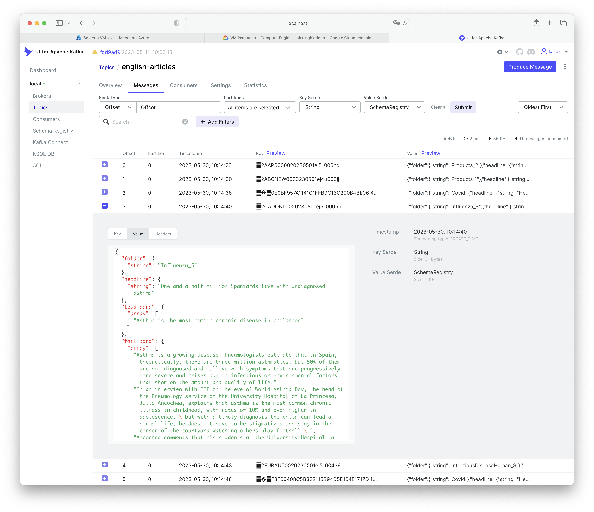

# NLP Pipeline

## [A. Objectives](#a-objectives)

The `NLP pipeline` aims to be *foundational* for `GPHIN NG prototype` in three different perspectives:
1. Plan, manage, and monitor development (and later deployment) by 
  - *define* complex workflows based on
  - *micro services* and 
  - *orchestrate* them with the underlying data streaming infrastructure,
2. Applying design patterns and best practices such as
  - *consume-process-produce* to build plug-and-play micro services and
  - *scale* them by Docker container and Kubernetes.
3. Quickly get traction with Natural Language Processing (NLP) to solve core problems in analyzing news articles and gradually increase accuracy, performance, and overall quality by:
  - to use (different) *open-source ML models* from (different) sources for example [huggingface.co](https://huggingface.co), [Stanford NLP Group](http://stanfordnlp.github.io/), etc to quickly provide *NLP capabilities*, 
  - to help *human analysts* to *interactively participate* in the workflow, 
  - to track *processing (machine-/human-made) decisions*, then later 
  - to *fine-tune the ML models* with (our) selected data to *increase accuracy*, as well as 
  - to *improve quality* based on *reinforcement learning* of processed data.

## [B. The problem context](#b-the-problem-context)

`GPHIN NG` aims at
- modernizing the current system, 
- developing much needed non-existing capabilites, and 
- processing 
  + large number (1M+) of news articles real-time
  + from hundreds or thousands online sources, and
  + support human analysts in their decisions
- performing analysis:
  + on multiple news streams,
  + with different content policies 
  + at various security levels, and
  + provide aggregation/filtering/transformation of news stream
  + into pre-define formats and destinations for processed content

The problem context in this version of the `NLP pipeline` represents a much smaller scope with simplified requirements in order to show how to solve the problems by using some design patterns together with a number of best practices.

### B.1. Factiva news articles

`Factiva` news articles are published by [`Dow Jones` professional service `Factiva`](https://www.dowjones.com/professional/factiva/). The articles are the results of  searches with pre-configured set of terms. The resulting articles are downloadble as `XML` files. 

`9` news articles were selected for this exercise. These are in `XML` format. Most of them are in English, some in Spanish, with some news are duplicates published by different sources. `4` and `6` are articles with *content duplicated as a whole*. They are reported by different news organizations but their contents are exact copies of each other.

| no. | source                                     | language | headline                                                                                | dup_id_cluster |     dup_content    | file_name                              |
|-----|--------------------------------------------|----------|-----------------------------------------------------------------------------------------|:--------------:|:------------------:|----------------------------------------|
| 1   | Australian Associated Press - General News | English  | Aust drug may stop brain cell death after trauma births                                 |                |                    | AAP0000020230501ej51006hd_FT.xml       |
| 2   | Australian Broadcasting Corporation News   | English  | Search for man missing in water along Victorian coast suspended, another man found dead |                | 2-full, 13-partial | ABCNEW0020230501ej4u000jj_FT.xml       |
| 3   | Diario de Cádiz Online                     | Spanish  | Un millón y medio de españoles malviven con un asma no diagnosticado                    |                |                    | CADONL0020230501ej510005p_FT.xml       |
| 4   | CBS - 3 WRBL                               | English  | Health officials warn irritating symptom may be returning with latest COVID strain      |                |   4-same, 6-same   | CBSGA00020230501ej4u0000j_FT.xml       |
| 5   | Europa Press - Servicio Autonómico         | Spanish  | CANTABRIA.-Coronavirus.- Cantabria tiene 10 personas hospitalizadas por Covid           |                |                    | EURAUT0020230501ej5100439_FT.xml       |
| 6   | FOX - 2 KTVI                               | English  | Health officials warn irritating symptom may be returning with latest COVID strain      |                |   4-same, 6-same   | FOXKTV0020230501ej4u0000m_FT.xml       |
| 7   | The Northlines                             | English  | Two IEDs, Grenade Launcher Seized From Terrorist Hideout In J&K's Ramban                |      7, 12     |                    | HTNLIN0020230501ej510005m_FT.xml       |
| 8   | Infobae                                    | Spanish  | Películas para ver esta noche en Disney+ Ecuador                                        |    8, 10, 11   | 8-full, 14-partial | INFOB00020230501ej51000c8_FT.xml       |
| 9   | KBS World News - English Edition           | English  | 5 Additional Mpox Cases Reported as Total Reaches 47                                    |                |                    | KBSWNE0020230501ej510008h_FT.xml       |

From these articles, 5 articles (`10`, `11`, `12`, `13`, and `14`) are *created* so they can represent:
- *duplicate articles's cluster* identified and indicated as duplicates by `Factiva` (column `dup_id_cluster` in the table below). For example articles `7` and `12` are identical by content and different by id, both were identified by `Factiva` as duplicates of each other. Similar situation with `8`, `10`, and `11`.
- articles with *partially duplicated content*, e.g. news that can be re-reported with some additional comments or information. `13` contains only a part of `2`, as well as `14` has a number of paragraphs from `8`.

| no. | source                                     | language | headline                                                                                | dup_id_cluster |     dup_content    | file_name                              |
|-----|--------------------------------------------|----------|-----------------------------------------------------------------------------------------|:--------------:|:------------------:|----------------------------------------|
| 1   | Australian Associated Press - General News | English  | Aust drug may stop brain cell death after trauma births                                 |                |                    | AAP0000020230501ej51006hd_FT.xml       |
| 2   | Australian Broadcasting Corporation News   | English  | Search for man missing in water along Victorian coast suspended, another man found dead |                | 2-full, 13-partial | ABCNEW0020230501ej4u000jj_FT.xml       |
| 3   | Diario de Cádiz Online                     | Spanish  | Un millón y medio de españoles malviven con un asma no diagnosticado                    |                |                    | CADONL0020230501ej510005p_FT.xml       |
| 4   | CBS - 3 WRBL                               | English  | Health officials warn irritating symptom may be returning with latest COVID strain      |                |   4-same, 6-same   | CBSGA00020230501ej4u0000j_FT.xml       |
| 5   | Europa Press - Servicio Autonómico         | Spanish  | CANTABRIA.-Coronavirus.- Cantabria tiene 10 personas hospitalizadas por Covid           |                |                    | EURAUT0020230501ej5100439_FT.xml       |
| 6   | FOX - 2 KTVI                               | English  | Health officials warn irritating symptom may be returning with latest COVID strain      |                |   4-same, 6-same   | FOXKTV0020230501ej4u0000m_FT.xml       |
| 7   | The Northlines                             | English  | Two IEDs, Grenade Launcher Seized From Terrorist Hideout In J&K's Ramban                |      7, 12     |                    | HTNLIN0020230501ej510005m_FT.xml       |
| 8   | Infobae                                    | Spanish  | Películas para ver esta noche en Disney+ Ecuador                                        |    8, 10, 11   | 8-full, 14-partial | INFOB00020230501ej51000c8_FT.xml       |
| 9   | KBS World News - English Edition           | English  | 5 Additional Mpox Cases Reported as Total Reaches 47                                    |                |                    | KBSWNE0020230501ej510008h_FT.xml       |
| 10  | Infobae                                    | Spanish  | Películas para ver esta noche en Disney+ Ecuador                                        |    8, 10, 11   |                    | vi-id-INFOB00020230501ej510003x.xml    |
| 11  | Infobae                                    | Spanish  | Películas para ver esta noche en Disney+ Ecuador                                        |    8, 10, 11   |                    | vi-id-INFOB00020230501ej5100049.xml    |
| 12  | Infobae                                    | Spanish  | Películas para ver esta noche en Disney+ Ecuador                                        |      7, 12     |                    | vi-id-PRTRIN0020230501ej51005eh.xml    |
| 13  | Australian Broadcasting Corporation News   | English  | Search for man missing in water along Victorian coast suspended, another man found dead |                | 2-full, 13-partial | vi-pc-ABCNEW0020230501ej4u000jj_FT.xml |
| 14  | Infobae                                    | Spanish  | Películas para ver esta noche en Disney+ Ecuador                                        |                | 8-full, 14-partial | vi-pc-INFOB00020230501ej51000c8.xml    |

### [B.2. Article analyzing process](#b2-articles-analyzing-process)

In order to analyze and decide if an article is of interest and can be published (deliver to interested parties), the following tasks have to be performed for each of the article:
1. find if it is one of the duplicate articles detected by `Factive`, allow only the first copy to be through,
2. detect if the article is written in a set of known languages, ignore it if it is in unknown languages that the system has no capability to translate into English, passes it through if it is already in English
3. perform machine translation if the article is in a recognized language, 
4. compare the article with a set of processed articles to find if it is similar to one of those,
5. filter out the article if it does not belong to topics of interests,
6. extract known named entities in order to categorize the article to see if it is relevant and can be passed along automatically for further processing, or need a decision from human analysts to do so, or just need to be ignored,
7. provide UI for human analysts to analyze, make decision, and record made decisions,
8. execute in-stream processing to re-route the article into live stream(s),
9. geo-locate the article,
10. summarize the article in short paragraphs for ease of consumption

## [C. Designing the workflow](#c-designing-the-workflow)

A `yaml`-based language, similar to [Google's workflow]() is created:
- to support creation of workflows using simple text editors, and later on by graphical user interface by `Pipelayer`, which is a `finite state machine` with a number of tasks communicate via `Kafka` topics and streams.
- to provide configuration details for the tasks, each of which is equivalent to a microservice containerizedd by `Docker`.
- currently for orchestrating the microservices, a [Docker Compose file](./docker-compose.yml) is used. Kubernetes support is planned in later stages.

The *manually drawn* diagram below is based on [workflow.yaml](./workflow.yaml), which is design to implement the [articles analyzing process](#b2-articles-analyzing-process).


### C.1. Transforming Factiva XML files into Kafka AVRO messages

For this exercise, it is assumed that the incoming articles will be placed in to a `Docker` volume accessible by `Kafka Connect` `Docker` container instances, which then load, transform, and emit them as `Kafka` messages into a topic named `factiva-articles` by a `FilePulse` connector specified in [create_factiva_connector.sh](./create_factiva_connector.sh). The transformed messages are emitted into the `factiva-articles` topic, as shown below.


<details>
<summary>Here is an example of a `Factiva` news article ... </summary>
<p>

```xml
<?xml version="1.0"?>
<DistDoc action="add" dist="dist_id" distdocver="05.2" an="AAP0000020230501ej51006hd" doctype="article">
  <SelectData>
    <FolderName id="302071787" rl="100">Products_2</FolderName>
  </SelectData>
  <SelectDedupData>
    <DupList cnt="0" dedupThreshold="OFF" id="302071787"/>
  </SelectDedupData>
  <ReplyItem lang="en">
    <BaseLang value="en" fid="la"/>
    <IPDocId fid="id">AAP0000020230501ej51006hd</IPDocId>
    <AccessionNo value="AAP0000020230501ej51006hd" fid="an"/>
    <Num value="721" fid="wc"/>
    <Date value="20230501" fid="pd"/>
    <SrcCode value="aap" fid="sc"/>
    <SrcName fid="sn">Australian Associated Press - General News</SrcName>
    <TruncRules>
      <XS value="29"/>
    </TruncRules>
    <Title fid="hl">
      <SectionName fid="se"/>
      <ColumnName fid="clm"/>
      <Headline fid="hd">
        <Para lang="en">Aust drug may stop brain cell death after trauma births</Para>
      </Headline>
    </Title>
    <Snippet>
      <Para>Corrects 6th paragraph - scope and status of clinical trials - based on updated
                advice from the company</Para>
      <Para>Katelyn Catanzariti</Para>
      <Para>SYDNEY, May 1 AAP - Six-year-old Franklin Taylor is a curious, intelligent boy who
                loves reading about outer space and...</Para>
    </Snippet>
    <Byline fid="by"/>
    <Credit fid="cr"/>
    <Copyright fid="cy">(c) 2023 Australian Associated Press Pty Ltd. All Rights Reserved </Copyright>
    <CodeSets>
      <CSet fid="co">
        <Code value="lyzior"/>
      </CSet>
      <CSet fid="in">
        <Code value="i257"/>
        <Code value="i951"/>
        <Code value="i2569"/>
      </CSet>
      <CSet fid="re">
        <Code value="sydney"/>
        <Code value="nswals"/>
        <Code value="apacz"/>
        <Code value="ausnz"/>
        <Code value="austr"/>
      </CSet>
      <CSet fid="ns">
        <Code value="ctrial"/>
        <Code value="c22"/>
        <Code value="c23"/>
        <Code value="ccat"/>
        <Code value="cexpro"/>
        <Code value="ncat"/>
        <Code value="nfact"/>
        <Code value="nfcpin"/>
      </CSet>
    </CodeSets>
  </ReplyItem>
  <MetadataPT>
    <DocData>
      <DocType value="article" fid="fmt"/>
      <IPDocId fid="id">AAP0000020230501ej51006hd</IPDocId>
      <AccessionNo value="AAP0000020230501ej51006hd" fid="an"/>
      <Num value="721" fid="wc"/>
      <Num value="3322" fid="cc"/>
      <Date value="20230501" fid="pd"/>
      <Date value="20230501" fid="upd"/>
      <Date value="20230501" fid="md"/>
      <Time value="080355" fid="upt"/>
      <Time value="080355" fid="mt"/>
      <BaseLang value="en" fid="la"/>
      <Editor value="" fid="rve"/>
      <RevisionNo value="0" fid="rvn"/>
    </DocData>
    <PubData>
      <Restrictor fid="rst">
        <Code value="FSPNORMAWS0500"/>
        <Code value="AAP"/>
        <Code value="fspFileId392802911"/>
        <Code value="FUT"/>
        <Code value="AUSNZ"/>
        <Code value="AUSTR"/>
        <Code value="CLNTALL"/>
        <Code value="EN"/>
        <Code value="SFAAP"/>
        <Code value="TBLT"/>
        <Code value="TCUWIR"/>
        <Code value="TGPW"/>
        <Code value="TNWR"/>
        <Code value="TRRSLN"/>
        <Code value="TSCH"/>
        <Code value="TTRK"/>
        <Code value="TWIR"/>
        <Code value="TWWW"/>
        <Code value="TYAS"/>
        <Code value="TYLA"/>
        <Code value="MPCV1M23M0B1"/>
        <Code value="MPCEnvPROD"/>
        <Code value="MPCDocHash30F6E13D77DE0DF2"/>
        <Code value="FSPTHINGFINDER"/>
        <Code value="FSP2YESCO"/>
        <Code value="FSP2YESCOCOM"/>
        <Code value="FSP2YESCOOC"/>
        <Code value="FSP2YESCOCOMOC"/>
        <Code value="FSP2YESCOORGOC"/>
        <Code value="FSPRBC"/>
        <Code value="FSPRBCIN"/>
        <Code value="FSP2YESIN"/>
        <Code value="FSPRBCNS"/>
        <Code value="FSP2YESNS"/>
        <Code value="FSPCATEGORIZER"/>
        <Code value="FSPCATRE"/>
        <Code value="FSP2YESRE"/>
        <Code value="FSP2NOPEOC"/>
        <Code value="FSPRBC648020"/>
        <Code value="FSPRBC648039"/>
        <Code value="FSPRBC800069"/>
        <Code value="MPCCL"/>
        <Code value="MPCJP"/>
        <Code value="MPCKW"/>
        <Code value="MPCKP"/>
        <Code value="MPCESRE"/>
        <Code value="MPCESIN"/>
        <Code value="MPCESNS"/>
        <Code value="FSP2AC"/>
        <Code value="FSP2ACRBCTERA"/>
        <Code value="FSP2ACRBCPRTY"/>
      </Restrictor>
      <IPId value="AAPIN" fid="ip"/>
      <PublisherN fid="pub">Australian Associated Press Pty Ltd</PublisherN>
      <AttribCode value="AAP" fid="atr"/>
      <SrcCode value="AAP" fid="sc"/>
      <SrcName fid="sn">Australian Associated Press - General News</SrcName>
      <Logo img="aapLogo.gif" link="" src="http://logos.factiva.com"/>
    </PubData>
    <CodeSets>
      <CSet fid="co">
        <Code value="lyzior">
          <CodeD index="no" lang="en">Argenica Therapeutics Ltd.</CodeD>
          <CodeI org="thingfinder" action="add">
            <CodeA name="db" value="ptf--aboutCo-00001170-20230430-154622.dictionary"/>
          </CodeI>
          <CodeI org="validation" action="add">
            <CodeA name="db" value="pedv---00000035-20230430-224111"/>
            <CodeA name="status" value="active"/>
          </CodeI>
        </Code>
      </CSet>
      <CSet fid="in">
        <Code value="i257">
          <CodeD index="no" lang="en">Pharmaceuticals</CodeD>
          <CodeI org="rbc" action="add">
            <CodeA name="db" value="prbc---00004614-20230501-003549"/>
            <CodeA name="rule" value="648020"/>
          </CodeI>
          <CodeI org="validation" action="add">
            <CodeA name="db" value="pedv---00000035-20230430-224111"/>
            <CodeA name="status" value="active"/>
          </CodeI>
          <CodeI org="hierarchy" action="add">
            <CodeA name="db" value="pedv---00000035-20230430-224111"/>
            <CodeA name="nodelevel" value="1"/>
          </CodeI>
        </Code>
        <Code value="i951">
          <CodeD index="no" lang="en">Healthcare/Life Sciences</CodeD>
          <CodeI org="expansion" action="add">
            <CodeA name="db" value="pedv---00000035-20230430-224111"/>
            <CodeA name="root" value="in:i2569"/>
          </CodeI>
          <CodeI org="validation" action="add">
            <CodeA name="db" value="pedv---00000035-20230430-224111"/>
            <CodeA name="status" value="active"/>
          </CodeI>
          <CodeI org="hierarchy" action="add">
            <CodeA name="db" value="pedv---00000035-20230430-224111"/>
            <CodeA name="nodelevel" value="0"/>
          </CodeI>
        </Code>
        <Code value="i2569">
          <CodeD index="no" lang="en">Biotechnology Services</CodeD>
          <CodeI org="expansion" action="add">
            <CodeA name="db" value="pedv---00000035-20230430-224111"/>
            <CodeA name="root" value="co:lyzior"/>
          </CodeI>
          <CodeI org="validation" action="add">
            <CodeA name="db" value="pedv---00000035-20230430-224111"/>
            <CodeA name="status" value="active"/>
          </CodeI>
          <CodeI org="hierarchy" action="add">
            <CodeA name="db" value="pedv---00000035-20230430-224111"/>
            <CodeA name="nodelevel" value="1"/>
          </CodeI>
        </Code>
      </CSet>
      <CSet fid="re">
        <Code value="sydney">
          <CodeD index="no" lang="en">Sydney</CodeD>
          <CodeI org="categoriser" action="add">
            <CodeA name="db" value="es-EnglishRE_en_20230425180959"/>
            <CodeA name="es_score" value="120"/>
          </CodeI>
          <CodeI org="validation" action="add">
            <CodeA name="db" value="pedv---00000035-20230430-224111"/>
            <CodeA name="status" value="active"/>
          </CodeI>
          <CodeI org="hierarchy" action="add">
            <CodeA name="db" value="pedv---00000035-20230430-224111"/>
            <CodeA name="nodelevel" value="3"/>
            <CodeA name="nodelevel" value="4"/>
          </CodeI>
        </Code>
        <Code value="nswals">
          <CodeD index="no" lang="en">New South Wales</CodeD>
          <CodeI org="categoriser" action="add">
            <CodeA name="db" value="es-EnglishRE_en_20230425180959"/>
            <CodeA name="es_score" value="80"/>
          </CodeI>
          <CodeI org="expansion" action="add">
            <CodeA name="db" value="pedv---00000035-20230430-224111"/>
            <CodeA name="root" value="re:sydney"/>
          </CodeI>
          <CodeI org="validation" action="add">
            <CodeA name="db" value="pedv---00000035-20230430-224111"/>
            <CodeA name="status" value="active"/>
          </CodeI>
          <CodeI org="hierarchy" action="add">
            <CodeA name="db" value="pedv---00000035-20230430-224111"/>
            <CodeA name="nodelevel" value="2"/>
            <CodeA name="nodelevel" value="3"/>
          </CodeI>
        </Code>
        <Code value="apacz">
          <CodeD index="no" lang="en">Asia Pacific</CodeD>
          <CodeI org="expansion" action="add">
            <CodeA name="db" value="pedv---00000035-20230430-224111"/>
            <CodeA name="root" value="re:nswals"/>
            <CodeA name="root" value="re:sydney"/>
          </CodeI>
          <CodeI org="validation" action="add">
            <CodeA name="db" value="pedv---00000035-20230430-224111"/>
            <CodeA name="status" value="active"/>
          </CodeI>
          <CodeI org="hierarchy" action="add">
            <CodeA name="db" value="pedv---00000035-20230430-224111"/>
            <CodeA name="nodelevel" value="0"/>
          </CodeI>
        </Code>
        <Code value="ausnz">
          <CodeD index="no" lang="en">Australia/Oceania</CodeD>
          <CodeI org="expansion" action="add">
            <CodeA name="db" value="pedv---00000035-20230430-224111"/>
            <CodeA name="root" value="re:nswals"/>
            <CodeA name="root" value="re:sydney"/>
          </CodeI>
          <CodeI org="validation" action="add">
            <CodeA name="db" value="pedv---00000035-20230430-224111"/>
            <CodeA name="status" value="active"/>
          </CodeI>
          <CodeI org="hierarchy" action="add">
            <CodeA name="db" value="pedv---00000035-20230430-224111"/>
            <CodeA name="nodelevel" value="0"/>
            <CodeA name="nodelevel" value="1"/>
          </CodeI>
        </Code>
        <Code value="austr">
          <CodeD index="no" lang="en">Australia</CodeD>
          <CodeI org="expansion" action="add">
            <CodeA name="db" value="pedv---00000035-20230430-224111"/>
            <CodeA name="root" value="re:nswals"/>
            <CodeA name="root" value="re:sydney"/>
          </CodeI>
          <CodeI org="validation" action="add">
            <CodeA name="db" value="pedv---00000035-20230430-224111"/>
            <CodeA name="status" value="active"/>
          </CodeI>
          <CodeI org="hierarchy" action="add">
            <CodeA name="db" value="pedv---00000035-20230430-224111"/>
            <CodeA name="nodelevel" value="1"/>
            <CodeA name="nodelevel" value="2"/>
          </CodeI>
        </Code>
      </CSet>
      <CSet fid="ns">
        <Code value="ctrial">
          <CodeD index="no" lang="en">New Product/Service Testing</CodeD>
          <CodeI org="rbc" action="add">
            <CodeA name="db" value="prbc---00004614-20230501-003549"/>
            <CodeA name="rule" value="648039"/>
            <CodeA name="rule" value="800069"/>
          </CodeI>
          <CodeI org="validation" action="add">
            <CodeA name="db" value="pedv---00000035-20230430-224111"/>
            <CodeA name="status" value="active"/>
          </CodeI>
          <CodeI org="hierarchy" action="add">
            <CodeA name="db" value="pedv---00000035-20230430-224111"/>
            <CodeA name="nodelevel" value="2"/>
            <CodeA name="nodelevel" value="3"/>
          </CodeI>
        </Code>
        <Code value="c22">
          <CodeD index="no" lang="en">New Products/Services</CodeD>
          <CodeI org="expansion" action="add">
            <CodeA name="db" value="pedv---00000035-20230430-224111"/>
            <CodeA name="root" value="ns:ctrial"/>
          </CodeI>
          <CodeI org="validation" action="add">
            <CodeA name="db" value="pedv---00000035-20230430-224111"/>
            <CodeA name="status" value="active"/>
          </CodeI>
          <CodeI org="hierarchy" action="add">
            <CodeA name="db" value="pedv---00000035-20230430-224111"/>
            <CodeA name="nodelevel" value="2"/>
          </CodeI>
        </Code>
        <Code value="c23">
          <CodeD index="no" lang="en">Research/Development</CodeD>
          <CodeI org="expansion" action="add">
            <CodeA name="db" value="pedv---00000035-20230430-224111"/>
            <CodeA name="root" value="ns:ctrial"/>
          </CodeI>
          <CodeI org="validation" action="add">
            <CodeA name="db" value="pedv---00000035-20230430-224111"/>
            <CodeA name="status" value="active"/>
          </CodeI>
          <CodeI org="hierarchy" action="add">
            <CodeA name="db" value="pedv---00000035-20230430-224111"/>
            <CodeA name="nodelevel" value="1"/>
          </CodeI>
        </Code>
        <Code value="ccat">
          <CodeD index="no" lang="en">Corporate/Industrial News</CodeD>
          <CodeI org="expansion" action="add">
            <CodeA name="db" value="pedv---00000035-20230430-224111"/>
            <CodeA name="root" value="ns:ctrial"/>
          </CodeI>
          <CodeI org="validation" action="add">
            <CodeA name="db" value="pedv---00000035-20230430-224111"/>
            <CodeA name="status" value="active"/>
          </CodeI>
          <CodeI org="hierarchy" action="add">
            <CodeA name="db" value="pedv---00000035-20230430-224111"/>
            <CodeA name="nodelevel" value="0"/>
          </CodeI>
        </Code>
        <Code value="cexpro">
          <CodeD index="no" lang="en">Products/Services</CodeD>
          <CodeI org="expansion" action="add">
            <CodeA name="db" value="pedv---00000035-20230430-224111"/>
            <CodeA name="root" value="ns:ctrial"/>
          </CodeI>
          <CodeI org="validation" action="add">
            <CodeA name="db" value="pedv---00000035-20230430-224111"/>
            <CodeA name="status" value="active"/>
          </CodeI>
          <CodeI org="hierarchy" action="add">
            <CodeA name="db" value="pedv---00000035-20230430-224111"/>
            <CodeA name="nodelevel" value="1"/>
          </CodeI>
        </Code>
        <Code value="ncat">
          <CodeD index="no" lang="en">Content Types</CodeD>
          <CodeI org="expansion" action="add">
            <CodeA name="db" value="pedv---00000035-20230430-224111"/>
            <CodeA name="root" value="ns:ctrial"/>
          </CodeI>
          <CodeI org="validation" action="add">
            <CodeA name="db" value="pedv---00000035-20230430-224111"/>
            <CodeA name="status" value="active"/>
          </CodeI>
        </Code>
        <Code value="nfact">
          <CodeD index="no" lang="en">Factiva Filters</CodeD>
          <CodeI org="expansion" action="add">
            <CodeA name="db" value="pedv---00000035-20230430-224111"/>
            <CodeA name="root" value="ns:ctrial"/>
          </CodeI>
          <CodeI org="validation" action="add">
            <CodeA name="db" value="pedv---00000035-20230430-224111"/>
            <CodeA name="status" value="active"/>
          </CodeI>
        </Code>
        <Code value="nfcpin">
          <CodeD index="no" lang="en">C&amp;E Industry News Filter</CodeD>
          <CodeI org="expansion" action="add">
            <CodeA name="db" value="pedv---00000035-20230430-224111"/>
            <CodeA name="root" value="ns:ctrial"/>
          </CodeI>
          <CodeI org="validation" action="add">
            <CodeA name="db" value="pedv---00000035-20230430-224111"/>
            <CodeA name="status" value="active"/>
          </CodeI>
        </Code>
      </CSet>
    </CodeSets>
    <DescTPC fid="de">
      <DescField fid="ipcns">Brain </DescField>
    </DescTPC>
  </MetadataPT>
  <ArchiveDoc xml:space="preserve">
    <Article markup="pp0" lang="en" index="field">
      <HandL fid="hlp">
        <Title fid="hl">
          <SectionName fid="se" index="field"/>
          <ColumnName fid="clm" index="field"/>
          <Headline fid="hd">
            <Para lang="en">Aust drug may stop brain cell death after trauma births</Para>
          </Headline>
        </Title>
        <LeadPara fid="lp">
          <Para>Corrects 6th paragraph - scope and status of clinical trials - based on updated advice from the company</Para>
          <Para>Katelyn Catanzariti</Para>
        </LeadPara>
      </HandL>
      <TailParas fid="td">
        <Para>SYDNEY, May 1 AAP - Six-year-old Franklin Taylor is a curious, intelligent boy who loves reading about outer space and going for rides on his bicycle.</Para>
        <Para>But his bicycle has had to be specially adapted; while he can read, he can't turn the pages of a book; and he cannot talk clearly so he communicates through with a specially designed keyboard.</Para>
        <Para>Franklin suffered ahypoxic-ischaemic encephalopathy (HIE) injury at birth that has left him severely disabled, requiring around-the-clock care for the rest of his life.</Para>
        <Para>But an Australian-developed breakthrough drug could offer children who suffer the same injury as Franklin a 70 per cent better chance at a normal life.</Para>
        <Para>Australian biotech company Argenica Therapeutics? potentially world-first neuroprotective drug is administered to protect brain cells at a critical time point to prevent brain tissue dying.</Para>
        <Para>Developed in collaboration with the Perron Institute for Neurological and Translational Science and the University of Western Australia, the drug is in clinical trials involving humans, and will soon be tested on stroke patients.</Para>
        <Para>After another round of animal testing, it is hoped it can be used in neonatal treatment to prevent life-long symptoms.</Para>
        <Para>During Franklin's otherwise textbook birth - on his due date, six years ago on Anzac Day - he became distressed in the final stage of delivery and, for a short while, his brain was deprived of blood and oxygen.</Para>
        <Para>Franklin's mother Sarah-Ann Taylor says their world stopped as doctors hit the 'code blue' button in the room and "a thousand" people seemed to descend. He was resuscitated and sent to the NICU and, for a little while, they thought the worst had been averted.</Para>
        <Para>"Initially we thought he was going to pull through pretty well. They didn't seem too concerned," Ms Taylor, from Jannali in Sydney's south, told AAP.</Para>
        <Para>"But as time went on, it became clear that he wasn't recovering in the way they expected.</Para>
        <Para>"It was a few days later that the 'HIE' term got mentioned. Ioverheard the doctor using that term. I Googled it and then shut my phone immediately."</Para>
        <Para>An MRI revealed Franklin had indeed suffered an HIE injury, which meant that while he had no oxygen and blood going to his brain, brain cells had begun to die.</Para>
        <Para>In HIE injuries, even when blood and oxygen is restored to the brain, there comes a second wave of impact as the body tries to "kill off" any cells contaminated by the initial deprivation.</Para>
        <Para>"We can't really do much with that initial injury, but that second injury happens hours to days after and ... itis almost the bigger injury," a neuroscientist and Argenica CEODr Liz Dallimore explains.</Para>
        <Para>"After the initial brain cell death, you get an influx into the cells of all these toxins, which causes the cells to implode on themselves which sets off a second wave of cell deaths.</Para>
        <Para>"That's what we're looking to prevent with this drug."</Para>
        <Para>The new drug would be administered immediately after the initial injury and effectively "hibernate" the brain, reducing the impact of the second wave of brain cell death.</Para>
        <Para>The latest research specifically shows a staggering 70 per cent prolonged reduction in brain tissue death.</Para>
        <Para>It is also 40 per cent more effective than the current best standard of care, which is hypothermia treatment - where the newborn's body or head is kept cool to try and halt the brain tissue death.</Para>
        <Para>As well as being less effective, hypothermia is only used in 30 per cent of cases as it has a very strict eligibility criteria, whereas the new drug might be able to be usedprophylactically after any distressed birth.</Para>
        <Para>"There's obviously still a way to go, but the data is obviously pointing in the right direction," Dr Dallimore tells AAP.</Para>
        <Para>Ms Taylor says the drug would be "absolutely life changing" for a family facing the same medical ordeal as hers.</Para>
        <Para>"They're looking at 70 per cent reduction in brain cell death - if Franklin had 70 per cent more brain capacity, I can only imagine what he would be capable of," she says.</Para>
        <Para>AAP ldj/KC/DJT/dm</Para>
      </TailParas>
      <Byline fid="by" index="field"/>
      <Credit fid="cr" index="field"/>
      <Contact fid="ct" index="field"/>
      <Notes fid="rf" index="field"/>
      <Art fid="art" index="field"/>
      <Copyright fid="cy" index="field">(c) 2023 Australian Associated Press Pty Ltd. All Rights Reserved </Copyright>
    </Article>
  </ArchiveDoc>
  <AdocTOC adoctype="article">
    <Item size="0" ref="distdoc:archive/ArchiveDoc::Article" type="arttext"/>
    <Item size="0" ref="distdoc:archive/InvertText" type="invtext"/>
  </AdocTOC>
</DistDoc>
```

</p>
</details>

For this exercise, to extract information from the article above, a number of `XML` elements with specific `xpath` expressions are choosen, together they rougly represent the article. 

<details>
<summary>Click to see the *simplified* version of the article above ... </summary>
<p>

```xml
<?xml version="1.0"?>
<DistDoc action="add" dist="dist_id" distdocver="05.2" an="AAP0000020230501ej51006hd" doctype="article">
  <SelectData>
    <FolderName id="302071787" rl="100">Products_2</FolderName>
  </SelectData>
  <SelectDedupData>
    <DupList cnt="0" dedupThreshold="OFF" id="302071787"/>
  </SelectDedupData>
  <MetadataPT>
    <DocData>
      <IPDocId fid="id">AAP0000020230501ej51006hd</IPDocId>
    </DocData>
  </MetadataPT>
  <ArchiveDoc xml:space="preserve">
    <Article markup="pp0" lang="en" index="field">
      <HandL fid="hlp">
        <Title fid="hl">
          <Headline fid="hd">
            <Para lang="en">Aust drug may stop brain cell death after trauma births</Para>
          </Headline>
        </Title>
        <LeadPara fid="lp">
          <Para>Corrects 6th paragraph - scope and status of clinical trials - based on updated advice from the company</Para>
          <Para>Katelyn Catanzariti</Para>
        </LeadPara>
      </HandL>
      <TailParas fid="td">
        <Para>SYDNEY, May 1 AAP - Six-year-old Franklin Taylor is a curious, intelligent boy who loves reading about outer space and going for rides on his bicycle.</Para>
        <Para>But his bicycle has had to be specially adapted; while he can read, he can't turn the pages of a book; and he cannot talk clearly so he communicates through with a specially designed keyboard.</Para>
        <Para>Franklin suffered ahypoxic-ischaemic encephalopathy (HIE) injury at birth that has left him severely disabled, requiring around-the-clock care for the rest of his life.</Para>
        <Para>But an Australian-developed breakthrough drug could offer children who suffer the same injury as Franklin a 70 per cent better chance at a normal life.</Para>
        <Para>Australian biotech company Argenica Therapeutics? potentially world-first neuroprotective drug is administered to protect brain cells at a critical time point to prevent brain tissue dying.</Para>
        <Para>Developed in collaboration with the Perron Institute for Neurological and Translational Science and the University of Western Australia, the drug is in clinical trials involving humans, and will soon be tested on stroke patients.</Para>
        <Para>After another round of animal testing, it is hoped it can be used in neonatal treatment to prevent life-long symptoms.</Para>
        <Para>During Franklin's otherwise textbook birth - on his due date, six years ago on Anzac Day - he became distressed in the final stage of delivery and, for a short while, his brain was deprived of blood and oxygen.</Para>
        <Para>Franklin's mother Sarah-Ann Taylor says their world stopped as doctors hit the 'code blue' button in the room and "a thousand" people seemed to descend. He was resuscitated and sent to the NICU and, for a little while, they thought the worst had been averted.</Para>
        <Para>"Initially we thought he was going to pull through pretty well. They didn't seem too concerned," Ms Taylor, from Jannali in Sydney's south, told AAP.</Para>
        <Para>"But as time went on, it became clear that he wasn't recovering in the way they expected.</Para>
        <Para>"It was a few days later that the 'HIE' term got mentioned. Ioverheard the doctor using that term. I Googled it and then shut my phone immediately."</Para>
        <Para>An MRI revealed Franklin had indeed suffered an HIE injury, which meant that while he had no oxygen and blood going to his brain, brain cells had begun to die.</Para>
        <Para>In HIE injuries, even when blood and oxygen is restored to the brain, there comes a second wave of impact as the body tries to "kill off" any cells contaminated by the initial deprivation.</Para>
        <Para>"We can't really do much with that initial injury, but that second injury happens hours to days after and ... itis almost the bigger injury," a neuroscientist and Argenica CEODr Liz Dallimore explains.</Para>
        <Para>"After the initial brain cell death, you get an influx into the cells of all these toxins, which causes the cells to implode on themselves which sets off a second wave of cell deaths.</Para>
        <Para>"That's what we're looking to prevent with this drug."</Para>
        <Para>The new drug would be administered immediately after the initial injury and effectively "hibernate" the brain, reducing the impact of the second wave of brain cell death.</Para>
        <Para>The latest research specifically shows a staggering 70 per cent prolonged reduction in brain tissue death.</Para>
        <Para>It is also 40 per cent more effective than the current best standard of care, which is hypothermia treatment - where the newborn's body or head is kept cool to try and halt the brain tissue death.</Para>
        <Para>As well as being less effective, hypothermia is only used in 30 per cent of cases as it has a very strict eligibility criteria, whereas the new drug might be able to be usedprophylactically after any distressed birth.</Para>
        <Para>"There's obviously still a way to go, but the data is obviously pointing in the right direction," Dr Dallimore tells AAP.</Para>
        <Para>Ms Taylor says the drug would be "absolutely life changing" for a family facing the same medical ordeal as hers.</Para>
        <Para>"They're looking at 70 per cent reduction in brain cell death - if Franklin had 70 per cent more brain capacity, I can only imagine what he would be capable of," she says.</Para>
        <Para>AAP ldj/KC/DJT/dm</Para>
      </TailParas>
    </Article>
  </ArchiveDoc>
</DistDoc>
```

</p>
</details>

Here are the summary of the chosen `xpath` expressions, the corresponding fields when the XML message is converted into an `AVRO` message, and some examples to illustrate the data in those fields.

| xpath                                            | avro_fields | type          | example                                                                                                                                                                                                                                                                                                                                                                                                                                                                                 |
|--------------------------------------------------|-------------|---------------|-----------------------------------------------------------------------------------------------------------------------------------------------------------------------------------------------------------------------------------------------------------------------------------------------------------------------------------------------------------------------------------------------------------------------------------------------------------------------------------------|
| /DistDoc/MetadataPT/DocData/IPDocId              | doc_id      | STRING        | "AAP0000020230501ej51006hd"                                                                                                                                                                                                                                                                                                                                                                                                                                                             |
| /DistDoc/SelectDedupData/DupList                 | dup_id_list | ARRAY[STRING] | ["INFOB00020230501ej510003x","INFOB00020230501ej5100049","INFOB00020230501ej510006n","INFOB00020230501ej510009g","INFOB00020230501ej510009n"]                                                                                                                                                                                                                                                                                                                                           |
| /DistDoc/SelectData/FolderName                   | folder      | STRING        | "OtherDiseases"                                                                                                                                                                                                                                                                                                                                                                                                                                                                         |
| /DistDoc/ArchiveDoc/Article/HandL/Title/Headline | headline    | STRING        | "Películas para ver esta noche en Disney+ Ecuador"                                                                                                                                                                                                                                                                                                                                                                                                                                      |
| /DistDoc/ArchiveDoc/Article/HandL/LeadPara       | lead_para   | ARRAY[STRING] | ["South Korea has confirmed five more cases of mpox as the country's total rises to 47.", "According to the Korea Disease Control and Prevention Agency on Monday, three patients are from Seoul, and one each from South Chungcheong Province and Busan, none of whom has traveled overseas within the last three weeks, suggesting local transmissions."]                                                                                                                             |
| /DistDoc/ArchiveDoc/Article/HandL/TailPara       | tail_para   | ARRAY[STRING] | ["Although the first case of mpox in South Korea reported last June and four more cases through March were all linked with overseas travel, the recent dozens of infections since early April are believed to be infections transmitted in the country.", "KDCA chief Jee Young-mee offered assurances that mpox could be sufficiently managed with the current quarantine response capacity and urged those exhibiting symptoms to visit their nearest medical facility for testing."] |

These are used as `AVRO` fields of the incoming messages. The value schema for the processed messages is defined inline in[create_factiva_connector.sh](./create_factiva_connector.sh), following [guidelines of Defining Connect Record Schema](https://streamthoughts.github.io/kafka-connect-file-pulse/docs/developer-guide/configuration/#defining-connect-record-schema). 

```json
{ 
	"name": "factiva_article_value", 
	"type": "STRUCT", 
	"fieldSchemas": { 
		"doc_id": {"type":"STRING", "isOptional":false}, 
		"dup_id_list": {"type":"ARRAY", "isOptional":true, "valueSchema": {"type": "STRING"}},
		"folder": {"type":"STRING", "isOptional":true},
		"headline": {"type":"STRING", "isOptional":true}, 
		"lead_para": {"type":"ARRAY", "isOptional":true, "valueSchema": {"type": "STRING"}}, 
		"tail_para":{"type":"ARRAY", "isOptional":true, "valueSchema": {"type": "STRING"}}
	}
}
```

`Kafka` automatically converts that into [`factiva-article-value.avsc`](./conf/avro/factiva-article-value.avsc) and keeps it in `Schema Registry` for further processing.

```json
{
	"type": "record",
	"name": "factiva_article_value",
	"fields": [
		{ "name": "doc_id", "type": "string" },
		{ "name": "dup_id_list",
			"type": [
				"null",
				{
					"type": "array",
					"items": "string"
				}
			],
			"default": null
		},
		{
			"name": "folder",
			"type": [
				"null",
				"string"
			],
			"default": null
		},
		{
			"name": "headline",
			"type": [
				"null",
				"string"
			],
			"default": null
		},
		{
			"name": "lead_para",
			"type": [
				"null",
				{
					"type": "array",
					"items": "string"
				}
			],
			"default": null
		},
		{
			"name": "tail_para",
			"type": [
				"null",
				{
					"type": "array",
					"items": "string"
				}
			],
			"default": null
		}
	],
	"connect.name": "factiva_article_value"
}
```

<details>
<summary>Click to see an example of a message in the topic factiva-articles ... </summary>
<p>


</p>
</details>

### C.2. Deduplication by identifiers

This task consumes messages from the `factiva-articles` topic, find if it is one of the duplicate articles detected by `Factive`, allow only the first copy to be through, and let those to be produced into `unique-article` topic.


`Factiva` indicates duplicates of messages based on the content of `SelectDedupData` `XML` tag. For a message where its `SelectDedupData` tag is not empty (or the attribute `cnt` of that tag is larger than 0) then it is a list of ids of messages that contains the exact same news as the message.

In the example below the message with id `PRTRIN0020230501ej51005eh` is *virtually identical* to the message with id `HTNLIN0020230501ej510005m`.
```xml
<?xml version="1.0"?>
<DistDoc action="add" dist="dist_id" distdocver="05.2" an="HTNLIN0020230501ej510005m" doctype="article">
  ...
  <SelectDedupData>
    <DupList cnt="1" dedupThreshold="VIRTUALLYIDENTICAL" id="301121937">
            PRTRIN0020230501ej51005eh</DupList>
  </SelectDedupData>
  ...
</DistDoc>  
```

In the example below any of five messages with ids of `INFOB00020230501ej510003x`, `INFOB00020230501ej5100049`, `INFOB00020230501ej510006n`, `INFOB00020230501ej510009g`, `INFOB00020230501ej510009n` is *virtually identical* to the message with id `INFOB00020230501ej51000c8`.
```xml
<?xml version="1.0"?>
<DistDoc action="add" dist="dist_id" distdocver="05.2" an="INFOB00020230501ej51000c8" doctype="article">
  ...
  <SelectDedupData>
    <DupList cnt="5" dedupThreshold="VIRTUALLYIDENTICAL" id="301125448">
            INFOB00020230501ej510003x,INFOB00020230501ej5100049,INFOB00020230501ej510006n,INFOB00020230501ej510009g,INFOB00020230501ej510009n</DupList>
  </SelectDedupData>
  ...
</DistDoc>  
```

The content of the `SelectDedupData` tag of each `XML` message is transformed in to the `dup_id_list` field of the `AVRO` message (in the `factiva-articles` topic). Here's an example:

```json
  {
    "doc_id": "INFOB00020230501ej51000c8",
    ...
    "dup_id_list": ["INFOB00020230501ej510003x", "INFOB00020230501ej5100049", "INFOB00020230501ej510006n", "INFOB00020230501ej510009g", "INFOB00020230501ej510009n"]
    ...
  }
```

In order to keep track of ids of messages encoutered first time or ids of messages declared as duplicates, a table named `articles` is created in the database `postgres` in a `PostgreSQL` instance, which basically has a single column for the identifiers of the articles.
```bash
docker exec -it postgres psql -U postgres -d postgres -c 'CREATE TABLE IF NOT EXISTS articles(doc_id TEXT PRIMARY KEY);' 
```

The `Kafka` worker [`dedup_by_id`](./src/dedup_by_id.py) deduplicates the messages by using this table:
- if the `dup_id_list`  field is not present and or is an empty array, meaning the message has no duplicates or it is the first reported one (so there are no such news reported by any other source therefore `Factiva` considers it as unique. 
  + The `doc_id` of the message is *inserted` into the table.
  + `dedup_by_id` cleans up the message fields by removing preceeding and trailing whitespaces (including linefeeds) and `HTML-unescaped` field contents. Embedded links inside the message are discarded to prevent ad contents being mixed with the news. It create an `AVRO` key from `doc_id` field. By doing so later in-stream processing can be performed on this key.
  + Then it passes the message so that it can be produced into the `unique-articles` topic.
- if the `dup_id_list` is a non-empty array, then a `lookup` in the `articles` table is performed to see if the id of the message or any id in the `dup_id_list` already in the table.
  + if there is at least one found, then the message is a duplicate because itself or any of its *companions* in the `dup_id_list` was already processed. No message can be passed to the `unique-articles` topic.
  + if the lookup returns empty, then the id of the message and all ids in the `dup_id_list` are inserted into the table to prevent later comers with same id. The message is processed (as above) and then passed to the `unique-articles` topic.

<details>
<summary>Click to see an example of unique message ... </summary>
<p>

```bash
docker compose logs dedup_by_id -f

dedup_by_id  | ->- [#9] [None] {'doc_id': 'KBSWNE0020230501ej510008h', 'dup_id_list': ['[]'], 'folder': 'OtherDiseases', 'headline': '5 Additional Mpox Cases Reported as Total Reaches 47', 'lead_para': ["South Korea has confirmed five more cases of mpox as the country's total rises to 47.", 'According to the Korea Disease Control and Prevention Agency on Monday, three patients are from Seoul, and one each from South Chungcheong Province and Busan, none of whom has traveled overseas within the last three weeks, suggesting local transmissions.'], 'tail_para': ['Although the first case of mpox in South Korea reported last June and four more cases through March were all linked with overseas travel, the recent dozens of infections since early April are believed to be infections transmitted in the country.', 'KDCA chief Jee Young-mee offered assurances that mpox could be sufficiently managed with the current quarantine response capacity and urged those exhibiting symptoms to visit their nearest medical facility for testing.']}
dedup_by_id  | --> [#9] [None] [{'doc_id': 'KBSWNE0020230501ej510008h'}] {'folder': 'OtherDiseases', 'headline': '5 Additional Mpox Cases Reported as Total Reaches 47', 'lead_para': ["South Korea has confirmed five more cases of mpox as the country's total rises to 47.", 'According to the Korea Disease Control and Prevention Agency on Monday, three patients are from Seoul, and one each from South Chungcheong Province and Busan, none of whom has traveled overseas within the last three weeks, suggesting local transmissions.'], 'tail_para': ['Although the first case of mpox in South Korea reported last June and four more cases through March were all linked with overseas travel, the recent dozens of infections since early April are believed to be infections transmitted in the country.', 'KDCA chief Jee Young-mee offered assurances that mpox could be sufficiently managed with the current quarantine response capacity and urged those exhibiting symptoms to visit their nearest medical facility for testing.']}
dedup_by_id  | User record b'\x00\x00\x00\x00\x022KBSWNE0020230501ej510008h' successfully produced to unique-articles [0] at offset 8
```

Note the last two lines in the log:
- the content of `AVRO` key and value of the message that was produced to the default outgoing topic,
- the offset (start at `0`) of the message in the outgoing topic is `8`


</p>
</details>

<details>
<summary>Click to see an example of duplicate message ... </summary>
<p>

```bash
docker compose logs dedup_by_id -f

dedup_by_id  | ->- [#12] [None] {'doc_id': 'vi-id-PRTRIN0020230501ej51005eh', 'dup_id_list': ['HTNLIN0020230501ej510005m'], 'folder': 'ChemicalNucRad', 'headline': "Two IEDs, Grenade Launcher Seized From Terrorist Hideout In J&K's Ramban", 'lead_para': ["JAMMU, May 1 -- A terrorist hideout was busted in a remote forest area in Jammu and Kashmir's Ramban district with the recovery of arms and explosives including two improvised explosive devices (IEDs) and a grenade launcher, police said on Monday.The hideout was busted on specific information about its location in the far-flung hilly and forested area of Burzalla in Khari tehsil, a police spokesperson said. The recoveries made from the hideout included an Under Barrel Grenade launcher (UBGL), two rifle grenades, a wireless set with an antenna, two IEDs with wire, a detonator, 17 rounds of AK-47 rifle, seven rounds of 9 mm pistol, one bottle containing some liquid, a 'Khakhi' jacket and a pair of black leather shoes, the spokesperson said.No one was arrested during the search operation, he said, adding police have registered a case under relevant sections of law and further investigation is on.", 'Published by HT Digital Content Services with permission from The Northlines.'], 'tail_para': None}
dedup_by_id  | --> [#12] [None] [None] None
```

Note the last linesin the log:
- no value for either topic, key, nor value for outgoing message

</p>
</details>

Here is how the `dedup_by_id` is configured to function as described above:

```yaml
        - dedup_by_id:
            type: kafka-worker
            consumer:
                bootstrap_servers: broker:${BROKER_INTERNAL_PORT}
                schema_registry: http://schema-registry:${SCHEMA_REGISTRY_PORT}
                poll_time: 1.0
                auto_offset_reset: earliest
                consumer_group_id: dedup_by_id
                source_topic:
                    - factiva-articles:
                        avro_val_schema_file: factiva-article-value.avsc
            worker:
                postgres:
                    host: postgres
                    port: ${POSTGRES_PORT}
                    user: ${POSTGRES_USER}
                    pass: ${POSTGRES_PASSWORD}
                    database: postgres
            producer:
                bootstrap_servers: broker:${BROKER_INTERNAL_PORT}
                schema_registry: http://schema-registry:${SCHEMA_REGISTRY_PORT}
                poll_time: 0.0
                destination_topic:
                    - unique-articles:
                        avro_key_schema_file: unique-article-key.avsc
                        avro_val_schema_file: unique-article-val.avsc
            next: language_detector
```

### C.3. Detect language of the content

This task consumes messages from the `unique-articles` topic, detect 
- if the article is written in English, then passes it into the `english-articles` topic,
- if it is not an English one, but is written in a set of known languages, then passes it into the `foreign-articles` topic,
- otherwise passes it into `unknown-language-articles` topic.


`language_detector` uses the content of headline and leading paragraphs in `heading` and `lead_para`, respectively.

```json
  {
    "doc_id": "CADONL0020230501ej510005p",
    ...
    "headline": "Un millón y medio de españoles malviven con un asma no diagnosticado",
    "lead_para": ["El asma es la enfermedad crónica más frecuente en la infancia"]
    ...
  }
```

`language_detector` uses the [papluca/xlm-roberta-base-language-detection](https://huggingface.co/papluca/xlm-roberta-base-language-detection) model to detect if the content is written in one of the twenty languages: arabic (ar), bulgarian (bg), german (de), modern greek (el), english (en), spanish (es), french (fr), hindi (hi), italian (it), japanese (ja), dutch (nl), polish (pl), portuguese (pt), russian (ru), swahili (sw), thai (th), turkish (tr), urdu (ur), vietnamese (vi), and chinese (zh)

*The average accuracy on the test set is 99.6% (this matches the average macro/weighted F1-score being the test set perfectly balanced). A more detailed evaluation is provided by the following table.*
| Language | Precision | Recall | F1-score | support |
|----------|-----------|--------|----------|---------|
| ar       | 0.998     | 0.996  | 0.997    | 500     |
| bg       | 0.998     | 0.964  | 0.981    | 500     |
| de       | 0.998     | 0.996  | 0.997    | 500     |
| el       | 0.996     | 1.000  | 0.998    | 500     |
| en       | 1.000     | 1.000  | 1.000    | 500     |
| es       | 0.967     | 1.000  | 0.983    | 500     |
| fr       | 1.000     | 1.000  | 1.000    | 500     |
| hi       | 0.994     | 0.992  | 0.993    | 500     |
| it       | 1.000     | 0.992  | 0.996    | 500     |
| ja       | 0.996     | 0.996  | 0.996    | 500     |
| nl       | 1.000     | 1.000  | 1.000    | 500     |
| pl       | 1.000     | 1.000  | 1.000    | 500     |
| pt       | 0.988     | 1.000  | 0.994    | 500     |
| ru       | 1.000     | 0.994  | 0.997    | 500     |
| sw       | 1.000     | 1.000  | 1.000    | 500     |
| th       | 1.000     | 0.998  | 0.999    | 500     |
| tr       | 0.994     | 0.992  | 0.993    | 500     |
| ur       | 1.000     | 1.000  | 1.000    | 500     |
| vi       | 0.992     | 1.000  | 0.996    | 500     |
| zh       | 1.000     | 1.000  | 1.000    | 500     |

The model returns a list of detected languages in desceding order of probaility. `language_detector` selects the first result (with highest probability). Then it maps the two-letter language code to the corresponding topic. The mapping is defined in the `destination_topic_map` of the `worker` in the configuration (shown below). The message is enriched with two additional fields `lang_id` and `lang_name`, then is passed into the mapped topic.

<details>
<summary>Click to see an example of language detection of a message ... </summary>
<p>

```bash
docker compose logs language_detector -f

language_detector  | ->- [#5] [{'doc_id': 'EURAUT0020230501ej5100439'}] {'folder': 'InfectiousDiseaseHuman_S', 'headline': 'CANTABRIA.-Coronavirus.- Cantabria tiene 10 personas hospitalizadas por Covid', 'lead_para': ['SANTANDER, 1 (EUROPA PRESS)', 'El número de hospitalizados por Covid-19 en Cantabria ha descendido este domingo a 10, dos menos que en la jornada anterior, y sigue sin haber ningún paciente en la Unidad de Cuidados Intensivos (UCI) debido al virus.'], 'tail_para': ['De los ingresados, cinco se encuentran en el Hospital Valdecilla, tres en el de Sierrallana y dos en el de Laredo. Al reducirse los pacientes, el porcentaje de ocupación hospitalaria por camas Covid ha bajado dos décimas, hasta el 0,6%.', 'En la jornada de ayer se detectaron seis nuevos casos de Covid en personas mayores de 60 años --único grupo del que se ofrecen datos de transmisión comunitaria--, uno más que en el día anterior.', 'Según los últimos datos del Servicio Cántabro de Salud (SCS), correspondientes al cierre del 30 de abril, la incidencia acumulada a 14 días en mayores de 60 años ha subido un punto, a 58 casos por cada 100.000 habitantes, mientras que la acumulada ha bajado dos puntos, a 27 casos.', 'Ambos parámetros están en riesgo bajo, si bien Cantabria en su conjunto se mantiene en riesgo controlado.', 'En la última semana se han contabilizado 48 nuevos casos entre mayores, que ascienden a 101 si se tienen en cuenta los últimos 14 días.'], 'lang_id': None, 'lang_name': None, 'labels': None, 'bio_ner': None, 'ner': None, 'summary_text': None}
language_detector  | --> [#5] [foreign-articles] [{'doc_id': 'EURAUT0020230501ej5100439'}] {'folder': 'InfectiousDiseaseHuman_S', 'headline': 'CANTABRIA.-Coronavirus.- Cantabria tiene 10 personas hospitalizadas por Covid', 'lead_para': ['SANTANDER, 1 (EUROPA PRESS)', 'El número de hospitalizados por Covid-19 en Cantabria ha descendido este domingo a 10, dos menos que en la jornada anterior, y sigue sin haber ningún paciente en la Unidad de Cuidados Intensivos (UCI) debido al virus.'], 'tail_para': ['De los ingresados, cinco se encuentran en el Hospital Valdecilla, tres en el de Sierrallana y dos en el de Laredo. Al reducirse los pacientes, el porcentaje de ocupación hospitalaria por camas Covid ha bajado dos décimas, hasta el 0,6%.', 'En la jornada de ayer se detectaron seis nuevos casos de Covid en personas mayores de 60 años --único grupo del que se ofrecen datos de transmisión comunitaria--, uno más que en el día anterior.', 'Según los últimos datos del Servicio Cántabro de Salud (SCS), correspondientes al cierre del 30 de abril, la incidencia acumulada a 14 días en mayores de 60 años ha subido un punto, a 58 casos por cada 100.000 habitantes, mientras que la acumulada ha bajado dos puntos, a 27 casos.', 'Ambos parámetros están en riesgo bajo, si bien Cantabria en su conjunto se mantiene en riesgo controlado.', 'En la última semana se han contabilizado 48 nuevos casos entre mayores, que ascienden a 101 si se tienen en cuenta los últimos 14 días.'], 'lang_id': 'es', 'lang_name': 'Spanish', 'labels': None, 'bio_ner': None, 'ner': None, 'summary_text': None}
language_detector  | User record b'\x00\x00\x00\x00\x022EURAUT0020230501ej5100439' successfully produced to foreign-articles [0] at offset 1
```

Note the last two lines in the log:
- the content of `AVRO` value of the message is extended with `'lang_id': 'es', 'lang_name': 'Spanish'` before it goes into the `foreign-articles` topic,
- the offset (start at `0`) of the message in the outgoing topic is `1`


</p>
</details>

Here is how the `language_detector` is configured to function as described above:

```yaml
        - language_detector:
            consumer:
                bootstrap_servers: broker:${BROKER_INTERNAL_PORT}
                schema_registry: http://schema-registry:${SCHEMA_REGISTRY_PORT}
                poll_time: 1.0
                auto_offset_reset: earliest
                consumer_group_id: language_detector
                source_topic:
                    - unique-articles:
                        avro_key_schema_file: unique-article-key.avsc
                        avro_val_schema_file: unique-article-val.avsc
            worker:
                huggingface_model: papluca/xlm-roberta-base-language-detection
                default_language: UNKNOWN
                destination_topic_map:
                    - english-articles: en
                    - foreign-articles: ar,bg,de,el,es,fr,hi,it,ja,nl,pl,ru,th,ur,vi,zh
                    - unknown-language-articles: UNKNOWN
            producer:
                bootstrap_servers: broker:${BROKER_INTERNAL_PORT}
                schema_registry: http://schema-registry:${SCHEMA_REGISTRY_PORT}
                poll_time: 0.0
                destination_topic:
                    - english-articles:
                        avro_key_schema_file: unique-article-key.avsc
                        avro_val_schema_file: unique-article-val.avsc
                    - foreign-articles:
                        avro_key_schema_file: unique-article-key.avsc
                        avro_val_schema_file: unique-article-val.avsc
                    - unknown-language-articles:
                        avro_key_schema_file: unique-article-key.avsc
                        avro_val_schema_file: unique-article-val.avsc
            next:
                - machine_translator
                - dedup_by_content
```

### C.4. Perform machine translation

This task consumes messages from the `foreign-articles` topic, *lazy* load a preconfigure language models, then perform translation of the news content, then passes them into `english-articles` topic (the same one if the `language_detector` passes messages into if it finds that those were written in Enlish.)


The language code, produced by `language_detector` task, stored in the `lang_id` field of the message, shown below in an example:

```json
  {
    "doc_id": "CADONL0020230501ej510005p",
    ...
    "headline": "Un millón y medio de españoles malviven con un asma no diagnosticado",
    "lead_para": ["El asma es la enfermedad crónica más frecuente en la infancia"],
    "lang_id": "es",
    "lang_name": "Spanish"
    ...
  }
```

`machine_translator` use this language code to retrieve a language model pre-configured in `huggingface_model_map` property of `worker` in the configuration. The translation *into English* is performed:
- on the `headline` field of the message, if present, then
- on each of the paragraphs in the `lead_para` array of leading paragraphs, if not empty, and
- on each of the paragraphs in the `tail_para` array of tailing paragraphs, if not empty.
The translated content then replaces the existing one. There is no need to keep the existing one since they are stored in the topic where from the message is consumed. 

The language models are from the [Language Technology Research Group at the University of Helsinki](https://huggingface.co/Helsinki-NLP) (over 1440 models). There are many other machine translation models that are worth to be experimented with or to be fine-tunned. However, most of them can be used in the same way as any of the preconfigured ones in this excercise.

<details>
<summary>Click to see an example of machine translation of a message ... </summary>
<p>

```bash
docker compose logs machine_translator -f

machine_translator  | ->- [#1] [{'doc_id': 'CADONL0020230501ej510005p'}] {'folder': 'Influenza_S', 'headline': 'Un millón y medio de españoles malviven con un asma no diagnosticado', 'lead_para': ['El asma es la enfermedad crónica más frecuente en la infancia'], 'tail_para': ['El asma es una enfermedad en aumento. Los neumólogos calculan que en España, teóricamente, hay tres millones de asmáticos, pero de ellos el 50% no está diagnosticado y malvive con síntomas que progresivamente son más graves y crisis por infecciones o factores ambientales que acortan la cantidad y calidad de vida.', 'En una entrevista con EFE en la víspera del Día Mundial del Asma, el jefe del servicio de Neumología del hospital universitario de La Princesa, Julio Ancochea, explica que el asma es la enfermedad crónica más frecuente en la infancia, con tasas del 10% e incluso más altas en la adolescencia, "pero con un diagnóstico a tiempo el niño puede llevar una vida normal, no tiene que estar estigmatizado y quedarse en el rincón del patio viendo como los demás juegan al fútbol".', 'Ancochea comenta que a sus alumnos en el Hospital Universitario La Princesa les pone el símil del iceberg. "Nosotros solo vemos la parte que sobresale que son los síntomas: la tos, la disnea, las sibilancias, los ruidos torácicos... pero lo importante es tratar la base, la que no se ve del iceberg, para que no se produzcan los síntomas y tener controlada la enfermedad".', 'Incluso con asma grave se puede llevar una vida plena', 'Aunque el asma no se cura, con un tratamiento óptimo se puede llevar una vida absolutamente normal, incluso ese 5% que padece las variantes más severas y que no responde a dosis altas de corticoides inhalados combinados con broncodilatadores de acción prolongada.', 'Para ellos, dice, la investigación ha desarrollado nuevos fármacos: "Cada vez conocemos mejor las células implicadas en esa inflamación de las vías respiratorias y por eso se dispone de medicamentos selectivos, anticuerpos monoclonales dirigidos específicamente a la clave de la inflamación".', 'El asma se puede diagnosticar con herramientas sencillas como una espirometría, y aunque es una enfermedad compleja y heterogénea tiene un común denominador que es la inflamación.', 'Por ello la importancia de campañas de visibilización de la enfermedad o de jornadas como el día mundial para que aquellas personas que tengan sospecha de asma acudan al neumólogo y pidan ayuda, de no hacerlo la enfermedad progresará con crisis cada vez más agudas que pueden ser mortales.', 'El urbanismo y el cambio climático aumentan la enfermedad', 'En los últimos años se ha detectado un aumento de casos de asma, que los neumólogos achacan al urbanismo creciente, a la contaminación y al cambio climático.', 'En el caso de Madrid, Ancochea comenta que los altos niveles de contaminación y la falta de lluvia hace que haya mucha concentración de partículas medioambientales, que pueden desencadenar síntomas asmáticos.', 'La presidenta de la Asociación Asma Madrid, Concepción Grau, también observa un aumento de casos en la población infantil que se da en toda España pero con más prevalencia en las grandes urbes.', 'Y es precisamente en ese entorno cuando la combinación de contaminación y polen se convierte en un "bombazo" para los asmáticos.', 'Grau insiste en que es asma se controla con autocuidados, tratamiento y controles en las consultas de alergología y neumología, pero para ello hay que detectarlo a tiempo.', 'Desde la Federación Española de Asociaciones de Pacientes Alérgicos y con Enfermedades Respiratorias (Fenaer), su presidente, Mariano Pastor, advierte de que un ataque de asma puede ser mortal (1.000 personas fallecen en España al año por una crisis) por lo que insta a promover la concienciación sobre el asma grave y su afectación en la calidad de vida del paciente.', 'Esta semana, el Hospital Universitario La Princesa, en Madrid, ha puesto en marcha una original experiencia inmersiva, que se replicará en centros sanitarios de toda España.', 'Se trata de una iniciativa de Fenaer y los laboratoios Sanofi. Una espirometría mide el óxido nítrico que exhala el paciente y que se traduce en una escala musical y visual personalizada del estado de sus vías respiratorias.', 'Gracias a unos auriculares y una pantalla, el voluntario conoce los resultados de las pruebas. Las representaciones gráficas y los sonidos irán del azul y música suave para una persona sana, al color rojo y ruido estridente de un asmático.', 'Es la primera vez que una enfermedad respiratoria crónica, como es el asma grave, se visualiza a través de la música, con un sonido envolvente que permite al paciente "escuchar y ver" la inflamación de sus vías aéreas. Proyectos inspiradores con la intención de sacar al asma del infradiagnóstico.'], 'lang_id': 'es', 'lang_name': 'Spanish', 'labels': None, 'bio_ner': None, 'ner': None, 'summary_text': None}
machine_translator  | --> [#1] [None] [{'doc_id': 'CADONL0020230501ej510005p'}] {'folder': 'Influenza_S', 'headline': 'One and a half million Spaniards live with undiagnosed asthma', 'lead_para': ['Asthma is the most common chronic disease in childhood'], 'tail_para': ['Asthma is a growing disease. Pneumologists estimate that in Spain, theoretically, there are three million asthmatics, but 50% of them are not diagnosed and mallive with symptoms that are progressively more severe and crises due to infections or environmental factors that shorten the amount and quality of life.', 'In an interview with EFE on the eve of World Asthma Day, the head of the Pneumology service of the University Hospital of La Princesa, Julio Ancochea, explains that asthma is the most common chronic illness in childhood, with rates of 10% and even higher in adolescence, "but with a timely diagnosis the child can lead a normal life, he does not have to be stigmatized and stay in the corner of the courtyard watching others play football."', 'Ancochea comments that his students at the University Hospital La Princesa put the simile of the iceberg. "We only see the part that stands out that are the symptoms: cough, dyspnoea, wheezing, chest noises... but the important thing is to treat the base, the one that is not seen from the iceberg, so that the symptoms do not occur and have control of the disease."', 'Even with severe asthma you can lead a full life', 'Although asthma is not cured, optimal treatment can lead an absolutely normal life, even that 5% that suffers the most severe variants and does not respond to high doses of inhaled corticosteroids combined with long-acting bronchodilators.', 'For them, he says, the research has developed new drugs: "We are increasingly familiar with the cells involved in this inflammation of the airways and that is why selective drugs are available, monoclonal antibodies specifically aimed at the key of inflammation."', 'Asthma can be diagnosed with simple tools such as spirometry, and although it is a complex and heterogeneous disease it has a common denominator that is inflammation.', 'Therefore, the importance of campaigns to make the disease visible or of days like the world day so that those who have suspicion of asthma come to the pulmonologist and ask for help, if not, the disease will progress with increasingly acute crises that can be fatal.', 'Urbanism and climate change increase the disease', 'In recent years there has been an increase in cases of asthma, which pneumologists blame on growing urbanism, pollution and climate change.', 'In the case of Madrid, Ancochea comments that high levels of pollution and lack of rain lead to a high concentration of environmental particles, which can trigger asthmatic symptoms.', 'The president of the Asma Madrid Association, Concepción Grau, also notes an increase in cases in the child population that occurs throughout Spain but with more prevalence in large cities.', 'And it is precisely in this environment that the combination of pollution and pollen becomes a "bomb" for asthmatics.', 'Grau insists that asthma is controlled with self-care, treatment, and controls in allergology and pneumology consultations, but it needs to be detected in time.', 'From the Spanish Federation of Associations of Allergy Patients and with Respiratory Diseases (Fenaer), its president, Mariano Pastor, warns that an asthma attack can be fatal (1,000 people die in Spain a year from a crisis) so he urges to promote awareness about severe asthma and its impact on the quality of life of the patient.', 'This week, the University Hospital La Princesa in Madrid has launched an original immersive experience, which will be replicated in health centers throughout Spain.', 'This is an initiative of Fenaer and the Sanofi laboratoies. A spirometry measures the nitric oxide exhaling the patient and which translates into a personalized musical and visual scale of the state of his airways.', 'Thanks to headphones and a screen, the volunteer knows the results of the tests. Graphical representations and sounds will go from blue and soft music for a healthy person, to the red color and strident noise of an asthmatic.', 'It is the first time that a chronic respiratory disease, such as severe asthma, is visualized through music, with an enveloping sound that allows the patient to "listen and see" the inflammation of his airways. Inspiring projects with the intention of removing asthma from the infradiagnosis.']}
machine_translator  | User record b'\x00\x00\x00\x00\x022CADONL0020230501ej510005p' successfully produced to english-articles [0] at offset 3
```

Note the last two lines in the log:
- the content of `AVRO` value of the message is translated (paragraph to paragraph) from `Spanish` into `English` before it goes into the `english-articles` topic,
- the offset (start at `0`) of the message in the outgoing topic is `3`



</p>
</details>

Here is how the `machine_translator` is configured to function as described above:

```yaml
        - machine_translator:
            consumer:
                bootstrap_servers: broker:${BROKER_INTERNAL_PORT}
                schema_registry: http://schema-registry:${SCHEMA_REGISTRY_PORT}
                poll_time: 1.0
                auto_offset_reset: earliest
                consumer_group_id: machine_translator
                source_topic:
                    - foreign-articles:
                        avro_key_schema_file: unique-article-key.avsc
                        avro_val_schema_file: unique-article-val.avsc
            worker:
                huggingface_model_map:
                    - ar: Helsinki-NLP/opus-mt-ar-en
                    - bg: Helsinki-NLP/opus-mt-bg-en
                    - de: Helsinki-NLP/opus-mt-de-en
                    - el: Helsinki-NLP/opus-mt-tc-big-el-en
                    - es: Helsinki-NLP/opus-mt-es-en
                    - fr: Helsinki-NLP/opus-mt-fr-en
                    - hi: Helsinki-NLP/opus-mt-hi-en
                    - it: Helsinki-NLP/opus-mt-it-en
                    - ja: Helsinki-NLP/opus-mt-ja-en
                    - nl: Helsinki-NLP/opus-mt-nl-en
                    - pl: Helsinki-NLP/opus-mt-pl-en
                    - ru: Helsinki-NLP/opus-mt-ru-en
                    - th: Helsinki-NLP/opus-mt-th-en
                    - ur: Helsinki-NLP/opus-mt-ur-en
                    - vi: Helsinki-NLP/opus-mt-vi-en 
                    - zh: Helsinki-NLP/opus-mt-zh-en
            producer:
                bootstrap_servers: broker:${BROKER_INTERNAL_PORT}
                schema_registry: http://schema-registry:${SCHEMA_REGISTRY_PORT}
                poll_time: 0.0
                destination_topic:
                    - english-articles:
                        avro_key_schema_file: unique-article-key.avsc
                        avro_val_schema_file: unique-article-val.avsc
            next: dedup_by_content
```

### C.5. Deduplication by content

This task consumes messages from the `english-articles` topic, compare the article with a set of processed articles to find if it is similar to one of those, if none is found then passes it into `unique-english-articles` topic.


Each of the two pairs of `XML` messages [ABCNEW0020230501ej4u000jj_FT.xml](./factiva_data/ABCNEW0020230501ej4u000jj_FT.xml), [vi-pc-ABCNEW0020230501ej4u000jj_FT.xml](./factiva_data/vi-pc-ABCNEW0020230501ej4u000jj_FT.xml) and [INFOB00020230501ej51000c8_FT.xml](./factiva_data/INFOB00020230501ej51000c8_FT.xml), [vi-pc-INFOB00020230501ej51000c8.xml](./factiva_data/vi-pc-INFOB00020230501ej51000c8.xml) having two articles with different numbers of paragraphs and share a set of paragraph pairs with same content.

`dedup_by_content` considers each message is a list of paragraphs (from `headline`, `lead_para`, `tail_para`), then it uses the  sentence transformer [all-MiniLM-L6-v2](https://huggingface.co/sentence-transformers/all-MiniLM-L6-v2), which maps sentences & paragraphs to a 384-dimensional dense vector space (in order to be used for tasks such as like clustering or semantic search.) Thus each message now is a list of 384-dimensional vectors. These are called `sentence embeddings`.

In order to retain the increasing number of sentence `embeddings` and allow simultaneously deduplications by multiple instances of the task, a table `embeddings` is created in the database `postgres` of the `PostgreSQL` instance. Note that the embeddings are serialized as `Python` `picked` data.

```bash
docker exec -it postgres psql -U postgres -d postgres -c 'CREATE TABLE IF NOT EXISTS embeddings(doc_id TEXT PRIMARY KEY, para_lengths INTEGER[], pickled BYTEA, timestamp BIGINT);' 
```

This list 384-dimensional vectors (of the message under processing) is compared with the list of vectors of of each processed messages (whose total number can be very large!) as follow:
  + Computation of [`cosine similarity`](https://en.wikipedia.org/wiki/Cosine_similarity) is executed on all pairs of vectors, one from the list of vectors of the message under processing, one from the list of vectors of a processed message. If there are `n` vectors in the first one and `m` vectors on the second one, then there are $n \times m$ computations. 
  + The computations then are ranked in descending order and only the ones with scores larger than or equal to the config option `paragraph_similarity_threshold` can be kept. This way only highly similar pairs of sentences are investigated.
  + For each computation with sufficiently large score, the lengths of the two corresponding paragraphs are taken into account. The length of the paragraph in the shorter article is cumulatively summing up until it reaches the threshold of content percentage specified in `content_similarty_threshold`. In other word, the threshold ensures that at least that amount of content found in the shorter article must be highly similar with the ones in the larger article. 
  + Note that paragraphs are chosen at most once for cumulation of (highly) similar content in order to prevent mismatch. This way, the matching paragraphs represent each part of the article once and not one part of the article many times.
- if the cumulative sum reaches the threshold, then the message is considered as duplicate, thus not produced to the topic `unique-english-articles`. Otherwise its embeddings are insert into a database and will be used for future comparisons.

Note that by configuring `number_of_threads` in the `worker` section, parallel computation of `cosine similarities` is executed, thus increase performance.

<details>
<summary>Click to see an example of a message considered as unique (yet) ... </summary>
<p>

```bash
docker compose logs dedup_by_content -f

dedup_by_content  | ->- [#2] [{'doc_id': 'ABCNEW0020230501ej4u000jj'}] {'folder': 'Products_1', 'headline': 'Search for man missing in water along Victorian coast suspended, another man found dead', 'lead_para': ["Emergency services are suspending the search for a man missing since Sunday afternoon in water along Victoria's Great Ocean Road due to deteriorating conditions.", "One man has already been found dead in water off Gellibrand Lower, on Victoria's Great Ocean Road."], 'tail_para': ['Sergeant Danny Brown said authorities were unable to continue their search for the second man due to worsening conditions on the coast.', '"The conditions were far too treacherous again, the swell was up to seven metres and appears to be getting higher again in the next couple of days," he said.', '"We’re always optimistic, we are hopeful. Unfortunately the conditions haven’t been favourable to anybody."', 'Sergeant Brown said the Victoria Police Air Wing would resume searching on Tuesday morning.', 'Victoria Police said five people went missing in the water around 3pm on Sunday near Otway National Park.', "Three people were found stranded on a cliff face between Wreck Beach and Devil's Kitchen around 4:30pm.", 'They were not injured.', 'Police said the body of a 30-year-old man from Sunshine North was found on rocks and was retrieved by emergency services.', 'It is believed the group were abalone fishing in the area, which is not regularly patrolled.', 'Andrew Devlin, who owns nearby Southern Anchorage Retreat, said it was a dangerous stretch of coastline.', '"It is definitely not a spot to go swimming in. It is really rugged coastline. That\'s why it gets its name Wreck Beach from all of the shipwrecks that have happened in the area," he said.', '"Some of the swells lately have been quite large and quite dangerous. I do know surfers who aren\'t prepared to surf the area because it is so dangerous."'], 'lang_id': 'en', 'lang_name': 'English', 'labels': None, 'bio_ner': None, 'ner': None, 'summary_text': None}
dedup_by_content  | [UNKNOWN] ABCNEW0020230501ej4u000jj
dedup_by_content  | --> [#2] [None] [{'doc_id': 'ABCNEW0020230501ej4u000jj'}] {'folder': 'Products_1', 'headline': 'Search for man missing in water along Victorian coast suspended, another man found dead', 'lead_para': ["Emergency services are suspending the search for a man missing since Sunday afternoon in water along Victoria's Great Ocean Road due to deteriorating conditions.", "One man has already been found dead in water off Gellibrand Lower, on Victoria's Great Ocean Road."], 'tail_para': ['Sergeant Danny Brown said authorities were unable to continue their search for the second man due to worsening conditions on the coast.', '"The conditions were far too treacherous again, the swell was up to seven metres and appears to be getting higher again in the next couple of days," he said.', '"We’re always optimistic, we are hopeful. Unfortunately the conditions haven’t been favourable to anybody."', 'Sergeant Brown said the Victoria Police Air Wing would resume searching on Tuesday morning.', 'Victoria Police said five people went missing in the water around 3pm on Sunday near Otway National Park.', "Three people were found stranded on a cliff face between Wreck Beach and Devil's Kitchen around 4:30pm.", 'They were not injured.', 'Police said the body of a 30-year-old man from Sunshine North was found on rocks and was retrieved by emergency services.', 'It is believed the group were abalone fishing in the area, which is not regularly patrolled.', 'Andrew Devlin, who owns nearby Southern Anchorage Retreat, said it was a dangerous stretch of coastline.', '"It is definitely not a spot to go swimming in. It is really rugged coastline. That\'s why it gets its name Wreck Beach from all of the shipwrecks that have happened in the area," he said.', '"Some of the swells lately have been quite large and quite dangerous. I do know surfers who aren\'t prepared to surf the area because it is so dangerous."'], 'lang_id': 'en', 'lang_name': 'English', 'labels': None, 'bio_ner': None, 'ner': None, 'summary_text': None}
dedup_by_content  | User record b'\x00\x00\x00\x00\x022ABCNEW0020230501ej4u000jj' successfully produced to unique-english-articles [0] at offset 1
```

Note the last three lines in the log:
- the content the message is considered as unique, thus it goes into the `unique-english-articles` topic,
- the offset (start at `0`) of the message in the outgoing topic is `1`


</p>
</details>

<details>
<summary>Click to see an example of some messages considered as duplicate ... </summary>
<p>

```bash
docker compose logs dedup_by_content -f

dedup_by_content  | ->- [#6] [{'doc_id': 'F8F00408C5B322115B94D5E104E1717D\n                135ad38f8451c0941492af9a5ccb3f511a92c9f20230430FOXKTV'}] {'folder': 'Covid', 'headline': 'Health officials warn irritating symptom may be returning with latest COVID strain', 'lead_para': ['(KTLA) - A new coronavirus subvariant is starting to spread in the U.S. and, according to health experts, it could be causing an annoying symptom to return.', 'According to the Centers for Disease Control and Prevention, roughly 10% of all COVID cases reported last week were determined to be from the omicron-related XBB.1.16 subvariant, being referred to by some as Arcturus.'], 'tail_para': ['After first being reported in January, the World Health Organization declared XBB.1.16 a variant of interest in mid-April, The Hill reports.', 'The Los Angeles County Department of Public Health is warning residents that this omicron sub-strain of COVID-19 may come with an irritating symptom: conjunctivitis', 'Commonly known as pink eye, health officials also reported that pink eye could be linked to COVID early in the pandemic. Then again last year, experts warned there could be a connection between the then-new omicron variant and itchy, irritated eyes.', 'Now, some health officials are reporting an increase in conjunctivitis cases nationwide.', 'That includes Los Angeles County, where the health department has warned that pink eye may be the newest possible symptom of COVID.', '"Observational data suggests that people infected with XBB.1.16 may be more likely to experience conjunctivitis as a symptom of their COVID infection, along with more traditional COVID symptoms, such as fever, cough and shortness of breath," the LA County Health Department said in a statement. "Historically, conjunctivitis was reported in 1 to 3% of COVID-19 cases."', "Conjunctivitis occurs when the lining that covers your eyelid and eyeball, the conjunctiva, becomes inflamed, optometrist Dr. Melanie Dombrowski tells Nexstar's WGHP. Symptoms include eyes becoming pink or red, increased tear production, discharge from the eyes, and itching, irritation, or burning, according to the CDC.", 'Pink eye is common with respiratory infections like the cold and flu.', 'However, with the limited data available, the department said it is "too early to know with certainty" if XBB.1.16 is truly associated with higher rates of conjunctivitis.', '"Residents should be aware that itchy, watery or red eyes may be a sign of a COVID-19 infection and these symptoms should not be simply dismissed as a result of pollen or seasonal allergies, especially if someone more vulnerable to severe illness could be exposed," the Health Department said. "The fact that we are seeing new strains, with possibly new and different symptoms, tells us that COVID continues to evolve and the way we think about our protections should reflect what we know."', "You should talk to your doctor if you have pink eye as well as pain in the eyes, sensitivity to light, blurred vision, intense redness, symptoms that aren't improving or get worse, or a weakened immune system, according to the CDC.", 'Older adults and individuals with underlying health conditions are encouraged to take extra precautions to avoid infection, which includes staying up to date on vaccinations, frequent hand washing, and staying home when feeling sick.', "Though officials say Arcturus may be more effective at escaping immune response than other subvariants, it doesn't appear any more severe."], 'lang_id': 'en', 'lang_name': 'English', 'labels': None, 'bio_ner': None, 'ner': None, 'summary_text': None}
dedup_by_content  | [SIMILAR] F8F00408C5B322115B94D5E104E1717D
dedup_by_content  |                 135ad38f8451c0941492af9a5ccb3f511a92c9f20230430FOXKTV -> 0E0BF957A1141C1FFB9C13C290B4BE06
dedup_by_content  |                 468127332cd434508b5648b4d719271abea8882520230430CBSGA
dedup_by_content  | --> [#6] [None] [None] None
```bash

```bash
docker compose logs dedup_by_content -f

dedup_by_content  | ->- [#10] [{'doc_id': 'vi-pc-ABCNEW0020230501ej4u000jj'}] {'folder': 'Products_1', 'headline': 'Search for man missing in water along Victorian coast suspended, another man found dead', 'lead_para': ["Emergency services are suspending the search for a man missing since Sunday afternoon in water along Victoria's Great Ocean Road due to deteriorating conditions.", "One man has already been found dead in water off Gellibrand Lower, on Victoria's Great Ocean Road."], 'tail_para': ['Victoria, Australia - Emergency Incidents Police annouced later on the day.', 'Sergeant Danny Brown said authorities were unable to continue their search for the second man due to worsening conditions on the coast.', '"The conditions were far too treacherous again, the swell was up to seven metres and appears to be getting higher again in the next couple of days." he said.', 'Sergeant Brown said the Victoria Police Air Wing would resume searching on Tuesday morning.', 'Victoria Police said five people went missing in the water around 3pm on Sunday near Otway National Park.', "Three people were found stranded on a cliff face between Wreck Beach and Devil's Kitchen around 4:30pm.", 'They were not injured.', 'Police said the body of a 30-year-old man from Sunshine North was found on rocks and was retrieved by emergency services.', 'It is believed the group were abalone fishing in the area, which is not regularly patrolled.', 'Andrew Devlin, who owns nearby Southern Anchorage Retreat, said it was a dangerous stretch of coastline.', '"It is definitely not a spot to go swimming in. It is really rugged coastline. That\'s why it gets its name Wreck Beach from all of the shipwrecks that have happened in the area," he said.', '(c) 2023 Australian Broadcasting Corporation'], 'lang_id': 'en', 'lang_name': 'English', 'labels': None, 'bio_ner': None, 'ner': None, 'summary_text': None}
dedup_by_content  | [SIMILAR] vi-pc-ABCNEW0020230501ej4u000jj -> ABCNEW0020230501ej4u000jj
dedup_by_content  | --> [#10] [None] [None] None
```

Note the last two lines in the log:
- the indication of an id of a previously processed message that is considered as similar in content to the current message,
- no outgoing topic, key, or value is set

</p>
</details>

Here is how the `dedup_by_content` is configured to function as described above:

```yaml
        - dedup_by_content:
            consumer:
                bootstrap_servers: broker:${BROKER_INTERNAL_PORT}
                schema_registry: http://schema-registry:${SCHEMA_REGISTRY_PORT}
                poll_time: 1.0
                auto_offset_reset: earliest
                consumer_group_id: dedup_by_content
                source_topic:
                    - english-articles:
                        avro_key_schema_file: unique-article-key.avsc
                        avro_val_schema_file: unique-article-val.avsc
            worker:
                postgres:
                    host: postgres
                    port: ${POSTGRES_PORT}
                    user: ${POSTGRES_USER}
                    pass: ${POSTGRES_PASSWORD}
                    database: postgres
                    batch_size: 1000
                gpu_device: cuda
                huggingface_model: sentence-transformers/all-MiniLM-L6-v2
                paragraph_similarity_threshold: 0.85
                content_similarty_threshold: 0.85
                number_of_threads: 4
            producer:
                bootstrap_servers: broker:${BROKER_INTERNAL_PORT}
                schema_registry: http://schema-registry:${SCHEMA_REGISTRY_PORT}
                poll_time: 0.0
                destination_topic:
                    - unique-english-articles:
                        avro_key_schema_file: unique-article-key.avsc
                        avro_val_schema_file: unique-article-val.avsc
            next: off_topic_filterer
```

### C.6. Off-topic filtering

This task consumes messages from the `unique-english-articles` topic, filter out the article if it does not belong to topics of interests by classifying if the text belongs to one or several topics
- if the text belongs to a topic in the config option `candidates` of the `worker` section in the configuration, and
- the classification reaches a *high confidence* score, which exceeds or equal to the `threshold` config option, then
- it passes the message into the `filtered-articles` topic, otherwise `off-topic-articles` topic.


All paragraphs from `headline`, `lead_para`, `tail_para` are assembled into a single text content and feeded into the model [facebook/bart-large-mnli](https://huggingface.co/facebook/bart-large-mnli) to perform a so-called *NLI-based Zero Shot Text Classification*. The models analyses the text against a list of topics, listed in the `labels` config option, then determine if the text belongs to a certain topic (or multiple ones) with a probability.

`off_topic_filterer` then collects the list of topics with probabilities reaching the threshold, then if that list *contains any of the topics* in the `candidates` list then the message is considered as `on-topic` and passed into the `filtered-articles` topic, otherwise `off-topic-articles` topic.

Extracted tags are placed in `labels` field of the message for further use, if any.

<details>
<summary>Click to see an example of a message considered as appropriate ... </summary>
<p>

```bash
docker compose logs off_topic_filterer -f

off_topic_filterer  | ->- [#5] [{'doc_id': 'EURAUT0020230501ej5100439'}] {'folder': 'InfectiousDiseaseHuman_S', 'headline': 'CANTABRIA.-Coronavirus.- Cantabria has 10 people hospitalized by Covid', 'lead_para': ['SANTANDER, 1 (EUROPE PRESS)', 'The number of patients hospitalized by Covid-19 in Cantabria has fallen this Sunday to 10, two less than in the previous day, and there are still no patients in the Intensive Care Unit (ICU) due to the virus.'], 'tail_para': ['Of those admitted, five are in Valdecilla Hospital, three in Sierrallana Hospital and two in Laredo Hospital. With the reduction of patients, the percentage of hospital occupancy by Covid beds has dropped two tenths, to 0.6%.', 'Yesterday, six new cases of Covid were detected in people over the age of 60 -- the only group of which community transmission data are available -- one more than on the previous day.', 'According to the latest data from the Cántabro Health Service (SCS), corresponding to the closing of April 30, the cumulative incidence of 14 days in over 60 years has risen one point, to 58 cases per 100,000 inhabitants, while the cumulative rate has dropped two points, to 27 cases.', 'Both parameters are at low risk, although Cantabria as a whole remains at controlled risk.', 'In the last week, 48 new cases have been recorded among the elderly, amounting to 101 if taken into account in the last 14 days.'], 'lang_id': None, 'lang_name': None, 'labels': None, 'bio_ner': None, 'ner': None, 'summary_text': None}
off_topic_filterer  | [FOUND] [EURAUT0020230501ej5100439] {'illness': 0.927569568157196, 'disease': 0.8878001570701599}
off_topic_filterer  | --> [#5] [filtered-articles] [{'doc_id': 'EURAUT0020230501ej5100439'}] {'folder': 'InfectiousDiseaseHuman_S', 'headline': 'CANTABRIA.-Coronavirus.- Cantabria has 10 people hospitalized by Covid', 'lead_para': ['SANTANDER, 1 (EUROPE PRESS)', 'The number of patients hospitalized by Covid-19 in Cantabria has fallen this Sunday to 10, two less than in the previous day, and there are still no patients in the Intensive Care Unit (ICU) due to the virus.'], 'tail_para': ['Of those admitted, five are in Valdecilla Hospital, three in Sierrallana Hospital and two in Laredo Hospital. With the reduction of patients, the percentage of hospital occupancy by Covid beds has dropped two tenths, to 0.6%.', 'Yesterday, six new cases of Covid were detected in people over the age of 60 -- the only group of which community transmission data are available -- one more than on the previous day.', 'According to the latest data from the Cántabro Health Service (SCS), corresponding to the closing of April 30, the cumulative incidence of 14 days in over 60 years has risen one point, to 58 cases per 100,000 inhabitants, while the cumulative rate has dropped two points, to 27 cases.', 'Both parameters are at low risk, although Cantabria as a whole remains at controlled risk.', 'In the last week, 48 new cases have been recorded among the elderly, amounting to 101 if taken into account in the last 14 days.'], 'lang_id': None, 'lang_name': None, 'labels': '{"illness": 0.927569568157196, "disease": 0.8878001570701599}', 'bio_ner': None, 'ner': None, 'summary_text': None}
off_topic_filterer  | User record b'\x00\x00\x00\x00\x022EURAUT0020230501ej5100439' successfully produced to filtered-articles [0] at offset 3
```

Note the last three lines in the log:
- the content the message is considered as appropriate, thus it goes into the `filtered-articles` topic,
- the offset (start at `0`) of the message in the outgoing topic is `3`


</p>
</details>

<details>
<summary>Click to see an example of a message considered as off-topic ... </summary>
<p>


</p>
</details>

Here is how the `off_topic_filterer` is configured to function as described above:

```yaml
        - off_topic_filterer:
            consumer:
                bootstrap_servers: broker:${BROKER_INTERNAL_PORT}
                schema_registry: http://schema-registry:${SCHEMA_REGISTRY_PORT}
                poll_time: 1.0
                auto_offset_reset: earliest
                consumer_group_id: off_topic_filterer
                source_topic:
                    - unique-english-articles:
                        avro_key_schema_file: unique-article-key.avsc
                        avro_val_schema_file: unique-article-val.avsc
            worker:
                huggingface_model: facebook/bart-large-mnli
                labels: disaster,disease,health,illness,medical,medicine,outbreak,arts,business,entertainment,environment,fashion,music,politics,science,sports,technology,trade,traffic,war,weather,world
                candidates: disaster,disease,illness,outbreak,war
                threshold: 0.85
            producer:
                bootstrap_servers: broker:${BROKER_INTERNAL_PORT}
                schema_registry: http://schema-registry:${SCHEMA_REGISTRY_PORT}
                poll_time: 0.0
                destination_topic:
                    - filtered-articles:
                        avro_key_schema_file: unique-article-key.avsc
                        avro_val_schema_file: unique-article-val.avsc
                    - off-topic-articles:
                        avro_key_schema_file: unique-article-key.avsc
                        avro_val_schema_file: unique-article-val.avsc
            next: topic_categorizer
```

### C.7. Topic categorization

This task consumes messages from the `filtered-articles` topic, 
- extract known named entities in order to categorize the article to see if it is relevant and can be passed along automatically for further processing into `relevant-articles` topic, or
- need a decision from human analysts to do so, so the message goes into the `pending-review-articles` topic, or 
- just need to be ignored, so the message ends up in the `trashed-articles` topic.


For this task, the [Biomedical Models](https://stanfordnlp.github.io/stanza/biomed.html) in the [Stanza NLP analysis package](https://stanfordnlp.github.io/stanza/) is used. To make the problem a bit interesting,
- messages can be placed into `relevant-articles` if in the `destination_topic_map`, *all `named entity` tags* - in this case `DISEASE` and `CHEMICAL` must be recognized from the text. In other words, the article must mention some diseases or similar terms, as well as some chemical terms.
- messages considered to be placed in front of human analysts, must *contain at least one of `named entity` tags*, speficied in `optional_destination_topic_map` config option.
- if no such tag is detected, then the message goes into `trashed-articles` topic.

For more information on which `NER` models returns which tags, see [Available Biomedical & Clinical Models](https://stanfordnlp.github.io/stanza/available_biomed_models.html). Extracted tags are placed in `bio_ner` field of the message for further use, if any.

<details>
<summary>Click to see an example of a message where DISEASE and CHEMICAL tags can be found with named entities ... </summary>
<p>

```bash
docker compose logs topic_categorizer -f

topic_categorizer  | ->- [#2] [{'doc_id': '0E0BF957A1141C1FFB9C13C290B4BE06\n                468127332cd434508b5648b4d719271abea8882520230430CBSGA'}] {'folder': 'Covid', 'headline': 'Health officials warn irritating symptom may be returning with latest COVID strain', 'lead_para': ['(KTLA) – A new coronavirus subvariant is starting to spread in the U.S. and, according to health experts, it could be causing an annoying symptom to return.', 'According to the Centers for Disease Control and Prevention, roughly 10% of all COVID cases reported last week were determined to be from the omicron-related XBB.1.16 subvariant, being referred to by some as Arcturus.'], 'tail_para': ['After first being reported in January, the World Health Organization declared XBB.1.16 a variant of interest in mid-April, The Hill reports.', 'The Los Angeles County Department of Public Health is warning residents that this omicron sub-strain of COVID-19 may come with an irritating symptom: conjunctivitis.', 'Commonly known as pink eye, health officials also reported that pink eye could be linked to COVID early in the pandemic. Then again last year, experts warned there could be a connection between the then-new omicron variant and itchy, irritated eyes.', 'Now, some health officials are reporting an increase in conjunctivitis cases nationwide.', 'That includes Los Angeles County, where the health department has warned that pink eye may be the newest possible symptom of COVID.', '"Observational data suggests that people infected with XBB.1.16 may be more likely to experience conjunctivitis as a symptom of their COVID infection, along with more traditional COVID symptoms, such as fever, cough and shortness of breath," the LA County Health Department said in a statement. "Historically, conjunctivitis was reported in 1 to 3% of COVID-19 cases."', "Conjunctivitis occurs when the lining that covers your eyelid and eyeball, the conjunctiva, becomes inflamed, optometrist Dr. Melanie Dombrowski tells Nexstar's WGHP. Symptoms include eyes becoming pink or red, increased tear production, discharge from the eyes, and itching, irritation, or burning, according to the CDC.", 'Pink eye is common with respiratory infections like the cold and flu.', 'However, with the limited data available, the department said it is "too early to know with certainty" if XBB.1.16 is truly associated with higher rates of conjunctivitis.', '"Residents should be aware that itchy, watery or red eyes may be a sign of a COVID-19 infection and these symptoms should not be simply dismissed as a result of pollen or seasonal allergies, especially if someone more vulnerable to severe illness could be exposed," the Health Department said. "The fact that we are seeing new strains, with possibly new and different symptoms, tells us that COVID continues to evolve and the way we think about our protections should reflect what we know."', "You should talk to your doctor if you have pink eye as well as pain in the eyes, sensitivity to light, blurred vision, intense redness, symptoms that aren't improving or get worse, or a weakened immune system, according to the CDC.", 'Older adults and individuals with underlying health conditions are encouraged to take extra precautions to avoid infection, which includes staying up to date on vaccinations, frequent hand washing, and staying home when feeling sick.', "Though officials say Arcturus may be more effective at escaping immune response than other subvariants, it doesn't appear any more severe."], 'lang_id': 'en', 'lang_name': 'English', 'labels': '{"illness": 0.9660065174102783, "disease": 0.8975417613983154, "outbreak": 0.8541578054428101}', 'bio_ner': None, 'ner': None, 'summary_text': None}
topic_categorizer  | [FOUND] [0E0BF957A1141C1FFB9C13C290B4BE06
topic_categorizer  |                 468127332cd434508b5648b4d719271abea8882520230430CBSGA] relevant-articles {'CHEMICAL': [['COVID-19', 701, 709], ['XBB.1.16', 1289, 1297], ['LA', 1480, 1482]], 'DISEASE': [['COVID', 70, 75], ['coronavirus subvariant', 97, 119], ['COVID', 319, 324], ['conjunctivitis', 747, 761], ['COVID', 855, 860], ['itchy', 990, 995], ['irritated eyes', 997, 1011], ['conjunctivitis', 1069, 1083], ['COVID', 1227, 1232], ['conjunctivitis', 1331, 1345], ['COVID', 1368, 1373], ['infection', 1374, 1383], ['COVID', 1413, 1418], ['fever', 1437, 1442], ['cough', 1444, 1449], ['shortness of breath', 1454, 1473], ['conjunctivitis', 1544, 1558], ['COVID', 1586, 1591], ['Conjunctivitis', 1603, 1617], ['itching', 1870, 1877], ['irritation', 1879, 1889], ['Pink eye', 1925, 1933], ['respiratory infections', 1949, 1971], ['conjunctivitis', 2151, 2165], ['itchy', 2199, 2204], ['watery', 2206, 2212], ['infection', 2253, 2262], ['allergies', 2347, 2356], ['illness', 2406, 2413], ['COVID', 2559, 2564], ['pain', 2721, 2725], ['blurred vision', 2761, 2775], ['redness', 2785, 2792], ['infection', 3003, 3012]]}
topic_categorizer  | --> [#2] [relevant-articles] [{'doc_id': '0E0BF957A1141C1FFB9C13C290B4BE06\n                468127332cd434508b5648b4d719271abea8882520230430CBSGA'}] {'folder': 'Covid', 'headline': 'Health officials warn irritating symptom may be returning with latest COVID strain', 'lead_para': ['(KTLA) – A new coronavirus subvariant is starting to spread in the U.S. and, according to health experts, it could be causing an annoying symptom to return.', 'According to the Centers for Disease Control and Prevention, roughly 10% of all COVID cases reported last week were determined to be from the omicron-related XBB.1.16 subvariant, being referred to by some as Arcturus.'], 'tail_para': ['After first being reported in January, the World Health Organization declared XBB.1.16 a variant of interest in mid-April, The Hill reports.', 'The Los Angeles County Department of Public Health is warning residents that this omicron sub-strain of COVID-19 may come with an irritating symptom: conjunctivitis.', 'Commonly known as pink eye, health officials also reported that pink eye could be linked to COVID early in the pandemic. Then again last year, experts warned there could be a connection between the then-new omicron variant and itchy, irritated eyes.', 'Now, some health officials are reporting an increase in conjunctivitis cases nationwide.', 'That includes Los Angeles County, where the health department has warned that pink eye may be the newest possible symptom of COVID.', '"Observational data suggests that people infected with XBB.1.16 may be more likely to experience conjunctivitis as a symptom of their COVID infection, along with more traditional COVID symptoms, such as fever, cough and shortness of breath," the LA County Health Department said in a statement. "Historically, conjunctivitis was reported in 1 to 3% of COVID-19 cases."', "Conjunctivitis occurs when the lining that covers your eyelid and eyeball, the conjunctiva, becomes inflamed, optometrist Dr. Melanie Dombrowski tells Nexstar's WGHP. Symptoms include eyes becoming pink or red, increased tear production, discharge from the eyes, and itching, irritation, or burning, according to the CDC.", 'Pink eye is common with respiratory infections like the cold and flu.', 'However, with the limited data available, the department said it is "too early to know with certainty" if XBB.1.16 is truly associated with higher rates of conjunctivitis.', '"Residents should be aware that itchy, watery or red eyes may be a sign of a COVID-19 infection and these symptoms should not be simply dismissed as a result of pollen or seasonal allergies, especially if someone more vulnerable to severe illness could be exposed," the Health Department said. "The fact that we are seeing new strains, with possibly new and different symptoms, tells us that COVID continues to evolve and the way we think about our protections should reflect what we know."', "You should talk to your doctor if you have pink eye as well as pain in the eyes, sensitivity to light, blurred vision, intense redness, symptoms that aren't improving or get worse, or a weakened immune system, according to the CDC.", 'Older adults and individuals with underlying health conditions are encouraged to take extra precautions to avoid infection, which includes staying up to date on vaccinations, frequent hand washing, and staying home when feeling sick.', "Though officials say Arcturus may be more effective at escaping immune response than other subvariants, it doesn't appear any more severe."], 'lang_id': 'en', 'lang_name': 'English', 'labels': '{"illness": 0.9660065174102783, "disease": 0.8975417613983154, "outbreak": 0.8541578054428101}', 'bio_ner': '{"DISEASE": [["COVID", 70, 75], ["coronavirus subvariant", 97, 119], ["COVID", 319, 324], ["conjunctivitis", 747, 761], ["COVID", 855, 860], ["itchy", 990, 995], ["irritated eyes", 997, 1011], ["conjunctivitis", 1069, 1083], ["COVID", 1227, 1232], ["conjunctivitis", 1331, 1345], ["COVID", 1368, 1373], ["infection", 1374, 1383], ["COVID", 1413, 1418], ["fever", 1437, 1442], ["cough", 1444, 1449], ["shortness of breath", 1454, 1473], ["conjunctivitis", 1544, 1558], ["COVID", 1586, 1591], ["Conjunctivitis", 1603, 1617], ["itching", 1870, 1877], ["irritation", 1879, 1889], ["Pink eye", 1925, 1933], ["respiratory infections", 1949, 1971], ["conjunctivitis", 2151, 2165], ["itchy", 2199, 2204], ["watery", 2206, 2212], ["infection", 2253, 2262], ["allergies", 2347, 2356], ["illness", 2406, 2413], ["COVID", 2559, 2564], ["pain", 2721, 2725], ["blurred vision", 2761, 2775], ["redness", 2785, 2792], ["infection", 3003, 3012]], "CHEMICAL": [["COVID-19", 701, 709], ["XBB.1.16", 1289, 1297], ["LA", 1480, 1482]]}', 'ner': None, 'summary_text': None}
topic_categorizer  | User record b'\x00\x00\x00\x00\x02\xcc\x010E0BF957A1141C1FFB9C13C290B4BE06\n                468127332cd434508b5648b4d719271abea8882520230430CBSGA' successfully produced to relevant-articles [0] at offset 1
```

Note the last three lines in the log:
- both DISEASE and CHEMICAL tags are found among named entities,
- they are added as `bio_ner` field in the message value, then it goes into the `relevant-articles` topic,
- the offset (start at `0`) of the message in the outgoing topic is `1`


</p>
</details>

<details>
<summary>Click to see an example of a message where one of the preconfigured tags is found ... </summary>
<p>

```bash
docker compose logs topic_categorizer -f

topic_categorizer  | ->- [#4] [{'doc_id': 'EURAUT0020230501ej5100439'}] {'folder': 'InfectiousDiseaseHuman_S', 'headline': 'CANTABRIA.-Coronavirus.- Cantabria has 10 people hospitalized by Covid', 'lead_para': ['SANTANDER, 1 (EUROPE PRESS)', 'The number of patients hospitalized by Covid-19 in Cantabria has fallen this Sunday to 10, two less than in the previous day, and there are still no patients in the Intensive Care Unit (ICU) due to the virus.'], 'tail_para': ['Of those admitted, five are in Valdecilla Hospital, three in Sierrallana Hospital and two in Laredo Hospital. With the reduction of patients, the percentage of hospital occupancy by Covid beds has dropped two tenths, to 0.6%.', 'Yesterday, six new cases of Covid were detected in people over the age of 60 -- the only group of which community transmission data are available -- one more than on the previous day.', 'According to the latest data from the Cántabro Health Service (SCS), corresponding to the closing of April 30, the cumulative incidence of 14 days in over 60 years has risen one point, to 58 cases per 100,000 inhabitants, while the cumulative rate has dropped two points, to 27 cases.', 'Both parameters are at low risk, although Cantabria as a whole remains at controlled risk.', 'In the last week, 48 new cases have been recorded among the elderly, amounting to 101 if taken into account in the last 14 days.'], 'lang_id': None, 'lang_name': None, 'labels': '{"illness": 0.927569568157196, "disease": 0.8878001570701599}', 'bio_ner': None, 'ner': None, 'summary_text': None}
topic_categorizer  | [OPTIONAL] [EURAUT0020230501ej5100439] pending-review-articles {'DISEASE': [['ICU', 284, 287]]}
topic_categorizer  | --> [#4] [pending-review-articles] [{'doc_id': 'EURAUT0020230501ej5100439'}] {'folder': 'InfectiousDiseaseHuman_S', 'headline': 'CANTABRIA.-Coronavirus.- Cantabria has 10 people hospitalized by Covid', 'lead_para': ['SANTANDER, 1 (EUROPE PRESS)', 'The number of patients hospitalized by Covid-19 in Cantabria has fallen this Sunday to 10, two less than in the previous day, and there are still no patients in the Intensive Care Unit (ICU) due to the virus.'], 'tail_para': ['Of those admitted, five are in Valdecilla Hospital, three in Sierrallana Hospital and two in Laredo Hospital. With the reduction of patients, the percentage of hospital occupancy by Covid beds has dropped two tenths, to 0.6%.', 'Yesterday, six new cases of Covid were detected in people over the age of 60 -- the only group of which community transmission data are available -- one more than on the previous day.', 'According to the latest data from the Cántabro Health Service (SCS), corresponding to the closing of April 30, the cumulative incidence of 14 days in over 60 years has risen one point, to 58 cases per 100,000 inhabitants, while the cumulative rate has dropped two points, to 27 cases.', 'Both parameters are at low risk, although Cantabria as a whole remains at controlled risk.', 'In the last week, 48 new cases have been recorded among the elderly, amounting to 101 if taken into account in the last 14 days.'], 'lang_id': None, 'lang_name': None, 'labels': '{"illness": 0.927569568157196, "disease": 0.8878001570701599}', 'bio_ner': '{"DISEASE": [["ICU", 284, 287]]}', 'ner': None, 'summary_text': None}
topic_categorizer  | User record b'\x00\x00\x00\x00\x022EURAUT0020230501ej5100439' successfully produced to pending-review-articles [0] at offset 0
```

Note the last three lines in the log:
- only one DISEASE tag are found among named entities,
- it is added as `bio_ner` field in the message value, then it goes into the `pending-review-articles` topic,
- the offset (start at `0`) of the message in the outgoing topic is `0`


</p>
</details>

Here is how the `topic_categorizer` is configured to function as described above:

```yaml
            consumer:
                bootstrap_servers: broker:${BROKER_INTERNAL_PORT}
                schema_registry: http://schema-registry:${SCHEMA_REGISTRY_PORT}
                poll_time: 1.0
                auto_offset_reset: earliest
                consumer_group_id: topic_categorizer
                source_topic:
                    - filtered-articles:
                        avro_key_schema_file: unique-article-key.avsc
                        avro_val_schema_file: unique-article-val.avsc
            worker:
                package: craft
                ner_models: bc5cdr,ncbi_disease
                destination_topic_map:
                    - relevant-articles: DISEASE,CHEMICAL
                optional_destination_topic_map:
                    - pending-review-articles: AMINO_ACID,ANATOMICAL_SYSTEM,ANATOMY,CANCER,CELL,CELL_LINE,CELL_TYPE,CELLULAR_COMPONENT,CHEMICAL,DEVELOPING_ANATOMICAL_STRUCTURE,DISEASE,DNA,GENE_OR_GENE_PRODUCT,IMMATERIAL_ANATOMICAL_ENTITY,MULTI-TISSUE_STRUCTURE,ORGAN,ORGANISM,ORGANISM_SUBDIVISION,ORGANISM_SUBSTANCE,PATHOLOGICAL_FORMATION,PROBLEM,PROTEIN,RNA,SIMPLE_CHEMICAL,SPECIES,TISSUE
            producer:
                bootstrap_servers: broker:${BROKER_INTERNAL_PORT}
                schema_registry: http://schema-registry:${SCHEMA_REGISTRY_PORT}
                poll_time: 0.0
                destination_topic:
                    - relevant-articles:
                        avro_key_schema_file: unique-article-key.avsc
                        avro_val_schema_file: unique-article-val.avsc
                    - pending-review-articles:
                        avro_key_schema_file: unique-article-key.avsc
                        avro_val_schema_file: unique-article-val.avsc
                    - trashed-articles:
                        avro_key_schema_file: unique-article-key.avsc
                        avro_val_schema_file: unique-article-val.avsc
            next: 
                - geo_locator
                - human_reviewer
```

### C.8. Human Reviewer

This task is to provide UI for human analysts to analyze, make decision, and record made decisions.


First, one `Kafka JDBC sink connector` to capture the messages of the `pending-review-articles` topic, turning them into rows in the table `pending_review` in a `PostgreSQL` database.

```bash
sink_connector=pending-review
sink_topic=pending-review-articles
sink_pk_fields=doc_id
sink_table=pending_review

docker exec -it postgres psql -U postgres -d postgres -c 'CREATE TABLE IF NOT EXISTS '${sink_table}'(doc_id TEXT PRIMARY KEY, folder TEXT, headline TEXT, lead_para TEXT[], tail_para TEXT[], lang_id TEXT, lang_name TEXT, labels TEXT, bio_ner TEXT, ner TEXT, summary_text TEXT, is_reviewed BOOLEAN DEFAULT FALSE);' 

curl -X PUT http://${connect_host}:${connect_port}/connectors/${sink_connector}/config \
    -H "Content-Type: application/json" \
    -d '{
        "connector.class": "io.confluent.connect.jdbc.JdbcSinkConnector",
        "connection.url": "jdbc:postgresql://'${postgres_host}':'${postgres_port}'/",
        "connection.user": "'${postgres_user}'",
        "connection.password": "'${postgres_pass}'",
        "tasks.max": "1",
        "topics": "'${sink_topic}'",
        "auto.create": "true",
        "auto.evolve":"false",
        "pk.mode":"record_key",
        "pk.fields":"'${sink_pk_fields}'",
        "insert.mode": "upsert",
        "table.name.format":"'${sink_table}'"
    }'
```

<details>
<summary>Click to see the content of pending_review table after populated from pending-review-articles topic ... </summary>
<p>


```bash
docker exec -it postgres psql -U postgres -d postgres -c 'SELECT doc_id, headline FROM pending_review;'

doc_id           |                                headline
---------------------------+------------------------------------------------------------------------
 EURAUT0020230501ej5100439 | CANTABRIA.-Coronavirus.- Cantabria has 10 people hospitalized by Covid
 KBSWNE0020230501ej510008h | 5 Additional Mpox Cases Reported as Total Reaches 47
 INFOB00020230501ej51000c8 | Movies to watch tonight in Disney+ Ecuador
(3 rows)
```

</p>
</details>

An [UI](https://phac.retool.com/apps/4a92e650-fc32-11ed-907b-87a421a42551/Review%20pending%20articles) created with `Retool.com` to query the messages from `pending_review`, let user decide to make it a `relevant` article, or `trash` it.


The UI then captures the decision into the `status` table and the using a  `Kafka JDBC source connector` to generate messages into the topic `review-status`.

<details>
<summary>Click to see the screenshots reviewing and rating messages ... </summary>
<p>


</p>
</details>


```bash
source_topic_prefix=review-
source_connector=review-complete
source_table=status

docker exec -it postgres psql -U postgres -d postgres -c 'CREATE TABLE IF NOT EXISTS '${source_table}'(sequence_id SERIAL PRIMARY KEY, doc_id TEXT, is_relevant BOOLEAN);' 

curl -X PUT http://${connect_host}:${connect_port}/connectors/${source_connector}/config \
    -H "Content-Type: application/json" \
    -d '{
        "connector.class": "io.confluent.connect.jdbc.JdbcSourceConnector",
        "connection.url": "jdbc:postgresql://'${postgres_host}':'${postgres_port}'/",
        "connection.user": "'${postgres_user}'",
        "connection.password": "'${postgres_pass}'",
        "tasks.max": "1",
        "topic.prefix": "'${source_topic_prefix}'",
        "mode":"incrementing",
        "table.whitelist":"'${source_table}'",
        "incrementing.column.name":"sequence_id",
        "output.data.format":"AVRO"
    }'
```

<details>
<summary>Click to see the content of review_status table after the reviews ... </summary>
<p>


```bash
docker exec -it postgres psql -U postgres -d postgres -c 'SELECT * FROM status;'

sequence_id |          doc_id           | is_relevant
-------------+---------------------------+-------------
           1 | EURAUT0020230501ej5100439 | t
           2 | KBSWNE0020230501ej510008h | t
           3 | INFOB00020230501ej51000c8 | t
(3 rows)
```

</p>
</details>

Here is how the `human_reviewer` is configured as described above. Note that this configuration is just an illustration for this task and not used directly.

```yaml
        - human_reviewer:
            sink:
                topic: pending-review-articles
                connector: pending-review
                    postgres:
                        host: postgres
                        port: ${POSTGRES_PORT}
                        user: ${POSTGRES_USER}
                        pass: ${POSTGRES_PASSWORD}
                        database: postgres
                    table: pending_review
                    pk_fields: doc_id
                command: CREATE TABLE IF NOT EXISTS pending_review(doc_id TEXT PRIMARY KEY, folder TEXT, headline TEXT, lead_para TEXT[], tail_para TEXT[], lang_id TEXT, lang_name TEXT, labels TEXT, bio_ner TEXT, ner TEXT, summary_text TEXT, is_reviewed BOOLEAN DEFAULT FALSE);
            source:
                topic_prefix: review-
                connector: review-complete
                    postgres:
                        host: postgres
                        port: ${POSTGRES_PORT}
                        user: ${POSTGRES_USER}
                        pass: ${POSTGRES_PASSWORD}
                        database: postgres
                    table: status
                    pk_fields: doc_id
                command: CREATE TABLE IF NOT EXISTS status(sequence_id SERIAL PRIMARY KEY, doc_id TEXT, is_relevant BOOLEAN);
            next: 
                - stream_processor
```

### C.9. Stream processor

This task is execute in-stream processing to re-route the article into live stream(s). The purpose of in-stream processing is that by using a few `SQL-like` commands, executed once, the events in streams are automatically aggregated, filtered, or transformed as instructed. There is no need to consume messages, compare them, wait for appropriate ones to arrive. All are executed in-stream without any manual intervention.


The instructions are specified in [stream_processing.sql](./conf/streams/stream_processing.sql). The diagram below depicts the flow of messages in topics and streams.


First the consuming offset is set to `earliest` to ensure all messages are processed. Previously created streams and temporary topics are dropped.

```SQL
------------------------------------------------------------------------------------------
--- Reset consuming offsets --------------------------------------------------------------
------------------------------------------------------------------------------------------
SET 'auto.offset.reset' = 'earliest';

------------------------------------------------------------------------------------------
--- Drop existing streams and deleted accompanied existing topics (if temporary ----------
------------------------------------------------------------------------------------------
DROP STREAM IF EXISTS reviewed_trashed_articles DELETE TOPIC;
DROP STREAM IF EXISTS reviewed_relevant_articles DELETE TOPIC;
DROP STREAM IF EXISTS review_status;
DROP STREAM IF EXISTS pending_review_articles;
```

<details>
<summary>Click to see the details ... </summary>
<p>

```bash
docker exec -it ksqldb-cli ksql http://ksqldb-server:8088


                  ===========================================
                  =       _              _ ____  ____       =
                  =      | | _____  __ _| |  _ \| __ )      =
                  =      | |/ / __|/ _` | | | | |  _ \      =
                  =      |   <\__ \ (_| | | |_| | |_) |     =
                  =      |_|\_\___/\__, |_|____/|____/      =
                  =                   |_|                   =
                  =        The Database purpose-built       =
                  =        for stream processing apps       =
                  ===========================================

Copyright 2017-2022 Confluent Inc.

CLI v7.3.2, Server v7.3.2 located at http://ksqldb-server:8088
Server Status: RUNNING

Having trouble? Type 'help' (case-insensitive) for a rundown of how things work!

ksql> SET 'auto.offset.reset' = 'earliest';
Successfully changed local property 'auto.offset.reset' to 'earliest'. Use the UNSET command to revert your change.
ksql> DROP STREAM IF EXISTS reviewed_trashed_articles DELETE TOPIC;
>DROP STREAM IF EXISTS reviewed_relevant_articles DELETE TOPIC;
>DROP STREAM IF EXISTS review_status;
>DROP STREAM IF EXISTS pending_review_articles;

DROP STREAM IF EXISTS REVIEWED_TRASHED_ARTICLES;
 Message
----------------------------------------------------
 Source `REVIEWED_TRASHED_ARTICLES` does not exist.
----------------------------------------------------

DROP STREAM IF EXISTS REVIEWED_RELEVANT_ARTICLES;
 Message
-----------------------------------------------------
 Source `REVIEWED_RELEVANT_ARTICLES` does not exist.
-----------------------------------------------------

DROP STREAM IF EXISTS review_status;
 Message
----------------------------------------
 Source `REVIEW_STATUS` does not exist.
----------------------------------------

DROP STREAM IF EXISTS pending_review_articles;
 Message
--------------------------------------------------
 Source `PENDING_REVIEW_ARTICLES` does not exist.
--------------------------------------------------
ksql>
```

</p>
</details>

Then two topics are turned into streams by creating `pending_review_articles` and `review_status` streams with backing existing topics `pending-review-articles topic` and `review-status`.

```SQL
------------------------------------------------------------------------------------------
--- Creating pending_review_articles from existing pending-review-articles topic ---------
------------------------------------------------------------------------------------------
CREATE STREAM pending_review_articles WITH (
  KAFKA_TOPIC='pending-review-articles',
	KEY_FORMAT='AVRO',
  VALUE_FORMAT='AVRO',
  PARTITIONS=1
);

------------------------------------------------------------------------------------------
--- Creating review_status from existing review-status topic -----------------------------
------------------------------------------------------------------------------------------
CREATE STREAM review_status WITH (
  KAFKA_TOPIC='review-status',
  VALUE_FORMAT='AVRO',
  PARTITIONS=1
);
```

<details>
<summary>Click to see the details ... </summary>
<p>

```bash
ksql> CREATE STREAM pending_review_articles WITH (
>  KAFKA_TOPIC='pending-review-articles',
>   KEY_FORMAT='AVRO',
>  VALUE_FORMAT='AVRO',
>  PARTITIONS=1
>);
>

 Message
----------------
 Stream created
----------------
```
ksql> CREATE STREAM review_status WITH (
>  KAFKA_TOPIC='review-status',
>  VALUE_FORMAT='AVRO',
>  PARTITIONS=1
>);
>

 Message
----------------
 Stream created
----------------
ksql>
</p>
</details>

Then `reviewed_relevant_articles` is created by `joining` two streams `pending_review_articles` and `review_status`:
- messages with same `doc_id` ,
- `is_relevant` field, in the `review_status`, is `TRUE`

The resulting backing topic `reviewed-relevant-articles` contains messages that rated as `relevant` by human analysts, thus will be consumed with `geo_locator`.

```SQL
------------------------------------------------------------------------------------------
--- Creating reviewed_relevant_articles and backing topic reviewed-relevant-articles -----
------------------------------------------------------------------------------------------
CREATE STREAM reviewed_relevant_articles WITH (
    KAFKA_TOPIC='reviewed-relevant-articles',
	KEY_FORMAT='AVRO',
    VALUE_FORMAT='AVRO',
    PARTITIONS=1
) AS SELECT
	rs.doc_id,
	pra.folder,
	pra.headline,
	pra.lead_para,
	pra.tail_para,
	pra.lang_id,
	pra.lang_name,
	pra.labels,
	pra.bio_ner,
	pra.ner,
	pra.summary_text
FROM review_status rs
INNER JOIN pending_review_articles pra
	WITHIN 1 DAYS GRACE PERIOD 12 HOURS
	ON rs.doc_id = pra.ROWKEY->doc_id
	WHERE rs.is_relevant = TRUE
EMIT CHANGES;
```

<details>
<summary>Click to see the details ... </summary>
<p>

```bash
ksql> CREATE STREAM reviewed_relevant_articles WITH (
>    KAFKA_TOPIC='reviewed-relevant-articles',
>   KEY_FORMAT='AVRO',
>    VALUE_FORMAT='AVRO',
>    PARTITIONS=1
>) AS SELECT
>   rs.doc_id,
>   pra.folder,
>   pra.headline,
>   pra.lead_para,
>   pra.tail_para,
>   pra.lang_id,
>   pra.lang_name,
>   pra.labels,
>   pra.bio_ner,
>   pra.ner,
>   pra.summary_text
>FROM review_status rs
>INNER JOIN pending_review_articles pra
>   WITHIN 1 DAYS GRACE PERIOD 12 HOURS
>   ON rs.doc_id = pra.ROWKEY->doc_id
>   WHERE rs.is_relevant = TRUE
>EMIT CHANGES;

 Message
----------------------------------------------------------
 Created query with ID CSAS_REVIEWED_RELEVANT_ARTICLES_13
----------------------------------------------------------
ksql>
```
</p>
</details>

Similarly `reviewed_trashed_articles` is created by `joining` two streams `pending_review_articles` and `review_status`:
- messages with same `doc_id` ,
- `is_relevant` field, in the `review_status`, is `FALSE`

The resulting backing topic `reviewed-trashed-articles` contains messages that rated as `trashed` by human analysts, thus will not be processed further.

```SQL
------------------------------------------------------------------------------------------

--- Creating reviewed_trashed_articles and backing topic reviewed-trashed-articles -------
------------------------------------------------------------------------------------------

CREATE STREAM reviewed_trashed_articles WITH (
    KAFKA_TOPIC='review-trashed-articles',
	KEY_FORMAT='AVRO',
    VALUE_FORMAT='AVRO',
    PARTITIONS=1
) AS SELECT
	rs.doc_id,
	pra.folder,
	pra.headline,
	pra.lead_para,
	pra.tail_para,
	pra.lang_id,
	pra.lang_name,
	pra.labels,
	pra.bio_ner,
	pra.ner,
	pra.summary_text
FROM review_status rs
INNER JOIN pending_review_articles pra
	WITHIN 1 DAYS GRACE PERIOD 12 HOURS
	ON rs.doc_id = pra.ROWKEY->doc_id
	WHERE rs.is_relevant = FALSE
EMIT CHANGES;
```

<details>
<summary>Click to see the details ... </summary>
<p>

```bash
ksql> CREATE STREAM reviewed_trashed_articles WITH (
>    KAFKA_TOPIC='review-trashed-articles',
>   KEY_FORMAT='AVRO',
>    VALUE_FORMAT='AVRO',
>    PARTITIONS=1
>) AS SELECT
>   rs.doc_id,
>   pra.folder,
>   pra.headline,
>   pra.lead_para,
>   pra.tail_para,
>   pra.lang_id,
>   pra.lang_name,
>   pra.labels,
>   pra.bio_ner,
>   pra.ner,
>   pra.summary_text
>FROM review_status rs
>INNER JOIN pending_review_articles pra
>   WITHIN 1 DAYS GRACE PERIOD 12 HOURS
>   ON rs.doc_id = pra.ROWKEY->doc_id
>   WHERE rs.is_relevant = FALSE
>EMIT CHANGES;

 Message
---------------------------------------------------------
 Created query with ID CSAS_REVIEWED_TRASHED_ARTICLES_15
---------------------------------------------------------
ksql>
```

</p>
</details>

Below is the content of review-relevant-articles populated from the source connector ... </summary>


These instructions can also be executed in a single script on `ksqldb-server` with `ksqldb-cli`:
```bash
echo Copy in-stream processing instructions for ksqldb-cli ...
cp conf/streams/stream_processing.sql kafka-ce/ksqldb-cli/scripts/.
echo ''

echo Execute in-stream processing instructions for ksqldb-cli ...
docker exec -it ksqldb-cli bash -c 'cat /data/scripts/stream_processing.sql <(echo -e '\nEXIT')| ksql http://ksqldb-server:8088'
echo ''
```

Here is how the `human_reviewer` is configured as described above. Note that this configuration is just an illustration for this task and not used directly.

```yaml
        - stream_processor:
            source_streams:
                - pending_review_articles: 
                    topic: pending-review-articles
                - review_status:
                    topic: review-status
            join:
                - reviewed_relevant_articles:
                    streams: pending_review_articles,pending_review_articles
                    fields: doc_id,folder,headline,lead_para,tail_para,lang_id,lang_name,labels,bio_ner,ner,summary_text
                    match_fields: doc_id
                    condition: rs.is_relevant = TRUE
                    topic: reviewed-relevant-articles
                - reviewed_transhed_articles: 
                    streams: pending_review_articles,pending_review_articles
                    fields: doc_id,folder,headline,lead_para,tail_para,lang_id,lang_name,labels,bio_ner,ner,summary_text
                    match_fields: doc_id
                    condition: rs.is_relevant = TRUE
                    topic: review-trashed-articles
            next: 
                - geo_locator
```

### C.10. Geo locator

This task consumes messages from two different topics `relevant-articles`, where the messages are automatically categorized, and `reviewed-relevant-articles`, where the messages are manually rated `relavant` by human analyst(s). The message the goes through an `named entity recogniztion` process and any entities with tags defined `ner_tags` config option are placed into a `ner` field of the message.


All paragraphs from `headline`, `lead_para`, `tail_para` are assembled into a single text content and feeded into a `Stanza` pipeline which tokenizes and then perform named entity recognitions.

<details>
<summary>Click to see an example of a message where GPE tags can be found with named entities ... </summary>
<p>

```bash
docker compose logs geo_locator -f

geo_locator  | ->- [#4] [EURAUT0020230501ej5100439] {'FOLDER': 'InfectiousDiseaseHuman_S', 'HEADLINE': 'CANTABRIA.-Coronavirus.- Cantabria has 10 people hospitalized by Covid', 'LEAD_PARA': ['SANTANDER, 1 (EUROPE PRESS)', 'The number of patients hospitalized by Covid-19 in Cantabria has fallen this Sunday to 10, two less than in the previous day, and there are still no patients in the Intensive Care Unit (ICU) due to the virus.'], 'TAIL_PARA': ['Of those admitted, five are in Valdecilla Hospital, three in Sierrallana Hospital and two in Laredo Hospital. With the reduction of patients, the percentage of hospital occupancy by Covid beds has dropped two tenths, to 0.6%.', 'Yesterday, six new cases of Covid were detected in people over the age of 60 -- the only group of which community transmission data are available -- one more than on the previous day.', 'According to the latest data from the Cántabro Health Service (SCS), corresponding to the closing of April 30, the cumulative incidence of 14 days in over 60 years has risen one point, to 58 cases per 100,000 inhabitants, while the cumulative rate has dropped two points, to 27 cases.', 'Both parameters are at low risk, although Cantabria as a whole remains at controlled risk.', 'In the last week, 48 new cases have been recorded among the elderly, amounting to 101 if taken into account in the last 14 days.'], 'LANG_ID': None, 'LANG_NAME': None, 'LABELS': '{"illness": 0.927569568157196, "disease": 0.8878001570701599}', 'BIO_NER': '{"DISEASE": [["ICU", 284, 287]]}', 'NER': None, 'SUMMARY_TEXT': None}
geo_locator  | [FOUND] [EURAUT0020230501ej5100439] ['GPE'] {'GPE': [['Cantabria', 25, 34], ['Cantabria', 149, 158], ['Laredo Hospital', 399, 414], ['Cantabria', 1043, 1052]]}
geo_locator  | --> [#4] [None] [{'doc_id': 'EURAUT0020230501ej5100439'}] {'folder': 'InfectiousDiseaseHuman_S', 'headline': 'CANTABRIA.-Coronavirus.- Cantabria has 10 people hospitalized by Covid', 'lead_para': ['SANTANDER, 1 (EUROPE PRESS)', 'The number of patients hospitalized by Covid-19 in Cantabria has fallen this Sunday to 10, two less than in the previous day, and there are still no patients in the Intensive Care Unit (ICU) due to the virus.'], 'tail_para': ['Of those admitted, five are in Valdecilla Hospital, three in Sierrallana Hospital and two in Laredo Hospital. With the reduction of patients, the percentage of hospital occupancy by Covid beds has dropped two tenths, to 0.6%.', 'Yesterday, six new cases of Covid were detected in people over the age of 60 -- the only group of which community transmission data are available -- one more than on the previous day.', 'According to the latest data from the Cántabro Health Service (SCS), corresponding to the closing of April 30, the cumulative incidence of 14 days in over 60 years has risen one point, to 58 cases per 100,000 inhabitants, while the cumulative rate has dropped two points, to 27 cases.', 'Both parameters are at low risk, although Cantabria as a whole remains at controlled risk.', 'In the last week, 48 new cases have been recorded among the elderly, amounting to 101 if taken into account in the last 14 days.'], 'lang_id': None, 'lang_name': None, 'labels': '{"illness": 0.927569568157196, "disease": 0.8878001570701599}', 'bio_ner': '{"DISEASE": [["ICU", 284, 287]]}', 'ner': '{"GPE": [["Cantabria", 25, 34], ["Cantabria", 149, 158], ["Laredo Hospital", 399, 414], ["Cantabria", 1043, 1052]], "CARDINAL": [["10", 39, 41], ["10", 185, 187], ["two", 189, 192], ["five", 325, 329], ["three", 358, 363], ["two", 392, 395], ["two tenths", 511, 521], ["six", 543, 546], ["one", 681, 684], ["one", 890, 893], ["58", 904, 906], ["100,000", 917, 924], ["two", 976, 979], ["27", 991, 993], ["48", 1110, 1112], ["101", 1174, 1177]], "ORG": [["CovidSANTANDER, 1 (EUROPE PRESS", 65, 96], ["the Intensive Care Unit", 259, 282], ["Covid", 488, 493], ["the C\\u00e1ntabro Health Service", 750, 777], ["SCS", 779, 782]], "FAC": [["Covid-19", 137, 145], ["Valdecilla Hospital", 337, 356], ["Sierrallana Hospital", 367, 387]], "DATE": [["this Sunday", 170, 181], ["the previous day", 206, 222], ["Yesterday", 532, 541], ["the age of 60", 595, 608], ["the previous day", 698, 714], ["the closing of April 30", 802, 825], ["14 days", 855, 862], ["over 60 years", 866, 879], ["the last week", 1095, 1108], ["the last 14 days", 1203, 1219]], "PERCENT": [["0.6%", 526, 530]], "PRODUCT": [["Covid", 560, 565]]}', 'summary_text': None}
geo_locator  | User record b'\x00\x00\x00\x00\x022EURAUT0020230501ej5100439' successfully produced to geo-located-articles [0] at offset 3
```

Note the last three lines in the log:
- `GPE` (Geographical-Political Entity) tags are found among named entities,
- they are added as `ner` field in the message value, then it goes into the `geo-located-articles` topic,
- the offset (start at `0`) of the message in the outgoing topic is `3`


</p>
</details>

Here is how the `geo_locator` is configured to function as described above:

```yaml
            consumer:
                bootstrap_servers: broker:${BROKER_INTERNAL_PORT}
                schema_registry: http://schema-registry:${SCHEMA_REGISTRY_PORT}
                poll_time: 1.0
                auto_offset_reset: earliest
                consumer_group_id: geo_locator
                source_topic: 
                    - relevant-articles:
                        avro_key_schema_file: unique-article-key.avsc
                        avro_val_schema_file: unique-article-val.avsc
                    - reviewed-relevant-articles:
                        avro_key_schema_file: reviewed-relevant-article-key.avsc
                        avro_val_schema_file: reviewed-relevant-article-val.avsc
            worker:
                ner_tags: GPE,LOC
            producer:
                bootstrap_servers: broker:${BROKER_INTERNAL_PORT}
                schema_registry: http://schema-registry:${SCHEMA_REGISTRY_PORT}
                poll_time: 0.0
                destination_topic:
                    - geo-located-articles:
                        avro_key_schema_file: unique-article-key.avsc
                        avro_val_schema_file: unique-article-val.avsc
            next: 
                - summarizer
```

### C.11. Summarizer

This task consumes messages from `geo-located-articles`,then summarized by [facebook/bart-large-cnn](https://huggingface.co/facebook/bart-large-cnn). The summarized text then is placed into a `summary_text` field of the message.


All paragraphs from `headline`, `lead_para`, `tail_para` are assembled into a single text content and feeded into a `Stanza` pipeline which tokenizes and then perform named entity recognitions.

<details>
<summary>Click to see an example of a message with summarized text ... </summary>
<p>

```bash
docker compose logs summerizer -f

summarizer  | ->- [#5] [{'doc_id': 'KBSWNE0020230501ej510008h'}] {'folder': 'OtherDiseases', 'headline': '5 Additional Mpox Cases Reported as Total Reaches 47', 'lead_para': ["South Korea has confirmed five more cases of mpox as the country's total rises to 47.", 'According to the Korea Disease Control and Prevention Agency on Monday, three patients are from Seoul, and one each from South Chungcheong Province and Busan, none of whom has traveled overseas within the last three weeks, suggesting local transmissions.'], 'tail_para': ['Although the first case of mpox in South Korea reported last June and four more cases through March were all linked with overseas travel, the recent dozens of infections since early April are believed to be infections transmitted in the country.', 'KDCA chief Jee Young-mee offered assurances that mpox could be sufficiently managed with the current quarantine response capacity and urged those exhibiting symptoms to visit their nearest medical facility for testing.'], 'lang_id': 'en', 'lang_name': 'English', 'labels': '{"disease": 0.9644308686256409, "illness": 0.9642748832702637, "outbreak": 0.9417799711227417}', 'bio_ner': '{"DISEASE": [["mpox", 97, 101], ["mpox", 419, 423], ["infections", 551, 561], ["infections", 599, 609]]}', 'ner': '{"CARDINAL": [["5", 0, 1], ["five", 78, 82], ["47", 134, 136], ["three", 210, 215], ["one", 245, 248], ["four", 462, 466], ["dozens", 541, 547]], "GPE": [["South Korea", 52, 63], ["Seoul", 234, 239], ["South Chungcheong Province", 259, 285], ["Busan", 290, 295], ["South Korea", 427, 438]], "ORG": [["the Korea Disease Control and Prevention Agency", 151, 198], ["KDCA", 638, 642]], "DATE": [["Monday", 202, 208], ["the last three weeks", 339, 359], ["last June", 448, 457], ["March", 486, 491], ["early April", 568, 579]], "ORDINAL": [["first", 405, 410]], "PERSON": [["Jee Young-mee", 649, 662]]}', 'summary_text': None}
summarizer  | [SUMMARY] [KBSWNE0020230501ej510008h] South Korea has confirmed five more cases of mpox as the country's total rises to 47. Three patients are from Seoul, and one each from South Chungcheong Province and Busan. None of the patients has traveled overseas within the last three weeks, suggesting local transmissions.
summarizer  | --> [#5] [None] [{'doc_id': 'KBSWNE0020230501ej510008h'}] {'folder': 'OtherDiseases', 'headline': '5 Additional Mpox Cases Reported as Total Reaches 47', 'lead_para': ["South Korea has confirmed five more cases of mpox as the country's total rises to 47.", 'According to the Korea Disease Control and Prevention Agency on Monday, three patients are from Seoul, and one each from South Chungcheong Province and Busan, none of whom has traveled overseas within the last three weeks, suggesting local transmissions.'], 'tail_para': ['Although the first case of mpox in South Korea reported last June and four more cases through March were all linked with overseas travel, the recent dozens of infections since early April are believed to be infections transmitted in the country.', 'KDCA chief Jee Young-mee offered assurances that mpox could be sufficiently managed with the current quarantine response capacity and urged those exhibiting symptoms to visit their nearest medical facility for testing.'], 'lang_id': 'en', 'lang_name': 'English', 'labels': '{"disease": 0.9644308686256409, "illness": 0.9642748832702637, "outbreak": 0.9417799711227417}', 'bio_ner': '{"DISEASE": [["mpox", 97, 101], ["mpox", 419, 423], ["infections", 551, 561], ["infections", 599, 609]]}', 'ner': '{"CARDINAL": [["5", 0, 1], ["five", 78, 82], ["47", 134, 136], ["three", 210, 215], ["one", 245, 248], ["four", 462, 466], ["dozens", 541, 547]], "GPE": [["South Korea", 52, 63], ["Seoul", 234, 239], ["South Chungcheong Province", 259, 285], ["Busan", 290, 295], ["South Korea", 427, 438]], "ORG": [["the Korea Disease Control and Prevention Agency", 151, 198], ["KDCA", 638, 642]], "DATE": [["Monday", 202, 208], ["the last three weeks", 339, 359], ["last June", 448, 457], ["March", 486, 491], ["early April", 568, 579]], "ORDINAL": [["first", 405, 410]], "PERSON": [["Jee Young-mee", 649, 662]]}', 'summary_text': "South Korea has confirmed five more cases of mpox as the country's total rises to 47. Three patients are from Seoul, and one each from South Chungcheong Province and Busan. None of the patients has traveled overseas within the last three weeks, suggesting local transmissions."}
summarizer  | User record b'\x00\x00\x00\x00\x022KBSWNE0020230501ej510008h' successfully produced to summarized-articles [0] at offset 4
```

Note the last three lines in the log:
- the summary text is created,
- it is added as `summary_text` field in the message value, then it goes into the `summarized-articles` topic,
- the offset (start at `0`) of the message in the outgoing topic is `4`


</p>
</details>

Here is how the `geo_locator` is configured to function as described above:

```yaml
        - summarizer:
            consumer:
                bootstrap_servers: broker:${BROKER_INTERNAL_PORT}
                schema_registry: http://schema-registry:${SCHEMA_REGISTRY_PORT}
                poll_time: 1.0
                auto_offset_reset: earliest
                consumer_group_id: summarizer
                source_topic:
                    - geo-located-articles:
                        avro_key_schema_file: unique-article-key.avsc
                        avro_val_schema_file: unique-article-val.avsc
            worker:
                huggingface_model: facebook/bart-large-cnn
                length_limit: 1024
            producer:
                bootstrap_servers: broker:${BROKER_INTERNAL_PORT}
                schema_registry: http://schema-registry:${SCHEMA_REGISTRY_PORT}
                poll_time: 0.0
                destination_topic:
                    - summarized-articles:
                        avro_key_schema_file: unique-article-key.avsc
                        avro_val_schema_file: unique-article-val.avsc
            next: end
```

### C.12. Consuming NLP-pipeline-processed articles by `Kafka Rest Proxy` 

The [`consume_articles.sh`](./consume_articles.sh) shows how messages can be consumed via `HTTP`, thus easy to deliver them to other applications outside of `Kafka cluster`.

Below there are two different approaches. One using `curl` and the other via an UI design with `Retool`.

#### C.12.1. Using `consume_articles.sh`

First, create consumer group and consumer instance:
```bash
curl -X POST -H "Content-Type: application/vnd.kafka.v2+json" \
    --data '{"name": "'${consumer_instance}'", "format": "avro", "auto.offset.reset": "earliest"}' \
    http://${rest_proxy_host}:${rest_proxy_port}/consumers/${consumer_group}
```

then, subscribe to the topic:
```bash
echo  ...
curl -X POST -H "Content-Type: application/vnd.kafka.v2+json" --data '{"topics":["summarized-articles"]}' \
    http://${rest_proxy_host}:${rest_proxy_port}/consumers/${consumer_group}/instances/${consumer_instance}/subscription
```

then, consume the messages:
```bash
# Note that you must issue this command twice due to https://github.com/confluentinc/kafka-rest/issues/432)
for i in 1 2
do
    return=$(curl --silent -X GET -H "Accept: application/vnd.kafka.avro.v2+json" \
        http://${rest_proxy_host}:${rest_proxy_port}/consumers/${consumer_group}/instances/${consumer_instance}/records)
    if [ -z "$return" ]; then
        echo Wait for 5 seconds ...
        sleep 5
    else
        echo $return | jq '.[]'
    fi
done
```

then, delete the consumer instance:
```bash
curl -X DELETE -H "Content-Type: application/vnd.kafka.v2+json" \
    http://${rest_proxy_host}:${rest_proxy_port}/consumers/${consumer_group}/instances/${consumer_instance}
```

finally (and optionally), delete the consumer group (which requires access to the broker)
```bash
docker exec -it ${broker_container_name} /bin/kafka-consumer-groups \
    --bootstrap-server ${broker_internal_host}:${broker_internal_port} \
    --topic ${topic} --delete-offsets --group ${consumer_group} --execute;
```

<details>
<summary>Click to see details of execution ... </summary>
<p>

```bash
./consume_articles.sh

Create consumer group and consumer instance ...
{"instance_id":"rest_consumer_instance","base_uri":"http://rest-proxy:8082/consumers/rest_consumer_group/instances/rest_consumer_instance"}

Subscribe to the topic ...

Consume messages ...
{
  "topic": "summarized-articles",
  "key": {
    "doc_id": "AAP0000020230501ej51006hd"
  },
  "value": {
    "folder": {
      "string": "Products_2"
    },
    "headline": {
      "string": "Aust drug may stop brain cell death after trauma births"
    },
    "lead_para": {
      "array": [
        "Corrects 6th paragraph - scope and status of clinical trials - based on updated advice from the company",
        "Katelyn Catanzariti"
      ]
    },
    "tail_para": {
      "array": [
        "SYDNEY, May 1 AAP - Six-year-old Franklin Taylor is a curious, intelligent boy who loves reading about outer space and going for rides on his bicycle.",
        "But his bicycle has had to be specially adapted; while he can read, he can't turn the pages of a book; and he cannot talk clearly so he communicates through with a specially designed keyboard.",
        "Franklin suffered ahypoxic-ischaemic encephalopathy (HIE) injury at birth that has left him severely disabled, requiring around-the-clock care for the rest of his life.",
        "But an Australian-developed breakthrough drug could offer children who suffer the same injury as Franklin a 70 per cent better chance at a normal life.",
        "Australian biotech company Argenica Therapeutics? potentially world-first neuroprotective drug is administered to protect brain cells at a critical time point to prevent brain tissue dying.",
        "Developed in collaboration with the Perron Institute for Neurological and Translational Science and the University of Western Australia, the drug is in clinical trials involving humans, and will soon be tested on stroke patients.",
        "After another round of animal testing, it is hoped it can be used in neonatal treatment to prevent life-long symptoms.",
        "During Franklin's otherwise textbook birth - on his due date, six years ago on Anzac Day - he became distressed in the final stage of delivery and, for a short while, his brain was deprived of blood and oxygen.",
        "Franklin's mother Sarah-Ann Taylor says their world stopped as doctors hit the 'code blue' button in the room and \"a thousand\" people seemed to descend. He was resuscitated and sent to the NICU and, for a little while, they thought the worst had been averted.",
        "\"Initially we thought he was going to pull through pretty well. They didn't seem too concerned,\" Ms Taylor, from Jannali in Sydney's south, told AAP.",
        "\"But as time went on, it became clear that he wasn't recovering in the way they expected.",
        "\"It was a few days later that the 'HIE' term got mentioned. Ioverheard the doctor using that term. I Googled it and then shut my phone immediately.\"",
        "An MRI revealed Franklin had indeed suffered an HIE injury, which meant that while he had no oxygen and blood going to his brain, brain cells had begun to die.",
        "In HIE injuries, even when blood and oxygen is restored to the brain, there comes a second wave of impact as the body tries to \"kill off\" any cells contaminated by the initial deprivation.",
        "\"We can't really do much with that initial injury, but that second injury happens hours to days after and ... itis almost the bigger injury,\" a neuroscientist and Argenica CEODr Liz Dallimore explains.",
        "\"After the initial brain cell death, you get an influx into the cells of all these toxins, which causes the cells to implode on themselves which sets off a second wave of cell deaths.",
        "\"That's what we're looking to prevent with this drug.\"",
        "The new drug would be administered immediately after the initial injury and effectively \"hibernate\" the brain, reducing the impact of the second wave of brain cell death.",
        "The latest research specifically shows a staggering 70 per cent prolonged reduction in brain tissue death.",
        "It is also 40 per cent more effective than the current best standard of care, which is hypothermia treatment - where the newborn's body or head is kept cool to try and halt the brain tissue death.",
        "As well as being less effective, hypothermia is only used in 30 per cent of cases as it has a very strict eligibility criteria, whereas the new drug might be able to be usedprophylactically after any distressed birth.",
        "\"There's obviously still a way to go, but the data is obviously pointing in the right direction,\" Dr Dallimore tells AAP.",
        "Ms Taylor says the drug would be \"absolutely life changing\" for a family facing the same medical ordeal as hers.",
        "\"They're looking at 70 per cent reduction in brain cell death - if Franklin had 70 per cent more brain capacity, I can only imagine what he would be capable of,\" she says.",
        "AAP ldj/KC/DJT/dm"
      ]
    },
    "lang_id": {
      "string": "en"
    },
    "lang_name": {
      "string": "English"
    },
    "labels": {
      "string": "{\"illness\": 0.9757376313209534, \"disease\": 0.9462669491767883, \"outbreak\": 0.9414227604866028, \"disaster\": 0.8954140543937683}"
    },
    "bio_ner": {
      "string": "{\"DISEASE\": [[\"brain cell death\", 19, 35], [\"trauma\", 42, 48], [\"encephalopathy\", 559, 573], [\"HIE\", 575, 578], [\"stroke\", 1246, 1252], [\"HIE\", 2128, 2131], [\"HIE\", 2290, 2293], [\"HIE injuries\", 2405, 2417], [\"death\", 2823, 2828], [\"deaths\", 2969, 2975], [\"death\", 3196, 3201], [\"death\", 3303, 3308], [\"hypothermia\", 3397, 3408], [\"death\", 3500, 3505], [\"hypothermia\", 3540, 3551], [\"brain cell death\", 4005, 4021]], \"CHEMICAL\": [[\"oxygen\", 1585, 1591], [\"AAP\", 1998, 2001], [\"oxygen\", 2335, 2341], [\"oxygen\", 2439, 2445], [\"AAP\", 3842, 3845]]}"
    },
    "ner": {
      "string": "{\"ORDINAL\": [[\"6th\", 64, 67], [\"second\", 2486, 2492], [\"second\", 2651, 2657], [\"second\", 2949, 2955], [\"second\", 3170, 3176]], \"PERSON\": [[\"Katelyn CatanzaritiSYDNEY\", 159, 184], [\"Franklin Taylor\", 211, 226], [\"Franklin\", 522, 530], [\"Franklin\", 788, 796], [\"Franklin's\", 1389, 1399], [\"Franklin\", 1593, 1601], [\"Sarah-Ann Taylor\", 1611, 1627], [\"Taylor\", 1953, 1959], [\"Franklin\", 2258, 2266], [\"Argenica CEODr\", 2754, 2768], [\"Liz Dallimore\", 2769, 2782], [\"Dallimore\", 3826, 3835], [\"Taylor\", 3850, 3856], [\"Franklin\", 4027, 4035]], \"DATE\": [[\"May 1 AAP - Six-year-old\", 186, 210], [\"six years ago\", 1444, 1457], [\"a few days later\", 2101, 2117], [\"days\", 2682, 2686]], \"NORP\": [[\"Australian\", 698, 708], [\"Australian\", 843, 853]], \"PERCENT\": [[\"70 per cent\", 799, 810], [\"70 per cent\", 3255, 3266], [\"40 per cent\", 3321, 3332], [\"30 per cent\", 3568, 3579], [\"70 per cent\", 3980, 3991], [\"70 per cent\", 4040, 4051]], \"ORG\": [[\"Argenica Therapeutics\", 870, 891], [\"the Perron Institute for Neurological and Translational Science\", 1065, 1128], [\"the University of Western Australia\", 1133, 1168], [\"NICU\", 1782, 1786], [\"AAP\", 1998, 2001], [\"MRI\", 2245, 2248], [\"AAP\", 3842, 3845]], \"EVENT\": [[\"Anzac Day\", 1461, 1470]], \"CARDINAL\": [[\"thousand\", 1710, 1718]], \"GPE\": [[\"Jannali\", 1966, 1973], [\"Sydney\", 1977, 1983]], \"TIME\": [[\"hours\", 2673, 2678]]}"
    },
    "summary_text": {
      "string": "Six-year-old Franklin Taylor suffered a brain injury at birth. He needs around-the-clock care for the rest of his life. A breakthrough drug could offer children who suffer the same injury a 70 per cent better chance at a normal life. Aust drug may stop brain cell death after trauma births. A potentially world-first neuroprotective drug is administered to protect brain cells at a critical time point to prevent brain tissue dying. Developed in collaboration with the Perron Institute for Neurological and Translational Science and the University of Western Australia, the drug is in clinical trials involving humans. It is hoped it can be used in neonatal treatment to prevent life-long symptoms. Franklin Taylor suffered an HIE injury, which means he had no oxygen and blood going to his brain. In HIE injuries, even when blood and oxygen is restored to the brain, there comes a second wave of impact as the body tries to \"kill off\" any cells contaminated by the initial deprivation. \"We can't really do much with that initial injury, but that second injury happens hours to days after and ... itis almost the bigger injury,\" neuroscientist Liz Dallimore explains. The new drug would be administered immediately after the initial injury. It would effectively \"hibernate\" the brain, reducing the impact of the second wave of brain cell death. It is also 40 per cent more effective than the current best standard of care, which is hypothermia treatment. \"There's obviously still a way to go, but the data is obviously pointing in the right direction,\" Dr Dallimore tells AAP. Ms Taylor says the drug would be \"absolutely life changing\" for a family facing the same medical ordeal as hers. \"If Franklin had 70 per cent more brain capacity, I can only imagine what he would be capable of,\" she says."
    }
  },
  "partition": 0,
  "offset": 0
}
{
  "topic": "summarized-articles",
  "key": {
    "doc_id": "0E0BF957A1141C1FFB9C13C290B4BE06\n 468127332cd434508b5648b4d719271abea8882520230430CBSGA"
  },
  "value": {
    "folder": {
      "string": "Covid"
    },
    "headline": {
      "string": "Health officials warn irritating symptom may be returning with latest COVID strain"
    },
    "lead_para": {
      "array": [
        "(KTLA) – A new coronavirus subvariant is starting to spread in the U.S. and, according to health experts, it could be causing an annoying symptom to return.",
        "According to the Centers for Disease Control and Prevention, roughly 10% of all COVID cases reported last week were determined to be from the omicron-related XBB.1.16 subvariant, being referred to by some as Arcturus."
      ]
    },
    "tail_para": {
      "array": [
        "After first being reported in January, the World Health Organization declared XBB.1.16 a variant of interest in mid-April, The Hill reports.",
        "The Los Angeles County Department of Public Health is warning residents that this omicron sub-strain of COVID-19 may come with an irritating symptom: conjunctivitis.",
        "Commonly known as pink eye, health officials also reported that pink eye could be linked to COVID early in the pandemic. Then again last year, experts warned there could be a connection between the then-new omicron variant and itchy, irritated eyes.",
        "Now, some health officials are reporting an increase in conjunctivitis cases nationwide.",
        "That includes Los Angeles County, where the health department has warned that pink eye may be the newest possible symptom of COVID.",
        "\"Observational data suggests that people infected with XBB.1.16 may be more likely to experience conjunctivitis as a symptom of their COVID infection, along with more traditional COVID symptoms, such as fever, cough and shortness of breath,\" the LA County Health Department said in a statement. \"Historically, conjunctivitis was reported in 1 to 3% of COVID-19 cases.\"",
        "Conjunctivitis occurs when the lining that covers your eyelid and eyeball, the conjunctiva, becomes inflamed, optometrist Dr. Melanie Dombrowski tells Nexstar's WGHP. Symptoms include eyes becoming pink or red, increased tear production, discharge from the eyes, and itching, irritation, or burning, according to the CDC.",
        "Pink eye is common with respiratory infections like the cold and flu.",
        "However, with the limited data available, the department said it is \"too early to know with certainty\" if XBB.1.16 is truly associated with higher rates of conjunctivitis.",
        "\"Residents should be aware that itchy, watery or red eyes may be a sign of a COVID-19 infection and these symptoms should not be simply dismissed as a result of pollen or seasonal allergies, especially if someone more vulnerable to severe illness could be exposed,\" the Health Department said. \"The fact that we are seeing new strains, with possibly new and different symptoms, tells us that COVID continues to evolve and the way we think about our protections should reflect what we know.\"",
        "You should talk to your doctor if you have pink eye as well as pain in the eyes, sensitivity to light, blurred vision, intense redness, symptoms that aren't improving or get worse, or a weakened immune system, according to the CDC.",
        "Older adults and individuals with underlying health conditions are encouraged to take extra precautions to avoid infection, which includes staying up to date on vaccinations, frequent hand washing, and staying home when feeling sick.",
        "Though officials say Arcturus may be more effective at escaping immune response than other subvariants, it doesn't appear any more severe."
      ]
    },
    "lang_id": {
      "string": "en"
    },
    "lang_name": {
      "string": "English"
    },
    "labels": {
      "string": "{\"illness\": 0.9660065174102783, \"disease\": 0.8975417613983154, \"outbreak\": 0.8541578054428101}"
    },
    "bio_ner": {
      "string": "{\"DISEASE\": [[\"COVID\", 70, 75], [\"coronavirus subvariant\", 97, 119], [\"COVID\", 319, 324], [\"conjunctivitis\", 747, 761], [\"COVID\", 855, 860], [\"itchy\", 990, 995], [\"irritated eyes\", 997, 1011], [\"conjunctivitis\", 1069, 1083], [\"COVID\", 1227, 1232], [\"conjunctivitis\", 1331, 1345], [\"COVID\", 1368, 1373], [\"infection\", 1374, 1383], [\"COVID\", 1413, 1418], [\"fever\", 1437, 1442], [\"cough\", 1444, 1449], [\"shortness of breath\", 1454, 1473], [\"conjunctivitis\", 1544, 1558], [\"COVID\", 1586, 1591], [\"Conjunctivitis\", 1603, 1617], [\"itching\", 1870, 1877], [\"irritation\", 1879, 1889], [\"Pink eye\", 1925, 1933], [\"respiratory infections\", 1949, 1971], [\"conjunctivitis\", 2151, 2165], [\"itchy\", 2199, 2204], [\"watery\", 2206, 2212], [\"infection\", 2253, 2262], [\"allergies\", 2347, 2356], [\"illness\", 2406, 2413], [\"COVID\", 2559, 2564], [\"pain\", 2721, 2725], [\"blurred vision\", 2761, 2775], [\"redness\", 2785, 2792], [\"infection\", 3003, 3012]], \"CHEMICAL\": [[\"COVID-19\", 701, 709], [\"XBB.1.16\", 1289, 1297], [\"LA\", 1480, 1482]]}"
    },
    "ner": {
      "string": "{\"GPE\": [[\"U.S.\", 149, 153], [\"Los Angeles County\", 1116, 1134], [\"Arcturus\", 3145, 3153]], \"ORG\": [[\"the Centers for Disease Control and Prevention\", 252, 298], [\"COVID\", 319, 324], [\"the World Health Organization\", 495, 524], [\"Hill\", 583, 587], [\"The Los Angeles County Department of Public Health\", 597, 647], [\"the LA County Health Department\", 1476, 1507], [\"COVID\", 1586, 1591], [\"Nexstar\", 1754, 1761], [\"WGHP\", 1764, 1768], [\"CDC\", 1920, 1923], [\"the Health Department\", 2433, 2454], [\"COVID\", 2559, 2564], [\"CDC\", 2885, 2888]], \"PERCENT\": [[\"roughly 10%\", 300, 311], [\"1 to 3%\", 1575, 1582]], \"DATE\": [[\"last week\", 340, 349], [\"January\", 486, 493], [\"mid-April\", 568, 577], [\"last year\", 895, 904]], \"ORDINAL\": [[\"first\", 462, 467]], \"CARDINAL\": [[\"XBB.1.16\", 534, 542], [\"19\", 1592, 1594]], \"PRODUCT\": [[\"COVID-19\", 701, 709]], \"PERSON\": [[\"Melanie Dombrowski\", 1729, 1747]]}"
    },
    "summary_text": {
      "string": "Health officials warn irritating symptom may be returning with latest COVID strain. Around 10% of all COVID cases reported last week were determined to be from the omicron-related XBB.1.16 subvariant. The Los Angeles County Department of Public Health is warning residents that the new strain may come with an irritating symptom: conjunctivitis. Los Angeles County health officials report an increase in conjunctivitis cases. Symptoms include eyes becoming pink or red, increased tear production, discharge from the eyes, and itching, irritation, or burning. Pink eye is common with respiratory infections like the cold and flu, according to the CDC. It is \"too early to know with certainty\" if XBB.1.16 is associated with conjunctivitis. \"Residents should be aware that itchy, watery or red eyes may be a sign of a COVID-19 infection,\" the CDC says. Officials say Arcturus may be more effective at escaping immune response than other subvariants. Older adults and individuals with underlying health conditions are encouraged to take extra precautions to avoid infection. Stay up to date on vaccinations, frequent hand washing, and staying home when feeling sick."
    }
  },
  "partition": 0,
  "offset": 1
}
{
  "topic": "summarized-articles",
  "key": {
    "doc_id": "CADONL0020230501ej510005p"
  },
  "value": {
    "folder": {
      "string": "Influenza_S"
    },
    "headline": {
      "string": "One and a half million Spaniards live with undiagnosed asthma"
    },
    "lead_para": {
      "array": [
        "Asthma is the most common chronic disease in childhood"
      ]
    },
    "tail_para": {
      "array": [
        "Asthma is a growing disease. Pneumologists estimate that in Spain, theoretically, there are three million asthmatics, but 50% of them are not diagnosed and mallive with symptoms that are progressively more severe and crises due to infections or environmental factors that shorten the amount and quality of life.",
        "In an interview with EFE on the eve of World Asthma Day, the head of the Pneumology service of the University Hospital of La Princesa, Julio Ancochea, explains that asthma is the most common chronic illness in childhood, with rates of 10% and even higher in adolescence, \"but with a timely diagnosis the child can lead a normal life, he does not have to be stigmatized and stay in the corner of the courtyard watching others play football.\"",
        "Ancochea comments that his students at the University Hospital La Princesa put the simile of the iceberg. \"We only see the part that stands out that are the symptoms: cough, dyspnoea, wheezing, chest noises... but the important thing is to treat the base, the one that is not seen from the iceberg, so that the symptoms do not occur and have control of the disease.\"",
        "Even with severe asthma you can lead a full life",
        "Although asthma is not cured, optimal treatment can lead an absolutely normal life, even that 5% that suffers the most severe variants and does not respond to high doses of inhaled corticosteroids combined with long-acting bronchodilators.",
        "For them, he says, the research has developed new drugs: \"We are increasingly familiar with the cells involved in this inflammation of the airways and that is why selective drugs are available, monoclonal antibodies specifically aimed at the key of inflammation.\"",
        "Asthma can be diagnosed with simple tools such as spirometry, and although it is a complex and heterogeneous disease it has a common denominator that is inflammation.",
        "Therefore, the importance of campaigns to make the disease visible or of days like the world day so that those who have suspicion of asthma come to the pulmonologist and ask for help, if not, the disease will progress with increasingly acute crises that can be fatal.",
        "Urbanism and climate change increase the disease",
        "In recent years there has been an increase in cases of asthma, which pneumologists blame on growing urbanism, pollution and climate change.",
        "In the case of Madrid, Ancochea comments that high levels of pollution and lack of rain lead to a high concentration of environmental particles, which can trigger asthmatic symptoms.",
        "The president of the Asma Madrid Association, Concepción Grau, also notes an increase in cases in the child population that occurs throughout Spain but with more prevalence in large cities.",
        "And it is precisely in this environment that the combination of pollution and pollen becomes a \"bomb\" for asthmatics.",
        "Grau insists that asthma is controlled with self-care, treatment, and controls in allergology and pneumology consultations, but it needs to be detected in time.",
        "From the Spanish Federation of Associations of Allergy Patients and with Respiratory Diseases (Fenaer), its president, Mariano Pastor, warns that an asthma attack can be fatal (1,000 people die in Spain a year from a crisis) so he urges to promote awareness about severe asthma and its impact on the quality of life of the patient.",
        "This week, the University Hospital La Princesa in Madrid has launched an original immersive experience, which will be replicated in health centers throughout Spain.",
        "This is an initiative of Fenaer and the Sanofi laboratoies. A spirometry measures the nitric oxide exhaling the patient and which translates into a personalized musical and visual scale of the state of his airways.",
        "Thanks to headphones and a screen, the volunteer knows the results of the tests. Graphical representations and sounds will go from blue and soft music for a healthy person, to the red color and strident noise of an asthmatic.",
        "It is the first time that a chronic respiratory disease, such as severe asthma, is visualized through music, with an enveloping sound that allows the patient to \"listen and see\" the inflammation of his airways. Inspiring projects with the intention of removing asthma from the infradiagnosis."
      ]
    },
    "lang_id": null,
    "lang_name": null,
    "labels": {
      "string": "{\"illness\": 0.8951953053474426, \"outbreak\": 0.8942647576332092}"
    },
    "bio_ner": {
      "string": "{\"DISEASE\": [[\"asthmaAsthma\", 55, 67], [\"chronic disease\", 87, 102], [\"childhoodAsthma\", 106, 121], [\"infections\", 346, 356], [\"EFE\", 448, 451], [\"Asthma\", 472, 478], [\"asthma\", 592, 598], [\"chronic illness\", 618, 633], [\"cough\", 1035, 1040], [\"dyspnoea\", 1042, 1050], [\"wheezing\", 1052, 1060], [\"chest noises\", 1062, 1074], [\"asthma\", 1252, 1258], [\"asthma\", 1293, 1299], [\"inflammation\", 1643, 1655], [\"inflammation\", 1773, 1785], [\"Asthma\", 1788, 1794], [\"inflammation\", 1941, 1953], [\"asthma\", 2088, 2094], [\"pulmonologist\", 2107, 2120], [\"Urbanism\", 2223, 2231], [\"asthma\", 2327, 2333], [\"asthma\", 2921, 2927], [\"allergology\", 2985, 2996], [\"pneumology\", 3001, 3011], [\"Allergy\", 3111, 3118], [\"Respiratory Diseases\", 3137, 3157], [\"asthma\", 3213, 3219], [\"asthma\", 3335, 3341], [\"asthmatic\", 3991, 4000], [\"respiratory disease\", 4038, 4057], [\"asthma\", 4074, 4080], [\"inflammation\", 4184, 4196], [\"asthma\", 4263, 4269]], \"CHEMICAL\": [[\"nitric oxide\", 3647, 3659]]}"
    },
    "ner": {
      "string": "{\"CARDINAL\": [[\"One and a half million\", 0, 22], [\"three million\", 207, 220], [\"1,000\", 3241, 3246]], \"NORP\": [[\"Spaniards\", 23, 32]], \"GPE\": [[\"Spain\", 175, 180], [\"Madrid\", 2427, 2433], [\"Spain\", 2737, 2742], [\"Spain\", 3261, 3266], [\"Madrid\", 3446, 3452], [\"Spain\", 3554, 3559]], \"PERCENT\": [[\"50%\", 237, 240], [\"10%\", 662, 665], [\"5%\", 1378, 1380]], \"ORG\": [[\"EFE\", 448, 451], [\"the Pneumology service\", 496, 518], [\"the University Hospital of La Princesa\", 522, 560], [\"the University Hospital\", 907, 930], [\"the Asma Madrid Association\", 2612, 2639], [\"the Spanish Federation of Associations of Allergy Patients\", 3069, 3127], [\"Respiratory Diseases\", 3137, 3157], [\"Fenaer\", 3159, 3165], [\"the University Hospital\", 3407, 3430], [\"Fenaer\", 3586, 3592], [\"Sanofi\", 3601, 3607]], \"DATE\": [[\"the eve of World Asthma Day\", 455, 482], [\"recent years\", 2275, 2287], [\"This week\", 3396, 3405]], \"PERSON\": [[\"Julio Ancochea\", 562, 576], [\"Ancochea\", 868, 876], [\"Ancochea\", 2435, 2443], [\"Concepci\\u00f3n Grau\", 2641, 2656], [\"Grau\", 2903, 2907], [\"Mariano Pastor\", 3183, 3197]], \"FAC\": [[\"La Princesa\", 931, 942], [\"La Princesa\", 3431, 3442]], \"ORDINAL\": [[\"first\", 4012, 4017]]}"
    },
    "summary_text": {
      "string": "Pneumologists estimate that in Spain, theoretically, there are three million asthmatics. 50% of them are not diagnosed and mallive with symptoms that are progressively more severe. One and a half million Spaniards live with undiagnosed asthma. Asthma is the most common chronic illness in childhood. Even with severe asthma you can lead a full life. optimal treatment can lead an absolutely normal life. Even that 5% that suffers the most severe variants and does not respond to high doses of inhaled corticosteroids combined with long-acting bronchodilators. In recent years there has been an increase in cases of asthma in Spain. Pneumologists blame growing urbanism, pollution and climate change. High levels of pollution and lack of rain lead to a high concentration of environmental particles, which can trigger asthmatic symptoms. Asthma can be diagnosed with simple tools such as spirometry, and has a common denominator that is inflammation. 1,000 people die in Spain a year from a crisis. Grau insists that asthma is controlled with self-care, treatment, and controls. This week, the University Hospital La Princesa in Madrid has launched an original immersive experience, which will be replicated in health centers throughout Spain. The project is the first time that a chronic respiratory disease, such as severe asthma, is visualized through music. The enveloping sound allows the patient to \"listen and see\" the inflammation of his airways. Graphical representations and sounds will go from blue and soft music for a healthy person to the red color and strident noise of an asthmatic."
    }
  },
  "partition": 0,
  "offset": 2
}
{
  "topic": "summarized-articles",
  "key": {
    "doc_id": "EURAUT0020230501ej5100439"
  },
  "value": {
    "folder": {
      "string": "InfectiousDiseaseHuman_S"
    },
    "headline": {
      "string": "CANTABRIA.-Coronavirus.- Cantabria has 10 people hospitalized by Covid"
    },
    "lead_para": {
      "array": [
        "SANTANDER, 1 (EUROPE PRESS)",
        "The number of patients hospitalized by Covid-19 in Cantabria has fallen this Sunday to 10, two less than in the previous day, and there are still no patients in the Intensive Care Unit (ICU) due to the virus."
      ]
    },
    "tail_para": {
      "array": [
        "Of those admitted, five are in Valdecilla Hospital, three in Sierrallana Hospital and two in Laredo Hospital. With the reduction of patients, the percentage of hospital occupancy by Covid beds has dropped two tenths, to 0.6%.",
        "Yesterday, six new cases of Covid were detected in people over the age of 60 -- the only group of which community transmission data are available -- one more than on the previous day.",
        "According to the latest data from the Cántabro Health Service (SCS), corresponding to the closing of April 30, the cumulative incidence of 14 days in over 60 years has risen one point, to 58 cases per 100,000 inhabitants, while the cumulative rate has dropped two points, to 27 cases.",
        "Both parameters are at low risk, although Cantabria as a whole remains at controlled risk.",
        "In the last week, 48 new cases have been recorded among the elderly, amounting to 101 if taken into account in the last 14 days."
      ]
    },
    "lang_id": null,
    "lang_name": null,
    "labels": {
      "string": "{\"illness\": 0.927569568157196, \"disease\": 0.8878001570701599}"
    },
    "bio_ner": {
      "string": "{\"DISEASE\": [[\"ICU\", 284, 287]]}"
    },
    "ner": {
      "string": "{\"GPE\": [[\"Cantabria\", 25, 34], [\"Cantabria\", 149, 158], [\"Laredo Hospital\", 399, 414], [\"Cantabria\", 1043, 1052]], \"CARDINAL\": [[\"10\", 39, 41], [\"10\", 185, 187], [\"two\", 189, 192], [\"five\", 325, 329], [\"three\", 358, 363], [\"two\", 392, 395], [\"two tenths\", 511, 521], [\"six\", 543, 546], [\"one\", 681, 684], [\"one\", 890, 893], [\"58\", 904, 906], [\"100,000\", 917, 924], [\"two\", 976, 979], [\"27\", 991, 993], [\"48\", 1110, 1112], [\"101\", 1174, 1177]], \"ORG\": [[\"CovidSANTANDER, 1 (EUROPE PRESS\", 65, 96], [\"the Intensive Care Unit\", 259, 282], [\"Covid\", 488, 493], [\"the C\\u00e1ntabro Health Service\", 750, 777], [\"SCS\", 779, 782]], \"FAC\": [[\"Covid-19\", 137, 145], [\"Valdecilla Hospital\", 337, 356], [\"Sierrallana Hospital\", 367, 387]], \"DATE\": [[\"this Sunday\", 170, 181], [\"the previous day\", 206, 222], [\"Yesterday\", 532, 541], [\"the age of 60\", 595, 608], [\"the previous day\", 698, 714], [\"the closing of April 30\", 802, 825], [\"14 days\", 855, 862], [\"over 60 years\", 866, 879], [\"the last week\", 1095, 1108], [\"the last 14 days\", 1203, 1219]], \"PERCENT\": [[\"0.6%\", 526, 530]], \"PRODUCT\": [[\"Covid\", 560, 565]]}"
    },
    "summary_text": {
      "string": "Number of patients hospitalized by Covid-19 in Cantabria has fallen this Sunday to 10. Six new cases of Covid were detected in people over the age of 60. No patients in the Intensive Care Unit (ICU) due to the virus. Cántabro Health Service: cumulative incidence of 14 days in over 60 years has risen one point. In the last week, 48 new cases have been recorded among the elderly, amounting to 101 if taken into account in the last 14 days. Cantabria as a whole remains at controlled risk. Both parameters are at low risk, although the elderly are at high risk."
    }
  },
  "partition": 0,
  "offset": 3
}
{
  "topic": "summarized-articles",
  "key": {
    "doc_id": "KBSWNE0020230501ej510008h"
  },
  "value": {
    "folder": {
      "string": "OtherDiseases"
    },
    "headline": {
      "string": "5 Additional Mpox Cases Reported as Total Reaches 47"
    },
    "lead_para": {
      "array": [
        "South Korea has confirmed five more cases of mpox as the country's total rises to 47.",
        "According to the Korea Disease Control and Prevention Agency on Monday, three patients are from Seoul, and one each from South Chungcheong Province and Busan, none of whom has traveled overseas within the last three weeks, suggesting local transmissions."
      ]
    },
    "tail_para": {
      "array": [
        "Although the first case of mpox in South Korea reported last June and four more cases through March were all linked with overseas travel, the recent dozens of infections since early April are believed to be infections transmitted in the country.",
        "KDCA chief Jee Young-mee offered assurances that mpox could be sufficiently managed with the current quarantine response capacity and urged those exhibiting symptoms to visit their nearest medical facility for testing."
      ]
    },
    "lang_id": {
      "string": "en"
    },
    "lang_name": {
      "string": "English"
    },
    "labels": {
      "string": "{\"disease\": 0.9644308686256409, \"illness\": 0.9642748832702637, \"outbreak\": 0.9417799711227417}"
    },
    "bio_ner": {
      "string": "{\"DISEASE\": [[\"mpox\", 97, 101], [\"mpox\", 419, 423], [\"infections\", 551, 561], [\"infections\", 599, 609]]}"
    },
    "ner": {
      "string": "{\"CARDINAL\": [[\"5\", 0, 1], [\"five\", 78, 82], [\"47\", 134, 136], [\"three\", 210, 215], [\"one\", 245, 248], [\"four\", 462, 466], [\"dozens\", 541, 547]], \"GPE\": [[\"South Korea\", 52, 63], [\"Seoul\", 234, 239], [\"South Chungcheong Province\", 259, 285], [\"Busan\", 290, 295], [\"South Korea\", 427, 438]], \"ORG\": [[\"the Korea Disease Control and Prevention Agency\", 151, 198], [\"KDCA\", 638, 642]], \"DATE\": [[\"Monday\", 202, 208], [\"the last three weeks\", 339, 359], [\"last June\", 448, 457], [\"March\", 486, 491], [\"early April\", 568, 579]], \"ORDINAL\": [[\"first\", 405, 410]], \"PERSON\": [[\"Jee Young-mee\", 649, 662]]}"
    },
    "summary_text": {
      "string": "South Korea has confirmed five more cases of mpox as the country's total rises to 47. Three patients are from Seoul, and one each from South Chungcheong Province and Busan. None of the patients has traveled overseas within the last three weeks, suggesting local transmissions."
    }
  },
  "partition": 0,
  "offset": 4
}
{
  "topic": "summarized-articles",
  "key": {
    "doc_id": "INFOB00020230501ej51000c8"
  },
  "value": {
    "folder": {
      "string": "InfectiousDiseaseHuman_S"
    },
    "headline": {
      "string": "Movies to watch tonight in Disney+ Ecuador"
    },
    "lead_para": {
      "array": [
        "With these stories, Disney+ seeks to stay in the taste of users",
        "The advance of the technology of the new millennium, coupled with the coronavirus pandemic that hit internationally, prompted citizens to seek new ways to enjoy cinema from the comfort of the home."
      ]
    },
    "tail_para": {
      "array": [
        "As a result, several streaming platforms have been created, such as Disney+, which has been able to take advantage of its wide range of productions and has positioned itself in the taste of users.",
        "From that catalog stand out these 10 films, which have gained fame and become the subject of conversation in recent days.",
        "Here is the list of the most views of Disney+ Ecuador:",
        "1. Peter Pan & Wendy",
        "Wendy Darling, a child who does not want to go to boarding school, meets Peter Pan, a boy who refuses to grow up. Together with his brothers and Campanilla, a tiny fairy, will travel with Peter to the magical world of Neverland. There he will meet an evil pirate, Captain Hook and embark on an exciting adventure that will change his life forever.",
        "2. Network",
        "Mei Lee, a 13-year-old girl a little rare but confident of herself, is debating between being the obedient daughter her mother wants her to be and the chaos typical of adolescence. Ming, her protective and slightly demanding mother, never separates from her what is an undesirable situation for a teenager. And in case the changes in her life and body were not enough, every time she gets too excited (what happens to her practically all the time), she becomes a giant red panda.",
        "3. Vaiana",
        "A great adventure about an energetic teenager who embarks on a bold mission to save her people from an ancient and mysterious threat, on a journey of self-discovery. She will be accompanied by the arrogant demigod Maui, who will guide her on her journey through the ocean on a journey full of action, filled with fearsome creatures and impossible challenges to restore the lost order.",
        "4. Coconut",
        "Miguel is a young man with the dream of becoming a legend of music despite the prohibition of his family. His passion will lead him into the \"Land of the Dead\" to know his true family legacy.",
        "5. Charm",
        "\"Encanto\" tells the story of the Madrigals, an extraordinary family living in a magical house of a vibrant village in the mountains of Colombia hidden in a \"Encanto.\" The magic of the Charm has blessed every child of the family with a unique gift, from superforce to the power to heal. Everyone, except Mirabel, who wishes to be as special as the rest of his family. But when the magic surrounding the Encanto is in danger, Mirabel decides that she, the only Madrigal without any kind of unique gift, can be the only hope of her exceptional family.",
        "6. Cars",
        "The aspiring racing champion Rayo McQueen is on the fast track to success, fame and everything he had dreamed of, until by mistake he takes an unexpected detour on the dusty and lonely Route 66. His arrogant attitude fades when he reaches a small forgotten community that teaches him the important things of life he had forgotten.",
        "7. Luca",
        "Set in a beautiful coastal village on the Italian Riviera, Luca tells the story about the passage to adulthood of a boy who lives an unforgettable summer full of ice cream, pasta and endless scooter rides. Luca shares these adventures with his new best friend, but all the fun is threatened by a very deep secret: he is a sea monster of a world that lies beneath the surface of the water.",
        "8. Ratatouille",
        "Remy is a nice rat who dreams of becoming a great French chef despite the opposition of his family and the obvious problem that involves being a rat in a profession that detests rodents. The destination then takes Remy to the sewers of Paris, but his situation could not be better, since he is just below a restaurant that has become famous thanks to Auguste Gusteau, a culinary star. Despite the danger that it represents being a rare visitor (and of course nothing desired) in the stoves of an exquisite French restaurant, Remy's passion for cooking turns the Parisian culinary world upside down in a thrilling and exciting adventure.",
        "9. Frozen 2",
        "Why was Elsa born with magical powers? The answer is calling her and threatening her kingdom. Together with Anna, Kristoff, Olaf and Sven she will take a dangerous and unforgettable journey. In 'Frozen: The Ice Kingdom', Elsa feared that her powers would be too much for the world. In 'Frozen 2', she will wish they were enough.",
        "10. Guardians of the Galaxy",
        "The fearless adventurer Peter Quill is the object of a relentless bounty hunter after stealing a mysterious sphere coveted by Ronan, a powerful villain whose ambition threatens the entire universe. To escape the tireless Ronan, Quill is forced to agree on a complicated truce with a quartet of misfits: Rocket, a raccoon armed with a rifle, Groot, a tree-shaped humanoid, the lethal and enigmatic Gamora and the vengeful Drax the Destroyer. But when Quill discovers the true power of the sphere, he must do everything he can to defeat his extravagant rivals in a desperate attempt to save the fate of the galaxy.",
        "*Some titles can be repeated in the ranking because they are different episodes or seasons, as well, they may not bring description because the platform does not provide them.",
        "Disney unpacks Netflix",
        "Disney+ is a streaming platform owned by The Walt Disney Company and offers its subscribers a comprehensive catalogue of films, series, documentaries, among other multimedia products that have been released under Disney, Pixar, Marvel, Star, National Geographic studios, among others.",
        "The service was officially launched on November 12, 2019 in the United States and Canada, and later expanded to the Netherlands and Spain. It was until the end of 2020 that the platform finally arrived in Latin America and the Caribbean, with the exception of Cuba.",
        "According to the last cut made on August 10, 2022, the streaming service has about 221.1 million users worldwide, surpassing for the first time the biggest rival: Netflix, which has remained at 220.67 million users.",
        "The total number of users that counts Disney+ (152 million) also refers to its service Hulu (46.2 million) and ESPN (22.8 million).In contrast, Netflix lost 200 thousand subscribers in its latest balance sheet and is expected to drop two million more.",
        "However, his reign in the world of streaming might not last long due to the announcement about his new payment plans, as the company contemplates a new premium package for which more will be paid after the arrival of a new modality that contemplates advertising.",
        "As antecedent, in late 2015 Disney launched its DisneyLife service in the UK, but following the launch of Disney+ the service was suspended.",
        "At the time of its release, it was said that the platform seeks to host 500 films and 7,000 episodes of television programmes or series; in addition, four original films and five television programmes were scheduled to be released, which was seen with the release of the series The Mandalorian, which cost about $100 million."
      ]
    },
    "lang_id": null,
    "lang_name": null,
    "labels": {
      "string": "{\"outbreak\": 0.9112509489059448}"
    },
    "bio_ner": {
      "string": "{\"DISEASE\": [[\"coronavirus pandemic\", 176, 196], [\"Vaiana\", 1540, 1546]]}"
    },
    "ner": {
      "string": "{\"TIME\": [[\"tonight\", 16, 23]], \"GPE\": [[\"Disney\", 27, 33], [\"Ecuador\", 668, 675], [\"Colombia\", 2279, 2287], [\"Encanto\", 2546, 2553], [\"Paris\", 3680, 3685], [\"the United States\", 5607, 5624], [\"Canada\", 5629, 5635], [\"Netherlands\", 5663, 5674], [\"Spain\", 5679, 5684], [\"Cuba\", 5807, 5811], [\"UK\", 6618, 6620]], \"ORG\": [[\"Disney+\", 62, 69], [\"Disney+\", 371, 378], [\"Disney\", 660, 666], [\"Disney\", 5239, 5245], [\"The Walt Disney Company\", 5303, 5326], [\"Disney\", 5475, 5481], [\"Pixar\", 5483, 5488], [\"Marvel\", 5490, 5496], [\"Star\", 5498, 5502], [\"National Geographic\", 5504, 5523], [\"Netflix\", 5976, 5983], [\"Disney\", 6067, 6073], [\"Hulu\", 6116, 6120], [\"ESPN\", 6140, 6144], [\"Netflix\", 6173, 6180], [\"Disney\", 6572, 6578], [\"Disney\", 6650, 6656]], \"DATE\": [[\"the new millennium\", 139, 157], [\"recent days\", 609, 620], [\"13-year-old\", 1068, 1079], [\"an unforgettable summer\", 3170, 3193], [\"seasons\", 5146, 5153], [\"November 12, 2019\", 5586, 5603], [\"the end of 2020\", 5699, 5714], [\"August 10, 2022\", 5847, 5862], [\"late 2015\", 6562, 6571]], \"CARDINAL\": [[\"10\", 534, 536], [\"1\", 677, 678], [\"2\", 1046, 1047], [\"3\", 1537, 1538], [\"4\", 1932, 1933], [\"5\", 2135, 2136], [\"6\", 2693, 2694], [\"7\", 3032, 3033], [\"8\", 3429, 3430], [\"9\", 4081, 4082], [\"10\", 4422, 4424], [\"about 221.1 million\", 5890, 5909], [\"220.67 million\", 6007, 6021], [\"152 million\", 6076, 6087], [\"22.8 million\", 6146, 6158], [\"200 thousand\", 6186, 6198], [\"two million\", 6263, 6274], [\"500\", 6757, 6760], [\"7,000\", 6771, 6776], [\"four\", 6835, 6839], [\"five\", 6859, 6863]], \"PERSON\": [[\"Peter Pan\", 680, 689], [\"Wendy Wendy Darling\", 692, 711], [\"Peter Pan\", 771, 780], [\"Campanilla\", 843, 853], [\"Peter\", 886, 891], [\"Captain Hook\", 962, 974], [\"Mei Lee\", 1057, 1064], [\"Ming\", 1238, 1242], [\"Vaiana\", 1540, 1546], [\"Maui\", 1761, 1765], [\"Coconut Miguel\", 1935, 1949], [\"the \\\"Land of the Dead\\\"\", 2080, 2102], [\"Encanto\", 2145, 2152], [\"Madrigals\", 2177, 2186], [\"Charm\", 2328, 2333], [\"Mirabel\", 2447, 2454], [\"Mirabel\", 2568, 2575], [\"Madrigal\", 2603, 2611], [\"Rayo McQueen\", 2730, 2742], [\"Luca\", 3035, 3039], [\"Luca\", 3099, 3103], [\"Luca\", 3246, 3250], [\"Ratatouille Remy\", 3432, 3448], [\"Remy\", 3658, 3662], [\"Auguste Gusteau\", 3795, 3810], [\"Remy\", 3969, 3973], [\"Frozen 2\", 4084, 4092], [\"Elsa\", 4101, 4105], [\"Anna\", 4201, 4205], [\"Kristoff\", 4207, 4215], [\"Olaf\", 4217, 4221], [\"Sven\", 4226, 4230], [\"Elsa\", 4314, 4318], [\"Peter Quill\", 4474, 4485], [\"Ronan\", 4576, 4581], [\"Ronan\", 4671, 4676], [\"Quill\", 4678, 4683], [\"Groot\", 4791, 4796], [\"Gamora\", 4847, 4853], [\"Drax the Destroyer\", 4871, 4889], [\"Quill\", 4900, 4905]], \"LOC\": [[\"Neverland\", 916, 925], [\"Encanto\", 2301, 2308], [\"the Italian Riviera\", 3078, 3097], [\"Latin America\", 5752, 5765], [\"Caribbean\", 5774, 5783]], \"FAC\": [[\"Route 66\", 2886, 2894]], \"NORP\": [[\"French\", 3494, 3500], [\"French\", 3950, 3956], [\"Parisian\", 4006, 4014]], \"WORK_OF_ART\": [[\"Frozen: The Ice Kingdom'\", 4288, 4312], [\"Frozen 2'\", 4379, 4388], [\"The Mandalorian\", 6963, 6978]], \"PRODUCT\": [[\"Netflix Disney+\", 5254, 5269], [\"DisneyLife\", 6592, 6602]], \"ORDINAL\": [[\"first\", 5946, 5951]], \"MONEY\": [[\"46.2 million)\", 6122, 6135], [\"about $100 million\", 6991, 7009]]}"
    },
    "summary_text": {
      "string": "Disney+ Ecuador has been able to take advantage of its wide range of productions and has positioned itself in the taste of users. From that catalog stand out these 10 films, which have gained fame and become the subject of conversation. Here is the list of the most views of Disney+ Ecuador: 1. Peter Pan & Wendy. Wendy Darling, a child who does not want to go to boarding school, meets Peter Pan, a boy who refuses to grow up. Together with his brothers and Campanilla, a tiny fairy, will travel with Peter to the magical world of Neverland. There he will meet an evil pirate, Captain Hook and embark on an exciting adventure. A great adventure about an energetic teenager who embarks on a bold mission to save her people from an ancient and mysterious threat. She will be accompanied by the arrogant demigod Maui, who will guide her on her journey through the ocean on a journey full of action, filled with fearsome creatures and impossible challenges to restore the lost order. \"Encanto\" tells the story of the Madrigals, an extraordinary family living in a magical house of a vibrant village in the mountains of Colombia. The magic of the Charm has blessed every child of the family with a unique gift, from superforce to the power to heal. Everyone, except Mirabel, who wishes to be as special as the rest of his family. When the magic surrounding the Encanto is in danger, Mirabel decides that she can be the only hope of her exceptional family. Luca tells the story about the passage to adulthood of a boy who lives an unforgettable summer full of ice cream, pasta and endless scooter rides. Luca shares these adventures with his new best friend, but all the fun is threatened by a very deep secret: he is a sea monster of a world that lies beneath the surface. Remy is a nice rat who dreams of becoming a great French chef. He is just below a restaurant that has become famous thanks to Auguste Gusteau. Despite the danger that it represents, Remy's passion for cooking turns the Parisian culinary world upside down in a thrilling and exciting adventure. Peter Quill is the object of a relentless bounty hunter after stealing a mysterious sphere coveted by Ronan. To escape the tireless Ronan, Quill agrees on a complicated truce with a quartet of misfits. When Quill discovers the true power of the sphere, he must do everything he can to defeat his extravagant rivals in a desperate attempt to save the fate of the galaxy. Disney+ is a streaming platform owned by The Walt Disney Company. According to the last cut made on August 10, 2022, the streaming service has about 221.1 million users worldwide. The service was officially launched on November 12, 2019 in the United States and Canada, and later expanded to the Netherlands and Spain. Disney+ service was launched in the UK in late 2015. It was said that the platform seeks to host 500 films and 7,000 episodes of television programmes or series. In addition, four original films and five television programmes were scheduled to be released, which was seen with the release of the series The Mandalorian, which cost about $100 million."
    }
  },
  "partition": 0,
  "offset": 5
}
Delete consumer instance rest_consumer_instance ...

Delete consumer group rest_consumer_group ...
Request succeed for deleting offsets with topic summarized-articles group rest_consumer_group

TOPIC                          PARTITION       STATUS
summarized-articles            0               Successful
```
</p>
</details>

#### C.12.2. Using cloud UI made with Retool

It is also possible to access the summarized messages via the `Kafka Rest Proxy` on an [UI](https://phac.retool.com/apps/e10de29a-ff18-11ed-80e2-e3fea92a7eb2/View%20summarized%20articles) designed using `Retool`. Click on `Create consumer`, then `Subscribe to topic`, and then `Consume records`. Note that this implementation does not support multiple consumption of the same records (messages).


## [D. Try it out!](#d-try-it-out)

1. Pre-requisite:
- 8 CPUs, 32 GB RAM
- 4 GPU Tesla T4
- 256 GB disk

2. Installations

```bash
cd
gh repo clone gphin/gphin-data-pipeline-reference
cd gphin-data-pipeline-reference
git checkout --track origin/4-create-starter-nlp-pipeline
cd nlp_pipeline
./docker/install.sh
exit
```

Relogin, then

```bash
cd gphin-data-pipeline-reference/nlp_pipeline
./docker/test.sh
./scripts/install_gpu_support.sh
```

3. Start the pipeline and feed the messages

```bash
./setup.sh
./start.sh
./run.sh
```

4. Forward `KafkaUI` port for monitoring:

Use `vscode` to forward port `8080`, open your browser to `http://locahost:8080`, check if `pending-review-articles` has `3` messages.

5. Act as human analyst:

Open [UI](https://phac.retool.com/apps/4a92e650-fc32-11ed-907b-87a421a42551/Review%20pending%20articles). Make two messages to be `relevant`, one `trashed`, then run

6. Setup stream processing:

```bash
./create_stream_processing.sh
```

7. Consume all output messages of the pipeline

Finally, to see all summarized messages (reaching the end of the pipeline)
```bash
./consume_articles.sh
```

## E. Future improvements

1. Introduce multiple instances of Kafka brokers, connects to support higher performance and multiple partitions and eplications
2. Multi-threaded processing for `dedup_by_content`
3. UI and/or custom formats for consuming (final) serialized messages