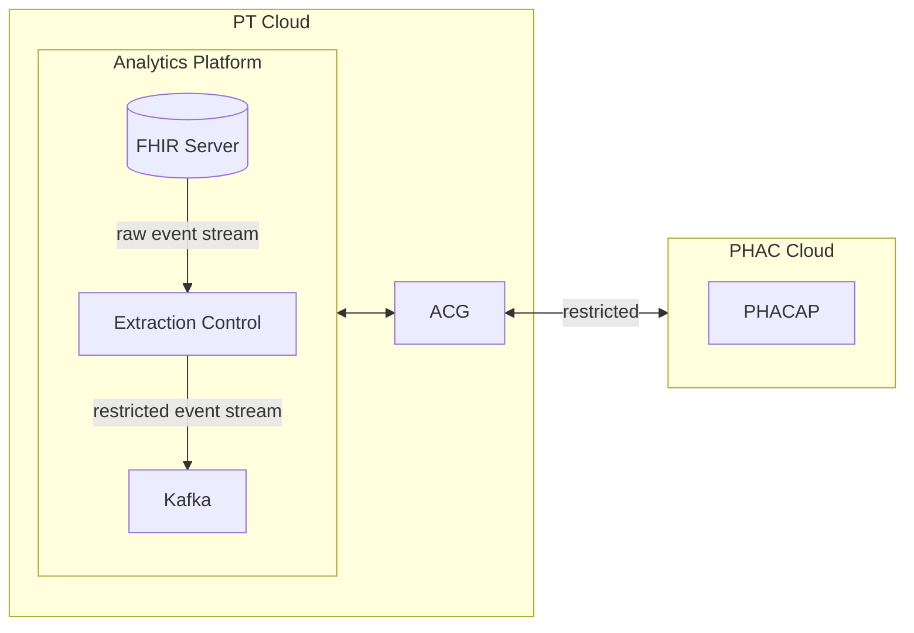

# Access control gateway (ACG)

This kafka worker implements field transformations based on a provided
ruleset yaml file. The ruleset can be reconfigured by posting a message
to the `acg-config-connector` topic on the PT kafka cluster.

In this proof of concept, the ruleset is converted into a GraphQL Schema,
with transformations specified as custom directives. The following directives
are [supported](./src/directives.ts):

- @date - transforms a date into a string using provided format mask
- @hash - performs a one way hash of the field
- @restrict - replaces the value with the word "** restricted **"
- @selectable - loosely based on neo4j - this removes the field entirely
- @topic - used to link queries and subscriptions to kafka

> NOTE: @selectable is not available in the UI as the current analytics queries
> do not support having fields omitted from their avro schemas.

## Architecture

The ACG is decoupled from both the PT and federal environments and only
requires connections to the participating analytics platforms via
their respective event brokers.



## Enforcement of rules

### JSON Schema definition

JSON Schema is used to determine what resource types are available and what 
fields each type contains.  This was chosen because the HL7 specifications are
generally available in this format.  The addition of new types to PoC can be
done relatively quickly as a result.

A few extensions were added for the PoC to the specification.

A top level `entrypoints` key has been added, which define what queries are
possible, what arguments they require and what kafka topics they should bind to.

```json
  "entrypoints": {
    "COVIDVaccinationStatusRequest": {
      "type": "array",
      "items": {
        "$ref": "#/definitions/COVIDVaccinationStatusResponse"
      },
      "arguments": "#/definitions/COVIDVaccinationStatusRequest",
      "topics": {
        "request": "far_1",
        "response": "fas_1"
      }
    },
```

The string type has been extended to support other types such as Date and 
DateTime.  Valid values for `format` are:

    - date
    - date-time
    - point
    - cartesian-point

Example:

```json
        "start": {
          "type": "string",
          "format": "date-time",
          "description": "The date and time the encounter started - Date (yyyy-MM-dd'T'HH:mm'Z')"
        },
```

### Ruleset specification

The rules that should be enforced are specified as a yaml file.  These rules
describe exactly what data is allowed to cross a restricted boundary (At the
EEC and the ACG).  Here is an example ruleset specification that allows access
to the `COVIDVaccinationStatusResponse` resource type, but only a subset of
its fields.  Additionally the `patient_zip` will be hashed.

```yaml
ruleset:
  version: 0.0.1
  resourceTypes:
    - name: COVIDVaccinationStatusResponse
      fields:
        - request_id
        - pt
        - start_date
        - end_date
        - patient_zip:
            hash: true
        - patient_count:
            restrict: true
        - patient_status
            restrict: true
        - status_count
            restrict: true
        - status_percent
            restrict: true
        - timestamp


```

### GraphQL Schema

The final step requires the ruleset yaml file and the target JSON Schema.  These
are combined to create a GraphQL schema on-demand which implements the
transformations as custom directives.  Apollo's graphql engine is used to
execute the resolvers.  The ruleset above would generate the following GraphQL
schema.

```graphql
"""
COVID vaccination status showing quantities (count, percent) for each of statuses of COVID vaccinated patients per zip code.
"""
type COVIDVaccinationStatusResponse {
  request_id: String!
  pt: String!
  start_date: String!
  end_date: String!
  patient_zip: String! @hash
  patient_count: Float! @restrict
  patient_status: String! @restrict
  status_count: Float! @restrict
  status_percent: Float! @restrict
  timestamp: Float!
}

"""Query entrypoints"""
type Query {
  COVIDVaccinationStatusRequest(request_id: String!, covid_cvx_list: String!, start_date: String!, end_date: String!, pt_list: String!, timestamp: Float!, doc: String!): [COVIDVaccinationStatusResponse!]! @topic(request: "far_1", response: "fas_1")
}

"""Subscription entrypoints"""
type Subscription {
  COVIDVaccinationStatusRequest(request_id: String!, covid_cvx_list: String!, start_date: String!, end_date: String!, pt_list: String!, timestamp: Float!, doc: String!): [COVIDVaccinationStatusResponse!]! @topic(request: "far_1", response: "fas_1")
}
```

#### Avro schema

The JSON schema and ruleset combination can also be used to produce a avro
schema, used by kafka to optimize communication - however this schema only
ensures the data is valid, and does not enforce any transformations - with the
exception of removing properties via the @selectable directive.