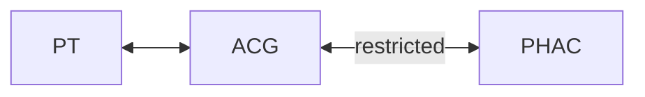

# Access control gateway (ACG)

This kafka worker implements property transformations based on a provided
ruleset yaml file.  The ruleset can be reconfigured by posting a message
to the `acg-config-connector` topic on the PT kafka cluster.
 
In this proof of concept, the ruleset is converted into a GraphQL Schema,
with transformations specified as custom directives.  The following directives
are [supported](./directive.ts):
   - @date       - transforms a date into a string using a format string
   - @hash       - performs a one way hash of the property
   - @blank      - replaces the value with the word "** restricted **"
   - @selectable - loosely based on neo4j - this removes the property entirely
   - @topic      - used to link queries and subscriptions to kafka

#  Architecture

The ACG is completely decoupled from both the PT
and federal environments and can be deployed anywhere.

It connects to both a PT and PHACs analytics platforms via
their respective event brokers.

