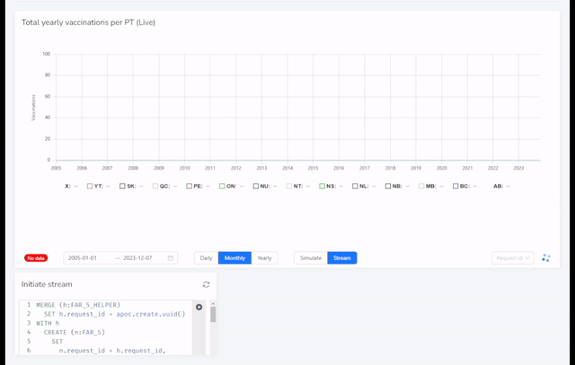

# Streaming visualization demo

Having an event driven architecture means we can also leverage data in real-time as
it arrives into the system.

This PoC demonstrates how we can graph events as they are received in real-time.  The example
uses the [FAR_5](/paradire/doc/part-i.md) response data.

The intention is to embed the application inside of NeoDash, however the "Playback" mode works
independently.

## Stream mode

When in stream mode data is collected directly from Kafka via the `fas_5` topic.  Responses contain
a request_id property which corresponds to the request made in NeoDash.  All streams are kept on
the server in memory until they are not accessed for 5 minutes.  The available request ids are displayed
in a dropdown on the bottom right.

## Simulate mode

In simulate mode the raw data from a recorded streaming session is transmitted in 20 seconds.  This data
is stored in [cached.json](./cached.json).

## How does it work?

This is a [T3 Stack](https://create.t3.gg/) project bootstrapped with `create-t3-app`.  The
backend connects to kafka and streams events to the frontend via [tRPC](https://trpc.io) 
supscriptions over websockets.

## Deployment

There are 3 distinct services created in project.

  - The backend
  - The frontend
  - The websocket server.

The backend and the frontend can both be served by a single docker image, the websocket
server however is a separate deployment.

- [Dockerfile](./Dockerfile)
- [Dockerfile.wsserver](./Dockerfile.wsserver)

