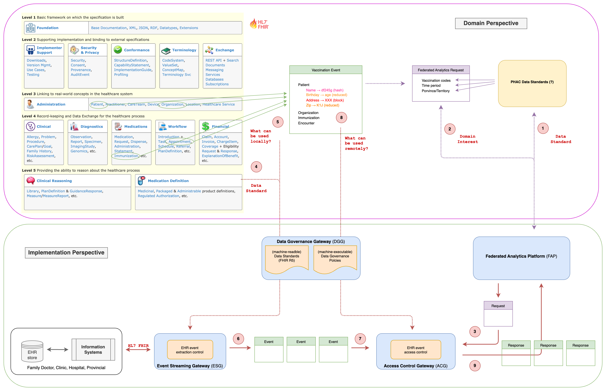

[Table of Content](./README.md) | [Next](./part-ii.md)

--- 

# [Part I](#part-i)

## [A. Overview](#a-overview)

The **Immunization Record Gateway (IRG)** aims to enhance, standardize and connect Canadian immunization registries in an effort to increase access to comprehensive and authenticated immunization data for Canadians, health care providers and public health units. The initiative is led by PHAC in collaboration with provinces and territories.

## [B. Present Situation](#b-present-situation)

**Our understanding** is as follow:
1. *vaccination events are recorded at the first-line of contact*: the local public health clinics, doctors' offices, school, and pharmacies.
2. vaccination records *may or may not be centrally kept in a PT electronic immunization registry* (if exists and/or up-to-date).
3. vaccination records *may or may not be automatically synchronized* from the facilities where they were created to local public health unit, or to PT electronic immunization registry.
4. in general *no parts of vaccination records are transmitted outside of the PT's boundary*, thus not to the F government.
5. only in cases of *reported adverse effect*, vaccination data are delivered to the F government via the same reporting chain, with specific document forms. It is unclear what information these data constitute and whether it contains any privacy or sensitive information.

*Notes: Below are some of the public sources about vaccine procurement, handling and storing, administration, periodic reporting, and adverse effect reporting:*
- [The process](https://www.canada.ca/en/public-health/services/vaccine-supply.html): The Federal government awards contracts for vaccines from manufacturers. The PTs are the actual signatories who purchase, store, and supply them to *the local public health clinics, doctors' offices, and pharmacies*. The latter administer vaccines to the patients based on pre-defined schedules (for children and adults).
- [Periodic report](https://www.canada.ca/en/public-health/services/immunization-vaccines/vaccination-coverage.html): Every *two years* (i.e.in 2013, 2015, 2017, 2019, 2021), the Federal government performs a survey to track coverage for vaccines recommended by the Natioinal Advisory Committee on Immunization. The survey provides *an estimation of the the percentages of people vaccinated* for vaccine-preventable diseases.
- [Vaccine standards](https://www.canada.ca/en/public-health/services/publications/vaccines-immunization/canadian-immunization-registry-functional-standards-2020-2024.html): A brief high-level guide with data elements defined The National Immunization Data Elements (NIDE) (note that both are not based on any international/technical standards, nor any crosswalk defined).
- [Adverse Events Following Immunization (AEFI)](https://www.canada.ca/en/public-health/services/immunization/canadian-adverse-events-following-immunization-surveillance-system-caefiss.html#_About_the_system) are reported via a separate channel, more or less with in the same process.
- [Tools and best practices](https://www.canada.ca/en/public-health/services/immunization-vaccines/vaccination-coverage.html#tools): Data sets for National Immunization Registry Network and Vaccine Associated Adverse Events Surveillance System (document dated 2002), National Standards for Immunization Coverage Assessment (vaccination schedule, dated 2015-10-14), and National Eligible Due and Overdue Guidelines for Immunization Registries: Draft Recommendations from the Canadian Immunization Registry Network (archived document, dated 2004-03-15).

## [C. Upcoming Challenges](#c-upcoming-challenges)

**Data collection**: Vaccination data, in particular, and primary/preventive care data collection when done by traditional methods poses a numerous in problems in data quality and privacy protection. For a single vaccination event:
+ if it is *not automatically synced upstream* to local public health unit, then to the provincial immunization registry - with the assumption that those do exist, the synchronization mechanism is in place, monitored, and audited;
+ if it is *manually collected*, then the collection would have missing records, infrequent update, items incorrectly repeated; data recorded without standards for format encapsulation (such as HL7 FHIR); privacy (personal, health, or financial) information unintentionally exposed.
+ if it is a *part of a 2-year periodic survey*, arriving years late having no or little relation with current situation; without ensuring representative distribution sampling would result in erroneous generalization; devised analysis and statistics already out-of-date.
+ if it is collected so that is it *disconnected from the context* such as encounter, conditions and observations recorded, administering provider/organization, or other health information that would miss important relations to the context, thus reduce ability to learn more.
+ if it *does not end up automatically in the personal vaccination records*, i.e.  when vaccines administered by providers or organizations without access  to the patient's EHR, outside of the jurisdiction, etc; then there is a risk that it will never be there.

**Data sharing (by PT)**: 
+ The first problem with data sharing is *the chicken-and-egg one*: PT intends to share the data that F might need; but F never had a chance to access PT data previously, thus it has unclear understanding of what it would do with the data, then what data it would need; result in the inability of the PT to make the decision of what to be shared.
+ The second problem is that PT has to perform its own *assessment on its infrastructure*, software eco-systems, workflows, data flows, in order to obtain the full picture of what can be share by an automated mean and what needs to be improved to reach that mean.
+ The third problem is *the realization of data governance enforcement to protect privacy information* when shared, even if a portion of some data elements might need to be shared such as how to identify a patient by an anonymized identifier to ensure the related events are correlated; or what's the age of a patient rather then his/her birth date, etc.
+ The fourth problem is *the technical ability to provide shared data*. There are several ways to share data: (i) via API that put the weights on both sides (PT and F), i.e. force PT to maintain a wide access to large amount of data in short period of time; F to remember what it asked for, keep a temporary storage of retrieved data that might keep growing because the diversity of the queries; (ii) via a event sourcing (data streaming) architecture that requires little of maintenance, low demanding infrastructure, easy to search, track, and monitor. Data comes in real-time, inspected, having no duplicates, and always up-to-date.
+ The fifth problem is *the design and implementation of the overall architecture and the underlying infrastructure* that can serve the needs and solve the encountered problems. It is not easy to design or to acquire reference implementation of solutions that are based on year-long continuous work, which are frequently used in different but similar context.

**Data queries (by F)**:
+ The first problem of F is described in PT's first one.
+ The second one of F is similar with PT's second one of PT, but differ in the aspect that *F does not have a machine-readable data standards* for using inputs from PT and producing outcomes.
+ The third problem is that *how F establish and maintain a real-time, up-to-the-minute situation awareness* of vaccination throughout the country.
+ The fourth problem is *how to combine different information types* that would come from the PTs, such as other resource types of patient health records, other divisions inside PHAC, other departments of GoC, to obtain a better and more detailed picture of what it wish to see. This indicates at least *the need to access information beyond immunization*.
+ The fifth problem is *to establish a domain language for data querying* so that instantiated queries can be inspected against the joint machine-executable data-governance policies and automatically be executed at the PT side.

## [D. Conceptual View](#d-conceptual-view)

1. Data standards:
    + The focus is on a set of international standards [`HL7 FHIR R4`](https://hl7.org/fhir/R4/), a standard for health care data exchange, published by HL7. This can cover most of targeted data standards, while provides adequate resources for the PoC.
2. Data sources: using synthetic data generated by probabilistic models (vs. machine-learning models or anonymized data). 
    + The synthetic data is generated by [`Synthea`](https://synthetichealth.github.io/synthea/), a Synthetic Patient Population Simulator. The tool is capable to output synthetic, realistic (but not real), patient data and associated health records in a variety of formats.
3. Simulated information systems at PT level (the local public health clinics, doctors' offices, and pharmacies): to help users to get familiar with data-with-a-face:
    + [`HAPI FHIR`](https://hapifhir.io), a complete implementation of the HL7 FHIR standard for healthcare interoperability in Java, for storage, manage, and provide access to generated synthetic EHRs. HAPI FHIR 6.6.0 support the latest FHIR R5. In the long run, newly adapted [`EHI Export API`](https://smarthealthit.org/electronic-health-information-ehi-export-api/) will be consider as additional elements to the PT platform.
    + [`Patient Browser from Smart`](https://smarthealthit.org): a standalone html5 app giving users the ability to select patients and view their EHRs in detail.
4. Data governance by a novel approach to implement data governance and asserts control to ensure compliance:
    + Data Governance Gateway with sub-component Event Streaming Gateway, and Access Control Gateway: built by [`React`](https://react.dev)/[`GraphQL`](https://graphql.org) for data governance
5.  A full-fledge analytics platform for each of both PT and F based on a Federated Data Architecture with reference implementations from the existing Data Mesh Toolkit (by the Data Innovation Division, DMIA): 
    + [`Kafka`](https://kafka.apache.org) data streaming infrastructure;
    + [`Neo4j`](https://neo4j.com) analytics and graph database;
    + [`NeoDash`](https://neo4j.com/labs/neodash/2.4/) low-code dashboard builder and visualizer;
    + [`Docker`](https://www.docker.com) containerization;
    + [`Kubernetes`](https://kubernetes.io) cloud orchestration;
    + [`Github`](https://github.com) CI/CD for continuous development, testing, and deployment; and
    + [`Google Cloud Platform`](https://cloud.google.com/?hl=en) for hosting the showcase.

<center>
    
    <div align="center">
        <figcaption>The conceptual view of the Proof-of-Concept</figcaption>
        <br/>
    </div>
</center>

## [E. The PT Cluster](#e-the-pt-cluster)

**Key data flow: EHR events from PT health information systems into PT Analytics Platform**

(See the chains of red circles on the left of the *the conceptual view of the Proof-of-Concept* above)

### E.1. Generating Synthetic Patient Population

**Step 0**. A `population size` with selectable `PT` (from 13 jurisdictions $AB,BC,MB,NB,NL,NT,NS,NU,ON,PE,QC,SK,YT$) can be selected for generating a set of synthetic patient population:
       + 2016 Canadian census data: [2016 Statistics Canada](https://www12.statcan.gc.ca/census-recensement/2016/dp-pd/prof/details/download-telecharger/comp/GetFile.cfm?Lang=E&FILETYPE=CSV&GEONO=044) dataset is used for demographics.
       + [Open Database of Healthcare Facilities](https://www.statcan.gc.ca/eng/lode/databases/odhf) dataset is used for information on care providing organizations.
       + Other information such geography, zip codes, etc from government sites or open source datasets.

**Step 1**. `Synthea` uses these parameters, demographics, and master datasets with clinical care maps, disease incidence & prevalence statistics to formulate a number of finite state machines for clinical disease models and other predefined configuration to generate complete sets of longitudinal data for patients, claims, encounters, immunizations, medications, procedures, providers, etc.

<center>
    
    <div align="center">
        <figcaption>Synthea Architecture</figcaption>
        <br/>
    </div>
</center>

<br/>

Synthea contains a framework for defining modules using JSON. These JSON modules describe a progression of states and the transitions between them. On each Synthea generation time-step, the generic framework processes states one at a time to trigger conditions, encounters, medications, and other clinical events.

<center>
    
    <div align="center">
        <figcaption>Ear infection</figcaption>
        <br/>
    </div>
</center>

<br/>

This simplified example of childhood ear infections, can be seen as above, shows the flow of a generic module. In this instance, children get ear infections at different rates based on their age, are then diagnosed at an encounter, and then are prescribed either an antibiotic or a painkiller.

### E.2. Simulating PT Health Information Systems (PT HIS)

**Step 2**. The set of complete patient `EHRs` is uploaded into a pre-deployed `HAPI FHIR` server.

<center>
    
    <div align="center">
        <figcaption>HAPI FHIR for New Brunswick PT-deployment by the PoC</figcaption>
        <br/>
    </div>
</center>

<br/>

The EHRs can be viewed in detail by a pre-deployed `Patient Browser` to simulate the existing PT health information systems.

<center>
    
    <div align="center">
        <figcaption>Patient Browser for New Brunswick PT-deployment by the PoC</figcaption>
        <br/>
    </div>
</center>

### E.3. Extract EHR events from PT HIS and stream them into PT Analytics Platform

**Step 3**. The `Data Governance Gateway`, used by the policy designers to help them *choosing elements of `HL7 Resource Type`*, in this case i.e. `Immunization`, then *defines the extraction control mechanism* for the resources of this type.

Note that, while generating EHS, Synthea collects [`time-based events in 20 categories`](https://github.com/synthetichealth/synthea/wiki/CSV-File-Data-Dictionary) and provide them separately. Below is the list of  event categories and their `HL7 FHIR Resource Type`:
- allergies: from [R4 - AllergyIntolerance](https://www.hl7.org/fhir/allergyintolerance.html)
- careplans: from [R4 - CarePlan](https://www.hl7.org/fhir/careplan.html)
- claims_transactions: from [ R4 - ClaimResponse](https://www.hl7.org/fhir/claimresponse.html)
- claims: from [R4 - Claim](https://www.hl7.org/fhir/claim.html)
- conditions: from [R4 - Condition](https://www.hl7.org/fhir/condition.html)
- devices: from [R3 - Device](https://www.hl7.org/fhir/device.html)
- encounters: from [R4 - Appointment](https://www.hl7.org/fhir/appointment.html)
- imaging_studies: from [R4 - ImagingStudy](https://www.hl7.org/fhir/imagingstudy.html)
- immunizations: from [R4 - Immunization](https://www.hl7.org/fhir/immunization.html)
- medications: from [R4 - Medication](https://www.hl7.org/fhir/medication.html)
- observations: from [R4 - Observation](https://www.hl7.org/fhir/observation.html)
- organizations: from [R3 - Organization](https://www.hl7.org/fhir/organization.html)
- patient_expenses: from [R4 - Invoice](https://www.hl7.org/fhir/invoice.html)
- patients: from [R3 - Patient](https://www.hl7.org/fhir/patient.html)
- payer_transitions: from [R3 - InsurancePlan](https://www.hl7.org/fhir/insuranceplan.html)
- payers: from [R3 - Organization](https://www.hl7.org/fhir/organization.html)
- procedures: from [R4 - Procedure](https://www.hl7.org/fhir/procedure.html)
- providers: from [R4 - Practitioner](https://www.hl7.org/fhir/practitioner.html)
- supplies: from [R3 - InventoryItem](https://www.hl7.org/fhir/inventoryitem.html)
- symptoms: from [R4 - Observation](https://www.hl7.org/fhir/observation.html)

Let's take an example of `immunization` to see how these events ended up in the PT Analytics Platform.

Here's an example of 10 `immunization` events from `Saskatchewan`, generated by `Synthea`:
| DATE                 | PATIENT                              | ENCOUNTER                            | CODE | DESCRIPTION                   | BASE_COST |
|----------------------|--------------------------------------|--------------------------------------|------|-------------------------------|-----------|
| 2022-04-23T14:09:14Z | 09702b54-23e6-5cf3-8955-20db99392d63 | 2b70a68e-7ab1-2c73-e8aa-cf6610432de9 | 08   | Hep B adolescent or pediatric | 136.00    |
| 2022-05-28T14:09:14Z | 09702b54-23e6-5cf3-8955-20db99392d63 | 74c3c4b9-3a8e-1b9b-0997-e5f93db10f42 | 08   | Hep B adolescent or pediatric | 136.00    |
| 2022-07-30T14:09:14Z | 09702b54-23e6-5cf3-8955-20db99392d63 | b530d7de-e0aa-ed50-2126-903a6e6395c6 | 49   | Hib (PRP-OMP)                 | 136.00    |
| 2022-07-30T14:09:14Z | 09702b54-23e6-5cf3-8955-20db99392d63 | b530d7de-e0aa-ed50-2126-903a6e6395c6 | 119  | rotavirus monovalent          | 136.00    |
| 2022-07-30T14:09:14Z | 09702b54-23e6-5cf3-8955-20db99392d63 | b530d7de-e0aa-ed50-2126-903a6e6395c6 | 10   | IPV                           | 136.00    |
| 2022-07-30T14:09:14Z | 09702b54-23e6-5cf3-8955-20db99392d63 | b530d7de-e0aa-ed50-2126-903a6e6395c6 | 20   | DTaP                          | 136.00    |
| 2022-07-30T14:09:14Z | 09702b54-23e6-5cf3-8955-20db99392d63 | b530d7de-e0aa-ed50-2126-903a6e6395c6 | 133  | Pneumococcal conjugate PCV 13 | 136.00    |
| 2022-10-01T14:09:14Z | 09702b54-23e6-5cf3-8955-20db99392d63 | 75dd24f7-fbd7-a102-f3a3-f0be80163716 | 49   | Hib (PRP-OMP)                 | 136.00    |
| 2022-10-01T14:09:14Z | 09702b54-23e6-5cf3-8955-20db99392d63 | 75dd24f7-fbd7-a102-f3a3-f0be80163716 | 119  | rotavirus monovalent          | 136.00    |
| 2022-10-01T14:09:14Z | 09702b54-23e6-5cf3-8955-20db99392d63 | 75dd24f7-fbd7-a102-f3a3-f0be80163716 | 10   | IPV                           | 136.00    |

These `immunization` events need *to be automatically read, verify (type and value), then turned into standard record* (a part process of data governance to control quality of incoming data). To do that, we use [`Apache AVRO`](https://avro.apache.org), a standard of data serialization.

 For example, the `immunization` events now have a formal data serialization specification in `AVRO` as follow:
```json
{
    "type": "record",
    "name": "immunization_val",
    "fields": [
        {"name": "date", "type": "string", "doc": "The date the immunization was administered. - Date (yyyy-MM-dd'T'HH:mm'Z')"},
        {"name": "patient_id", "type": "string", "doc": "Foreign key to the Patient - UUID."},
        {"name": "encounter_id", "type": "string", "doc": "Foreign key to the Encounter where the immunization was administered - UUID"},
        {"name": "code", "type": "string", "doc": "Immunization code from CVX"},
        {"name": "description", "type": "string", "doc": "Description of the immunization"},
        {"name": "base_cost", "type": "float", "doc": "The line item cost of the immunization"}
    ]
}
```

These *elements of `HL7 Immunization Resource Type`* are chosen, and *allowed to be extracted* from accessible PT data, which then help to convert `Synthea` events into AVRO, the first example row above is now shown as follow:
```json
{
    "date": "2022-04-23T14:09:14Z",
    "patient_id": "09702b54-23e6-5cf3-8955-20db99392d63",
    "encounter_id": "2b70a68e-7ab1-2c73-e8aa-cf6610432de9",
    "code": "08",
    "description": "Hep B  adolescent or pediatric",
    "base_cost": 136.0
}
```

**Step 4**. The `kafka-avro-console-producer`, together with `schema-registry` service of the [`Kafka`] data streaming infrastructure of the `PT Analytics Platform` performs the streaming of these AVRO events into 20 topics with the same name.

<center>
    
    <div align="center">
        <figcaption>AVRO events into 20 topics in the Kafka Cluster of the PT Analytics Platform</figcaption>
        <br/>
    </div>
</center>

<br/>

Immunization events are now shown as `Kafka` messages. They are now *data-in-motion*.

<center>
    
    <div align="center">
        <figcaption>Immunization events as messages in the Kafka Cluster of the PT Analytics Platform</figcaption>
        <br/>
    </div>
</center>

<br/>

**Step 5**. Sink connectors to the graph analytics engine and database `Neo4j` are setup to receive streaming events from `Kafka` topics. Once this step is done, a complete dataset, up-to-this-minute is available in the `PT Analytics Platform` and ready for (local and remote) analytics queries.

<center>
    
    <div align="center">
        <figcaption>Single patient view in the PT Analytics Platform</figcaption>
        <br/>
    </div>
</center>


<br/>

The following diagram show the vaccinations over time of a single patient (`Nikita578`), living in Saanich, Sunshine Coast D, British Columbia, show as the green circle in the middle, who was born in 2002.
+ The six annual encounters in 2014-2019 (show as blue circles with titles `Well child visit` from top left to the right and down), when she was under 18. During this period of time she got a number of vaccinations (show as pink circles) at the encounters, all at the Fraser Canyon Clinic.
+ From 2019-2023, in four annual visits (show as blue circles with titles `General examination` from middle to the right and up) she got a number of different vaccines, some for adult only, i.i. Td, Hep B, also from the Fraser Canyon Clinic.
+ The encounter as blue circle, titled `Administration of vaccine to produce active immunization` at the bottom, showed that in 2021, she got a vaccine coded `212`, described as `SARS-COV-2 (COVID-19) vaccine  vector non-replicating  recombinant spike protein-Ad26  preservative free  0.5 mL` at Lilooet District Hospital and Health Center.

<center>
    
    <div align="center">
        <figcaption>Single patient immunizations over time</figcaption>
        <br/>
    </div>
</center>

### E.4. What analytics can be conducted locally at the PT Analytics Platform?

In this section, we show a number of analytics that can be performed locally. *It means that organizations having access to the PT Analytics Platform (likely under jurisdiction and are permitted to do so) can design and execute similar queries to gain knowledge from the shared data.*

**Vaccination Status**: following set of diagrams show the situation of COVID vaccination at the start of the year 2021, then at the end of four subsequent quarters in that year. The charts, at each point in time, show the number of patients per zip code who are unvaccinated, vaccinated with a single dose, or fully vaccinated (2 doses) with the 207 and 208 vaccines (Moderna).

*Legend: red - unvaccinated; yellow - one dose, green - fully vaccinated.*

<table cellspacing="0" cellpadding="0" border="0">
    <tr>
        <td style="text-align: center; vertical-align: top;">
            
            <figcaption>2021-01-01</figcaption>
            <br />
        </td>
        <td style="text-align: center;  vertical-align: top;">
            
            <figcaption>2021-04-01</figcaption>
            <br />
        </td>
        <td style="text-align: center;  vertical-align: top;">
            
            <figcaption>2021-07-01</figcaption>
            <br />
        </td>
    </tr>
    <tr>
        <td style="text-align: center; vertical-align: top;">
            
            <figcaption>2021-10-01</figcaption>
            <br />
        </td>
        <td style="text-align: center;  vertical-align: top;">
            
            <figcaption>2022-01-01</figcaption>
            <br />
        </td>
    </tr>
</table>

<br/>

**Vaccination Schedule**: The following set of diagrams show an inquiry for young children missing vaccination schedule. In this, the charts are able to show the data from multiple angles based on a set of vaccine schedule: who missed schedule of which vaccines; heat map can be shown at for a high level over view, but map with individual location (and missing doses) provide a more in-dept details.

<table cellspacing="0" cellpadding="0" border="0">
    <tr>
        <td style="text-align: center; vertical-align: top;">
            
            <figcaption>Who missing vaccination - name, doses, and heat map</figcaption>
            <br />
        </td>
        <td style="text-align: center;  vertical-align: top;">
            
            <figcaption>Who missing vaccination - individual locations</figcaption>
            <br />
        </td>
    </tr>
</table>

<br/>

**Travel distance**: The following set of diagrams show two types of analysis on traveling distance to get vaccinated.

The first one based on the statistics computed using distances between patients' home location and the administering organizations. It highlights the distances people living in a zip code need to travel to get vaccinated, and then the breakdown with in the treemap shows distances of some of those people need to travel to certain hospital. 

<center>
    
    <div align="center">
        <figcaption>Average travel distance to get vaccinated</figcaption>
        <br/>
    </div>
</center>

The second one uses a different approaches. It show every single travel distance of individuals for getting COVID doses.

<center>
    
    <div align="center">
        <figcaption>Individuals travels for COVID vaccinations</figcaption>
        <br/>
    </div>
</center>

<br/>

**Vaccination Traffic**: This simple Sandkey chart shows the number of vaccinations each patient getting from an organization.

<center>
    
    <div align="center">
        <figcaption>Random 10 patients and their vaccinations by organizations</figcaption>
        <br/>
    </div>
</center>

<br/>

**Vaccination Record**: Below is a simple extraction of random 10 vaccination records ordered by time

| date       |  cvx  |  cvx_description                                      |  organization                  |  encounter                                    |  snomet_ct  |  patient_id |  age               |  address                         |  zip  |  gender |  race    |  ethn          |
|------------|-------|-------------------------------------------------------|--------------------------------|-----------------------------------------------|-------------|-------------|--------------------|----------------------------------|-------|---------|----------|----------------|
| 2014-05-15 | "140" |  "Influenza  seasonal  injectable  preservative free" |  "Denning Health Group"        |  "General examination of patient (procedure)" | "162673000" | "353e3a1f"  | 35                 | "130 Raynor Manor Suite 31"      | "V4A" |  "M"    |  "asian" |  "nonhispanic" |
| 2014-05-17 | "21"  |  "varicella"                                          |  "Mercy Medical Clinic"        |  "Well child visit (procedure)"               | "410620009" | "fab28025"  | 5                  | "607 Volkman Crossroad"          | "V4A" |  "M"    |  "asian" |  "nonhispanic" |
| 2014-05-17 | "10"  |  "IPV"                                                |  "Mercy Medical Clinic"        |  "Well child visit (procedure)"               | "410620009" | "fab28025"  | 5                  | "607 Volkman Crossroad"          | "V4A" |  "M"    |  "asian" |  "nonhispanic" |
| 2014-05-17 | "140" |  "Influenza  seasonal  injectable  preservative free" |  "Mercy Medical Clinic"        |  "Well child visit (procedure)"               | "410620009" | "fab28025"  | 5                  | "607 Volkman Crossroad"          | "V4A" |  "M"    |  "asian" |  "nonhispanic" |
| 2014-05-17 | "20"  |  "DTaP"                                               |  "Mercy Medical Clinic"        |  "Well child visit (procedure)"               | "410620009" | "fab28025"  | 5                  | "607 Volkman Crossroad"          | "V4A" |  "M"    |  "asian" |  "nonhispanic" |
| 2014-05-17 | "03"  |  "MMR"                                                |  "Mercy Medical Clinic"        |  "Well child visit (procedure)"               | "410620009" | "fab28025"  | 5                  | "607 Volkman Crossroad"          | "V4A" |  "M"    |  "asian" |  "nonhispanic" |
| 2014-05-21 | "08"  |  "Hep B  adolescent or pediatric"                     |  "Towne Centre Medical Clinic" |  "Well child visit (procedure)"               | "410620009" | "fa5772f8"  | {"low":0;"high":0} | "152 Reinger Meadow Apt 6"       | "V0H" |  "F"    |  "white" |  "nonhispanic" |
| 2014-05-26 | "33"  | "pneumococcal polysaccharide vaccine  23 valent"      |  "Riverview Hospital"          |  "Encounter for check up (procedure)"         | "185349003" | "203da9f0"  | 66                 | "328 Hahn Track"                 | "V3B" |  "F"    |  "asian" |  "nonhispanic" |
| 2014-06-05 | "140" |  "Influenza  seasonal  injectable  preservative free" |  "Fraser Canyon Clinic"        |  "Well child visit (procedure)"               | "410620009" | "114cbf30"  | 12                 | "1030 MacGyver Approach Unit 50" | "V9E" |  "F"    |  "white" |  "nonhispanic" |
| 2014-06-05 | "62"  |  "HPV  quadrivalent"                                  |  "Fraser Canyon Clinic"        |  "Well child visit (procedure)"               | "410620009" | "114cbf30"  | 12                 | "1030 MacGyver Approach Unit 50" | "V9E" |  "F"    |  "white" |  "nonhispanic" |

<br/>

**Key Indicators**: To easily capture a key statistics at a moment. Three examples are shown: patient condition, reason for medications, performed procedures distributions.

<center>
    
    <div align="center">
        <figcaption>Distribution of conditions</figcaption>
        <br/>
    </div>
</center>

<br/>

<center>
    
    <div align="center">
        <figcaption>Distribution of reasons for medication</figcaption>
        <br/>
    </div>
</center>

<br/>

<center>
    
    <div align="center">
        <figcaption>Distribution of top 100 procedures</figcaption>
        <br/>
    </div>
</center>

<br/>

**Research Indicator**: This inquiry wishes to see more why certain patients missing their vaccination, while the organizations, where they visited (for other vaccinations), still provided the vaccines they missed to other patients.

<center>
    
    <div align="center">
        <figcaption>Where would they have been immunized?</figcaption>
        <br/>
    </div>
</center>

## [F. Building Trust by Sharing Data with Governance](#f-building-trust-by-sharing-data-with-governance)

*The star of the show is undoubtedly Data Governance*. Or to be precise, **Data Governance by applying machine-executable policies on a set of machine readable data standards**.

Implement such a systems depicted above is not novel, nor technological challenge, or resource/computational intensive. The key issue that we need to solve here is how to build trust:
- How can the PT feel comfortable to provide data that they know what are those?
- How can the PT knows that the extraction of a portion of data from the provided dataset is compliant to the policy?
- How can the PT knows that the data is shared within the premises that has adequate security and access control?
- How can the PT knows that the data is shared within a permitted amount of time and not more?
- And how can the PT knows that the actions on extraction, queried, captured, etc are actually compliant? Are there evidence to provide to support this reasoning?

From the F side, there are a number of problems as well:
- How can F be sure that the data PTs share is the one that F needs?
- How can F ensure the quality of the data even before using it?
- How can F ensure the data suppose to be the same across the PTs will actually be the same when arrive?
- How can F perform queries on such dataset but prevent violation or abuse of the rule?
- How can PHAC utilize this platform for further uses or other teams, division, branches?

**Key assumption one**: *PT will be able to provide data formatted by international standards such as HL7 FHIR R4*.
+ Without any international standards, it is impossible to build a consensus among PTs or within PT to have a common format for data.
+ It is crucial that the data standards are mature, well-defined, backed by relevant users with substantial private sector support.
+ It is mandatory that the data standards must be specified in machine-readable format, accompanied with concrete use cases and examples for implementation guide, and a test suite for compliance, which is key to obtain compliant certificate.
+ Any derivation with deviation from international standards should not be accepted at face value, unless reference implementation with implementation guide is provided, test suite for compliance, and certification process are in place.
+ The use of data standards for application of data governance rules must be automated. Manual constructed process is fragile and will not stand the test of time when newly formed data properties, relations are adapted, or the data standards evolve.

**Key assumption two**: *Data governance policies must be specify by some formal language that support automatic translation to machine-executable instructions*
+ Data governance policies if documented at high-level will be victim of different interpretations, which then leads to incompatibility in implementation.
+ The use of formal language is to make the specification of the policy short, precise, and translatable into machine instructions which then are used directly by implementers.
+ The automatic translation prevents errors, ready to be analyzed (that it contains no malicious attempt), investigated (if accidents happen), prevent attacks of middle man (incorrect manual implementation, shortcut, etc), high-performance, and easy to upgrade.

Let's take an example. The diagram below shows the formation of vaccination records that F wishes to receive.

<center>
    
    <div align="center">
        <figcaption>Data Governance Gateway</figcaption>
        <br/>
    </div>
</center>

<br/>

From F side, (although it is not know what data standards are going to be used), but let's suppose that the instance of the vaccination record contains CVX, some information of the patient, the organization where the vaccine was administered, the encounter, and the immunization activity. See the purple box on the right and its input from the green box in the middle for reference.

The vaccination record, provided from PT, consists of several pieces of information derived from multiple resource types in a patient's EHR, from *HL7 FHIR R4*, namely *Patient, Organization, Appointment, Immunization*. Note that from the diagram depicting HL7 FHIR, it is easy to see that *the minimum required version for HL7 FHIR is R4*. This implies on **what data needs to be extracted from the data that PT holds** in order to create vaccination records for F. This is the first role of the Data Governance Gateway, exercising control on its first sub-component, the Event Streaming Gateway to collect such data from PT.

The extracted data, now is in stream within the PT Analytics Platform. It is ephemeral and will stay for a short period of time. The stream heads to the Access Control Gateway, which is the second sub-component of the Data Governance Gateway, where **according the executable policy the data must be transformed**:
+ certain fields such as *personal information is blocked* and replaced by '** restricted **' to highlight that information is there but restricted.
+ certain fields like the *patient identifier is transformed into an irreversible identifier*(so that later need to correlate data based on the patient identifier is still intact), 
+ certain fields like *birth date, zip code, etc are reduced in capacity* to provide less information, for example instead of full birth date, its year can be provided so analytics on age can still be done; similarly 6-character zip code will not be allowed, only it first three (forward station code) is allowed for area map and so.

We will see in the Federated Analytics Request 5 (FAR 5) some concrete example explaining how the data governance rules work.

## [G. The F cluster](#g-the-f-cluster)

The F cluster basically is a simpler version of the PT cluster. It is [the analytics platform](#d-conceptual-view) in essence.

### G.1. Local and Federated Analytics Queries

Previously we defined a set of analytics requests that were created within a single PT Analytics Platform. They were executed in place and the responses (to the requests) are consumed locally as shown in the examples above.  Now, we wish to create the same set of queries on the F Analytics Platform, which then automatically got executed on a number of desired PT Analytics Platforms,  the responses to the requests are delivered to the F Platform after applying governance rules, and then aggregated at the F Analytics Platform. 

**The best possible way to define a query is to use natural language**. It is possible to use (AI) Natural Language Processing (NLP) tools to to transform a statement in natural language such as:

    How many patient are there in a zip?
    
to a `Cypher` query as below:

```cypher
MATCH (n:Patient)
RETURN DISTINCT(patient.zip) AS zip, COUNT(patient) AS count;
```

However we have not enough time to implement that in this PoC, thus **the preferred option is parameterized queries**.

### G.2. What is a parameterized query?

*A query is a pair of a request and a response*.

*The request is a single event*, which:
   + Specifies `an intent` of some user from the F side;
   + Is formulated at the F Analytics Platform with *four mandatory parameters*: 
        - `request_id`, which is a unique string identifying the request and differentiate it from any other request, i.e. *far_1-1* or *afe703e7-85d5-3bb7-9092-8104167871c4* or any unique identifier.
        - `pt_list`, which is the list of PT 2-letter abbreviations, i.e *BC,ON,QC*, indicating which PTs this request addresses.
        - `timestamp`, the number of seconds measured from *1970-01-01*, a.k.a epoch, recorded the datetime when this request is created.
        - `doc`, the document string describing this request, i.e. *All PTs: COVID-19 monovalent Moderna adult (12+ yrs) vaccine, 1st/2nd dosage.*
   + Is replicated from a Kafka's topic on FAP (reserved for the type of the parameterized requests, for example `far_1` topic for *Federated Analytics Request One (FAR_1)*) into the topic with the same name on those PAP clusters which represent the PTs mentioned in the `pt_list`.

   Below is the AVRO specification of an example request:
```json
{
    "type": "record",
    "name": "ConnectDefault",
    "namespace": "io.confluent.connect.avro",
    "doc": "COVIDVaccinationStatusRequest - Request COVID vaccination status - Request for COVID vaccination status by a number of CVXs, within a period of time, and based on the number of doses depending on vaccine type.",
    "fields": [
        {"name": "request_id", "type": "string", "doc": "Unique ID of a Fererated Analytics Request"},
        {"name": "covid_cvx_list", "type": "string", "doc": "List of COVID CVX codes (comma-separated), i.e 207,208."},
        {"name": "start_date", "type": "string", "doc": "Date (YYYY-MM-DD) as string."},
        {"name": "end_date", "type": "string", "doc": "Date (YYYY-MM-DD) as string."},
        {"name": "pt_list", "type": "string", "doc": "List of PTs (comma-separated), where this request is sent, i.e BC,ON,QC."},
        {"name": "timestamp", "type": "long", "doc": "Timestamp when this record is produced"},
        {"name": "doc", "type": "string", "doc": "Description of this request"}
    ]
}
```

And an instance:
```json
{   
    "request_id": "far_1-2",
    "covid_cvx_list": "207,208",
    "start_date": "2021-01-01",
    "end_date": "2021-04-01",
    "pt_list": "AB,BC,MB,NB,NL,NT,NS,NU,ON,PE,QC,SK,YT",
    "timestamp": 1699312649,
    "doc": "All PTs: COVID-19 monovalent Moderna adult (12+ yrs) vaccine, 1st/2nd dosage."
}
```

The response is a (possibly continuous) stream of events, which:
   + Specifies the detail in returning data
   + Each event is created inside the PT Analytics Platform with *three mandatory parameters*: 
        - `request_id`, which is inherited from the request and is used to identify each and every response to this request.
        - `pt`, which indicates the PT owns the platform.
        - `timestamp`, the number of seconds measured from *1970-01-01*, a.k.a epoch, recorded the datetime when this event is created.
   + Is replicated from a Kafka's topic on PAP (reserved for the type of the parameterized responses, for example `fas_1` topic for the *Federated Analytics Response One (FAS_1)*) into the topic with the same name on FAP.

Below is the AVRO specification of an example response:
```json
{
    "type": "record",
    "name": "ConnectDefault",
    "namespace": "io.confluent.connect.avro",
    "doc": "COVIDVaccinationStatusResponse - COVID vaccination status - COVID vaccination status showing quantities (count, percent) for each of statuses of COVID vaccinated patients per zip code.",
    "fields": [
        {"name": "request_id", "type": "string", "doc": "Unique ID of a Fererated Analytics Request."},
        {"name": "pt", "type": "string", "doc": "PT, where this response from, i.e. BC"},
        {"name": "start_date", "type": "string", "doc": "Date (YYYY-MM-DD) as string."},
        {"name": "end_date", "type": "string", "doc": "Date (YYYY-MM-DD) as string."},
        {"name": "patient_zip", "type": "string", "doc": "Reduced zip code (first three characters)."},
        {"name": "patient_count", "type": "long", "doc": "The total number of vaccinated patients, with in the zipcode"},
        {"name": "patient_status", "type": "string", "doc": "The status of patient: Unvaccinated (0 doses), One-dosed, or Fully vaccinated (2 doses)."},
        {"name": "status_count", "type": "long", "doc": "The total number of vaccinated patients, for single status type, with in the zipcode"},
        {"name": "status_percent", "type": "double", "doc": "status_count/patient_count * 100% with two digits after decimal point, i.e. 64.35"},
        {"name": "timestamp", "type": "long", "doc": "Timestamp when this record is produced."}
    ]
}
```

And three events of the response:
```json
{
    "request_id": "far_1-2", 
    "pt": "BC", 
    "start_date": "2021-01-01", 
    "end_date": "2021-04-01", 
    "patient_zip": "V0B", 
    "patient_count": 9, 
    "patient_status": "Unvaccinated", 
    "status_count": 7, 
    "status_percent": 77.78, 
    "timestamp": 1700000130760
}
{
    "request_id": "far_1-2", 
    "pt": "BC", 
    "start_date": "2021-01-01", 
    "end_date": "2021-04-01", 
    "patient_zip": "V0H", 
    "patient_count": 12, 
    "patient_status": 
    "One-dosed", 
    "status_count": 2, 
    "status_percent": 16.67, 
    "timestamp": 1700000130760
}
{
    "request_id": "far_1-2", 
    "pt": "BC", 
    "start_date": "2021-01-01", 
    "end_date": "2021-04-01", 
    "patient_zip": "V7P", 
    "patient_count": 46, 
    "patient_status": "Fully vaccinated", 
    "status_count": 6, 
    "status_percent": 13.04, 
    "timestamp": 1700000130760
}
```

### G.3. Federated Analytics Queries

<center>
    
    <div align="center">
        <figcaption>The conceptual view of the Proof-of-Concept</figcaption>
        <br/>
    </div>
</center>

<br/>

**Key data flow: Federated Analytics Requests F- to PT Analytics Platform and back with the responses**

(See the chains of purple circles on the right of the *the conceptual view of the Proof-of-Concept* above)

**Step 0**. The query is formed by either a UI or NeoDash

With UI, an AVRO message with content as below
```json
{
    "request_id": "far_1-1", 
    "covid_cvx_list": "207,208", 
    "start_date": "2021-01-01", 
    "end_date": "2021-04-01", 
    "pt_list": "BC", 
    "timestamp": 1699312649, 
    "doc": 
    "BC only: COVID-19 monovalent Moderna adult (12+ yrs) vaccine, 1st/2nd dosage."
}
```

With NeoDash, it would be a Cypher query

```cypher
CREATE (n:FAR_1)
    SET
        n.request_id = 'far_1-1',
        n.covid_cvx_list = '207,208',
        n.start_date = '2021-01-01', 
        n.end_date = '2021-04-01', 
        n.pt_list = 'BC',
        n.timestamp = apoc.date.currentTimestamp(),
        n.doc = 'BC only: COVID-19 monovalent Moderna adult (12+ yrs) vaccine, 1st/2nd dosage.';
```

**Step 1**. The query is inserted into `far_1` Kafka topic
 - directly if it is an AVRO message
 - or converted from a Neo4j `FAR_1` entity (shown as above) into an event by the `Neo4j` `far_1` source connector
 ```json
 {
    "name": "far_1_source_connector",
    "config": {
        "_comment": "Source configuration of FAR_1 Request (going to PT Analytics Platform)",
        "connector.class": "streams.kafka.connect.source.Neo4jSourceConnector",
        "key.converter": "io.confluent.connect.avro.AvroConverter",
        "key.converter.schema.registry.url": "http://schema-registry:8081",
        "value.converter": "io.confluent.connect.avro.AvroConverter",
        "value.converter.schema.registry.url": "http://schema-registry:8081",
        "errors.retry.timeout": "-1",
        "errors.retry.delay.max.ms": "1000",
        "errors.tolerance": "all",
        "errors.log.enable": true,
        "errors.log.include.messages": true,
        "neo4j.server.uri": "bolt://neo4j:7687",
        "neo4j.authentication.basic.username": "neo4j",
        "neo4j.authentication.basic.password": "phac@2023",
        "partitions": 4,
        "neo4j.streaming.poll.interval.msecs": 5000,
        "neo4j.streaming.property": "timestamp",
        "neo4j.streaming.from": "ALL",
        "neo4j.enforce.schema": true,
        "neo4j.encryption.enabled": false,
        "topic": "far_1",
        "neo4j.source.type":"QUERY",
        "neo4j.source.query": "MATCH (entity:FAR_1) WHERE entity.timestamp > $lastCheck RETURN entity.request_id AS request_id, entity.covid_cvx_list AS covid_cvx_list, entity.start_date AS start_date, entity.end_date AS end_date, entity.pt_list AS pt_list, entity.timestamp AS timestamp, entity.doc AS doc"
    }
}
 ```

The message landed in the `far_1` topic on FAP, as shown below.
<center>
    
    <div align="center">
        <figcaption>COVIDVaccinationStatusRequest (FAR_1)</figcaption>
        <br/>
    </div>
</center>

<br/>

**Step 2, 3, 4**. The Access Control Gateways replicates the request
- All ACGs subscribe to the `far` topic of FAP, thus all of them aware of the appearance of the request in the topic.
- Each and everyone of them takes the event, verify the `pt_list` against its own PT 2-letter abbreviation, and if matched, then replicate the event.

Thus, the request arrives at the PT side.

The message landed in the `far_1` topic on FAP, as shown below.
<center>
    
    <div align="center">
        <figcaption>COVIDVaccinationStatusRequest (FAR_1)</figcaption>
        <br/>
    </div>
</center>

<br/>

**Step 5, 6, 7, 8**. `Neo4j` sink connector for the parameterized request type of `far_1` detects the request.
- It invokes the `Cypher` query in the `far_sink_connectors` connector to perform the analysis, and
- Creates entities as events for the response

```cypher
WITH 
    event.request_id AS request_id,
    SPLIT(event.covid_cvx_list, ',') AS covid_cvx_list,
    DATE(event.start_date) AS start_date,
    DATE(event.end_date) AS end_date,
    event.pt_list AS pt
WITH
    request_id, pt, covid_cvx_list, start_date, end_date
    OPTIONAL MATCH (patient:Patient)-[]-(immunization:Immunization)
WITH
    DISTINCT(patient) AS patient, 
    request_id, pt, start_date, end_date, covid_cvx_list,
    COLLECT(immunization) AS immunizations
WITH 
    patient, request_id, pt, start_date, end_date, covid_cvx_list,
    REDUCE(l=0, e IN immunizations | 
    CASE WHEN 
        e.code IN covid_cvx_list AND 
        DATE(e.date) >= start_date AND 
        DATE(e.date) <= end_date
    THEN l + 1 ELSE l END) AS immunization_count
WITH
    DISTINCT(patient.zip) AS patient_zip,
    request_id, pt, start_date, end_date,
    CASE
        WHEN immunization_count >= 2 THEN 'Fully vaccinated' 
        WHEN immunization_count = 1 THEN 'One-dosed' 
        ELSE 'Unvaccinated' END AS patient_status, 
    COUNT(*) AS status_count
WITH
    request_id, pt, start_date, end_date, patient_zip, patient_status, status_count
        MATCH (patient:Patient {zip: patient_zip})
WITH 
    request_id, pt, start_date, end_date, patient_zip, patient_status, status_count,
    COUNT(patient) AS patient_count
WITH
    request_id, pt, start_date, end_date, patient_zip, patient_status, status_count, patient_count,
    ROUND(status_count*10000.0 / patient_count)/100.0 AS status_percent
    CREATE (n:FAS_1)
        SET
            n.request_id = request_id,
            n.pt = pt,
            n.start_date = TOSTRING(start_date),
            n.end_date = TOSTRING(end_date),
            n.patient_zip = patient_zip,
            n.patient_count = patient_count,
            n.patient_status = patient_status,
            n.status_count = status_count,
            n.status_percent = status_percent,
            n.timestamp = apoc.date.currentTimestamp();
```

**Step 9, 10**. `Neo4j` `fas_1_source_connector` for the parameterized response type of `fas_1` detects the response's events.
- It converts them into AVRO messages and publish into the topic with the same name.

```cypher
MATCH (entity:FAS_1)
    WHERE entity.timestamp > $lastCheck
RETURN
    entity.request_id AS request_id,
    entity.pt AS pt,
    entity.start_date AS start_date,
    entity.end_date AS end_date,
    entity.patient_zip AS patient_zip,
    entity.patient_count AS patient_count,
    entity.patient_status AS patient_status,
    entity.status_count AS status_count,
    entity.status_percent AS status_percent,
    entity.timestamp AS timestamp
```

<center>
    
    <div align="center">
        <figcaption>COVIDVaccinationStatusResponse (FAS_1)</figcaption>
        <br/>
    </div>
</center>

<br/>

**Step 11, 12, 13**. Access Control Gateway detects response event, perform governance rules, and replicate them into `fas_1` topic on the F side.

<center>
    
    <div align="center">
        <figcaption>COVIDVaccinationStatusResponse (FAS_1)</figcaption>
        <br/>
    </div>
</center>

<br/>

**Step 14**. `Neo4j` picks up the events and converts them into entities.

Below some 10 examples:

<center>

| n.patient_zip | n.patient_status   | n.status_percent |
|:-------------:|-------------------:|:----------------:|
| "V6Z"         | "Unvaccinated"     | 76.4             |
| "V4A"         | "Unvaccinated"     | 80.16            |
| "V1M"         | "Fully vaccinated" | 11.76            |
| "V1X"         | "Unvaccinated"     | 70.37            |
| "V9E"         | "Unvaccinated"     | 78.81            |
| "V3B"         | "Unvaccinated"     | 75.93            |
| "V1M"         | "Unvaccinated"     | 79.41            |
| "V0J"         | "Fully vaccinated" | 100.0            |
| "V4S"         | "One-dosed"        | 18.18            |
| "V4C"         | "One-dosed"        | 10.71            |

</center>

**Step 15**. `NeoDash` creates a dashboard and show them (note the board name)

This is now the Federal view.
<center>
    
    <div align="center">
        <figcaption>Percentage of vaccinated population per zip code for the Period above</figcaption>
        <br/>
    </div>
</center>

<br/>

Let's some other queries.

**Vaccination Schedule**: The following set of diagrams show an inquiry for young children missing vaccination schedule. In this, the charts are able to show the data from multiple angles based on a set of vaccine schedule: who missed schedule of which vaccines; heat map can be shown at for a high level over view, but map with individual location (and missing doses) provide a more in-dept details.

<center>
    
    <div align="center">
        <figcaption>Who missing vaccination</figcaption>
        <br/>
    </div>
</center>

<br/>

**Vaccination Record**: Note the distinctive changes in patient (identifier), birth date, and address.

<center>
    
    <div align="center">
        <figcaption>Random consecutive 1000 events in the stream of vaccination records</figcaption>
        <br/>
    </div>
</center>

--- 

[Table of Content](./README.md) | [Top](#part-i) | [Next](./part-ii.md)