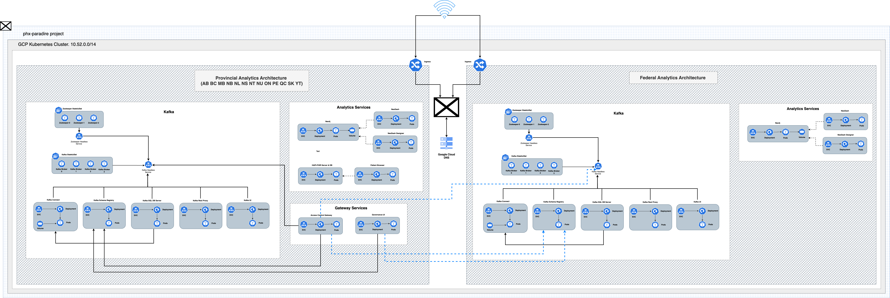

[Table of Content](./README.md) | [Prev](./part-ii.md) | [Next](./part-iv.md)

--- 

# [Part III - PT and F clusters in harmony](#part-iii---pt-and-f-clusters-in-harmony)

# Kubernetes Cluster Deployment Script

## Overview
The [`launch_pt_federal_cluster.sh`](../k8s/launch_pt_federal_cluster.sh) script is an automation tool for managing Kubernetes cluster deployments for 13 provinces and a Federal cluster. It leverages Helm, a package manager for Kubernetes, to facilitate the installation, upgrade, and uninstallation of these clusters.

## Prerequisites
- Bash shell.
- Kubernetes and Helm setup.
- Proper access to the target Kubernetes clusters.

## Usage

### Run the Script
Execute the script in a Bash environment:
./launch_pt_federal_cluster.sh

### Select an Action

1. **Install** (`1`):
   - **Action**: Executes `helm install`.
   - **Purpose**: To deploy a new set of Kubernetes resources for a specific province or the Federal cluster. It creates all necessary Kubernetes components if they don't exist.

2. **Upgrade** (`2`):
   - **Action**: Executes `helm upgrade`.
   - **Purpose**: To update an existing deployment with new configurations or updates. This is useful for updating the clusters without disrupting their current state.

3. **Uninstall** (`-1`):
   - **Action**: Executes uninstallation of the Helm release.
   - **Purpose**: To completely remove the deployment from the specified Kubernetes clusters. This includes deleting all resources associated with the deployment.

### Choose Environment (For Install and Upgrade Only)

- **Staging Environment** (`1`):
   - Retrieves Let's Encrypt staging certificates.
   - Suitable for testing and non-production environments.

- **Production Environment** (`2`):
   - Retrieves Let's Encrypt production certificates.
   - Used for live, user-facing deployments.

   The script defaults to the staging environment if an invalid choice is entered.

### Confirm Uninstallation (For Uninstall Only)

- **Confirmation Prompt**:
   - Enter `Y` to proceed with uninstallation.
   - Enter `N` to cancel the process.

   This confirmation step ensures that uninstallation is intentional, preventing accidental deletion of resources.

## Architecture

--- 

[Table of Content](./README.md) | [Top](#part-iii) | [Prev](./part-ii.md) | [Next](./part-iv.md)
