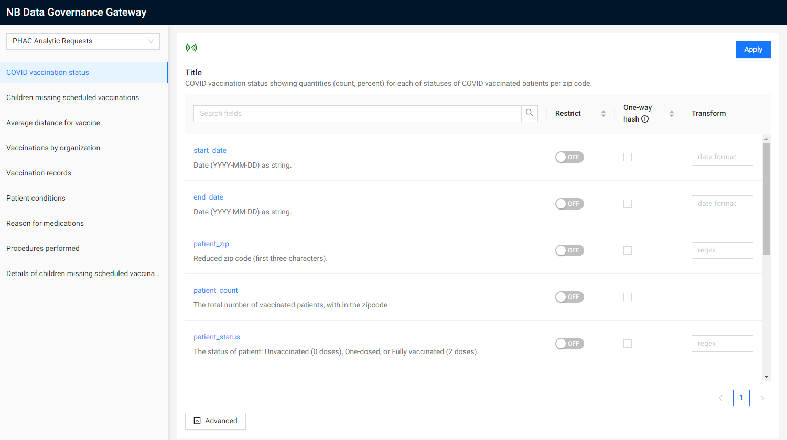

# Governance UI

The governance UI provides an interface to control the policies in use by the connected
access control gateway via a yaml ruleset [specification](../../analytics/acg/README.md#ruleset-specification).

## Kafka topics

The governance UI connects to a few topis to operate - unlike the streaming platform AVRO
is not used to format the messages.

Note: Using kafka for this purpose was done for convenience during the proof of concept.  A
reference implementation should consider security before taking this approach.

### acg-status

The `acg-status` topic is used to determine if the ACG is active, and to retreive the currently
active ruleset.  The ACG waits for a `ping` message on this topic - when received it responds
with the active ruleset.

### acg_monitor

The ACG will duplicate messages sent to the federal cluster on this topic.  The Governance UI
monitors this topic to provide a live view of data flowing to the federal platform.

### acg_ruleset_config

When a new ruleset is ready, it is published on this topic.  The ACG will get notified and
apply the new ruleset.

## Deployment

There are 3 distinct services created in project.

  - The backend
  - The frontend
  - The websocket server.

The backend and the frontend can both be served by a single docker image, the websocket
server however is a separate deployment.

- [Dockerfile](./Dockerfile)
- [Dockerfile.wsserver](./Dockerfile.wsserver)

## How did we make this
This is a [T3 Stack](https://create.t3.gg/) project bootstrapped with `create-t3-app`.
