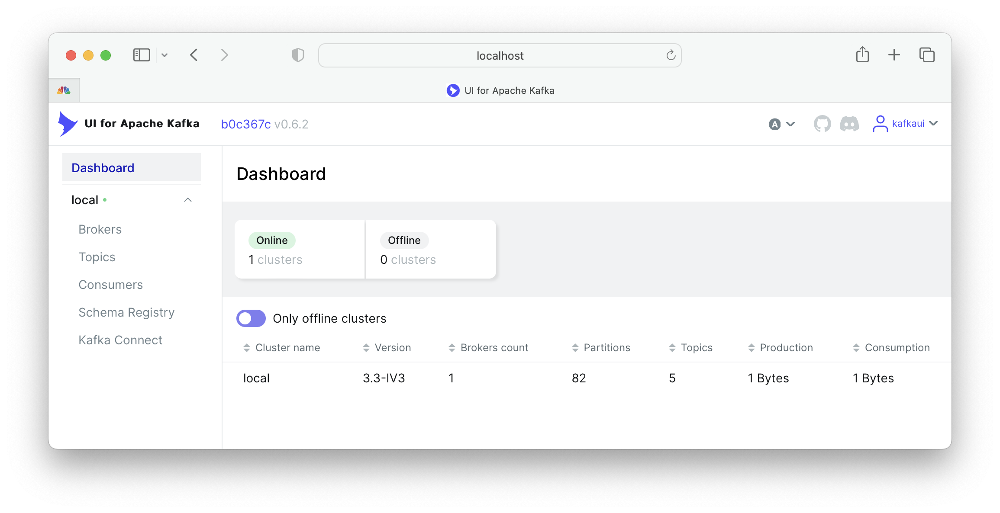
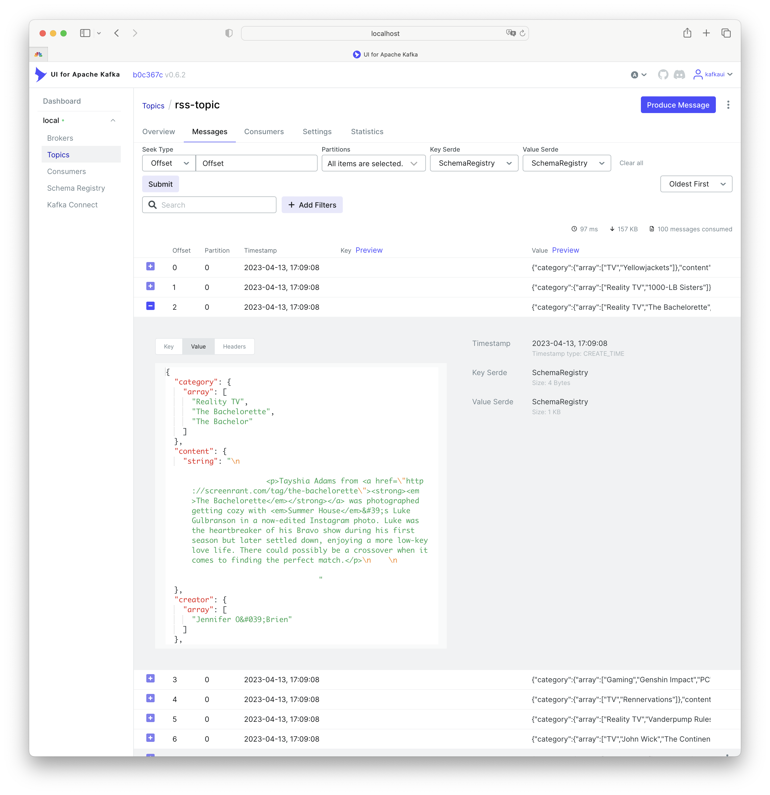

# Kafka Cluster Community Edition (CE)

## A. Overview

The cluster is constructed from `open source only` components. The `starter` cluster consists of a minimal set of `Kafka` components without any redundancy. The purpose is to quickly start development using `Kafka` on either adequate local (laptop/desktop/workstation/server) or cloud environments.

The cluster is configured as a set of `Docker` containers within ([`docker-compose.yml`](./docker-compose.yml)) consists of:
- a single instance `zookeper` of ([`Apache Zookeeper`](https://zookeeper.apache.org))
- a single instance `broker` of ([`Apache Kafka`](https://kafka.apache.org/documentation.html))
- a single instance `schema-registry` of ([`Confluent Schema Registry`](https://github.com/confluentinc/schema-registry))
- a single instance `connect` of ([`Apache Kafka Connect`](https://kafka.apache.org/documentation.html#connect))
- a single instance of  `kafka-ui` of ([`Kafka UI`](https://github.com/provectus/kafka-ui))
- and a single instance `init-kafka`, which is a `broker`, used for initialization of a number of default `Kafka` topics.

Furthermore, the cluster is configured so that it does not expose any ports for external access. Only access via `localhost` or docker bridge network `backend` is allowed.

&nbsp;

### [A.1. Quick end-to-end test](#quick-end-to-end-test)

If you just want to run an end-to-end test, make sure that the cluster is behaving correctly as expected, then run and observe:

```bash
sudo apt install jq wget
git clone https://github.com/gphin/gphin-data-pipeline.git
cd gphin-data-pipeline
git checkout --track origin/2-setup-a-kafka-cluster-in-docker-for-local-development
cd kafka_cluster
./docker/install.sh v2.17.2
./setup.sh
./start.sh
./tests/test_brokers.sh
./tests/test_schema_registry.sh
./tests/test_filepulse_connector.sh
./stop.sh
./cleanup.sh
```

&nbsp;

## B. Prerequisites

First, make sure you have `jq` and `wget` installed, if not, then:

```bash
sudo apt install jq wget
```

&nbsp;

### B.1. Clone the GitHub repository

```bash
git clone https://github.com/gphin/gphin-data-pipeline.git
```

**Important:** the templates [`starter.env`](./conf/starter.env) and [`standard.env`](./conf/standard.env) contain most of configurable versions, ports, and other information. Review and make modifications if you need.

&nbsp;

### B.2. Install `Docker Engine` and `Docker Compose` CLI plugin

**Important:** you will need the [`latest version number`](https://github.com/docker/compose/releases) of `Docker Compose` CLI plugin. For more information, see [Install the plugin manually](https://docs.docker.com/compose/install/linux/#install-the-plugin-manually).

```bash
cd kafka_cluster
./docker/install.sh v2.17.2
```

Logout (Ctrl-D) and relogin to ensure the environment is up-to-date.

For further needs:
<details>
<summary>You can test if they are correctly setup ... </summary>
<p>

```bash
./docker/test.sh
```

</p>
</details>

<details>
<summary>If you which to cleanup the docker system ... </summary>
<p>

```bash
./docker/cleanup.sh
```

</p>
</details>

<details>
<summary>If you which to uninstall Docker Engine ... </summary>
<p>

```bash
./docker/uninstall.sh
```

</p>
</details>

&nbsp;

## C. Setup

With in the folder `kafka_cluster/`, setup a set of environment variables in `.env`, then creating a number of local folders for `Kafka` components to use as volumes:

```bash
nghia_doan_gcp_hc_sc_gc_ca@gphin-vm:~/gphin-data-pipeline/kafka_cluster$ ./setup.sh
Creating volumes for zookeeper ...
kafka-ce/zk/data
kafka-ce/zk/data volume is created.
kafka-ce/zk/txn-logs
kafka-ce/zk/txn-logs volume is created.
Volumes for zookeeper created ✅

Creating volumes for brokers ...
kafka-ce/broker/data
kafka-ce/broker/data volume is created.
Volumes for brokers created ✅

Creating volumes for schema-registry ...
kafka-ce/schema-registry/data
kafka-ce/schema-registry/data volume is created.
Volumes for schema-registry created ✅

Creating volumes for connect ...
kafka-ce/connect/data
kafka-ce/connect/data volume is created.
kafka-ce/connect/plugins
kafka-ce/connect/plugins volume is created.
Volumes for connect created ✅

Creating volumes for filepulse ...
kafka-ce/connect/data/filepulse/xml
kafka-ce/connect/data/filepulse/xml volume is created.
Volumes for filepulse created ✅
```

Then start the cluster by:

```bash
nghia_doan_gcp_hc_sc_gc_ca@gphin-vm:~/gphin-data-pipeline/kafka_cluster$ ./start.sh
Start all services ...
[+] Running 7/7
 ✔ Network backend            Created                                                                                                                  0.1s
 ✔ Container zookeeper        Started                                                                                                                  0.9s
 ✔ Container broker           Started                                                                                                                  1.5s
 ✔ Container schema-registry  Started                                                                                                                  2.2s
 ✔ Container connect          Started                                                                                                                  3.2s
 ✔ Container kafka-ui         Started                                                                                                                  5.3s
 ✔ Container init-kafka       Started                                                                                                                  5.3s

Wait for zookeeper:2181 ...
zookeeper:2181 is ready ✅

Wait for broker:29092 ...
broker:29092 is ready ✅

Wait for schema-registry:8081 ...
schema-registry:8081 is ready ✅

Wait for connect:8083 ...
connect:8083 is ready ✅

Kafka cluster is ready ✅
All services have started ✅
```

Now, use `vscode` to forward port `8080` to your local browser so you can investigate the local cluster. The credentials are set in `.env`.



&nbsp;

## D. Tests

### D.1. Test console producer/consumer

The following test performs
- Create topic `console-test`, then create some text messages for test.
- Sending 3 messages into topic `console-test` to the `broker` from a console producer.
- Inspect topic `console-test`.
- Receive 3 messages from topic `console-test` by a console comsumer.
- Verify if the sent and received messages are matched, both by order and content.
- Inspect the consumer group `console-test-consumer`.
- Reset all consumer offsets of `filepulse-consumer` group.
- Receive (again, from beginning) 3 messages from topic `console-test` by a console comsumer.
- Verify if the sent and received messages are matched, both by order and content.
- Delete topic `console-test`

```bash
nghia_doan_gcp_hc_sc_gc_ca@gphin-vm:~/gphin-data-pipeline/kafka_cluster$ ./tests/test_brokers.sh
Create topic console-test ...
docker exec -it broker /bin/kafka-topics     --bootstrap-server broker:29092     --create --topic console-test
Created topic console-test.
console-test created ✅

Creating console messages ...
key1:value1
key2:value2
key3:value3

Sending 3 messages into topic console-test from broker ...
3 messages sent ✅

Aboout topic console-test ...
docker exec -it broker /bin/kafka-topics     --bootstrap-server broker:29092     --describe --topic console-test
Topic: console-test	TopicId: iIWc3RWDQ3iL5G5l6SB6-Q	PartitionCount: 1	ReplicationFactor: 1	Configs: retention.ms=-1
	Topic: console-test	Partition: 0	Leader: 1	Replicas: 1	Isr: 1

Receiving 3 messages from topic console-test ...
3 messages received ✅

key1:value1
key2:value2
key3:value3
Processed a total of 3 messages

Test sending/receiving console messages completed ✅

Get console-test-consumer ...
docker exec -it broker /bin/kafka-consumer-groups     --bootstrap-server broker:29092     --describe --group console-test-consumer;


Consumer group 'console-test-consumer' has no active members.

GROUP                 TOPIC           PARTITION  CURRENT-OFFSET  LOG-END-OFFSET  LAG             CONSUMER-ID     HOST            CLIENT-ID
console-test-consumer console-test    0          3               3               0               -               -               -

Reset all consumer offsets of console-test-consumer group ...
docker exec -it broker /bin/kafka-consumer-groups     --bootstrap-server broker:29092     --group console-test-consumer --reset-offsets --to-earliest --all-topics --execute;


GROUP                          TOPIC                          PARTITION  NEW-OFFSET
console-test-consumer          console-test                   0          0
Consumer offsets reset ✅

Receiving 3 messages from topic console-test ...
3 messages received ✅

key1:value1
key2:value2
key3:value3
Processed a total of 3 messages

Test sending/receiving console messages completed ✅

Delete topic console-test ...
docker exec -it broker /bin/kafka-topics     --bootstrap-server broker:29092     --delete --topic console-test
console-test deleted ✅
```

&nbsp;

### D.2. Test schema-registry

The test performs:
- Check if avro is one of supported schema types
- Check top level schema compatibility configuration
- List all current subjects
- Creating subject `daily-report-key` with schema in [daily-report-key.avsc](./tests/conf/daily-report-key.avsc)
- Creating subject `daily-report-value` with schema in [daily-report-value.avsc](./tests/conf/daily-report-value.avsc)
- List all current subjects
- Find ID of the `daily-report-key` schema
- Find details of the `daily-report-key` schema
- List all versions of the `daily-report-key` schema
- Find ID of the `daily-report-value` schema
- Find details of the `daily-report-value` schema
- List all versions of the `daily-report-value` schema
- Create topic `daily-report`
- Produce 12 messages to the topic `daily-report`
- Consume all messages for 5 seconds
- Delete subject `daily-report-key`
- Delete subject `daily-report-value`
- List all current subjects
- Delete topic `daily-report`

```bash
nghia_doan_gcp_hc_sc_gc_ca@gphin-vm:~/gphin-data-pipeline/kafka_cluster$ ./tests/test_schema_registry.sh
Check if avro is one of supported schema types ...
["JSON","PROTOBUF","AVRO"] are supported ✅
AVRO is supported ✅

Top level schema compatibility configuration ...
"BACKWARD"

List all current subjects ...
curl --silent -X GET http://localhost:8081/subjects | jq .[]

Creating subject daily-report-key with schema ./tests/conf/daily-report-key.avsc ...
1

Creating subject daily-report-value with schema ./tests/conf/daily-report-value.avsc ...
2

List all current subjects ...
curl --silent -X GET http://localhost:8081/subjects | jq .[]
"daily-report-key"
"daily-report-value"

Find ID of the daily-report-key...
schema_id=1


Find details of the daily-report-key...
curl --silent -X GET http://localhost:8081/subjects/daily-report-key/versions/latest
{"subject":"daily-report-key","version":1,"id":1,"schema":"{\"type\":\"record\",\"name\":\"daily_report_key\",\"namespace\":\"ca.gov.phac.cdsb.dmia.oan.dmri\",\"fields\":[{\"name\":\"date\",\"type\":\"string\"},{\"name\":\"fips\",\"type\":\"string\"}]}"}

List all versions of daily-report-key...
curl --silent -X GET http://localhost:8081/subjects/daily-report-key/versions | jq
[
  1
]

Find ID of the daily-report-value...
schema_id=2


Find details of the daily-report-value...
curl --silent -X GET http://localhost:8081/subjects/daily-report-value/versions/latest
{"subject":"daily-report-value","version":1,"id":2,"schema":"{\"type\":\"record\",\"name\":\"daily_report_value\",\"namespace\":\"ca.gov.phac.cdsb.dmia.oan.dmri\",\"doc\":\"Value record, of a daily report, containing four fields: name of the county, name of the state, number of cases, and number of deaths on the date of reporting.\",\"fields\":[{\"name\":\"county\",\"type\":\"string\"},{\"name\":\"state\",\"type\":\"string\"},{\"name\":\"cases\",\"type\":\"int\"},{\"name\":\"deaths\",\"type\":\"int\"}]}"}

List all versions of daily-report-value...
curl --silent -X GET http://localhost:8081/subjects/daily-report-value/versions | jq
[
  1
]

Create topic daily-report ...
docker exec -it broker /bin/kafka-topics     --bootstrap-server broker:29092     --create --topic daily-report
Created topic daily-report.
daily-report created ✅

Produce 12 messages ...

Consume messages ...
{"county":"Bristol","state":"Rhode Island","cases":1369,"deaths":44}
{"county":"Aiken","state":"South Carolina","cases":6791,"deaths":101}
{"county":"Jones","state":"South Dakota","cases":63,"deaths":0}
{"county":"Lawrence","state":"Tennessee","cases":2987,"deaths":38}
{"county":"Tyler","state":"Texas","cases":325,"deaths":5}
{"county":"Morgan","state":"Utah","cases":566,"deaths":3}
{"county":"Essex","state":"Vermont","cases":62,"deaths":0}
{"county":"St. Thomas","state":"Virgin Islands","cases":898,"deaths":15}
{"county":"Pulaski","state":"Virginia","cases":794,"deaths":16}
{"county":"Columbia","state":"Washington","cases":48,"deaths":3}
{"county":"Wyoming","state":"West Virginia","cases":840,"deaths":11}
{"county":"Weston","state":"Wyoming","cases":419,"deaths":2}
Processed a total of 12 messages

Delete subject daily-report-key ...
curl --silent -X DELETE http://localhost:8081/subjects/daily-report-key | jq .[]
1

Delete subject daily-report-value ...
curl --silent -X DELETE http://localhost:8081/subjects/daily-report-value | jq .[]
1

List all current subjects ...
curl --silent -X GET http://localhost:8081/subjects | jq .[]

Delete topic daily-report ...
docker exec -it broker /bin/kafka-topics     --bootstrap-server broker:29092     --delete --topic daily-report
daily-report deleted ✅
```

&nbsp;

### D.3. Test FilePulse connector

The test performs:
- List all available plugins in the `Kafka Connect` instance
- List all current (running) connectors
- List all current subjects (in the `schema-registry`)
- Creating a `filepulse` connector ...
- List all current (running) connectors
- List all current topics (the newly created topic might not available yet, until some messages are consumed into that)
- List all current subjects

```bash
nghia_doan_gcp_hc_sc_gc_ca@gphin-vm:~/gphin-data-pipeline/kafka_cluster$ ./tests/test_filepulse_connector.sh
All available plugins ...
curl -s -XGET http://localhost:8083/connector-plugins | jq '.[].class'
"io.confluent.connect.jdbc.JdbcSinkConnector"
"io.confluent.connect.jdbc.JdbcSourceConnector"
"io.streamthoughts.kafka.connect.filepulse.source.FilePulseSourceConnector"
"org.apache.kafka.connect.mirror.MirrorCheckpointConnector"
"org.apache.kafka.connect.mirror.MirrorHeartbeatConnector"
"org.apache.kafka.connect.mirror.MirrorSourceConnector"

All current connectors ...
curl -s -XGET http://localhost:8083/connectors | jq '.[]'

List all current subjects ...
curl --silent -X GET http://localhost:8081/subjects | jq .[]

Creating filepulse connector ...
HTTP/1.1 201 Created
Date: Thu, 13 Apr 2023 21:08:55 GMT
Location: http://localhost:8083/connectors/rss-filepulse-connector
Content-Type: application/json
Content-Length: 2273
Server: Jetty(9.4.48.v20220622)

{"name":"rss-filepulse-connector","config":{"connector.class":"io.streamthoughts.kafka.connect.filepulse.source.FilePulseSourceConnector","fs.listing.class":"io.streamthoughts.kafka.connect.filepulse.fs.LocalFSDirectoryListing","fs.listing.directory.path":"/data/filepulse/xml","fs.listing.filters":"io.streamthoughts.kafka.connect.filepulse.fs.filter.RegexFileListFilter","fs.listing.interval.ms":"10000","fs.cleanup.policy.class":"io.streamthoughts.kafka.connect.filepulse.fs.clean.LogCleanupPolicy ","file.filter.regex.pattern":".*\\.xml$","offset.strategy":"name","reader.xpath.expression":"/rss/channel/item","reader.xpath.result.type":"NODESET","reader.xml.force.array.on.fields":"category,creator","reader.xml.parser.validating.enabled":"true","reader.xml.parser.namespace.aware.enabled":"true","filters":"content,pubDate,Exclude","filters.content.type":"io.streamthoughts.kafka.connect.filepulse.filter.RenameFilter","filters.content.field":"encoded","filters.content.target":"content","filters.pubDate.type":"io.streamthoughts.kafka.connect.filepulse.filter.RenameFilter","filters.pubDate.field":"pubDate","filters.pubDate.target":"pub_date","filters.Exclude.type":"io.streamthoughts.kafka.connect.filepulse.filter.ExcludeFilter","filters.Exclude.fields":"comments,commentRss,enclosure,guid,post-id,thumbnail","topic":"rss-topic","tasks.file.status.storage.bootstrap.servers":"broker:29092","tasks.file.status.storage.topic":"connect-file-pulse-status","tasks.reader.class":"io.streamthoughts.kafka.connect.filepulse.fs.reader.LocalXMLFileInputReader","tasks.max":"1","value.connect.schema":"{ \"name\": \"rss_value\", \"type\":\"STRUCT\", \"fieldSchemas\": { \"link\":{\"type\":\"STRING\", \"isOptional\":false}, \"pub_date\":{\"type\":\"STRING\", \"isOptional\":false}, \"category\": {\"type\":\"ARRAY\", \"isOptional\":true, \"valueSchema\": {\"type\": \"STRING\"}}, \"content\":{\"type\":\"STRING\", \"isOptional\":true}, \"creator\": {\"type\":\"ARRAY\", \"isOptional\":true, \"valueSchema\": {\"type\": \"STRING\"}}, \"description\":{\"type\":\"STRING\", \"isOptional\":true}, \"enclosure_url\":{\"type\":\"STRING\", \"isOptional\":true}, \"title\":{\"type\":\"STRING\", \"isOptional\":true} } }","name":"rss-filepulse-connector"},"tasks":[],"type":"source"}
ß
Filepulse connector created ✅

All current connectors ...
curl -s -XGET http://localhost:8083/connectors | jq '.[]'
"rss-filepulse-connector"

All current topics ...
docker exec -it broker /bin/kafka-topics --bootstrap-server broker:29092 --list
__consumer_offsets
_kafka-connect-configs
_kafka-connect-offsets
_kafka-connect-status
_schemas
connect-file-pulse-status
default-topic-1
default-topic-2
default-topic-3

List all current subjects ...
curl --silent -X GET http://localhost:8081/subjects | jq .[]
```

Now on the local browser `kafka-ui` tab, by choosing `Topics` menuitem on the left menu, and then `rss-topic` on the list of the topic, then `Messages` tab, we can see all `100` consumed messages.



&nbsp;

## E. Stop and Cleanup

The `stop.sh` script shutdown the `Docker Compose` services and removes the containers.

```bash
nghia_doan_gcp_hc_sc_gc_ca@gphin-vm:~/gphin-data-pipeline/kafka_cluster$ ./stop.sh
Stopping all services ...
[+] Running 7/7
 ✔ Container kafka-ui         Removed                                                                                                                              2.4s
 ✔ Container init-kafka       Removed                                                                                                                              0.0s
 ✔ Container connect          Removed                                                                                                                             10.4s
 ✔ Container schema-registry  Removed                                                                                                                              0.7s
 ✔ Container broker           Removed                                                                                                                              1.3s
 ✔ Container zookeeper        Removed                                                                                                                              0.6s
 ✔ Network backend            Removed                                                                                                                              0.3s
All services are stopped ✅
```

The `cleanup.sh` script removes all local folders (created previously) for `Kafka` components, orphan `Docker` volumes, and removes `.env` file.

```bash
nghia_doan_gcp_hc_sc_gc_ca@gphin-vm:~/gphin-data-pipeline/kafka_cluster$ ./cleanup.sh
Stopping all services ...
All services are stopped ✅

Shutting down containers...
Containers shutdown ✅

Deleting volumes for neo4j ...
neo4j/data
neo4j/import
neo4j/plugins
Volumes for neo4j deleted ✅

Deleting volumes for filepulse ...
kafka-ce/connect/data/filepulse
Volumes for filepulse deleted ✅

Deleting volumes for spooldir ...
kafka-ce/connect/data/spooldir
Volumes for spooldir deleted ✅

Deleting volumes for kcat ...
kafka-ce/kcat
Volumes for kcat deleted ✅

Deleting volumes for ksqldb-cli ...
kafka-ce/ksqldb-cli
Volumes for ksqldb-cli deleted ✅

Deleting volumes for connect ...
kafka-ce/connect
kafka-ce/connect2
kafka-ce/connect3
Volumes for connect deleted ✅

Deleting volumes for schema-registry ...
kafka-ce/schema-registry
Volumes for schema-registry deleted ✅

Deleting volumes for brokers ...
kafka-ce/broker
kafka-ce/broker2
kafka-ce/broker3
Volumes for brokers deleted ✅

Deleting volumes for zookeeper ...
kafka-ce/zk
Volumes for zookeeper deleted ✅
```

&nbsp;

## F. Default Cluster (to be added - not included now)

In addition to the components of the Starter cluster, two more instances of each of `Kafka Broker` and `Kafka Connect` are used to ensure better performance for streaming event handling as well as better throughput for getting data into and out-of `Kafka`. `ksqlDB`, `ksqlDB CLI` are added to handle in-stream filtering, aggregation, and transformation. `Rest Proxy` is to offer an alternative to issue `Kafka` standard commands to the cluster via HTTP, where `Kafkakat CLI` offers a multi-purpose and convinient tool to handled complex command via traditional CLI.

The cluster is configured as a set of `Docker` containers within ([`kafka-docker-compose.yml`](./kafka-docker-compose.yml)) consists of:
- a single instance `zookeper` of ([`Apache Zookeeper`](https://zookeeper.apache.org))
- three instances `broker`, `broker2`, and `broker3` of ([`Apache Kafka`](https://kafka.apache.org/documentation.html))
- a single instance `schema-registry` of ([`Confluent Schema Registry`](https://github.com/confluentinc/schema-registry))
- three instances `connect`, `connect2`, and `connect3` ([`Apache Kafka Connect`](https://kafka.apache.org/documentation.html#connect))
- a single instance `ksqldb-server` of ([`Confluent ksqlDB`](https://ksqldb.io/))
- a single instance `ksqldb-cli` of ([`Confluent ksqlDB CLI`](https://docs.ksqldb.io/en/latest/operate-and-deploy/installation/cli-config/))
- a single instance `rest-proxy` of ([`Confluent Rest Proxy`](https://github.com/confluentinc/kafka-rest))
- a single instance `kafkacat` of ([`Kafkacat CLI`](https://docs.confluent.io/platform/current/app-development/kafkacat-usage.html))
- a single instance `kafka-ui` of ([`Kafka UI`](https://github.com/provectus/kafka-ui))
- and a single instance of `init-kafka`, which is a `broker`, used for initialization of a number of default `Kafka` topics.
