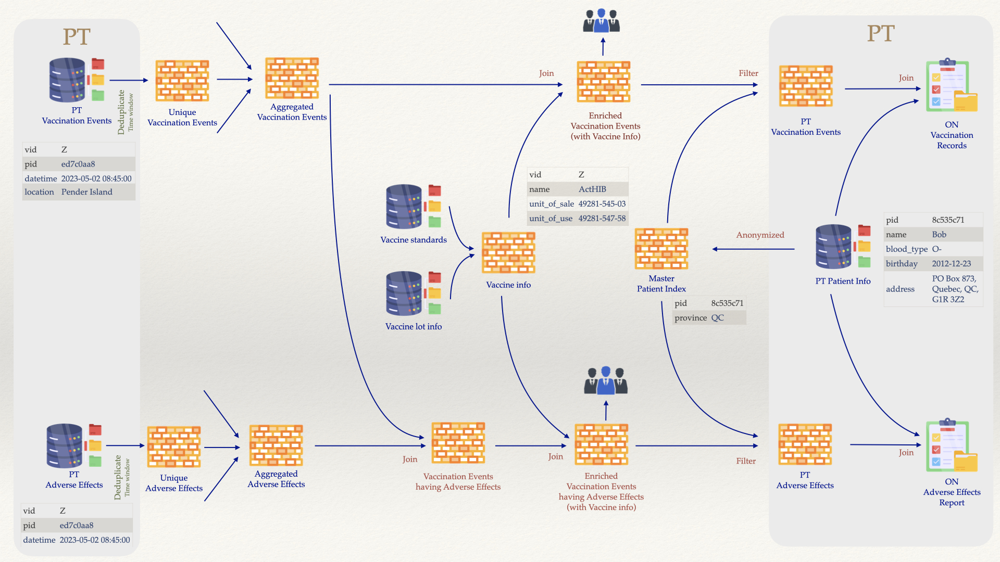

# An imaginative vaccination story

*Disclaimer:*
- *This story is for the exercise how to use design patterns of in-stream processing blended with some best practices in Data Mesh federated computational governance to show how unbounded streams of data events can be processed, aggregated, filtered, transformed, and reused across jurisdictions and bringing data-as-products together.*
- *This story does not aim to solve any problems of vaccination data management caused by incorrectly designed business process, malpractices of IT technologies, or misconception in applications. It would neither shed any light on what Data Mesh principles are, nor reveal why at-source data collection with proper data governance policy supported by event sourcing infrastructure can save the day.*
- *This story focuses on data on the move, with many copies, incomplete, related to things that also move, ephemeral, and never at rest.*

## B. The story

### B.1. The vaccines

In the beginning (of this story), there are seven types of vaccines:

| vid | name              | unit_of_sale |  unit_of_use |
|:---:|-------------------|:------------:|:------------:|
|  T  | ActHIB            | 49281-545-03 | 49281-547-58 |
|  U  | IMOVAX RABIES     | 49281-250-51 | 49281-249-01 |
|  V  | IPOL vial         | 49281-860-10 | 49281-860-78 |
|  X  | Menveo            | 58160-955-09 | 58160-958-01 |
|  Y  | Typhim Vi syringe | 49281-790-51 | 49281-790-88 |
|  Z  | Vivotif           | 46028-208-01 | 46028-219-11 |
|  W  | BIOTHRAX          | 49281-790-20 | 49281-790-38 |

The `vid` - vaccine identifier is an obscured string for identification for a vaccine lot from the manufacturer. The record can contain additional vaccine information from some vaccine standards. Note that for the simplicity of the exercise, the assumption here is a vaccine record can provide adequate information about an administered dose. 

It is important to emphasize that knowing the identifier itself would not mean to know the actual vaccine or the lot or any other information about the administered dose.

### B.2. The actors

Alice lives in Ottawa. Her personal information record is kept by her family doctor.

| name    | blood_type | birthday   | address                                         |
|---------|------------|------------|-------------------------------------------------|
| Alice   | A+         | 1970-03-02 | 12 Oak Street, Ottawa, ON, K1H 0A0              |

Bob lives somewhere in Quebec, he uses a PO. Box for correspondence.

| name    | blood_type | birthday   | address                                         |
|---------|------------|------------|-------------------------------------------------|
| Bob     | O-         | 2012-12-23 | PO Box 873, Quebec, QC, G1R 3Z2                 |

Charlie lives in a rural area of British Columbia,

| name    | blood_type | birthday   | address                                         |
|---------|------------|------------|-------------------------------------------------|
| Charlie | AB-        | 2021-10-04 | 3757 Anchor Way RR2                             |


Note that these information records are kept by their health providers, or in a patient information system, or in a person record system, ... Any of these can just be a simple electronic database, a sophisticated HL7-compliant HIS, an EHR management system, or anything similar. All of them closely guard these records and do not expose to any other than their own users.

In order for quick identification of patients, and to `anonymized` users records to the outside world, short identifiers are used. Thus, the `pid` column, as seen in above tables, are hash codes used for anonymizing a personal record. [Hash function](https://en.wikipedia.org/wiki/Hash_function) is a simple practice for this purpose. 
- It *uniquely* represents such a record.
- It is *impossible to reverse-engineer* the record from the generated the hash.
- It is *impossible to guess* the record by trying records with partially different content.

To have more information how these hash codes can be generated, visit [Online Toools](https://emn178.github.io/online-tools/crc32.html) for the `CRC32` hash. Other hash algorithms are also available. `SHA512` can be a good choice for personal info hash. Here are records and their the generated hash codes by the `CRC32` tool, try it out.

|                            personal record                           | hash (CRC32) |
|:--------------------------------------------------------------------:|:------------:|
| { "name": "Alice", "blood_type": "A+", "birthday": "1970-03-02" }    |   07dc617f   |
| { "name": "Bob", "blood_type": "O-", "birthday": "2012-12-23" }      |   a74d8d56   |
| { "name": "Charlie", "blood_type": "AB-", "birthday": "2021-10-04" } |   35d8d75c   |

By adding some random `seeds` the security level can be increase. There are other methods as well.

The `pid` will be used with in a jurisdiction, where the personal record is keep, to identify the personal record with ease. Outside of the jurisdiction, it is only an identifier of someone belongs to the said jurisdiction and that's all. This way the collection fo `pid` together with the identifier of the jurisdiction form a unique way to identify an person without revealing the person's information. 

Thus, in Ontario, a `pid` hash is generated and added to Alice's record in their vault of personal records

| pid      | name    | blood_type | birthday   | address                                         |
|----------|---------|------------|------------|-------------------------------------------------|
| 07dc617f | Alice   | A+         | 1970-03-02 | 12 Oak Street, Ottawa, ON, K1H 0A0              |

similarly for Bob:

| pid      | name    | blood_type | birthday   | address                                         |
|----------|---------|------------|------------|-------------------------------------------------|
| a74d8d56 | Bob     | O-         | 2012-12-23 | PO Box 873, Quebec, QC, G1R 3Z2                 |

and for Charlie:

| pid      | name    | blood_type | birthday   | address                                         |
|----------|---------|------------|------------|-------------------------------------------------|
| 35d8d75c | Charlie | AB-        | 2021-10-04 | 3757 Anchor Way RR2


The three provinces British Columbia, Ontario, and Quebec, sent a list of `pid` to the Federal. The collection of (`pid`, jurisdiction identifier) forms a `Master Person Index` (a practice well known in some countries with extensive practice in personal information protection.) This way personal records are anonymized (and protected). 

|    pid   | province |
|:--------:|:--------:|
| 07dc617f |    ON    |
| a74d8d56 |    QC    |
| 35d8d75c |    BC    |

This way, for Alice, Ontario is the one and only that can identify (and use) her personal record based on the `pid`.

Note that the exercise's data can be extended to include multiple actors for a jurisdiction. It is constructed as above in order to easily follow the narrative, observing data, comparison of changes.

### B.2. The vaccination events

Alice, Bob, and Charlie got vaccinated during the months of May, June, and July.

Below is an information record - called `vaccination event` - consists of:
- the administration of a dose `BIOTHRAX` (prevention of disease caused by Bacillus anthracis in persons between 18 and 65), identified by `vid` `X`,
- for Alice, identified by `pid` `07dc617f`,
- on `2023-05-01` at `10:00 AM`,
- in `Ottawa`.

```json
{ "vid": "X", "pid": "07dc617f" } { "datetime": "2023-05-01 10:00:00", "location": "Ottawa" }
```

Note that the event has two parts:
- the key part, a combination of vaccine identifier and patient identifier: `{ "vid": "X", "pid": "07dc617f" }`,
- the value part, a combination of date plus time and location of the event: `{ "datetime": "2023-05-01 10:00:00", "location": "Ottawa" }`.

It is important to note that since information comes in `unbounded streams`, each event can be modified, changed, repeated, so there is no such way or property or combination of property that can *uniquely* identify an `in-stream event`. **This is a great challenge when migrating from transactional data architecture to truly event streaming architecture**.

Each of the three provinces sent a stream vaccination events to the Federal. 

Here's Ontario's stream, all of the records here belong to Alice (`07dc617f`). 

```json
{ "vid": "X", "pid": "07dc617f" } { "datetime": "2023-05-01 10:00:00", "location": "Ottawa" }
{ "vid": "Y", "pid": "07dc617f" } { "datetime": "2023-05-05 10:00:00", "location": "Ottawa" }
{ "vid": "X", "pid": "07dc617f" } { "datetime": "2023-06-02 10:00:00", "location": "Ottawa" }
{ "vid": "X", "pid": "07dc617f" } { "datetime": "2023-06-02 22:00:00", "location": "Ottawa" }
{ "vid": "X", "pid": "07dc617f" } { "datetime": "2023-07-10 13:00:00", "location": "Ottawa" }
```

here's Quebec's stream, most of the records here belong to Bob (`a74d8d56`). However two records indicate two events for Alice, when she was in Montreal (once is a duplicate of the other, see below.)

```json
{ "vid": "Y", "pid": "a74d8d56" } { "datetime": "2023-05-02 13:30:00", "location": "Quebec" }
{ "vid": "X", "pid": "a74d8d56" } { "datetime": "2023-06-01 12:30:00", "location": "Quebec" }
{ "vid": "Z", "pid": "a74d8d56" } { "datetime": "2023-07-12 14:30:00", "location": "Quebec" }
{ "vid": "Z", "pid": "07dc617f" } { "datetime": "2023-07-21 15:00:00", "location": "Montreal" }
{ "vid": "W", "pid": "a74d8d56" } { "datetime": "2023-07-21 17:30:00", "location": "Quebec" }
{ "vid": "Z", "pid": "07dc617f" } { "datetime": "2023-07-22 08:00:00", "location": "Montreal" }
```

and here's British Columbia stream,all of the records here belong to Charlie (`35d8d75c`). 

```json
{ "vid": "Z", "pid": "35d8d75c" } { "datetime": "2023-05-02 08:45:00", "location": "Pender Island" }
{ "vid": "T", "pid": "35d8d75c" } { "datetime": "2023-05-04 09:45:00", "location": "Pender Island" }
{ "vid": "T", "pid": "35d8d75c" } { "datetime": "2023-05-05 07:45:00", "location": "Pender Island" }
{ "vid": "U", "pid": "35d8d75c" } { "datetime": "2023-06-16 11:45:00", "location": "Pender Island" }
{ "vid": "V", "pid": "35d8d75c" } { "datetime": "2023-07-21 17:45:00", "location": "Pender Island" }
```

In total there are sixteen (`16`) vaccination events, however three (`3`) of them are duplicated, these were sent a few hours later, but not exceeding 24 hours, thus the incoming streams altogether contain sixteen events. 

| vid |    pid   |       datetime      |    location   | duplicate | adverse |
|:---:|:--------:|:-------------------:|:-------------:|:---------:|:-------:|
|  X  | 07dc617f | 2023-05-01 10:00:00 |     Ottawa    |           |         |
|  Z  | 35d8d75c | 2023-05-02 08:45:00 | Pender Island |           |    A    |
|  Y  | a74d8d56 | 2023-05-02 13:30:00 |     Quebec    |           |         |
|  T  | 35d8d75c | 2023-05-04 09:45:00 | Pender Island |   (1) O   |         |
|  T  | 35d8d75c | 2023-05-05 07:45:00 | Pender Island |   (1) D   |         |
|  Y  | 07dc617f | 2023-05-05 10:00:00 |     Ottawa    |           |         |
|  X  | a74d8d56 | 2023-06-01 12:30:00 |     Quebec    |           |    A    |
|  X  | 07dc617f | 2023-06-02 10:00:00 |     Ottawa    |   (2) O   |         |
|  X  | 07dc617f | 2023-06-02 22:00:00 |     Ottawa    |   (2) D   |         |
|  U  | 35d8d75c | 2023-06-16 11:45:00 | Pender Island |           |         |
|  X  | 07dc617f | 2023-07-10 13:00:00 |     Ottawa    |           |         |
|  Z  | a74d8d56 | 2023-07-12 14:30:00 |     Quebec    |           |         |
|  Z  | 07dc617f | 2023-07-21 15:00:00 |    Montreal   |   (3) O   |    A    |
|  W  | a74d8d56 | 2023-07-21 17:30:00 |     Quebec    |           |         |
|  V  | 35d8d75c | 2023-07-21 17:45:00 | Pender Island |           |    A    |
|  Z  | 07dc617f | 2023-07-22 08:00:00 |    Montreal   |   (3) D   |    A    |

Notes:
- let assume that any vaccination of the same type for the same person later than `36` hours comparing with the previous one is considered as new one,
- the extra column `duplicate` (for this explanation only and not included in the event streams) indicates if an event is an original one, for example `(2) O` indicates the original event, whereas `(2) D` indicates the duplicate of the event (that has duplicate(s).)
- the extra columns `adverse` (for this explanation only and not included in the event streams) is to indicate that the associated event is reported to have adverse effects.

### B.3. The adverse effects

In addition, four vaccinations resulted in the patients having adverse effects, these are recorded and sent later in a separate data stream.

No reports from Ontario, 

three from Quebec, one from Bob's vaccination, two from Alice's,

```json
{ "vid": "X", "pid": "a74d8d56" }|{ "datetime": "2023-06-01 12:30:00" }
{ "vid": "Z", "pid": "07dc617f" }|{ "datetime": "2023-07-21 15:00:00" }
{ "vid": "Z", "pid": "07dc617f" }|{ "datetime": "2023-07-21 17:45:00" }
```

two from British Columbia, all from Charlie's.

```json
{ "vid": "Z", "pid": "35d8d75c" } { "datetime": "2023-05-02 08:45:00" }
{ "vid": "V", "pid": "35d8d75c" } { "datetime": "2023-07-21 17:45:00" }
```

Here the aggregated view,

| vid |    pid   |       datetime      | duplicate | adverse |
|:---:|:--------:|:-------------------:|:---------:|:-------:|
|  Z  | ed7c0aa8 | 2023-05-02 08:45:00 |           |    A    |
|  X  | 8c535c71 | 2023-06-01 12:30:00 |           |    A    |
|  Z  | 06ecb949 | 2023-07-21 15:00:00 |   (3) O   |    A    |
|  V  | ed7c0aa8 | 2023-07-21 17:45:00 |           |    A    |
|  Z  | 06ecb949 | 2023-07-22 08:00:00 |   (3) D   |    A    |

&nbsp;

## C. Objectives

The diagram below describes three timelines of vaccinations, one per person. The data points for vaccination events and adverse effects are indicated with square around vaccine identifier (letter). On the right, there are some objectives:
1. At PT-level:
    - to enrich personal vaccination records with vaccine information provided by Federal agencies such as vaccine standards, or vaccine lot information by manufacturers and supply chains.
    - to keep personal vaccination records up-to-date, with vaccination events happening outside of the jurisdiction.
    - a bonus feature is ease of deduplication, simple access, and make personal vaccination records truly portable.
    - to match adverse effect with the original vaccination event (since they could come in from different sources in different data streams)
    - to enrich adverse effect with vaccine information from organizations outside of the jurisdiction,
    - to receive recommendations for treatment or subsequent action in case of adverse effect, 
    - to receive notifications for upcoming or recommended vaccinations based on vaccination history.
2. At F-level:
    - to provide just-in-time aggregated vaccination data for surveillance, research, and policy decisions
    - to enrich vaccination events and adverse effects with vaccine standards, lot, and other related information from genuine and approved sources.
    - to build trust and provide platform for collaboration between PT, F, other public agencies, private sector, and citizens.
3. For citizens:
    - With proper authentication and authorization mechanism, access to vaccination records can be made with ease.


## D. In-stream event processing by ksqlDB

[ksqlDB](https://ksqldb.io/) is a component of `Kafka` `open source` ecosystem purpose-built for stream processing applications.
- Real-time: Build applications that respond immediately to events. Craft materialized views over streams. Receive real-time push updates, or pull current state on demand.
- `Kafka`-native: Seamlessly leverage `Apache Kafka®` infrastructure to deploy stream-processing workloads and bring powerful new capabilities to applications.
- What, not how: Use a familiar, lightweight syntax to pack a powerful punch. Capture, process, and serve queries using only `SQL`. No other languages or services are required.

Detailed documentation can be found [here](https://docs.ksqldb.io/en/latest/).

Here's its code [GitHub repository](https://github.com/confluentinc/ksql).

&nbsp;

## E. Implementation with stream processing

The diagram below describes how do we attempt to reach the objectives using implementation based on `Kafka Streams` with `ksqlDB`.



Get the repository

```bash
git clone https://github.com/PHACDataHub/data-mesh-ref-impl.git
cd data-mesh-ref-impl/usvdm/kafka_streams
```

Setup for `Ubuntu`:

```bash
sudo apt install jq wget
cd kafka_cluster
./docker/install.sh v2.17.2
```

Setup `Mac OS`: first install [`brew`](https://brew.sh), then `Docker Desktop`(https://www.docker.com/products/docker-desktop/)
```bash
brew install jq
brew install wget
```

Start the `Kafka` cluster and feed the messages (persons, vaccines, vaccination events, adverse effects)
```bash
./setup.sh
```

<details>
<summary>You would see this output ...</summary>
<p>

```bash
./setup.sh
Creating volumes for zookeeper ...
kafka-ce/zk/data
Password:
kafka-ce/zk/data volume is created.
kafka-ce/zk/txn-logs
kafka-ce/zk/txn-logs volume is created.
Volumes for zookeeper created ✅

Creating volumes for brokers ...
kafka-ce/broker/data
kafka-ce/broker/data volume is created.
Volumes for brokers created ✅

Creating volumes for schema-registry ...
kafka-ce/schema-registry/data
kafka-ce/schema-registry/data volume is created.
Volumes for schema-registry created ✅

Creating volumes for connect ...
kafka-ce/connect/data
kafka-ce/connect/data volume is created.
kafka-ce/connect/plugins
kafka-ce/connect/plugins volume is created.
Volumes for connect created ✅

Creating volumes for ksqldb-cli ...
kafka-ce/ksqldb-cli/scripts
kafka-ce/ksqldb-cli/scripts volume is created.
Volumes for ksqldb-cli created ✅

Creating volumes for filepulse ...
kafka-ce/connect/data/filepulse/xml
kafka-ce/connect/data/filepulse/xml volume is created.
Volumes for filepulse created ✅

Start all services ...
[+] Running 9/9
 ✔ Network backend            Created                                                                                                                              0.0s
 ✔ Container zookeeper        Started                                                                                                                              0.5s
 ✔ Container broker           Started                                                                                                                              0.8s
 ✔ Container schema-registry  Started                                                                                                                              1.0s
 ✔ Container connect          Started                                                                                                                              1.2s
 ✔ Container kafka-ui         Started                                                                                                                              1.5s
 ✔ Container init-kafka       Started                                                                                                                              1.4s
 ✔ Container ksqldb-server    Started                                                                                                                              1.4s
 ✔ Container ksqldb-cli       Started                                                                                                                              1.7s

Wait for zookeeper:2181 ...
zookeeper:2181 is ready ✅

Wait for broker:29092 ...
broker:29092 is ready ✅

Wait for schema-registry:8081 ...
schema-registry:8081 is ready ✅

Wait for connect:8083 ...
connect:8083 is ready ✅

Wait for ksqldb-server:8088 ...
ksqldb-server:8088 is ready ✅

Kafka cluster is ready ✅
All services have started ✅
Check if avro is one of supported schema types ...
["JSON","PROTOBUF","AVRO"] are supported ✅
AVRO is supported ✅

Top level schema compatibility configuration ...
"BACKWARD"

List all current subjects ...
curl --silent -X GET http://localhost:8081/subjects | jq .[]

Creating subject vaccines-key with schema /Users/nghia/work/data-mesh-ref-impl/usvdm/kafka_streams/conf/vaccines-key.avsc ...
1

Creating subject vaccines-value with schema /Users/nghia/work/data-mesh-ref-impl/usvdm/kafka_streams/conf/vaccines-val.avsc ...
2

List all current subjects ...
curl --silent -X GET http://localhost:8081/subjects | jq .[]
"vaccines-key"
"vaccines-value"

Find ID of the vaccines-key...
schema_id=1


Find details of the vaccines-key...
curl --silent -X GET http://localhost:8081/subjects/vaccines-key/versions/latest
{"subject":"vaccines-key","version":1,"id":1,"schema":"{\"type\":\"record\",\"name\":\"vaccine_key\",\"namespace\":\"ca.gov.phac.cdsb.dmia.oan.dmri\",\"fields\":[{\"name\":\"vid\",\"type\":\"string\"}]}"}

List all versions of vaccines-key...
curl --silent -X GET http://localhost:8081/subjects/vaccines-key/versions | jq
[
  1
]

Find ID of the vaccines-value...
schema_id=2


Find details of the vaccines-value...
curl --silent -X GET http://localhost:8081/subjects/vaccines-value/versions/latest
{"subject":"vaccines-value","version":1,"id":2,"schema":"{\"type\":\"record\",\"name\":\"vaccine_value\",\"namespace\":\"ca.gov.phac.cdsb.dmia.oan.dmri\",\"fields\":[{\"name\":\"name\",\"type\":\"string\"},{\"name\":\"unit_of_sale\",\"type\":\"string\"},{\"name\":\"unit_of_use\",\"type\":\"string\"}]}"}

List all versions of vaccines-value...
curl --silent -X GET http://localhost:8081/subjects/vaccines-value/versions | jq
[
  1
]

Create topic vaccines ...
docker exec -it broker /bin/kafka-topics     --bootstrap-server broker:29092     --create --topic vaccines
Created topic vaccines.
vaccines created ✅

Produce 6 messages for vaccines ...

Check if avro is one of supported schema types ...
["JSON","PROTOBUF","AVRO"] are supported ✅
AVRO is supported ✅

Top level schema compatibility configuration ...
"BACKWARD"

List all current subjects ...
curl --silent -X GET http://localhost:8081/subjects | jq .[]
"vaccines-key"
"vaccines-value"

Creating subject persons-BC-key with schema /Users/nghia/work/data-mesh-ref-impl/usvdm/kafka_streams/conf/persons-BC-key.avsc ...
3

Creating subject persons-BC-value with schema /Users/nghia/work/data-mesh-ref-impl/usvdm/kafka_streams/conf/persons-BC-val.avsc ...
4

List all current subjects ...
curl --silent -X GET http://localhost:8081/subjects | jq .[]
"persons-BC-key"
"persons-BC-value"
"vaccines-key"
"vaccines-value"

Find ID of the persons-BC-key...
schema_id=3


Find details of the persons-BC-key...
curl --silent -X GET http://localhost:8081/subjects/persons-BC-key/versions/latest
{"subject":"persons-BC-key","version":1,"id":3,"schema":"{\"type\":\"record\",\"name\":\"person_bc_key\",\"namespace\":\"ca.gov.phac.cdsb.dmia.oan.dmri\",\"fields\":[{\"name\":\"pid\",\"type\":\"string\"}]}"}

List all versions of persons-BC-key...
curl --silent -X GET http://localhost:8081/subjects/persons-BC-key/versions | jq
[
  1
]

Find ID of the persons-BC-value...
schema_id=4


Find details of the persons-BC-value...
curl --silent -X GET http://localhost:8081/subjects/persons-BC-value/versions/latest
{"subject":"persons-BC-value","version":1,"id":4,"schema":"{\"type\":\"record\",\"name\":\"person_bc_value\",\"namespace\":\"ca.gov.phac.cdsb.dmia.oan.dmri\",\"fields\":[{\"name\":\"name\",\"type\":\"string\"},{\"name\":\"blood_type\",\"type\":\"string\"},{\"name\":\"birthday\",\"type\":\"string\"},{\"name\":\"address\",\"type\":\"string\"}]}"}

List all versions of persons-BC-value...
curl --silent -X GET http://localhost:8081/subjects/persons-BC-value/versions | jq
[
  1
]

Create topic persons-BC ...
docker exec -it broker /bin/kafka-topics     --bootstrap-server broker:29092     --create --topic persons-BC
Created topic persons-BC.
persons-BC created ✅

Produce 1 messages for persons-BC ...

Check if avro is one of supported schema types ...
["JSON","PROTOBUF","AVRO"] are supported ✅
AVRO is supported ✅

Top level schema compatibility configuration ...
"BACKWARD"

List all current subjects ...
curl --silent -X GET http://localhost:8081/subjects | jq .[]
"persons-BC-key"
"persons-BC-value"
"vaccines-key"
"vaccines-value"

Creating subject persons-ON-key with schema /Users/nghia/work/data-mesh-ref-impl/usvdm/kafka_streams/conf/persons-ON-key.avsc ...
5

Creating subject persons-ON-value with schema /Users/nghia/work/data-mesh-ref-impl/usvdm/kafka_streams/conf/persons-ON-val.avsc ...
6

List all current subjects ...
curl --silent -X GET http://localhost:8081/subjects | jq .[]
"persons-BC-key"
"persons-BC-value"
"persons-ON-key"
"persons-ON-value"
"vaccines-key"
"vaccines-value"

Find ID of the persons-ON-key...
schema_id=5


Find details of the persons-ON-key...
curl --silent -X GET http://localhost:8081/subjects/persons-ON-key/versions/latest
{"subject":"persons-ON-key","version":1,"id":5,"schema":"{\"type\":\"record\",\"name\":\"person_on_key\",\"namespace\":\"ca.gov.phac.cdsb.dmia.oan.dmri\",\"fields\":[{\"name\":\"pid\",\"type\":\"string\"}]}"}

List all versions of persons-ON-key...
curl --silent -X GET http://localhost:8081/subjects/persons-ON-key/versions | jq
[
  1
]

Find ID of the persons-ON-value...
schema_id=6


Find details of the persons-ON-value...
curl --silent -X GET http://localhost:8081/subjects/persons-ON-value/versions/latest
{"subject":"persons-ON-value","version":1,"id":6,"schema":"{\"type\":\"record\",\"name\":\"person_on_value\",\"namespace\":\"ca.gov.phac.cdsb.dmia.oan.dmri\",\"fields\":[{\"name\":\"name\",\"type\":\"string\"},{\"name\":\"blood_type\",\"type\":\"string\"},{\"name\":\"birthday\",\"type\":\"string\"},{\"name\":\"address\",\"type\":\"string\"}]}"}

List all versions of persons-ON-value...
curl --silent -X GET http://localhost:8081/subjects/persons-ON-value/versions | jq
[
  1
]

Create topic persons-ON ...
docker exec -it broker /bin/kafka-topics     --bootstrap-server broker:29092     --create --topic persons-ON
Created topic persons-ON.
persons-ON created ✅

Produce 1 messages for persons-ON ...

Check if avro is one of supported schema types ...
["JSON","PROTOBUF","AVRO"] are supported ✅
AVRO is supported ✅

Top level schema compatibility configuration ...
"BACKWARD"

List all current subjects ...
curl --silent -X GET http://localhost:8081/subjects | jq .[]
"persons-BC-key"
"persons-BC-value"
"persons-ON-key"
"persons-ON-value"
"vaccines-key"
"vaccines-value"

Creating subject persons-QC-key with schema /Users/nghia/work/data-mesh-ref-impl/usvdm/kafka_streams/conf/persons-QC-key.avsc ...
7

Creating subject persons-QC-value with schema /Users/nghia/work/data-mesh-ref-impl/usvdm/kafka_streams/conf/persons-QC-val.avsc ...
8

List all current subjects ...
curl --silent -X GET http://localhost:8081/subjects | jq .[]
"persons-BC-key"
"persons-BC-value"
"persons-ON-key"
"persons-ON-value"
"persons-QC-key"
"persons-QC-value"
"vaccines-key"
"vaccines-value"

Find ID of the persons-QC-key...
schema_id=7


Find details of the persons-QC-key...
curl --silent -X GET http://localhost:8081/subjects/persons-QC-key/versions/latest
{"subject":"persons-QC-key","version":1,"id":7,"schema":"{\"type\":\"record\",\"name\":\"person_qc_key\",\"namespace\":\"ca.gov.phac.cdsb.dmia.oan.dmri\",\"fields\":[{\"name\":\"pid\",\"type\":\"string\"}]}"}

List all versions of persons-QC-key...
curl --silent -X GET http://localhost:8081/subjects/persons-QC-key/versions | jq
[
  1
]

Find ID of the persons-QC-value...
schema_id=8


Find details of the persons-QC-value...
curl --silent -X GET http://localhost:8081/subjects/persons-QC-value/versions/latest
{"subject":"persons-QC-value","version":1,"id":8,"schema":"{\"type\":\"record\",\"name\":\"person_qc_value\",\"namespace\":\"ca.gov.phac.cdsb.dmia.oan.dmri\",\"fields\":[{\"name\":\"name\",\"type\":\"string\"},{\"name\":\"blood_type\",\"type\":\"string\"},{\"name\":\"birthday\",\"type\":\"string\"},{\"name\":\"address\",\"type\":\"string\"}]}"}

List all versions of persons-QC-value...
curl --silent -X GET http://localhost:8081/subjects/persons-QC-value/versions | jq
[
  1
]

Create topic persons-QC ...
docker exec -it broker /bin/kafka-topics     --bootstrap-server broker:29092     --create --topic persons-QC
Created topic persons-QC.
persons-QC created ✅

Produce 1 messages for persons-QC ...

Check if avro is one of supported schema types ...
["JSON","PROTOBUF","AVRO"] are supported ✅
AVRO is supported ✅

Top level schema compatibility configuration ...
"BACKWARD"

List all current subjects ...
curl --silent -X GET http://localhost:8081/subjects | jq .[]
"persons-BC-key"
"persons-BC-value"
"persons-ON-key"
"persons-ON-value"
"persons-QC-key"
"persons-QC-value"
"vaccines-key"
"vaccines-value"

Creating subject vaccination-events-BC-key with schema /Users/nghia/work/data-mesh-ref-impl/usvdm/kafka_streams/conf/vaccination-events-BC-key.avsc ...
9

Creating subject vaccination-events-BC-value with schema /Users/nghia/work/data-mesh-ref-impl/usvdm/kafka_streams/conf/vaccination-events-BC-val.avsc ...
10

List all current subjects ...
curl --silent -X GET http://localhost:8081/subjects | jq .[]
"persons-BC-key"
"persons-BC-value"
"persons-ON-key"
"persons-ON-value"
"persons-QC-key"
"persons-QC-value"
"vaccination-events-BC-key"
"vaccination-events-BC-value"
"vaccines-key"
"vaccines-value"

Find ID of the vaccination-events-BC-key...
schema_id=9


Find details of the vaccination-events-BC-key...
curl --silent -X GET http://localhost:8081/subjects/vaccination-events-BC-key/versions/latest
{"subject":"vaccination-events-BC-key","version":1,"id":9,"schema":"{\"type\":\"record\",\"name\":\"vaccination_event_bc_key\",\"namespace\":\"ca.gov.phac.cdsb.dmia.oan.dmri\",\"fields\":[{\"name\":\"vid\",\"type\":\"string\"},{\"name\":\"pid\",\"type\":\"string\"}]}"}

List all versions of vaccination-events-BC-key...
curl --silent -X GET http://localhost:8081/subjects/vaccination-events-BC-key/versions | jq
[
  1
]

Find ID of the vaccination-events-BC-value...
schema_id=10


Find details of the vaccination-events-BC-value...
curl --silent -X GET http://localhost:8081/subjects/vaccination-events-BC-value/versions/latest
{"subject":"vaccination-events-BC-value","version":1,"id":10,"schema":"{\"type\":\"record\",\"name\":\"vaccination_event_bc_value\",\"namespace\":\"ca.gov.phac.cdsb.dmia.oan.dmri\",\"fields\":[{\"name\":\"datetime\",\"type\":\"string\"},{\"name\":\"location\",\"type\":\"string\"}]}"}

List all versions of vaccination-events-BC-value...
curl --silent -X GET http://localhost:8081/subjects/vaccination-events-BC-value/versions | jq
[
  1
]

Create topic vaccination-events-BC ...
docker exec -it broker /bin/kafka-topics     --bootstrap-server broker:29092     --create --topic vaccination-events-BC
Created topic vaccination-events-BC.
vaccination-events-BC created ✅

Produce 5 messages for vaccination-events-BC ...

Check if avro is one of supported schema types ...
["JSON","PROTOBUF","AVRO"] are supported ✅
AVRO is supported ✅

Top level schema compatibility configuration ...
"BACKWARD"

List all current subjects ...
curl --silent -X GET http://localhost:8081/subjects | jq .[]
"persons-BC-key"
"persons-BC-value"
"persons-ON-key"
"persons-ON-value"
"persons-QC-key"
"persons-QC-value"
"vaccination-events-BC-key"
"vaccination-events-BC-value"
"vaccines-key"
"vaccines-value"

Creating subject vaccination-events-ON-key with schema /Users/nghia/work/data-mesh-ref-impl/usvdm/kafka_streams/conf/vaccination-events-ON-key.avsc ...
11

Creating subject vaccination-events-ON-value with schema /Users/nghia/work/data-mesh-ref-impl/usvdm/kafka_streams/conf/vaccination-events-ON-val.avsc ...
12

List all current subjects ...
curl --silent -X GET http://localhost:8081/subjects | jq .[]
"persons-BC-key"
"persons-BC-value"
"persons-ON-key"
"persons-ON-value"
"persons-QC-key"
"persons-QC-value"
"vaccination-events-BC-key"
"vaccination-events-BC-value"
"vaccination-events-ON-key"
"vaccination-events-ON-value"
"vaccines-key"
"vaccines-value"

Find ID of the vaccination-events-ON-key...
schema_id=11


Find details of the vaccination-events-ON-key...
curl --silent -X GET http://localhost:8081/subjects/vaccination-events-ON-key/versions/latest
{"subject":"vaccination-events-ON-key","version":1,"id":11,"schema":"{\"type\":\"record\",\"name\":\"vaccination_event_on_key\",\"namespace\":\"ca.gov.phac.cdsb.dmia.oan.dmri\",\"fields\":[{\"name\":\"vid\",\"type\":\"string\"},{\"name\":\"pid\",\"type\":\"string\"}]}"}

List all versions of vaccination-events-ON-key...
curl --silent -X GET http://localhost:8081/subjects/vaccination-events-ON-key/versions | jq
[
  1
]

Find ID of the vaccination-events-ON-value...
schema_id=12


Find details of the vaccination-events-ON-value...
curl --silent -X GET http://localhost:8081/subjects/vaccination-events-ON-value/versions/latest
{"subject":"vaccination-events-ON-value","version":1,"id":12,"schema":"{\"type\":\"record\",\"name\":\"vaccination_event_on_value\",\"namespace\":\"ca.gov.phac.cdsb.dmia.oan.dmri\",\"fields\":[{\"name\":\"datetime\",\"type\":\"string\"},{\"name\":\"location\",\"type\":\"string\"}]}"}

List all versions of vaccination-events-ON-value...
curl --silent -X GET http://localhost:8081/subjects/vaccination-events-ON-value/versions | jq
[
  1
]

Create topic vaccination-events-ON ...
docker exec -it broker /bin/kafka-topics     --bootstrap-server broker:29092     --create --topic vaccination-events-ON
Created topic vaccination-events-ON.
vaccination-events-ON created ✅

Produce 5 messages for vaccination-events-ON ...

Check if avro is one of supported schema types ...
["JSON","PROTOBUF","AVRO"] are supported ✅
AVRO is supported ✅

Top level schema compatibility configuration ...
"BACKWARD"

List all current subjects ...
curl --silent -X GET http://localhost:8081/subjects | jq .[]
"persons-BC-key"
"persons-BC-value"
"persons-ON-key"
"persons-ON-value"
"persons-QC-key"
"persons-QC-value"
"vaccination-events-BC-key"
"vaccination-events-BC-value"
"vaccination-events-ON-key"
"vaccination-events-ON-value"
"vaccines-key"
"vaccines-value"

Creating subject vaccination-events-QC-key with schema /Users/nghia/work/data-mesh-ref-impl/usvdm/kafka_streams/conf/vaccination-events-QC-key.avsc ...
13

Creating subject vaccination-events-QC-value with schema /Users/nghia/work/data-mesh-ref-impl/usvdm/kafka_streams/conf/vaccination-events-QC-val.avsc ...
14

List all current subjects ...
curl --silent -X GET http://localhost:8081/subjects | jq .[]
"persons-BC-key"
"persons-BC-value"
"persons-ON-key"
"persons-ON-value"
"persons-QC-key"
"persons-QC-value"
"vaccination-events-BC-key"
"vaccination-events-BC-value"
"vaccination-events-ON-key"
"vaccination-events-ON-value"
"vaccination-events-QC-key"
"vaccination-events-QC-value"
"vaccines-key"
"vaccines-value"

Find ID of the vaccination-events-QC-key...
schema_id=13


Find details of the vaccination-events-QC-key...
curl --silent -X GET http://localhost:8081/subjects/vaccination-events-QC-key/versions/latest
{"subject":"vaccination-events-QC-key","version":1,"id":13,"schema":"{\"type\":\"record\",\"name\":\"vaccination_event_qc_key\",\"namespace\":\"ca.gov.phac.cdsb.dmia.oan.dmri\",\"fields\":[{\"name\":\"vid\",\"type\":\"string\"},{\"name\":\"pid\",\"type\":\"string\"}]}"}

List all versions of vaccination-events-QC-key...
curl --silent -X GET http://localhost:8081/subjects/vaccination-events-QC-key/versions | jq
[
  1
]

Find ID of the vaccination-events-QC-value...
schema_id=14


Find details of the vaccination-events-QC-value...
curl --silent -X GET http://localhost:8081/subjects/vaccination-events-QC-value/versions/latest
{"subject":"vaccination-events-QC-value","version":1,"id":14,"schema":"{\"type\":\"record\",\"name\":\"vaccination_event_qc_value\",\"namespace\":\"ca.gov.phac.cdsb.dmia.oan.dmri\",\"fields\":[{\"name\":\"datetime\",\"type\":\"string\"},{\"name\":\"location\",\"type\":\"string\"}]}"}

List all versions of vaccination-events-QC-value...
curl --silent -X GET http://localhost:8081/subjects/vaccination-events-QC-value/versions | jq
[
  1
]

Create topic vaccination-events-QC ...
docker exec -it broker /bin/kafka-topics     --bootstrap-server broker:29092     --create --topic vaccination-events-QC
Created topic vaccination-events-QC.
vaccination-events-QC created ✅

Produce 6 messages for vaccination-events-QC ...

Check if avro is one of supported schema types ...
["JSON","PROTOBUF","AVRO"] are supported ✅
AVRO is supported ✅

Top level schema compatibility configuration ...
"BACKWARD"

List all current subjects ...
curl --silent -X GET http://localhost:8081/subjects | jq .[]
"persons-BC-key"
"persons-BC-value"
"persons-ON-key"
"persons-ON-value"
"persons-QC-key"
"persons-QC-value"
"vaccination-events-BC-key"
"vaccination-events-BC-value"
"vaccination-events-ON-key"
"vaccination-events-ON-value"
"vaccination-events-QC-key"
"vaccination-events-QC-value"
"vaccines-key"
"vaccines-value"

Creating subject adverse-effects-BC-key with schema /Users/nghia/work/data-mesh-ref-impl/usvdm/kafka_streams/conf/adverse-effects-BC-key.avsc ...
15

Creating subject adverse-effects-BC-value with schema /Users/nghia/work/data-mesh-ref-impl/usvdm/kafka_streams/conf/adverse-effects-BC-val.avsc ...
16

List all current subjects ...
curl --silent -X GET http://localhost:8081/subjects | jq .[]
"adverse-effects-BC-key"
"adverse-effects-BC-value"
"persons-BC-key"
"persons-BC-value"
"persons-ON-key"
"persons-ON-value"
"persons-QC-key"
"persons-QC-value"
"vaccination-events-BC-key"
"vaccination-events-BC-value"
"vaccination-events-ON-key"
"vaccination-events-ON-value"
"vaccination-events-QC-key"
"vaccination-events-QC-value"
"vaccines-key"
"vaccines-value"

Find ID of the adverse-effects-BC-key...
schema_id=15


Find details of the adverse-effects-BC-key...
curl --silent -X GET http://localhost:8081/subjects/adverse-effects-BC-key/versions/latest
{"subject":"adverse-effects-BC-key","version":1,"id":15,"schema":"{\"type\":\"record\",\"name\":\"adverse_effect_bc_key\",\"namespace\":\"ca.gov.phac.cdsb.dmia.oan.dmri\",\"fields\":[{\"name\":\"vid\",\"type\":\"string\"},{\"name\":\"pid\",\"type\":\"string\"}]}"}

List all versions of adverse-effects-BC-key...
curl --silent -X GET http://localhost:8081/subjects/adverse-effects-BC-key/versions | jq
[
  1
]

Find ID of the adverse-effects-BC-value...
schema_id=16


Find details of the adverse-effects-BC-value...
curl --silent -X GET http://localhost:8081/subjects/adverse-effects-BC-value/versions/latest
{"subject":"adverse-effects-BC-value","version":1,"id":16,"schema":"{\"type\":\"record\",\"name\":\"adverse_effect_bc_value\",\"namespace\":\"ca.gov.phac.cdsb.dmia.oan.dmri\",\"fields\":[{\"name\":\"datetime\",\"type\":\"string\"}]}"}

List all versions of adverse-effects-BC-value...
curl --silent -X GET http://localhost:8081/subjects/adverse-effects-BC-value/versions | jq
[
  1
]

Create topic adverse-effects-BC ...
docker exec -it broker /bin/kafka-topics     --bootstrap-server broker:29092     --create --topic adverse-effects-BC
Created topic adverse-effects-BC.
adverse-effects-BC created ✅

Produce 2 messages for adverse-effects-BC ...

Check if avro is one of supported schema types ...
["JSON","PROTOBUF","AVRO"] are supported ✅
AVRO is supported ✅

Top level schema compatibility configuration ...
"BACKWARD"

List all current subjects ...
curl --silent -X GET http://localhost:8081/subjects | jq .[]
"adverse-effects-BC-key"
"adverse-effects-BC-value"
"persons-BC-key"
"persons-BC-value"
"persons-ON-key"
"persons-ON-value"
"persons-QC-key"
"persons-QC-value"
"vaccination-events-BC-key"
"vaccination-events-BC-value"
"vaccination-events-ON-key"
"vaccination-events-ON-value"
"vaccination-events-QC-key"
"vaccination-events-QC-value"
"vaccines-key"
"vaccines-value"

Creating subject adverse-effects-ON-key with schema /Users/nghia/work/data-mesh-ref-impl/usvdm/kafka_streams/conf/adverse-effects-ON-key.avsc ...
17

Creating subject adverse-effects-ON-value with schema /Users/nghia/work/data-mesh-ref-impl/usvdm/kafka_streams/conf/adverse-effects-ON-val.avsc ...
18

List all current subjects ...
curl --silent -X GET http://localhost:8081/subjects | jq .[]
"adverse-effects-BC-key"
"adverse-effects-BC-value"
"adverse-effects-ON-key"
"adverse-effects-ON-value"
"persons-BC-key"
"persons-BC-value"
"persons-ON-key"
"persons-ON-value"
"persons-QC-key"
"persons-QC-value"
"vaccination-events-BC-key"
"vaccination-events-BC-value"
"vaccination-events-ON-key"
"vaccination-events-ON-value"
"vaccination-events-QC-key"
"vaccination-events-QC-value"
"vaccines-key"
"vaccines-value"

Find ID of the adverse-effects-ON-key...
schema_id=17


Find details of the adverse-effects-ON-key...
curl --silent -X GET http://localhost:8081/subjects/adverse-effects-ON-key/versions/latest
{"subject":"adverse-effects-ON-key","version":1,"id":17,"schema":"{\"type\":\"record\",\"name\":\"adverse_effect_on_key\",\"namespace\":\"ca.gov.phac.cdsb.dmia.oan.dmri\",\"fields\":[{\"name\":\"vid\",\"type\":\"string\"},{\"name\":\"pid\",\"type\":\"string\"}]}"}

List all versions of adverse-effects-ON-key...
curl --silent -X GET http://localhost:8081/subjects/adverse-effects-ON-key/versions | jq
[
  1
]

Find ID of the adverse-effects-ON-value...
schema_id=18


Find details of the adverse-effects-ON-value...
curl --silent -X GET http://localhost:8081/subjects/adverse-effects-ON-value/versions/latest
{"subject":"adverse-effects-ON-value","version":1,"id":18,"schema":"{\"type\":\"record\",\"name\":\"adverse_effect_on_value\",\"namespace\":\"ca.gov.phac.cdsb.dmia.oan.dmri\",\"fields\":[{\"name\":\"datetime\",\"type\":\"string\"}]}"}

List all versions of adverse-effects-ON-value...
curl --silent -X GET http://localhost:8081/subjects/adverse-effects-ON-value/versions | jq
[
  1
]

Create topic adverse-effects-ON ...
docker exec -it broker /bin/kafka-topics     --bootstrap-server broker:29092     --create --topic adverse-effects-ON
Created topic adverse-effects-ON.
adverse-effects-ON created ✅

Produce 0 messages for adverse-effects-ON ...

Check if avro is one of supported schema types ...
["JSON","PROTOBUF","AVRO"] are supported ✅
AVRO is supported ✅

Top level schema compatibility configuration ...
"BACKWARD"

List all current subjects ...
curl --silent -X GET http://localhost:8081/subjects | jq .[]
"adverse-effects-BC-key"
"adverse-effects-BC-value"
"adverse-effects-ON-key"
"adverse-effects-ON-value"
"persons-BC-key"
"persons-BC-value"
"persons-ON-key"
"persons-ON-value"
"persons-QC-key"
"persons-QC-value"
"vaccination-events-BC-key"
"vaccination-events-BC-value"
"vaccination-events-ON-key"
"vaccination-events-ON-value"
"vaccination-events-QC-key"
"vaccination-events-QC-value"
"vaccines-key"
"vaccines-value"

Creating subject adverse-effects-QC-key with schema /Users/nghia/work/data-mesh-ref-impl/usvdm/kafka_streams/conf/adverse-effects-QC-key.avsc ...
19

Creating subject adverse-effects-QC-value with schema /Users/nghia/work/data-mesh-ref-impl/usvdm/kafka_streams/conf/adverse-effects-QC-val.avsc ...
20

List all current subjects ...
curl --silent -X GET http://localhost:8081/subjects | jq .[]
"adverse-effects-BC-key"
"adverse-effects-BC-value"
"adverse-effects-ON-key"
"adverse-effects-ON-value"
"adverse-effects-QC-key"
"adverse-effects-QC-value"
"persons-BC-key"
"persons-BC-value"
"persons-ON-key"
"persons-ON-value"
"persons-QC-key"
"persons-QC-value"
"vaccination-events-BC-key"
"vaccination-events-BC-value"
"vaccination-events-ON-key"
"vaccination-events-ON-value"
"vaccination-events-QC-key"
"vaccination-events-QC-value"
"vaccines-key"
"vaccines-value"

Find ID of the adverse-effects-QC-key...
schema_id=19


Find details of the adverse-effects-QC-key...
curl --silent -X GET http://localhost:8081/subjects/adverse-effects-QC-key/versions/latest
{"subject":"adverse-effects-QC-key","version":1,"id":19,"schema":"{\"type\":\"record\",\"name\":\"adverse_effect_qc_key\",\"namespace\":\"ca.gov.phac.cdsb.dmia.oan.dmri\",\"fields\":[{\"name\":\"vid\",\"type\":\"string\"},{\"name\":\"pid\",\"type\":\"string\"}]}"}

List all versions of adverse-effects-QC-key...
curl --silent -X GET http://localhost:8081/subjects/adverse-effects-QC-key/versions | jq
[
  1
]

Find ID of the adverse-effects-QC-value...
schema_id=20


Find details of the adverse-effects-QC-value...
curl --silent -X GET http://localhost:8081/subjects/adverse-effects-QC-value/versions/latest
{"subject":"adverse-effects-QC-value","version":1,"id":20,"schema":"{\"type\":\"record\",\"name\":\"adverse_effect_qc_value\",\"namespace\":\"ca.gov.phac.cdsb.dmia.oan.dmri\",\"fields\":[{\"name\":\"datetime\",\"type\":\"string\"}]}"}

List all versions of adverse-effects-QC-value...
curl --silent -X GET http://localhost:8081/subjects/adverse-effects-QC-value/versions | jq
[
  1
]

Create topic adverse-effects-QC ...
docker exec -it broker /bin/kafka-topics     --bootstrap-server broker:29092     --create --topic adverse-effects-QC
Created topic adverse-effects-QC.
adverse-effects-QC created ✅

Produce 3 messages for adverse-effects-QC ...
```

</p>
</details>

(note that you might need to type your password for a few `sudo`)

Now, if you open [`Kafka UI`](http://localhost:8080), type `kafkaui` and `phac@2023` if needed (if you runs this exercise on a cloud VM, then forward the port 8080, for more complete use of `vscode` on these purposes, checkout the writeup [remote-dev](../remote-dev/remote-development.md)).


There are three ways to continue with the example.

1. First, you have [`Kafka UI`](http://localhost:8080) open then navigate to `KSQL DB` menu item on the `Dashboard` menu, then click on `Execute KSQL Request` on the top right. 

Then you copy the instructions line-by-line (each ends with ';') from [streams_processing.sql](./conf/stream_processing.sql) to the UI and execute them. It's convenient as an UI, but you can execute only one SQL command at a time. No dirty terminal-handling, but tedious copy-and-paste.

2. Second, open a terminal to the `Kafka cluster` VM, then usie `ksqldb-cli` `Docker` container (included with the `Kafka cluster`) to open the command line to `ksqldb`:

```bash
docker exec -it ksqldb-cli ksql http://ksqldb-server:8088
```

Then you copy the instructions from [streams_processing.sql](./conf/stream_processing.sql) to the command line. Still tedious copy-and-paste, but you can run a number of instructions (multiple lines) instead of a single one and then observe the outcomes.

3. Finally, if you don't have time and just want to observe the end-results, run:

```bash
./run.sh
```

In the sections below, the second way is demonstrated. The instructions are discussed in detailed illustrated by outputs from execution of them. Let get the `ksql` command line ready

```bash
docker exec -it ksqldb-cli ksql http://ksqldb-server:8088

                  ===========================================
                  =       _              _ ____  ____       =
                  =      | | _____  __ _| |  _ \| __ )      =
                  =      | |/ / __|/ _` | | | | |  _ \      =
                  =      |   <\__ \ (_| | | |_| | |_) |     =
                  =      |_|\_\___/\__, |_|____/|____/      =
                  =                   |_|                   =
                  =        The Database purpose-built       =
                  =        for stream processing apps       =
                  ===========================================

Copyright 2017-2022 Confluent Inc.

CLI v7.3.2, Server v7.3.2 located at http://ksqldb-server:8088
Server Status: RUNNING

Having trouble? Type 'help' (case-insensitive) for a rundown of how things work!

ksql>
```

*Note that in below the `datetime` field is to be the `event`'s timestamp that `ksqlDB` uses for event comparisons based on time. `TIMESTAMP_FORMAT='yyyy-MM-dd HH:mm:ss'` is specified in order to instruct `ksqlDB` how to interpret the `datetime` field*.

More on [`CREATE STREAM` syntax](https://docs.ksqldb.io/en/latest/developer-guide/ksqldb-reference/create-stream/).

### E.1. Create vaccine info stream 

First, the vaccine information published in `vaccines` topic is converted into stream for stream processing purpose.


```sql
CREATE STREAM vaccines_stream WITH (KAFKA_TOPIC='vaccines', KEY_FORMAT='AVRO', VALUE_FORMAT='AVRO', PARTITIONS=1);
```

We can look into the stream to see what data is there. Since it is stream processing, so tt will take an amount of time for the query to `timeout`. Just be patient when executing these queries. 

```sql
ksql> SELECT * FROM vaccines_stream  EMIT CHANGES LIMIT 7;
>
+----------------------------------------+----------------------------------------+----------------------------------------+----------------------------------------+
|ROWKEY                                  |NAME                                    |UNIT_OF_SALE                            |UNIT_OF_USE                             |
+----------------------------------------+----------------------------------------+----------------------------------------+----------------------------------------+
|{VID=T}                                 |ActHIB                                  |49281-545-03                            |49281-547-58                            |
|{VID=U}                                 |IMOVAX RABIES                           |49281-250-51                            |49281-249-01                            |
|{VID=V}                                 |IPOL vial                               |49281-860-10                            |49281-860-78                            |
|{VID=X}                                 |Menveo                                  |58160-955-09                            |58160-958-01                            |
|{VID=Y}                                 |Typhim Vi syringe                       |49281-790-51                            |49281-790-88                            |
|{VID=Z}                                 |Vivotif                                 |46028-208-01                            |46028-219-11                            |
|{VID=W}                                 |BIOTHRAX                                |49281-790-20                            |49281-790-38                            |
Limit Reached
Query terminated
ksql>
```

After each of these queries, we execute an `offset resetting` in order to `re-consume` the messages. By default, seen messages are not consumed again.

```sql
ksql> SET 'auto.offset.reset' = 'earliest';
>
Successfully changed local property 'auto.offset.reset' from 'earliest' to 'earliest'.
ksql>
```

### E.2. Aggregate streams of person info coming from the provinces

In order to build the `Master Person Index`, here called as `persons` stream, we first convert the `anonymized` persons records provided by the provinces (arrived as unbounded streams of messages into separate `Kafka` topics) into streams, then create a` `persons` stream and inserting all records into it.


```sql
CREATE STREAM persons_stream_BC WITH (KAFKA_TOPIC='persons-BC', KEY_FORMAT='AVRO', VALUE_FORMAT='AVRO', PARTITIONS=1);
CREATE STREAM persons_stream_ON WITH (KAFKA_TOPIC='persons-ON', KEY_FORMAT='AVRO', VALUE_FORMAT='AVRO', PARTITIONS=1);
CREATE STREAM persons_stream_QC WITH (KAFKA_TOPIC='persons-QC', KEY_FORMAT='AVRO', VALUE_FORMAT='AVRO', PARTITIONS=1);

CREATE STREAM persons_stream WITH (KAFKA_TOPIC='persons', KEY_FORMAT='AVRO', VALUE_FORMAT='AVRO', PARTITIONS=1)
AS SELECT ROWKEY, 'BC' AS province FROM persons_stream_BC;
INSERT INTO persons_stream SELECT ROWKEY, 'ON' AS province FROM persons_stream_ON;
INSERT INTO persons_stream SELECT ROWKEY, 'QC' AS province FROM persons_stream_QC;
```

We can look into the stream to see what data is there (and resetting offset after consumption.)

```sql
ksql> SELECT * FROM persons_stream  EMIT CHANGES LIMIT 3;
+----------------------------------------------------------------------------------+----------------------------------------------------------------------------------+
|ROWKEY                                                                            |PROVINCE                                                                          |
+----------------------------------------------------------------------------------+----------------------------------------------------------------------------------+
|{PID=35d8d75c}                                                                    |BC                                                                                |
|{PID=07dc617f}                                                                    |ON                                                                                |
|{PID=a74d8d56}                                                                    |QC                                                                                |
Limit Reached
Query terminated
ksql> SET 'auto.offset.reset' = 'earliest';
Successfully changed local property 'auto.offset.reset' from 'earliest' to 'earliest'.
ksql>
```

### E.3. Create streams of vaccination events from the provinces and deduplicate the events

Similar to above, we first create a number of streams, each for a province containing vaccination events from that province.


```sql
CREATE STREAM vaccination_events_stream_BC WITH (
    KAFKA_TOPIC='vaccination-events-BC', KEY_FORMAT='AVRO', VALUE_FORMAT='AVRO',
    TIMESTAMP='datetime', TIMESTAMP_FORMAT='yyyy-MM-dd HH:mm:ss', PARTITIONS=1
);
CREATE STREAM vaccination_events_stream_ON WITH (
    KAFKA_TOPIC='vaccination-events-ON', KEY_FORMAT='AVRO', VALUE_FORMAT='AVRO',
    TIMESTAMP='datetime', TIMESTAMP_FORMAT='yyyy-MM-dd HH:mm:ss', PARTITIONS=1
);
CREATE STREAM vaccination_events_stream_QC WITH (
    KAFKA_TOPIC='vaccination-events-QC', KEY_FORMAT='AVRO', VALUE_FORMAT='AVRO',
    TIMESTAMP='datetime', TIMESTAMP_FORMAT='yyyy-MM-dd HH:mm:ss', PARTITIONS=1
);
```

Unlike above, where there are no duplicates in vaccine info or `anonymized` patient info (these are the assumptions of this exercise in order to show distinction between streams with uniquely identifiable data coming from databases such as vaccines and patients and non-unique data coming from operations such as vaccination events and adverse effects), we have to `deduplicate` them.

In the `SQL` commands below, note that aggregation of records are done based on a `sliding window session` of `2 days`. **Thus, vaccination events with the same `vid`, `pid`, and happened at the same `location` with in `2 days` are considered as the same.**

```sql
CREATE TABLE unique_vaccination_events_table_BC WITH (
    KAFKA_TOPIC='unique-vaccination-events-BC', KEY_FORMAT = 'AVRO', VALUE_FORMAT='AVRO',
    TIMESTAMP='datetime', TIMESTAMP_FORMAT='yyyy-MM-dd HH:mm:ss', PARTITIONS=1
) AS SELECT 
	ROWKEY->pid,
	ROWKEY->vid,
	EARLIEST_BY_OFFSET(datetime) AS datetime,
	location,
	COUNT(*) AS count
FROM vaccination_events_stream_BC
    WINDOW SESSION (2 DAYS)
GROUP BY ROWKEY->pid, ROWKEY->vid, location
HAVING COUNT(*) = 1;

CREATE TABLE unique_vaccination_events_table_ON WITH (
    KAFKA_TOPIC='unique-vaccination-events-ON', KEY_FORMAT = 'AVRO', VALUE_FORMAT='AVRO',
    TIMESTAMP='datetime', TIMESTAMP_FORMAT='yyyy-MM-dd HH:mm:ss', PARTITIONS=1
) AS SELECT 
	ROWKEY->pid,
	ROWKEY->vid,
	EARLIEST_BY_OFFSET(datetime) AS datetime,
	location,
	COUNT(*) AS count
FROM vaccination_events_stream_ON
    WINDOW SESSION (2 DAYS)
GROUP BY ROWKEY->pid, ROWKEY->vid, location
HAVING COUNT(*) = 1;

CREATE TABLE unique_vaccination_events_table_QC WITH (
    KAFKA_TOPIC='unique-vaccination-events-QC', KEY_FORMAT = 'AVRO', VALUE_FORMAT='AVRO',
    TIMESTAMP='datetime', TIMESTAMP_FORMAT='yyyy-MM-dd HH:mm:ss', PARTITIONS=1
) AS SELECT 
	ROWKEY->pid,
	ROWKEY->vid,
	EARLIEST_BY_OFFSET(datetime) AS datetime,
	location,
	COUNT(*) AS count
FROM vaccination_events_stream_QC
    WINDOW SESSION (2 DAYS)
GROUP BY ROWKEY->pid, ROWKEY->vid, location
HAVING COUNT(*) = 1;
```

The result is the `deduplication` of `16` events (some reported twice) into `13` (unique) events.

```sql
ksql> SELECT * FROM unique_vaccination_events_table_BC EMIT CHANGES LIMIT 4;
+----------------------+----------------------+----------------------+----------------------+----------------------+----------------------+----------------------+
|PID                   |VID                   |LOCATION              |WINDOWSTART           |WINDOWEND             |DATETIME              |COUNT                 |
+----------------------+----------------------+----------------------+----------------------+----------------------+----------------------+----------------------+
|35d8d75c              |Z                     |Pender Island         |1683017100000         |1683017100000         |2023-05-02 08:45:00   |1                     |
|35d8d75c              |T                     |Pender Island         |1683193500000         |1683193500000         |2023-05-04 09:45:00   |1                     |
|35d8d75c              |U                     |Pender Island         |1686915900000         |1686915900000         |2023-06-16 11:45:00   |1                     |
|35d8d75c              |V                     |Pender Island         |1689961500000         |1689961500000         |2023-07-21 17:45:00   |1                     |
Limit Reached
Query terminated
ksql> SELECT * FROM unique_vaccination_events_table_ON EMIT CHANGES LIMIT 4;
+----------------------+----------------------+----------------------+----------------------+----------------------+----------------------+----------------------+
|PID                   |VID                   |LOCATION              |WINDOWSTART           |WINDOWEND             |DATETIME              |COUNT                 |
+----------------------+----------------------+----------------------+----------------------+----------------------+----------------------+----------------------+
|07dc617f              |X                     |Ottawa                |1682935200000         |1682935200000         |2023-05-01 10:00:00   |1                     |
|07dc617f              |Y                     |Ottawa                |1683280800000         |1683280800000         |2023-05-05 10:00:00   |1                     |
|07dc617f              |X                     |Ottawa                |1685700000000         |1685700000000         |2023-06-02 10:00:00   |1                     |
|07dc617f              |X                     |Ottawa                |1688994000000         |1688994000000         |2023-07-10 13:00:00   |1                     |
Limit Reached
Query terminated
ksql> SELECT * FROM unique_vaccination_events_table_QC EMIT CHANGES LIMIT 5;
+----------------------+----------------------+----------------------+----------------------+----------------------+----------------------+----------------------+
|PID                   |VID                   |LOCATION              |WINDOWSTART           |WINDOWEND             |DATETIME              |COUNT                 |
+----------------------+----------------------+----------------------+----------------------+----------------------+----------------------+----------------------+
|a74d8d56              |Y                     |Quebec                |1683034200000         |1683034200000         |2023-05-02 13:30:00   |1                     |
|a74d8d56              |X                     |Quebec                |1685622600000         |1685622600000         |2023-06-01 12:30:00   |1                     |
|a74d8d56              |Z                     |Quebec                |1689172200000         |1689172200000         |2023-07-12 14:30:00   |1                     |
|07dc617f              |Z                     |Montreal              |1689951600000         |1689951600000         |2023-07-21 15:00:00   |1                     |
|a74d8d56              |W                     |Quebec                |1689960600000         |1689960600000         |2023-07-21 17:30:00   |1                     |
Limit Reached
Query terminated
ksql> SET 'auto.offset.reset' = 'earliest';
Successfully changed local property 'auto.offset.reset' from 'earliest' to 'earliest'.
ksql>
```

### E.4. Create streams of adverse effects from the provinces and deduplicate the events

The very same is done for the adverse effects by creating streams.


```sql
CREATE STREAM adverse_effects_stream_BC WITH (
    KAFKA_TOPIC='adverse-effects-BC', KEY_FORMAT='AVRO', VALUE_FORMAT='AVRO',
    TIMESTAMP='datetime', TIMESTAMP_FORMAT='yyyy-MM-dd HH:mm:ss', PARTITIONS=1
);
CREATE STREAM adverse_effects_stream_ON WITH (
    KAFKA_TOPIC='adverse-effects-ON', KEY_FORMAT='AVRO', VALUE_FORMAT='AVRO',
    TIMESTAMP='datetime', TIMESTAMP_FORMAT='yyyy-MM-dd HH:mm:ss', PARTITIONS=1
);
CREATE STREAM adverse_effects_stream_QC WITH (
    KAFKA_TOPIC='adverse-effects-QC', KEY_FORMAT='AVRO', VALUE_FORMAT='AVRO',
    TIMESTAMP='datetime', TIMESTAMP_FORMAT='yyyy-MM-dd HH:mm:ss', PARTITIONS=1
);
```

Then deduplicate them.

```sql
CREATE TABLE unique_adverse_effects_table_BC WITH (
    KAFKA_TOPIC='unique-adverse-effects-BC', KEY_FORMAT = 'AVRO', VALUE_FORMAT='AVRO',
    TIMESTAMP='datetime', TIMESTAMP_FORMAT='yyyy-MM-dd HH:mm:ss', PARTITIONS=1
) AS SELECT 
	ROWKEY->pid,
	ROWKEY->vid,
	EARLIEST_BY_OFFSET(datetime) AS datetime,
	COUNT(*) AS count
FROM adverse_effects_stream_BC
    WINDOW SESSION (2 DAYS)
GROUP BY ROWKEY->pid, ROWKEY->vid
HAVING COUNT(*) = 1;

CREATE TABLE unique_adverse_effects_table_ON WITH (
    KAFKA_TOPIC='unique-adverse-effects-ON', KEY_FORMAT = 'AVRO', VALUE_FORMAT='AVRO',
    TIMESTAMP='datetime', TIMESTAMP_FORMAT='yyyy-MM-dd HH:mm:ss', PARTITIONS=1
) AS SELECT 
	ROWKEY->pid,
	ROWKEY->vid,
	EARLIEST_BY_OFFSET(datetime) AS datetime,
	COUNT(*) AS count
FROM adverse_effects_stream_ON
    WINDOW SESSION (2 DAYS)
GROUP BY ROWKEY->pid, ROWKEY->vid
HAVING COUNT(*) = 1;

CREATE TABLE unique_adverse_effects_table_QC WITH (
    KAFKA_TOPIC='unique-adverse-effects-QC', KEY_FORMAT = 'AVRO', VALUE_FORMAT='AVRO',
    TIMESTAMP='datetime', TIMESTAMP_FORMAT='yyyy-MM-dd HH:mm:ss', PARTITIONS=1
) AS SELECT 
	ROWKEY->pid,
	ROWKEY->vid,
	EARLIEST_BY_OFFSET(datetime) AS datetime,
	COUNT(*) AS count
FROM adverse_effects_stream_QC
    WINDOW SESSION (2 DAYS)
GROUP BY ROWKEY->pid, ROWKEY->vid
HAVING COUNT(*) = 1;
```

The results are streams without duplication.

```sql
ksql> SELECT * FROM unique_adverse_effects_table_BC EMIT CHANGES LIMIT 2;
+--------------------------+--------------------------+--------------------------+--------------------------+--------------------------+--------------------------+
|PID                       |VID                       |WINDOWSTART               |WINDOWEND                 |DATETIME                  |COUNT                     |
+--------------------------+--------------------------+--------------------------+--------------------------+--------------------------+--------------------------+
|35d8d75c                  |Z                         |1683017100000             |1683017100000             |2023-05-02 08:45:00       |1                         |
|35d8d75c                  |V                         |1689961500000             |1689961500000             |2023-07-21 17:45:00       |1                         |
Limit Reached
Query terminated
ksql> SELECT * FROM unique_adverse_effects_table_ON EMIT CHANGES LIMIT 0;
+--------------------------+--------------------------+--------------------------+--------------------------+--------------------------+--------------------------+
|PID                       |VID                       |WINDOWSTART               |WINDOWEND                 |DATETIME                  |COUNT                     |
+--------------------------+--------------------------+--------------------------+--------------------------+--------------------------+--------------------------+
Limit Reached
Query terminated
ksql> SELECT * FROM unique_adverse_effects_table_QC EMIT CHANGES LIMIT 2;
+--------------------------+--------------------------+--------------------------+--------------------------+--------------------------+--------------------------+
|PID                       |VID                       |WINDOWSTART               |WINDOWEND                 |DATETIME                  |COUNT                     |
+--------------------------+--------------------------+--------------------------+--------------------------+--------------------------+--------------------------+
|a74d8d56                  |X                         |1685622600000             |1685622600000             |2023-06-01 12:30:00       |1                         |
|07dc617f                  |Z                         |1689951600000             |1689951600000             |2023-07-21 15:00:00       |1                         |
Limit Reached
Query terminated
ksql> SET 'auto.offset.reset' = 'earliest';
Successfully changed local property 'auto.offset.reset' from 'earliest' to 'earliest'.
ksql>
```

### E.5. Aggregate deduplicated provincial vaccination events into single stream

After deduplication, we aggregate the provincial streams into a single (federal) stream


```sql
CREATE STREAM unique_vaccination_events_stream_BC WITH (
    KAFKA_TOPIC='unique-vaccination-events-BC', KEY_FORMAT = 'AVRO', VALUE_FORMAT='AVRO',
    TIMESTAMP='datetime', TIMESTAMP_FORMAT='yyyy-MM-dd HH:mm:ss', PARTITIONS=1
);

CREATE STREAM unique_vaccination_events_stream_ON WITH (
    KAFKA_TOPIC='unique-vaccination-events-ON', KEY_FORMAT = 'AVRO', VALUE_FORMAT='AVRO',
    TIMESTAMP='datetime', TIMESTAMP_FORMAT='yyyy-MM-dd HH:mm:ss', PARTITIONS=1
);

CREATE STREAM unique_vaccination_events_stream_QC WITH (
    KAFKA_TOPIC='unique-vaccination-events-QC', KEY_FORMAT = 'AVRO', VALUE_FORMAT='AVRO',
    TIMESTAMP='datetime', TIMESTAMP_FORMAT='yyyy-MM-dd HH:mm:ss', PARTITIONS=1
);

CREATE STREAM unique_vaccination_events_stream WITH (
    KAFKA_TOPIC='unique-vaccination-events', KEY_FORMAT='AVRO', VALUE_FORMAT='AVRO', 
    TIMESTAMP='datetime', TIMESTAMP_FORMAT='yyyy-MM-dd HH:mm:ss', PARTITIONS=1
) AS SELECT ROWKEY, datetime, 'BC' AS province FROM unique_vaccination_events_stream_BC;
INSERT INTO unique_vaccination_events_stream SELECT ROWKEY, datetime, 'ON' AS province FROM unique_vaccination_events_stream_ON;
INSERT INTO unique_vaccination_events_stream SELECT ROWKEY, datetime, 'QC' AS province FROM unique_vaccination_events_stream_QC;
```

Thus, all (unique) vaccination events now are in a single streams

```sql
ksql> SELECT * FROM unique_vaccination_events_stream  EMIT CHANGES LIMIT 13;
+------------------------------------------------------+------------------------------------------------------+------------------------------------------------------+
|ROWKEY                                                |DATETIME                                              |PROVINCE                                              |
+------------------------------------------------------+------------------------------------------------------+------------------------------------------------------+
|{PID=35d8d75c, VID=Z, LOCATION=Pender Island}         |2023-05-02 08:45:00                                   |BC                                                    |
|{PID=35d8d75c, VID=T, LOCATION=Pender Island}         |2023-05-04 09:45:00                                   |BC                                                    |
|{PID=35d8d75c, VID=U, LOCATION=Pender Island}         |2023-06-16 11:45:00                                   |BC                                                    |
|{PID=35d8d75c, VID=V, LOCATION=Pender Island}         |2023-07-21 17:45:00                                   |BC                                                    |
|{PID=07dc617f, VID=X, LOCATION=Ottawa}                |2023-05-01 10:00:00                                   |ON                                                    |
|{PID=07dc617f, VID=Y, LOCATION=Ottawa}                |2023-05-05 10:00:00                                   |ON                                                    |
|{PID=07dc617f, VID=X, LOCATION=Ottawa}                |2023-06-02 10:00:00                                   |ON                                                    |
|{PID=07dc617f, VID=X, LOCATION=Ottawa}                |2023-07-10 13:00:00                                   |ON                                                    |
|{PID=a74d8d56, VID=Y, LOCATION=Quebec}                |2023-05-02 13:30:00                                   |QC                                                    |
|{PID=a74d8d56, VID=X, LOCATION=Quebec}                |2023-06-01 12:30:00                                   |QC                                                    |
|{PID=a74d8d56, VID=Z, LOCATION=Quebec}                |2023-07-12 14:30:00                                   |QC                                                    |
|{PID=07dc617f, VID=Z, LOCATION=Montreal}              |2023-07-21 15:00:00                                   |QC                                                    |
|{PID=a74d8d56, VID=W, LOCATION=Quebec}                |2023-07-21 17:30:00                                   |QC                                                    |
Limit Reached
Query terminated
ksql> SET 'auto.offset.reset' = 'earliest';
Successfully changed local property 'auto.offset.reset' from 'earliest' to 'earliest'.
```

### E.6. Aggregate deduplicated provincial adverse effects into single stream

Similar with the adverse effects


```sql
CREATE STREAM unique_adverse_effects_stream_BC WITH (
    KAFKA_TOPIC='unique-adverse-effects-BC', KEY_FORMAT = 'AVRO', VALUE_FORMAT='AVRO',
    TIMESTAMP='datetime', TIMESTAMP_FORMAT='yyyy-MM-dd HH:mm:ss', PARTITIONS=1
);

CREATE STREAM unique_adverse_effects_stream_ON WITH (
    KAFKA_TOPIC='unique-adverse-effects-ON', KEY_FORMAT = 'AVRO', VALUE_FORMAT='AVRO',
    TIMESTAMP='datetime', TIMESTAMP_FORMAT='yyyy-MM-dd HH:mm:ss', PARTITIONS=1
);

CREATE STREAM unique_adverse_effects_stream_QC WITH (
    KAFKA_TOPIC='unique-adverse-effects-QC', KEY_FORMAT = 'AVRO', VALUE_FORMAT='AVRO',
    TIMESTAMP='datetime', TIMESTAMP_FORMAT='yyyy-MM-dd HH:mm:ss', PARTITIONS=1
);
```

with the result show below

```sql
ksql> SELECT * FROM unique_adverse_effects_stream  EMIT CHANGES LIMIT 4;
+------------------------------------------------------+------------------------------------------------------+------------------------------------------------------+
|ROWKEY                                                |DATETIME                                              |PROVINCE                                              |
+------------------------------------------------------+------------------------------------------------------+------------------------------------------------------+
|{PID=35d8d75c, VID=Z}                                 |2023-05-02 08:45:00                                   |BC                                                    |
|{PID=35d8d75c, VID=V}                                 |2023-07-21 17:45:00                                   |BC                                                    |
|{PID=a74d8d56, VID=X}                                 |2023-06-01 12:30:00                                   |QC                                                    |
|{PID=07dc617f, VID=Z}                                 |2023-07-21 15:00:00                                   |QC                                                    |
Limit Reached
Query terminated
ksql> SET 'auto.offset.reset' = 'earliest';
Successfully changed local property 'auto.offset.reset' from 'earliest' to 'earliest'.
ksql>
```

### E.7. Enrich vaccination events with vaccine info


```sql
CREATE STREAM enriched_vaccination_events_stream WITH (
    KAFKA_TOPIC='enriched-vaccination-events', KEY_FORMAT='AVRO', VALUE_FORMAT='AVRO', 
    TIMESTAMP='datetime', TIMESTAMP_FORMAT='yyyy-MM-dd HH:mm:ss', PARTITIONS=1
) AS SELECT
    ROWKEY_1,
    u.ROWKEY,
    u.datetime AS datetime,
    u.province AS province,
    v.ROWKEY->vid AS vaccine_id,
    v.name AS vaccine_name,
    v.unit_of_sale AS vaccine_unit_of_sale,
    v.unit_of_use AS vaccine_unit_of_use
FROM unique_vaccination_events_stream u
INNER JOIN vaccines_stream v
	WITHIN 365 DAYS GRACE PERIOD 12 HOURS
	ON u.ROWKEY->vid = v.ROWKEY->vid
EMIT CHANGES;
```

Thus vaccination events now have complete vaccine information,

```sql
ksql> SELECT * FROM enriched_vaccination_events_stream  EMIT CHANGES LIMIT 13;
+-------------------+-------------------+-------------------+-------------------+-------------------+-------------------+-------------------+-------------------+
|ROWKEY_1           |U_ROWKEY           |DATETIME           |PROVINCE           |VACCINE_ID         |VACCINE_NAME       |VACCINE_UNIT_OF_SAL|VACCINE_UNIT_OF_USE|
|                   |                   |                   |                   |                   |                   |E                  |                   |
+-------------------+-------------------+-------------------+-------------------+-------------------+-------------------+-------------------+-------------------+
|Z                  |{PID=35d8d75c, VID=|2023-05-02 08:45:00|BC                 |Z                  |Vivotif            |46028-208-01       |46028-219-11       |
|                   |Z, LOCATION=Pender |                   |                   |                   |                   |                   |                   |
|                   |Island}            |                   |                   |                   |                   |                   |                   |
|T                  |{PID=35d8d75c, VID=|2023-05-04 09:45:00|BC                 |T                  |ActHIB             |49281-545-03       |49281-547-58       |
|                   |T, LOCATION=Pender |                   |                   |                   |                   |                   |                   |
|                   |Island}            |                   |                   |                   |                   |                   |                   |
|U                  |{PID=35d8d75c, VID=|2023-06-16 11:45:00|BC                 |U                  |IMOVAX RABIES      |49281-250-51       |49281-249-01       |
|                   |U, LOCATION=Pender |                   |                   |                   |                   |                   |                   |
|                   |Island}            |                   |                   |                   |                   |                   |                   |
|V                  |{PID=35d8d75c, VID=|2023-07-21 17:45:00|BC                 |V                  |IPOL vial          |49281-860-10       |49281-860-78       |
|                   |V, LOCATION=Pender |                   |                   |                   |                   |                   |                   |
|                   |Island}            |                   |                   |                   |                   |                   |                   |
|X                  |{PID=07dc617f, VID=|2023-05-01 10:00:00|ON                 |X                  |Menveo             |58160-955-09       |58160-958-01       |
|                   |X, LOCATION=Ottawa}|                   |                   |                   |                   |                   |                   |
|Y                  |{PID=07dc617f, VID=|2023-05-05 10:00:00|ON                 |Y                  |Typhim Vi syringe  |49281-790-51       |49281-790-88       |
|                   |Y, LOCATION=Ottawa}|                   |                   |                   |                   |                   |                   |
|X                  |{PID=07dc617f, VID=|2023-06-02 10:00:00|ON                 |X                  |Menveo             |58160-955-09       |58160-958-01       |
|                   |X, LOCATION=Ottawa}|                   |                   |                   |                   |                   |                   |
|X                  |{PID=07dc617f, VID=|2023-07-10 13:00:00|ON                 |X                  |Menveo             |58160-955-09       |58160-958-01       |
|                   |X, LOCATION=Ottawa}|                   |                   |                   |                   |                   |                   |
|Y                  |{PID=a74d8d56, VID=|2023-05-02 13:30:00|QC                 |Y                  |Typhim Vi syringe  |49281-790-51       |49281-790-88       |
|                   |Y, LOCATION=Quebec}|                   |                   |                   |                   |                   |                   |
|X                  |{PID=a74d8d56, VID=|2023-06-01 12:30:00|QC                 |X                  |Menveo             |58160-955-09       |58160-958-01       |
|                   |X, LOCATION=Quebec}|                   |                   |                   |                   |                   |                   |
|Z                  |{PID=a74d8d56, VID=|2023-07-12 14:30:00|QC                 |Z                  |Vivotif            |46028-208-01       |46028-219-11       |
|                   |Z, LOCATION=Quebec}|                   |                   |                   |                   |                   |                   |
|Z                  |{PID=07dc617f, VID=|2023-07-21 15:00:00|QC                 |Z                  |Vivotif            |46028-208-01       |46028-219-11       |
|                   |Z, LOCATION=Montrea|                   |                   |                   |                   |                   |                   |
|                   |l}                 |                   |                   |                   |                   |                   |                   |
|W                  |{PID=a74d8d56, VID=|2023-07-21 17:30:00|QC                 |W                  |BIOTHRAX           |49281-790-20       |49281-790-38       |
|                   |W, LOCATION=Quebec}|                   |                   |                   |                   |                   |                   |
Limit Reached
Query terminated
ksql> SET 'auto.offset.reset' = 'earliest';
Successfully changed local property 'auto.offset.reset' from 'earliest' to 'earliest'.
ksql>
```

### E.8. Merge adverse effects with (original) vaccination events and then enrich them with vaccine info


```sql
CREATE STREAM enriched_adverse_effects_stream WITH (
    KAFKA_TOPIC='enriched-adverse-effects', KEY_FORMAT='AVRO', VALUE_FORMAT='AVRO', 
    TIMESTAMP='datetime', TIMESTAMP_FORMAT='yyyy-MM-dd HH:mm:ss', PARTITIONS=1
) AS SELECT
    ROWKEY_1,
    a.ROWKEY,
    a.datetime AS datetime,
    u.province AS province,
    u.ROWKEY->location
FROM unique_adverse_effects_stream a
INNER JOIN unique_vaccination_events_stream u
	WITHIN 365 DAYS GRACE PERIOD 12 HOURS
	ON a.ROWKEY->vid = u.ROWKEY->vid
    WHERE a.ROWKEY->pid = u.ROWKEY->pid
EMIT CHANGES;

CREATE STREAM enriched_adverse_effects_stream_with_vaccine WITH (
    KAFKA_TOPIC='enriched-adverse-effects-with-vaccine', KEY_FORMAT='AVRO', VALUE_FORMAT='AVRO', 
    TIMESTAMP='datetime', TIMESTAMP_FORMAT='yyyy-MM-dd HH:mm:ss', PARTITIONS=1
) AS SELECT
    ROWKEY_2,
    a.A_ROWKEY,
    a.datetime AS datetime,
    a.province AS province,
    a.location AS location,
    v.ROWKEY->vid AS vaccine_id,
    v.name AS vaccine_name,
    v.unit_of_sale AS vaccine_unit_of_sale,
    v.unit_of_use AS vaccine_unit_of_use
FROM enriched_adverse_effects_stream a
INNER JOIN vaccines_stream v
	WITHIN 365 DAYS GRACE PERIOD 12 HOURS
	ON a.A_ROWKEY->vid = v.ROWKEY->vid
EMIT CHANGES;
```

Thus adverse events now are enriched from both vaccination event and vaccine information,

```sql
ksql> SELECT * FROM enriched_adverse_effects_stream_with_vaccine  EMIT CHANGES LIMIT 4;
+----------------+----------------+----------------+----------------+----------------+----------------+----------------+----------------+----------------+
|ROWKEY_2        |A_ROWKEY        |DATETIME        |PROVINCE        |LOCATION        |VACCINE_ID      |VACCINE_NAME    |VACCINE_UNIT_OF_|VACCINE_UNIT_OF_|
|                |                |                |                |                |                |                |SALE            |USE             |
+----------------+----------------+----------------+----------------+----------------+----------------+----------------+----------------+----------------+
|Z               |{PID=35d8d75c, V|2023-05-02 08:45|BC              |Pender Island   |Z               |Vivotif         |46028-208-01    |46028-219-11    |
|                |ID=Z}           |:00             |                |                |                |                |                |                |
|V               |{PID=35d8d75c, V|2023-07-21 17:45|BC              |Pender Island   |V               |IPOL vial       |49281-860-10    |49281-860-78    |
|                |ID=V}           |:00             |                |                |                |                |                |                |
|X               |{PID=a74d8d56, V|2023-06-01 12:30|QC              |Quebec          |X               |Menveo          |58160-955-09    |58160-958-01    |
|                |ID=X}           |:00             |                |                |                |                |                |                |
|Z               |{PID=07dc617f, V|2023-07-21 15:00|QC              |Montreal        |Z               |Vivotif         |46028-208-01    |46028-219-11    |
|                |ID=Z}           |:00             |                |                |                |                |                |                |
Limit Reached
Query terminated
ksql> SET 'auto.offset.reset' = 'earliest';
Successfully changed local property 'auto.offset.reset' from 'earliest' to 'earliest'.
ksql>
```

### E.9. Filter enriched vaccination events for each province and complete them with locally stored personal information


```sql
CREATE STREAM enriched_vaccination_events_stream_BC WITH (
    KAFKA_TOPIC='enriched-vaccination-events-BC', KEY_FORMAT='AVRO', VALUE_FORMAT='AVRO', 
    TIMESTAMP='datetime', TIMESTAMP_FORMAT='yyyy-MM-dd HH:mm:ss', PARTITIONS=1
) AS SELECT
    ROWKEY_2,
    u.U_ROWKEY,
    u.datetime AS datetime,
    u.U_ROWKEY->location AS location,
    u.vaccine_id AS vaccine_id,
    u.vaccine_name AS vaccine_name,
    u.vaccine_unit_of_sale AS vaccine_unit_of_sale,
    u.vaccine_unit_of_use AS vaccine_unit_of_use
FROM enriched_vaccination_events_stream u
INNER JOIN persons_stream p
	WITHIN 365 DAYS GRACE PERIOD 12 HOURS
	ON u.U_ROWKEY->pid = p.ROWKEY->pid
    WHERE p.province = 'BC';

CREATE STREAM enriched_vaccination_events_stream_ON WITH (
    KAFKA_TOPIC='enriched-vaccination-events-ON', KEY_FORMAT='AVRO', VALUE_FORMAT='AVRO', 
    TIMESTAMP='datetime', TIMESTAMP_FORMAT='yyyy-MM-dd HH:mm:ss', PARTITIONS=1
) AS SELECT
    ROWKEY_2,
    u.U_ROWKEY,
    u.datetime AS datetime,
    u.U_ROWKEY->location AS location,
    u.vaccine_id AS vaccine_id,
    u.vaccine_name AS vaccine_name,
    u.vaccine_unit_of_sale AS vaccine_unit_of_sale,
    u.vaccine_unit_of_use AS vaccine_unit_of_use
FROM enriched_vaccination_events_stream u
INNER JOIN persons_stream p
	WITHIN 365 DAYS GRACE PERIOD 12 HOURS
	ON u.U_ROWKEY->pid = p.ROWKEY->pid
    WHERE p.province = 'ON';

CREATE STREAM enriched_vaccination_events_stream_QC WITH (
    KAFKA_TOPIC='enriched-vaccination-events-QC', KEY_FORMAT='AVRO', VALUE_FORMAT='AVRO', 
    TIMESTAMP='datetime', TIMESTAMP_FORMAT='yyyy-MM-dd HH:mm:ss', PARTITIONS=1
) AS SELECT
    ROWKEY_2,
    u.U_ROWKEY,
    u.datetime AS datetime,
    u.U_ROWKEY->location AS location,
    u.vaccine_id AS vaccine_id,
    u.vaccine_name AS vaccine_name,
    u.vaccine_unit_of_sale AS vaccine_unit_of_sale,
    u.vaccine_unit_of_use AS vaccine_unit_of_use
FROM enriched_vaccination_events_stream u
INNER JOIN persons_stream p
	WITHIN 365 DAYS GRACE PERIOD 12 HOURS
	ON u.U_ROWKEY->pid = p.ROWKEY->pid
    WHERE p.province = 'QC';
```

Thus, each provice now receive their own enriched streams. Note that the vaccination events for Alice in Montreal happend outside of her province, are correctly reported to her province.

```sql
ksql> SELECT * FROM enriched_vaccination_events_stream_BC  EMIT CHANGES LIMIT 4;
+-------------------+-------------------+-------------------+-------------------+-------------------+-------------------+-------------------+-------------------+
|ROWKEY_2           |U_ROWKEY           |DATETIME           |LOCATION           |VACCINE_ID         |VACCINE_NAME       |VACCINE_UNIT_OF_SAL|VACCINE_UNIT_OF_USE|
|                   |                   |                   |                   |                   |                   |E                  |                   |
+-------------------+-------------------+-------------------+-------------------+-------------------+-------------------+-------------------+-------------------+
|35d8d75c           |{PID=35d8d75c, VID=|2023-05-02 08:45:00|Pender Island      |Z                  |Vivotif            |46028-208-01       |46028-219-11       |
|                   |Z, LOCATION=Pender |                   |                   |                   |                   |                   |                   |
|                   |Island}            |                   |                   |                   |                   |                   |                   |
|35d8d75c           |{PID=35d8d75c, VID=|2023-05-04 09:45:00|Pender Island      |T                  |ActHIB             |49281-545-03       |49281-547-58       |
|                   |T, LOCATION=Pender |                   |                   |                   |                   |                   |                   |
|                   |Island}            |                   |                   |                   |                   |                   |                   |
|35d8d75c           |{PID=35d8d75c, VID=|2023-06-16 11:45:00|Pender Island      |U                  |IMOVAX RABIES      |49281-250-51       |49281-249-01       |
|                   |U, LOCATION=Pender |                   |                   |                   |                   |                   |                   |
|                   |Island}            |                   |                   |                   |                   |                   |                   |
|35d8d75c           |{PID=35d8d75c, VID=|2023-07-21 17:45:00|Pender Island      |V                  |IPOL vial          |49281-860-10       |49281-860-78       |
|                   |V, LOCATION=Pender |                   |                   |                   |                   |                   |                   |
|                   |Island}            |                   |                   |                   |                   |                   |                   |
Limit Reached
Query terminated
ksql> SELECT * FROM enriched_vaccination_events_stream_ON  EMIT CHANGES LIMIT 5;
+-------------------+-------------------+-------------------+-------------------+-------------------+-------------------+-------------------+-------------------+
|ROWKEY_2           |U_ROWKEY           |DATETIME           |LOCATION           |VACCINE_ID         |VACCINE_NAME       |VACCINE_UNIT_OF_SAL|VACCINE_UNIT_OF_USE|
|                   |                   |                   |                   |                   |                   |E                  |                   |
+-------------------+-------------------+-------------------+-------------------+-------------------+-------------------+-------------------+-------------------+
|07dc617f           |{PID=07dc617f, VID=|2023-05-01 10:00:00|Ottawa             |X                  |Menveo             |58160-955-09       |58160-958-01       |
|                   |X, LOCATION=Ottawa}|                   |                   |                   |                   |                   |                   |
|07dc617f           |{PID=07dc617f, VID=|2023-05-05 10:00:00|Ottawa             |Y                  |Typhim Vi syringe  |49281-790-51       |49281-790-88       |
|                   |Y, LOCATION=Ottawa}|                   |                   |                   |                   |                   |                   |
|07dc617f           |{PID=07dc617f, VID=|2023-06-02 10:00:00|Ottawa             |X                  |Menveo             |58160-955-09       |58160-958-01       |
|                   |X, LOCATION=Ottawa}|                   |                   |                   |                   |                   |                   |
|07dc617f           |{PID=07dc617f, VID=|2023-07-10 13:00:00|Ottawa             |X                  |Menveo             |58160-955-09       |58160-958-01       |
|                   |X, LOCATION=Ottawa}|                   |                   |                   |                   |                   |                   |
|07dc617f           |{PID=07dc617f, VID=|2023-07-21 15:00:00|Montreal           |Z                  |Vivotif            |46028-208-01       |46028-219-11       |
|                   |Z, LOCATION=Montrea|                   |                   |                   |                   |                   |                   |
|                   |l}                 |                   |                   |                   |                   |                   |                   |
Limit Reached
Query terminated
ksql> SELECT * FROM enriched_vaccination_events_stream_QC  EMIT CHANGES LIMIT 4;
+-------------------+-------------------+-------------------+-------------------+-------------------+-------------------+-------------------+-------------------+
|ROWKEY_2           |U_ROWKEY           |DATETIME           |LOCATION           |VACCINE_ID         |VACCINE_NAME       |VACCINE_UNIT_OF_SAL|VACCINE_UNIT_OF_USE|
|                   |                   |                   |                   |                   |                   |E                  |                   |
+-------------------+-------------------+-------------------+-------------------+-------------------+-------------------+-------------------+-------------------+
|a74d8d56           |{PID=a74d8d56, VID=|2023-05-02 13:30:00|Quebec             |Y                  |Typhim Vi syringe  |49281-790-51       |49281-790-88       |
|                   |Y, LOCATION=Quebec}|                   |                   |                   |                   |                   |                   |
|a74d8d56           |{PID=a74d8d56, VID=|2023-06-01 12:30:00|Quebec             |X                  |Menveo             |58160-955-09       |58160-958-01       |
|                   |X, LOCATION=Quebec}|                   |                   |                   |                   |                   |                   |
|a74d8d56           |{PID=a74d8d56, VID=|2023-07-12 14:30:00|Quebec             |Z                  |Vivotif            |46028-208-01       |46028-219-11       |
|                   |Z, LOCATION=Quebec}|                   |                   |                   |                   |                   |                   |
|a74d8d56           |{PID=a74d8d56, VID=|2023-07-21 17:30:00|Quebec             |W                  |BIOTHRAX           |49281-790-20       |49281-790-38       |
|                   |W, LOCATION=Quebec}|                   |                   |                   |                   |                   |                   |
Limit Reached
Query terminated
ksql> SET 'auto.offset.reset' = 'earliest';
Successfully changed local property 'auto.offset.reset' from 'earliest' to 'earliest'.
ksql>
```

Which then can be used to add/update vaccination records within each province where they have complete personal records.

```sql
CREATE STREAM enriched_vaccination_records_stream_BC WITH (
    KAFKA_TOPIC='enriched-vaccination-records-BC', KEY_FORMAT='AVRO', VALUE_FORMAT='AVRO', 
    TIMESTAMP='datetime', TIMESTAMP_FORMAT='yyyy-MM-dd HH:mm:ss', PARTITIONS=1
) AS SELECT
    ROWKEY_1,
    u.U_ROWKEY,
    p.name AS name,
    p.blood_type AS blood_type,
    p.birthday AS birthday,
    p.address AS address,
    u.datetime AS datetime,
    u.U_ROWKEY->location AS location,
    u.vaccine_id AS vaccine_id,
    u.vaccine_name AS vaccine_name,
    u.vaccine_unit_of_sale AS vaccine_unit_of_sale,
    u.vaccine_unit_of_use AS vaccine_unit_of_use
FROM enriched_vaccination_events_stream_BC u
INNER JOIN persons_stream_BC p
	WITHIN 365 DAYS GRACE PERIOD 12 HOURS
	ON u.U_ROWKEY->pid = p.ROWKEY->pid
EMIT CHANGES;

CREATE STREAM enriched_vaccination_records_stream_ON WITH (
    KAFKA_TOPIC='enriched-vaccination-records-ON', KEY_FORMAT='AVRO', VALUE_FORMAT='AVRO', 
    TIMESTAMP='datetime', TIMESTAMP_FORMAT='yyyy-MM-dd HH:mm:ss', PARTITIONS=1
) AS SELECT
    ROWKEY_1,
    u.U_ROWKEY,
    p.name AS name,
    p.blood_type AS blood_type,
    p.birthday AS birthday,
    p.address AS address,
    u.datetime AS datetime,
    u.U_ROWKEY->location AS location,
    u.vaccine_id AS vaccine_id,
    u.vaccine_name AS vaccine_name,
    u.vaccine_unit_of_sale AS vaccine_unit_of_sale,
    u.vaccine_unit_of_use AS vaccine_unit_of_use
FROM enriched_vaccination_events_stream_ON u
INNER JOIN persons_stream_ON p
	WITHIN 365 DAYS GRACE PERIOD 12 HOURS
	ON u.U_ROWKEY->pid = p.ROWKEY->pid
EMIT CHANGES;

CREATE STREAM enriched_vaccination_records_stream_QC WITH (
    KAFKA_TOPIC='enriched-vaccination-records-QC', KEY_FORMAT='AVRO', VALUE_FORMAT='AVRO', 
    TIMESTAMP='datetime', TIMESTAMP_FORMAT='yyyy-MM-dd HH:mm:ss', PARTITIONS=1
) AS SELECT
    ROWKEY_1,
    u.U_ROWKEY,
    p.name AS name,
    p.blood_type AS blood_type,
    p.birthday AS birthday,
    p.address AS address,
    u.datetime AS datetime,
    u.U_ROWKEY->location AS location,
    u.vaccine_id AS vaccine_id,
    u.vaccine_name AS vaccine_name,
    u.vaccine_unit_of_sale AS vaccine_unit_of_sale,
    u.vaccine_unit_of_use AS vaccine_unit_of_use
FROM enriched_vaccination_events_stream_QC u
INNER JOIN persons_stream_QC p
	WITHIN 365 DAYS GRACE PERIOD 12 HOURS
	ON u.U_ROWKEY->pid = p.ROWKEY->pid
EMIT CHANGES;
```

```sql
ksql> SELECT * FROM enriched_vaccination_records_stream_BC  EMIT CHANGES LIMIT 4;
+------------+------------+------------+------------+------------+------------+------------+------------+------------+------------+------------+------------+
|ROWKEY_1    |U_ROWKEY    |NAME        |BLOOD_TYPE  |BIRTHDAY    |ADDRESS     |DATETIME    |LOCATION    |VACCINE_ID  |VACCINE_NAME|VACCINE_UNIT|VACCINE_UNIT|
|            |            |            |            |            |            |            |            |            |            |_OF_SALE    |_OF_USE     |
+------------+------------+------------+------------+------------+------------+------------+------------+------------+------------+------------+------------+
|35d8d75c    |{PID=35d8d75|Charlie     |AB-         |2021-10-04  |3757 Anchor |2023-05-02 0|Pender Islan|Z           |Vivotif     |46028-208-01|46028-219-11|
|            |c, VID=Z, LO|            |            |            |Way RR2, Pen|8:45:00     |d           |            |            |            |            |
|            |CATION=Pende|            |            |            |der Island, |            |            |            |            |            |            |
|            |r Island}   |            |            |            |BC, V0N 2M2 |            |            |            |            |            |            |
|35d8d75c    |{PID=35d8d75|Charlie     |AB-         |2021-10-04  |3757 Anchor |2023-05-04 0|Pender Islan|T           |ActHIB      |49281-545-03|49281-547-58|
|            |c, VID=T, LO|            |            |            |Way RR2, Pen|9:45:00     |d           |            |            |            |            |
|            |CATION=Pende|            |            |            |der Island, |            |            |            |            |            |            |
|            |r Island}   |            |            |            |BC, V0N 2M2 |            |            |            |            |            |            |
|35d8d75c    |{PID=35d8d75|Charlie     |AB-         |2021-10-04  |3757 Anchor |2023-06-16 1|Pender Islan|U           |IMOVAX RABIE|49281-250-51|49281-249-01|
|            |c, VID=U, LO|            |            |            |Way RR2, Pen|1:45:00     |d           |            |S           |            |            |
|            |CATION=Pende|            |            |            |der Island, |            |            |            |            |            |            |
|            |r Island}   |            |            |            |BC, V0N 2M2 |            |            |            |            |            |            |
|35d8d75c    |{PID=35d8d75|Charlie     |AB-         |2021-10-04  |3757 Anchor |2023-07-21 1|Pender Islan|V           |IPOL vial   |49281-860-10|49281-860-78|
|            |c, VID=V, LO|            |            |            |Way RR2, Pen|7:45:00     |d           |            |            |            |            |
|            |CATION=Pende|            |            |            |der Island, |            |            |            |            |            |            |
|            |r Island}   |            |            |            |BC, V0N 2M2 |            |            |            |            |            |            |
Limit Reached
Query terminated
ksql> SELECT * FROM enriched_vaccination_records_stream_ON  EMIT CHANGES LIMIT 5;
+------------+------------+------------+------------+------------+------------+------------+------------+------------+------------+------------+------------+
|ROWKEY_1    |U_ROWKEY    |NAME        |BLOOD_TYPE  |BIRTHDAY    |ADDRESS     |DATETIME    |LOCATION    |VACCINE_ID  |VACCINE_NAME|VACCINE_UNIT|VACCINE_UNIT|
|            |            |            |            |            |            |            |            |            |            |_OF_SALE    |_OF_USE     |
+------------+------------+------------+------------+------------+------------+------------+------------+------------+------------+------------+------------+
|07dc617f    |{PID=07dc617|Alice       |A+          |1970-03-02  |12 Oak Stree|2023-05-01 1|Ottawa      |X           |Menveo      |58160-955-09|58160-958-01|
|            |f, VID=X, LO|            |            |            |t, Ottawa, O|0:00:00     |            |            |            |            |            |
|            |CATION=Ottaw|            |            |            |N, K1H 0A0  |            |            |            |            |            |            |
|            |a}          |            |            |            |            |            |            |            |            |            |            |
|07dc617f    |{PID=07dc617|Alice       |A+          |1970-03-02  |12 Oak Stree|2023-05-05 1|Ottawa      |Y           |Typhim Vi sy|49281-790-51|49281-790-88|
|            |f, VID=Y, LO|            |            |            |t, Ottawa, O|0:00:00     |            |            |ringe       |            |            |
|            |CATION=Ottaw|            |            |            |N, K1H 0A0  |            |            |            |            |            |            |
|            |a}          |            |            |            |            |            |            |            |            |            |            |
|07dc617f    |{PID=07dc617|Alice       |A+          |1970-03-02  |12 Oak Stree|2023-06-02 1|Ottawa      |X           |Menveo      |58160-955-09|58160-958-01|
|            |f, VID=X, LO|            |            |            |t, Ottawa, O|0:00:00     |            |            |            |            |            |
|            |CATION=Ottaw|            |            |            |N, K1H 0A0  |            |            |            |            |            |            |
|            |a}          |            |            |            |            |            |            |            |            |            |            |
|07dc617f    |{PID=07dc617|Alice       |A+          |1970-03-02  |12 Oak Stree|2023-07-10 1|Ottawa      |X           |Menveo      |58160-955-09|58160-958-01|
|            |f, VID=X, LO|            |            |            |t, Ottawa, O|3:00:00     |            |            |            |            |            |
|            |CATION=Ottaw|            |            |            |N, K1H 0A0  |            |            |            |            |            |            |
|            |a}          |            |            |            |            |            |            |            |            |            |            |
|07dc617f    |{PID=07dc617|Alice       |A+          |1970-03-02  |12 Oak Stree|2023-07-21 1|Montreal    |Z           |Vivotif     |46028-208-01|46028-219-11|
|            |f, VID=Z, LO|            |            |            |t, Ottawa, O|5:00:00     |            |            |            |            |            |
|            |CATION=Montr|            |            |            |N, K1H 0A0  |            |            |            |            |            |            |
|            |eal}        |            |            |            |            |            |            |            |            |            |            |
Limit Reached
Query terminated
ksql> SELECT * FROM enriched_vaccination_records_stream_QC  EMIT CHANGES LIMIT 4;
+------------+------------+------------+------------+------------+------------+------------+------------+------------+------------+------------+------------+
|ROWKEY_1    |U_ROWKEY    |NAME        |BLOOD_TYPE  |BIRTHDAY    |ADDRESS     |DATETIME    |LOCATION    |VACCINE_ID  |VACCINE_NAME|VACCINE_UNIT|VACCINE_UNIT|
|            |            |            |            |            |            |            |            |            |            |_OF_SALE    |_OF_USE     |
+------------+------------+------------+------------+------------+------------+------------+------------+------------+------------+------------+------------+
|a74d8d56    |{PID=a74d8d5|Bob         |O-          |2012-12-23  |PO Box 873, |2023-05-02 1|Quebec      |Y           |Typhim Vi sy|49281-790-51|49281-790-88|
|            |6, VID=Y, LO|            |            |            |Quebec, QC, |3:30:00     |            |            |ringe       |            |            |
|            |CATION=Quebe|            |            |            |G1R 3Z2     |            |            |            |            |            |            |
|            |c}          |            |            |            |            |            |            |            |            |            |            |
|a74d8d56    |{PID=a74d8d5|Bob         |O-          |2012-12-23  |PO Box 873, |2023-06-01 1|Quebec      |X           |Menveo      |58160-955-09|58160-958-01|
|            |6, VID=X, LO|            |            |            |Quebec, QC, |2:30:00     |            |            |            |            |            |
|            |CATION=Quebe|            |            |            |G1R 3Z2     |            |            |            |            |            |            |
|            |c}          |            |            |            |            |            |            |            |            |            |            |
|a74d8d56    |{PID=a74d8d5|Bob         |O-          |2012-12-23  |PO Box 873, |2023-07-12 1|Quebec      |Z           |Vivotif     |46028-208-01|46028-219-11|
|            |6, VID=Z, LO|            |            |            |Quebec, QC, |4:30:00     |            |            |            |            |            |
|            |CATION=Quebe|            |            |            |G1R 3Z2     |            |            |            |            |            |            |
|            |c}          |            |            |            |            |            |            |            |            |            |            |
|a74d8d56    |{PID=a74d8d5|Bob         |O-          |2012-12-23  |PO Box 873, |2023-07-21 1|Quebec      |W           |BIOTHRAX    |49281-790-20|49281-790-38|
|            |6, VID=W, LO|            |            |            |Quebec, QC, |7:30:00     |            |            |            |            |            |
|            |CATION=Quebe|            |            |            |G1R 3Z2     |            |            |            |            |            |            |
|            |c}          |            |            |            |            |            |            |            |            |            |            |
Limit Reached
Query terminated
ksql> SET 'auto.offset.reset' = 'earliest';
Successfully changed local property 'auto.offset.reset' from 'earliest' to 'earliest'.
ksql>
```

### E.10. Filter enriched adverse effects for each province and complete them with locally stored personal information


```sql
CREATE STREAM enriched_adverse_effects_stream_BC WITH (
    KAFKA_TOPIC='enriched-adverse-effects-BC', KEY_FORMAT='AVRO', VALUE_FORMAT='AVRO', 
    TIMESTAMP='datetime', TIMESTAMP_FORMAT='yyyy-MM-dd HH:mm:ss', PARTITIONS=1
) AS SELECT
    ROWKEY_1,
    a.A_ROWKEY,
    a.datetime AS datetime,
    a.location AS location,
    a.vaccine_id AS vaccine_id,
    a.vaccine_name AS vaccine_name,
    a.vaccine_unit_of_sale AS vaccine_unit_of_sale,
    a.vaccine_unit_of_use AS vaccine_unit_of_use
FROM enriched_adverse_effects_stream_with_vaccine a
INNER JOIN persons_stream p
	WITHIN 365 DAYS GRACE PERIOD 12 HOURS
	ON a.A_ROWKEY->pid = p.ROWKEY->pid
    WHERE p.province = 'BC';

CREATE STREAM enriched_adverse_effects_stream_ON WITH (
    KAFKA_TOPIC='enriched-adverse-effects-ON', KEY_FORMAT='AVRO', VALUE_FORMAT='AVRO', 
    TIMESTAMP='datetime', TIMESTAMP_FORMAT='yyyy-MM-dd HH:mm:ss', PARTITIONS=1
) AS SELECT
    ROWKEY_1,
    a.A_ROWKEY,
    a.datetime AS datetime,
    a.location AS location,
    a.vaccine_id AS vaccine_id,
    a.vaccine_name AS vaccine_name,
    a.vaccine_unit_of_sale AS vaccine_unit_of_sale,
    a.vaccine_unit_of_use AS vaccine_unit_of_use
FROM enriched_adverse_effects_stream_with_vaccine a
INNER JOIN persons_stream p
	WITHIN 365 DAYS GRACE PERIOD 12 HOURS
	ON a.A_ROWKEY->pid = p.ROWKEY->pid
    WHERE p.province = 'ON';

CREATE STREAM enriched_adverse_effects_stream_QC WITH (
    KAFKA_TOPIC='enriched-adverse-effects-QC', KEY_FORMAT='AVRO', VALUE_FORMAT='AVRO', 
    TIMESTAMP='datetime', TIMESTAMP_FORMAT='yyyy-MM-dd HH:mm:ss', PARTITIONS=1
) AS SELECT
    ROWKEY_1,
    a.A_ROWKEY,
    a.datetime AS datetime,
    a.location AS location,
    a.vaccine_id AS vaccine_id,
    a.vaccine_name AS vaccine_name,
    a.vaccine_unit_of_sale AS vaccine_unit_of_sale,
    a.vaccine_unit_of_use AS vaccine_unit_of_use
FROM enriched_adverse_effects_stream_with_vaccine a
INNER JOIN persons_stream p
	WITHIN 365 DAYS GRACE PERIOD 12 HOURS
	ON a.A_ROWKEY->pid = p.ROWKEY->pid
    WHERE p.province = 'QC';
```

With the results. Note that the adverse effect for Alice, when happend outside of her province, is correctly reported to her province.

```sql
ksql> SELECT * FROM enriched_adverse_effects_stream_BC  EMIT CHANGES LIMIT 2;
+-------------------+-------------------+-------------------+-------------------+-------------------+-------------------+-------------------+-------------------+
|ROWKEY_1           |A_ROWKEY           |DATETIME           |LOCATION           |VACCINE_ID         |VACCINE_NAME       |VACCINE_UNIT_OF_SAL|VACCINE_UNIT_OF_USE|
|                   |                   |                   |                   |                   |                   |E                  |                   |
+-------------------+-------------------+-------------------+-------------------+-------------------+-------------------+-------------------+-------------------+
|35d8d75c           |{PID=35d8d75c, VID=|2023-05-02 08:45:00|Pender Island      |Z                  |Vivotif            |46028-208-01       |46028-219-11       |
|                   |Z}                 |                   |                   |                   |                   |                   |                   |
|35d8d75c           |{PID=35d8d75c, VID=|2023-07-21 17:45:00|Pender Island      |V                  |IPOL vial          |49281-860-10       |49281-860-78       |
|                   |V}                 |                   |                   |                   |                   |                   |                   |
Limit Reached
Query terminated
ksql> SELECT * FROM enriched_adverse_effects_stream_ON  EMIT CHANGES LIMIT 1;
+-------------------+-------------------+-------------------+-------------------+-------------------+-------------------+-------------------+-------------------+
|ROWKEY_1           |A_ROWKEY           |DATETIME           |LOCATION           |VACCINE_ID         |VACCINE_NAME       |VACCINE_UNIT_OF_SAL|VACCINE_UNIT_OF_USE|
|                   |                   |                   |                   |                   |                   |E                  |                   |
+-------------------+-------------------+-------------------+-------------------+-------------------+-------------------+-------------------+-------------------+
|07dc617f           |{PID=07dc617f, VID=|2023-07-21 15:00:00|Montreal           |Z                  |Vivotif            |46028-208-01       |46028-219-11       |
|                   |Z}                 |                   |                   |                   |                   |                   |                   |
Limit Reached
Query terminated
ksql> SELECT * FROM enriched_adverse_effects_stream_QC  EMIT CHANGES LIMIT 1;
+-------------------+-------------------+-------------------+-------------------+-------------------+-------------------+-------------------+-------------------+
|ROWKEY_1           |A_ROWKEY           |DATETIME           |LOCATION           |VACCINE_ID         |VACCINE_NAME       |VACCINE_UNIT_OF_SAL|VACCINE_UNIT_OF_USE|
|                   |                   |                   |                   |                   |                   |E                  |                   |
+-------------------+-------------------+-------------------+-------------------+-------------------+-------------------+-------------------+-------------------+
|a74d8d56           |{PID=a74d8d56, VID=|2023-06-01 12:30:00|Quebec             |X                  |Menveo             |58160-955-09       |58160-958-01       |
|                   |X}                 |                   |                   |                   |                   |                   |                   |
Limit Reached
Query terminated
ksql> SET 'auto.offset.reset' = 'earliest';
Successfully changed local property 'auto.offset.reset' from 'earliest' to 'earliest'.
ksql>
```

Which then can be used to add/update adverse effect reports within each province where they have complete personal records.

```sql
CREATE STREAM enriched_adverse_effects_report_stream_BC WITH (
    KAFKA_TOPIC='enriched-adverse-effects-report-BC', KEY_FORMAT='AVRO', VALUE_FORMAT='AVRO', 
    TIMESTAMP='datetime', TIMESTAMP_FORMAT='yyyy-MM-dd HH:mm:ss', PARTITIONS=1
) AS SELECT
    ROWKEY_2,
    a.A_ROWKEY,
    p.name AS name,
    p.blood_type AS blood_type,
    p.birthday AS birthday,
    p.address AS address,
    a.datetime AS datetime,
    a.location AS location,
    a.vaccine_id AS vaccine_id,
    a.vaccine_name AS vaccine_name,
    a.vaccine_unit_of_sale AS vaccine_unit_of_sale,
    a.vaccine_unit_of_use AS vaccine_unit_of_use
FROM enriched_adverse_effects_stream_BC a
INNER JOIN persons_stream_BC p
	WITHIN 365 DAYS GRACE PERIOD 12 HOURS
	ON a.A_ROWKEY->pid = p.ROWKEY->pid
EMIT CHANGES;

CREATE STREAM enriched_adverse_effects_report_stream_ON WITH (
    KAFKA_TOPIC='enriched-adverse-effects-report-ON', KEY_FORMAT='AVRO', VALUE_FORMAT='AVRO', 
    TIMESTAMP='datetime', TIMESTAMP_FORMAT='yyyy-MM-dd HH:mm:ss', PARTITIONS=1
) AS SELECT
    ROWKEY_2,
    a.A_ROWKEY,
    p.name AS name,
    p.blood_type AS blood_type,
    p.birthday AS birthday,
    p.address AS address,
    a.datetime AS datetime,
    a.location AS location,
    a.vaccine_id AS vaccine_id,
    a.vaccine_name AS vaccine_name,
    a.vaccine_unit_of_sale AS vaccine_unit_of_sale,
    a.vaccine_unit_of_use AS vaccine_unit_of_use
FROM enriched_adverse_effects_stream_ON a
INNER JOIN persons_stream_ON p
	WITHIN 365 DAYS GRACE PERIOD 12 HOURS
	ON a.A_ROWKEY->pid = p.ROWKEY->pid
EMIT CHANGES;

CREATE STREAM enriched_adverse_effects_report_stream_QC WITH (
    KAFKA_TOPIC='enriched-adverse-effects-report-QC', KEY_FORMAT='AVRO', VALUE_FORMAT='AVRO', 
    TIMESTAMP='datetime', TIMESTAMP_FORMAT='yyyy-MM-dd HH:mm:ss', PARTITIONS=1
) AS SELECT
    ROWKEY_2,
    a.A_ROWKEY,
    p.name AS name,
    p.blood_type AS blood_type,
    p.birthday AS birthday,
    p.address AS address,
    a.datetime AS datetime,
    a.location AS location,
    a.vaccine_id AS vaccine_id,
    a.vaccine_name AS vaccine_name,
    a.vaccine_unit_of_sale AS vaccine_unit_of_sale,
    a.vaccine_unit_of_use AS vaccine_unit_of_use
FROM enriched_adverse_effects_stream_QC a
INNER JOIN persons_stream_QC p
	WITHIN 365 DAYS GRACE PERIOD 12 HOURS
	ON a.A_ROWKEY->pid = p.ROWKEY->pid
EMIT CHANGES;
```

```sql
ksql> SELECT * FROM enriched_adverse_effects_report_stream_BC EMIT CHANGES LIMIT 2;
+------------+------------+------------+------------+------------+------------+------------+------------+------------+------------+------------+------------+
|ROWKEY_2    |A_ROWKEY    |NAME        |BLOOD_TYPE  |BIRTHDAY    |ADDRESS     |DATETIME    |LOCATION    |VACCINE_ID  |VACCINE_NAME|VACCINE_UNIT|VACCINE_UNIT|
|            |            |            |            |            |            |            |            |            |            |_OF_SALE    |_OF_USE     |
+------------+------------+------------+------------+------------+------------+------------+------------+------------+------------+------------+------------+
|35d8d75c    |{PID=35d8d75|Charlie     |AB-         |2021-10-04  |3757 Anchor |2023-05-02 0|Pender Islan|Z           |Vivotif     |46028-208-01|46028-219-11|
|            |c, VID=Z}   |            |            |            |Way RR2, Pen|8:45:00     |d           |            |            |            |            |
|            |            |            |            |            |der Island, |            |            |            |            |            |            |
|            |            |            |            |            |BC, V0N 2M2 |            |            |            |            |            |            |
|35d8d75c    |{PID=35d8d75|Charlie     |AB-         |2021-10-04  |3757 Anchor |2023-07-21 1|Pender Islan|V           |IPOL vial   |49281-860-10|49281-860-78|
|            |c, VID=V}   |            |            |            |Way RR2, Pen|7:45:00     |d           |            |            |            |            |
|            |            |            |            |            |der Island, |            |            |            |            |            |            |
|            |            |            |            |            |BC, V0N 2M2 |            |            |            |            |            |            |
Limit Reached
Query terminated
ksql> SELECT * FROM enriched_adverse_effects_report_stream_ON EMIT CHANGES LIMIT 1;
+------------+------------+------------+------------+------------+------------+------------+------------+------------+------------+------------+------------+
|ROWKEY_2    |A_ROWKEY    |NAME        |BLOOD_TYPE  |BIRTHDAY    |ADDRESS     |DATETIME    |LOCATION    |VACCINE_ID  |VACCINE_NAME|VACCINE_UNIT|VACCINE_UNIT|
|            |            |            |            |            |            |            |            |            |            |_OF_SALE    |_OF_USE     |
+------------+------------+------------+------------+------------+------------+------------+------------+------------+------------+------------+------------+
|07dc617f    |{PID=07dc617|Alice       |A+          |1970-03-02  |12 Oak Stree|2023-07-21 1|Montreal    |Z           |Vivotif     |46028-208-01|46028-219-11|
|            |f, VID=Z}   |            |            |            |t, Ottawa, O|5:00:00     |            |            |            |            |            |
|            |            |            |            |            |N, K1H 0A0  |            |            |            |            |            |            |
Limit Reached
Query terminated
ksql> SELECT * FROM enriched_adverse_effects_report_stream_QC EMIT CHANGES LIMIT 1;
+------------+------------+------------+------------+------------+------------+------------+------------+------------+------------+------------+------------+
|ROWKEY_2    |A_ROWKEY    |NAME        |BLOOD_TYPE  |BIRTHDAY    |ADDRESS     |DATETIME    |LOCATION    |VACCINE_ID  |VACCINE_NAME|VACCINE_UNIT|VACCINE_UNIT|
|            |            |            |            |            |            |            |            |            |            |_OF_SALE    |_OF_USE     |
+------------+------------+------------+------------+------------+------------+------------+------------+------------+------------+------------+------------+
|a74d8d56    |{PID=a74d8d5|Bob         |O-          |2012-12-23  |PO Box 873, |2023-06-01 1|Quebec      |X           |Menveo      |58160-955-09|58160-958-01|
|            |6, VID=X}   |            |            |            |Quebec, QC, |2:30:00     |            |            |            |            |            |
|            |            |            |            |            |G1R 3Z2     |            |            |            |            |            |            |
Limit Reached
Query terminated
ksql> SET 'auto.offset.reset' = 'earliest';
Successfully changed local property 'auto.offset.reset' from 'earliest' to 'earliest'.
ksql>
```

## F. Cleanup

```bash
./cleanup.sh
```