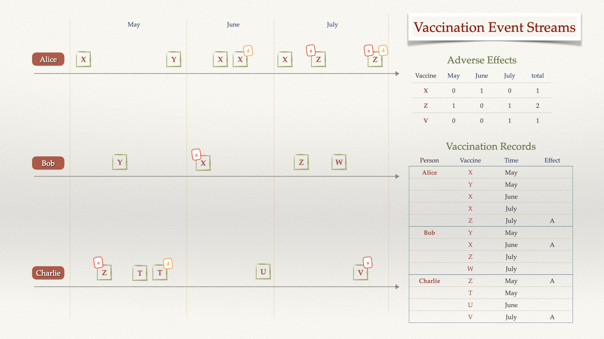

# Kafka Streams with ksqlDB

## A. Overview

[ksqlDB](https://ksqldb.io/) is the database purpose-built for stream processing applications.
- Real-time: Build applications that respond immediately to events. Craft materialized views over streams. Receive real-time push updates, or pull current state on demand.
- Kafka-native: Seamlessly leverage Apache Kafka® infrastructure to deploy stream-processing workloads and bring powerful new capabilities to applications.
- What, not how: Use a familiar, lightweight syntax to pack a powerful punch. Capture, process, and serve queries using only SQL. No other languages or services are required.

Detailed documentation can be found [here](https://docs.ksqldb.io/en/latest/).

Here's its code [GitHub repository](https://github.com/confluentinc/ksql).

&nbsp;

## B. Example data

In this reference implementation we use an example of vaccination dataflow.

Three persons, Alice, Bob, and Charlie got vaccinated during the months of May, June, and July.

| pid      | name    | blood_type | birthday   | address                                         |
|----------|---------|------------|------------|-------------------------------------------------|
| 06ecb949 | Alice   | A+         | 1970-03-02 | 12 Oak Street, Ottawa, ON, K1H 0A0              |
| 8c535c71 | Bob     | O-         | 2012-12-23 | PO Box 873, Quebec, QC, G1R 3Z2                 |
| ed7c0aa8 | Charlie | AB-        | 2021-10-04 | 3757 Anchor Way RR2, Pender Island, BC, V0N 2M2 |

Below is the [list of people](./data/persons.txt) with AVRO key and value parts.

```json
{ "pid": "06ecb949" }|{ "name": "Alice", "blood_type": "A+", "birthday": "1970-03-02", "address": "12 Oak Street, Ottawa, ON, K1H 0A0" }
{ "pid": "8c535c71" }|{ "name": "Bob", "blood_type": "O-", "birthday": "2012-12-23", "address": "PO Box 873, Quebec, QC, G1R 3Z2" }
{ "pid": "ed7c0aa8" }|{ "name": "Charlie", "blood_type": "AB-", "birthday": "2021-10-04", "address": "3757 Anchor Way RR2, Pender Island, BC, V0N 2M2" }
```

There are seven types of vaccines.

| vid | name              | unit_of_sale |  unit_of_use |
|:---:|-------------------|:------------:|:------------:|
|  T  | ActHIB            | 49281-545-03 | 49281-547-58 |
|  U  | IMOVAX RABIES     | 49281-250-51 | 49281-249-01 |
|  V  | IPOL vial         | 49281-860-10 | 49281-860-78 |
|  X  | Menveo            | 58160-955-09 | 58160-958-01 |
|  Y  | Typhim Vi syringe | 49281-790-51 | 49281-790-88 |
|  Z  | Vivotif           | 46028-208-01 | 46028-219-11 |
|  W  | BIOTHRAX          | 49281-790-20 | 49281-790-38 |


Below is the [list of vaccines](./data/vaccines.txt) with AVRO key and value parts.

```json
{ "vid": "T" }|{ "name": "ActHIB", "unit_of_sale": "49281-545-03", "unit_of_use": "49281-547-58" }
{ "vid": "U" }|{ "name": "IMOVAX RABIES", "unit_of_sale": "49281-250-51", "unit_of_use": "49281-249-01" }
{ "vid": "V" }|{ "name": "IPOL vial", "unit_of_sale": "49281-860-10", "unit_of_use": "49281-860-78" }
{ "vid": "X" }|{ "name": "Menveo", "unit_of_sale": "58160-955-09", "unit_of_use": "58160-958-01" }
{ "vid": "Y" }|{ "name": "Typhim Vi syringe", "unit_of_sale": "49281-790-51", "unit_of_use": "49281-790-88" }
{ "vid": "Z" }|{ "name": "Vivotif", "unit_of_sale": "46028-208-01", "unit_of_use": "46028-219-11" }
{ "vid": "W" }|{ "name": "BIOTHRAX", "unit_of_sale": "49281-790-20", "unit_of_use": "49281-790-38" }
```

In total there are thirteen vaccination events, however three of them are duplicated, these were sent a few hours later, but not exceeding 24 hours, thus the incoming data contains sixteen events. 

*Note one: any vaccination of the same type for the same person later than 36 hours comparing with the previous one is considered as new one.*

*Note two: the extra column `duplicate` (for this explanation only and not included in the event streams) indicates if an event is an original one, for example `(1) O` - the first original event, whereas `(2) D` indicates the duplicate of the second event that has duplicate(s).*

*Note three: the extra columns `adverse` (for this explanation only and not included in the event streams) is to indicate that the associated event is reported to have adverse effects.*

| vid |    pid   |       datetime      |    location   | duplicate | adverse |
|:---:|:--------:|:-------------------:|:-------------:|:---------:|:-------:|
|  X  | 06ecb949 | 2023-05-01 10:00:00 |     Ottawa    |           |         |
|  Z  | ed7c0aa8 | 2023-05-02 08:45:00 | Pender Island |           |    A    |
|  Y  | 8c535c71 | 2023-05-02 13:30:00 |     Quebec    |           |         |
|  T  | ed7c0aa8 | 2023-05-04 09:45:00 | Pender Island |   (1) O   |         |
|  T  | ed7c0aa8 | 2023-05-05 07:45:00 | Pender Island |   (1) D   |         |
|  Y  | 06ecb949 | 2023-05-05 10:00:00 |     Ottawa    |           |         |
|  X  | 8c535c71 | 2023-06-01 12:30:00 |     Quebec    |           |    A    |
|  X  | 06ecb949 | 2023-06-02 10:00:00 |     Ottawa    |   (2) O   |         |
|  X  | 06ecb949 | 2023-06-02 22:00:00 |     Ottawa    |   (2) D   |         |
|  U  | ed7c0aa8 | 2023-06-16 11:45:00 | Pender Island |           |         |
|  X  | 06ecb949 | 2023-07-10 13:00:00 |     Ottawa    |           |         |
|  Z  | 8c535c71 | 2023-07-12 14:30:00 |     Quebec    |           |         |
|  Z  | 06ecb949 | 2023-07-21 15:00:00 |     Ottawa    |   (3) O   |    A    |
|  W  | 8c535c71 | 2023-07-21 17:30:00 |     Quebec    |           |         |
|  V  | ed7c0aa8 | 2023-07-21 17:45:00 | Pender Island |           |    A    |
|  Z  | 06ecb949 | 2023-07-22 08:00:00 |     Ottawa    |   (3) D   |    A    |

Below is the [vaccination events](./data/vaccination-events.txt) with key and value parts.

```json
{ "vid": "X", "pid": "06ecb949" }|{ "datetime": "2023-05-01 10:00:00", "location": "Ottawa" }
{ "vid": "Z", "pid": "ed7c0aa8" }|{ "datetime": "2023-05-02 08:45:00", "location": "Pender Island" }
{ "vid": "Y", "pid": "8c535c71" }|{ "datetime": "2023-05-02 13:30:00", "location": "Quebec" }
{ "vid": "T", "pid": "ed7c0aa8" }|{ "datetime": "2023-05-04 09:45:00", "location": "Pender Island" }
{ "vid": "T", "pid": "ed7c0aa8" }|{ "datetime": "2023-05-05 07:45:00", "location": "Pender Island" }
{ "vid": "Y", "pid": "06ecb949" }|{ "datetime": "2023-05-05 10:00:00", "location": "Ottawa" }
{ "vid": "X", "pid": "8c535c71" }|{ "datetime": "2023-06-01 12:30:00", "location": "Quebec" }
{ "vid": "X", "pid": "06ecb949" }|{ "datetime": "2023-06-02 10:00:00", "location": "Ottawa" }
{ "vid": "X", "pid": "06ecb949" }|{ "datetime": "2023-06-02 22:00:00", "location": "Ottawa" }
{ "vid": "U", "pid": "ed7c0aa8" }|{ "datetime": "2023-06-16 11:45:00", "location": "Pender Island" }
{ "vid": "X", "pid": "06ecb949" }|{ "datetime": "2023-07-10 13:00:00", "location": "Ottawa" }
{ "vid": "Z", "pid": "8c535c71" }|{ "datetime": "2023-07-12 14:30:00", "location": "Quebec" }
{ "vid": "Z", "pid": "06ecb949" }|{ "datetime": "2023-07-21 15:00:00", "location": "Ottawa" }
{ "vid": "W", "pid": "8c535c71" }|{ "datetime": "2023-07-21 17:30:00", "location": "Quebec" }
{ "vid": "V", "pid": "ed7c0aa8" }|{ "datetime": "2023-07-21 17:45:00", "location": "Pender Island" }
{ "vid": "Z", "pid": "06ecb949" }|{ "datetime": "2023-07-22 08:00:00", "location": "Ottawa" }
```

In addition, four vaccinations resulted in the patients having adverse effects, these are recorded and sent later in a separate data stream. As above, one of the events is duplicated.

| vid |    pid   |       datetime      | duplicate | adverse |
|:---:|:--------:|:-------------------:|:---------:|:-------:|
|  Z  | ed7c0aa8 | 2023-05-02 08:45:00 |           |    A    |
|  X  | 8c535c71 | 2023-06-01 12:30:00 |           |    A    |
|  Z  | 06ecb949 | 2023-07-21 15:00:00 |   (3) O   |    A    |
|  V  | ed7c0aa8 | 2023-07-21 17:45:00 |           |    A    |
|  Z  | 06ecb949 | 2023-07-22 08:00:00 |   (3) D   |    A    |

Below is the [adverse effects](./data/adverse-effects.txt) with key and value parts.

```json
{ "vid": "Z", "pid": "ed7c0aa8" }|{ "datetime": "2023-05-02 08:45:00" }
{ "vid": "X", "pid": "8c535c71" }|{ "datetime": "2023-06-01 12:30:00" }
{ "vid": "Z", "pid": "06ecb949" }|{ "datetime": "2023-07-21 15:00:00" }
{ "vid": "V", "pid": "ed7c0aa8" }|{ "datetime": "2023-07-21 17:45:00" }
{ "vid": "Z", "pid": "06ecb949" }|{ "datetime": "2023-07-21 17:45:00" }
```

&nbsp;

## C. Objectives

The diagram below describes three timelines of vaccinations, one per person. The data points for vaccination events and adverse effects are indicated with square around vaccine identifier (letter). On the right, there are two objectives:
1. To aggregate data so that adverse effect reports can be produced
2. To keep the (personal) vaccination records up-to-date.



&nbsp;

## D. Populating incoming topics

Lets assume that the incoming events are stored in `persons`, `vaccines`, `vaccination-events`, and `adverse-effects` topics, they are populated as below.

```bash
sudo apt install jq wget
git clone https://github.com/gphin/gphin-data-pipeline.git
cd gphin-data-pipeline
git checkout --track origin/11-demonstrate-kafka-stream-processing
cd kafka_cluster
./docker/install.sh v2.17.2
cd kafka_streams
./setup.sh
```

&nbsp;

## E. Implementation with stream processing

The diagram below describes how do we attempt to reach the objectives using implementation based on `Kafka Streams` with `ksqlDB`.


&nbsp;

There are two ways to continue with the example.

First, you can use `Kafka UI` by navigating to `KSQL DB` menu item on the `Dashboard` menu, then click on `Execute KSQL Request` on the top right. It's convinient as an UI, but you can execute only one SQL command at a time.


Second, open a terminal to the `Kafka cluster` VM, then usie `ksqldb-cli` `Docker` container (included with the `Kafka cluster`)

```bash
docker exec -it ksqldb-cli ksql http://ksqldb-server:8088
```

**Here are [the only 10 `SQL commands`](./conf/streams_processing.sql) you need for the exercise.**

### E.1. Transforming topics into Kafka Streams (or Tables)

We convert each of the topics into a stream by keeping its key and value fields and shema.

*Note that the `datetime` field is to be the `event`'s timestamp that `ksqlDB` uses for event comparisons based on time. `TIMESTAMP_FORMAT='yyyy-MM-dd HH:mm:ss'` is specified in order to instruct `ksqlDB` how to interpret the `datetime` field*.

More on [`CREATE STREAM` syntax](https://docs.ksqldb.io/en/latest/developer-guide/ksqldb-reference/create-stream/).

```sql
------------------------------------------------------------------------------------------
--- Creating streams from existing topics ------------------------------------------------
------------------------------------------------------------------------------------------

SET 'auto.offset.reset' = 'earliest';

-- PRINT persons FROM BEGINNING LIMIT 3;
-- PRINT vaccines FROM BEGINNING LIMIT 7;
-- PRINT 'vaccination-events' FROM BEGINNING LIMIT 16;
-- PRINT 'adverse-effects' FROM BEGINNING LIMIT 5;

LIST STREAMS;

DROP STREAM IF EXISTS persons_stream;
DROP STREAM IF EXISTS vaccines_stream;
DROP STREAM IF EXISTS vaccination_events_stream;
DROP STREAM IF EXISTS adverse_effects_stream;

CREATE STREAM persons_stream WITH (
    KAFKA_TOPIC='persons',
    KEY_FORMAT='AVRO',
    VALUE_FORMAT='AVRO',
    PARTITIONS=1
);
-- SELECT * FROM persons_stream  EMIT CHANGES LIMIT 3;

CREATE STREAM vaccines_stream WITH (
    KAFKA_TOPIC='vaccines',
    KEY_FORMAT='AVRO',
    VALUE_FORMAT='AVRO',
    PARTITIONS=1
);
-- SELECT * FROM vaccines_stream  EMIT CHANGES LIMIT 3;

CREATE STREAM vaccination_events_stream WITH (
    KAFKA_TOPIC='vaccination-events',
    KEY_FORMAT='AVRO',
    VALUE_FORMAT='AVRO',
    TIMESTAMP='datetime',
    TIMESTAMP_FORMAT='yyyy-MM-dd HH:mm:ss',
    PARTITIONS=1
);
-- SELECT * FROM vaccination_events_stream  EMIT CHANGES LIMIT 16;

CREATE STREAM adverse_effects_stream WITH (
    KAFKA_TOPIC='adverse-effects',
    KEY_FORMAT='AVRO',
    VALUE_FORMAT='AVRO',
    TIMESTAMP='datetime',
    TIMESTAMP_FORMAT='yyyy-MM-dd HH:mm:ss',
    PARTITIONS=1
);
-- SELECT * FROM adverse_effects_stream EMIT CHANGES LIMIT 5;
```

### E.2. Filter duplicated events

In order to eliminate duplicates from `vaccination_events_stream` and `adverse_effects_stream`:
- In each of the streams, aggregate events belonging to the same `2 days`-length `window session` with the same person identifier (`pid`), vaccine identifier (`vid`), and location (`location`). The result is a windowed `Kafka Table`.
- Then convert the result table into a `Kafka Stream` (for ease of processing)

For more information on [Time and Windows](https://docs.ksqldb.io/en/latest/concepts/time-and-windows-in-ksqldb-queries/).

```sql
------------------------------------------------------------------------------------------
--- Filter duplicates in streams ---------------------------------------------------------
------------------------------------------------------------------------------------------

DROP STREAM IF EXISTS unique_vaccination_events_stream;
DROP TABLE IF EXISTS unique_vaccination_events_table DELETE TOPIC;

DROP STREAM IF EXISTS unique_adverse_effects_stream;
DROP TABLE IF EXISTS unique_adverse_effects_table DELETE TOPIC;

CREATE TABLE unique_vaccination_events_table WITH (
    KAFKA_TOPIC='unique-vaccination-events',
   	KEY_FORMAT = 'AVRO',
    VALUE_FORMAT='AVRO',
    TIMESTAMP='datetime',
    TIMESTAMP_FORMAT='yyyy-MM-dd HH:mm:ss',
    PARTITIONS=1
) AS SELECT 
	ves.ROWKEY->pid,
	ves.ROWKEY->vid,
	EARLIEST_BY_OFFSET(datetime) AS datetime,
	location,
	COUNT(*) AS count
FROM vaccination_events_stream ves
WINDOW SESSION (2 DAYS)
GROUP BY ves.ROWKEY->pid, ves.ROWKEY->vid, location
HAVING COUNT(*) = 1;
-- PRINT 'unique-vaccination-events' FROM BEGINNING LIMIT 13;
-- SELECT * FROM unique_vaccination_events_table EMIT CHANGES LIMIT 13;

CREATE STREAM unique_vaccination_events_stream WITH (
    KAFKA_TOPIC='unique-vaccination-events',
	KEY_FORMAT = 'AVRO',
    VALUE_FORMAT='AVRO',
    TIMESTAMP='datetime',
    TIMESTAMP_FORMAT='yyyy-MM-dd HH:mm:ss',
    PARTITIONS=1
);
-- SELECT * FROM unique_vaccination_events_stream EMIT CHANGES LIMIT 13;

CREATE TABLE unique_adverse_effects_table WITH (
    KAFKA_TOPIC='unique-adverse-effects',
   	KEY_FORMAT = 'AVRO',
    VALUE_FORMAT='AVRO',
    TIMESTAMP='datetime',
    TIMESTAMP_FORMAT='yyyy-MM-dd HH:mm:ss',
    PARTITIONS=1
) AS SELECT 
	aes.ROWKEY->pid,
	aes.ROWKEY->vid,
	EARLIEST_BY_OFFSET(datetime) AS datetime,
	COUNT(*) AS count
FROM adverse_effects_stream aes
WINDOW SESSION (2 DAYS)
GROUP BY aes.ROWKEY->pid, aes.ROWKEY->vid
HAVING COUNT(*) = 1;
-- SELECT * FROM unique_adverse_effects_table EMIT CHANGES LIMIT 4;
-- PRINT 'unique-adverse-effects' FROM BEGINNING LIMIT 4;

CREATE STREAM unique_adverse_effects_stream WITH (
    KAFKA_TOPIC='unique-adverse-effects',
	KEY_FORMAT = 'AVRO',
    VALUE_FORMAT='AVRO',
    TIMESTAMP='datetime',
    TIMESTAMP_FORMAT='yyyy-MM-dd HH:mm:ss',
    PARTITIONS=1
);
-- SELECT * FROM unique_adverse_effects_stream EMIT CHANGES LIMIT 4;
```

### E.3. Enrich stream events

We complete the exercise by enriching:
- the `unique_vaccination_events_stream` with patient (`persons_stream`) and vaccine (`vaccines_stream`) info, thus vaccination records now have complete 
information of the patient, the vaccine, and the vaccination event.
- the `unique_adverse_effects_stream` with vaccination info (`unique_vaccination_events_stream`), thus adverse effects reports can be produced with regards to time (`day`, `month`, or `year`), or vaccination `location`, or some of patient information (`blood type`, `living area`, etc)

```sql
------------------------------------------------------------------------------------------
--- Output adverse_effects_report --------------------------------------------------------
------------------------------------------------------------------------------------------

DROP STREAM IF EXISTS adverse_effects_report DELETE TOPIC;

CREATE STREAM adverse_effects_report WITH (
    KAFKA_TOPIC='adverse-effects-report',
    KEY_FORMAT='AVRO',
    VALUE_FORMAT='AVRO',
    TIMESTAMP='aes_datetime',
    TIMESTAMP_FORMAT='yyyy-MM-dd HH:mm:ss',
    PARTITIONS=1
) AS SELECT *
FROM unique_adverse_effects_stream aes
INNER JOIN unique_vaccination_events_stream ves
	WITHIN 1 DAYS GRACE PERIOD 12 HOURS
	ON aes.ROWKEY->pid = ves.ROWKEY->pid
EMIT CHANGES;

------------------------------------------------------------------------------------------
--- Output vaccination_records -----------------------------------------------------------
------------------------------------------------------------------------------------------

DROP STREAM IF EXISTS vaccination_records DELETE TOPIC;

CREATE STREAM vaccination_records WITH (
    KAFKA_TOPIC='vaccination-records',
    KEY_FORMAT='AVRO',
    VALUE_FORMAT='AVRO',
    TIMESTAMP='ves_datetime',
    TIMESTAMP_FORMAT='yyyy-MM-dd HH:mm:ss'
) AS SELECT *
FROM unique_vaccination_events_stream ves
INNER JOIN persons_stream ps
	WITHIN 365 DAYS GRACE PERIOD 12 HOURS
	ON ps.ROWKEY->pid = ves.ROWKEY->pid
INNER JOIN vaccines_stream vs
	WITHIN 365 DAYS GRACE PERIOD 12 HOURS
	ON vs.ROWKEY->vid = ves.ROWKEY->vid
EMIT CHANGES;

------------------------------------------------------------------------------------------
--- Show results  ------------------------------------------------------------------------
------------------------------------------------------------------------------------------

SELECT * FROM adverse_effects_report EMIT CHANGES LIMIT 4;

SELECT * FROM vaccination_records EMIT CHANGES LIMIT 13;
```

For `vaccination records`:


For `adverse effects report`:


As usual, to clean up

```bash
./cleanup.sh
```